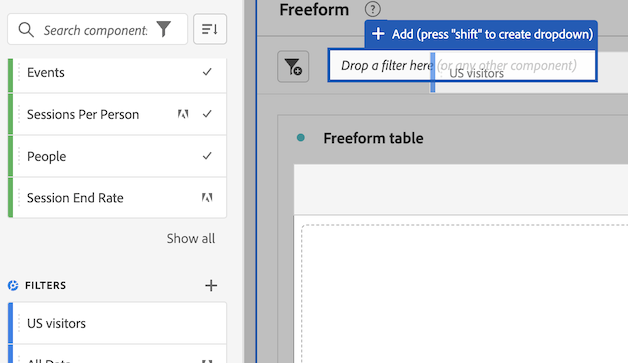

# Create projects

[Projects](/help/analysis-workspace/build-workspace-project/freeform-overview.md) in Analysis Workspace allow you to view business-critical analyses that can be shared with stakeholders inside or outside your organization. 

For general information about how to get started using Analysis Workspace, see [Analysis Workspace overview](/help/analysis-workspace/home.md).

The following sections describe how to create a project and start adding the key building blocks for any Analysis Workspace project: panels, visualizations, and components.

## Begin creating a project

1. In Adobe Analytics, select [!UICONTROL **Workspace**].

1. On the [!UICONTROL **Workspace**] tab, select the [!UICONTROL **Projects**] tab on the left side of the page, then select [!UICONTROL **Create project**].

1. Choose whether to create a blank project or a blank mobile scorecard

   * **Blank project** if you plan to share your analysis from the browser 
   * [**Blank mobile scorecard**](/help/mobile-app/curator.md) if you plan to share your analysis from the Adobe Analytics dashboards mobile app.

1. Select [!UICONTROL **Create**].

1. Next, you need to add panels, visualizations, and components to your project. First, add panels to your project in Analysis Workspace, as described in [Add panels to the project](#add-panels-to-the-project). You can then add visualizations to any panels. Finally, you can add components to any panels or visualizations.

## Add panels to the project {#panels}

[Panels](/help/analysis-workspace/c-panels/panels.md) are the foundation to any project in Analysis Workspace. Panels are used to organize the content (visualizations and components) of a project. 

Many of the panels provided in Analysis Workspace generate a full set of analyses based on a few user inputs. 

To add a panel:

1. Select the [!UICONTROL **Panels**] icon in the left rail.

   

1. Search for the panel you want to add. When it appears in the left rail, drag it into your project.

1. Add visualizations to your panel, as described in [Add visualizations to the project](#add-visualizations-to-the-project). 

   Alternatively, you can add components directly to a panel, as described in [Add components to the project](#add-components-to-the-project).

## Add visualizations to the project

[Visualizations](/help/analysis-workspace/visualizations/freeform-analysis-visualizations.md) (such as a freeform table, a bar chart, or a line chart) can be used to visually bring data to life. 

>[!TIP]
>
>Freeform tables are the most common type of visualization, and are the foundation for interactive data analysis. For more details about how to work with Freeform tables in Analysis Workspace, see [Freeform table](/help/analysis-workspace/visualizations/freeform-table/freeform-table.md).

To add a visualization:

1. Select the **[!UICONTROL Visualizations]** icon in the left rail.

   

1. Search for the visualization you want to add. When it appears in the left rail, drag it to a panel within your project. 

1. Add components to the visualization, as described in [Add components to the project](#add-components-to-the-project).

## Add components to the project

[Components](/help/components/overview.md) make up the actual data of any project. You can add components to visualizations or to panels.

>[!TIP]
>
>For information about each component, select the Info icon next to a component's name in the left rail, or see the [Components overview](/help/components/overview.md).

Following is basic information about how to add a component to a project in Analysis Workspace. For more detailed information about adding the various types of components (dimensions, metrics, filters, and date ranges), see [Use components in Analysis Workspace](/help/components/use-components-in-workspace.md).

To add a component to a project in Analysis Workspace:

1. Select the **[!UICONTROL Components]** icon in the left rail.

   

1. Scroll to or search for the component you want to add, then drag it to a panel or visualization within your project. 

   For example, you can drag a filter to the filter drop zone in a panel header.

   

   For more information about adding components to projects, see [Use components in Analysis Workspace](/help/components/use-components-in-workspace.md).

1. (Optional) Share the project as described in [Save and share the project](#save-and-share-the-project).

## Display a table of contents for the project

You can display a table of contents within a project. This allows you to quickly jump between panels and visualizations within the project. This is especially useful when viewing larger projects that contain many panels and visualizations.

The following information explains how to enable the table of contents on a single project. To enable the table of contents on all projects, update your [user preferences](/help/analysis-workspace/user-preferences.md).

To enable the table of contents on a project:

1. In Analysis Workspace, go to the project where you want to show the table of contents.

1. Select **[!UICONTROL Project]** > **[!UICONTROL Project info & settings]**.

1. Enable the option, [!UICONTROL **Show table of contents**], then select [!UICONTROL **Save**].

1. In the left nav, select the table of contents icon . 

   The table of contents for the project is displayed.

## Save and share the project

As you create an analysis in Analysis Workspace, your work is [automatically saved](/help/analysis-workspace/build-workspace-project/save-projects.md). 

When you finish building out the project and it's gathering actionable insights, the project is ready to be consumed by others. You can share the project with users and groups in your organization, or even with people outside your organization. For information about sharing a project, see [Share projects](/help/analysis-workspace/curate-share/share-projects.md).
