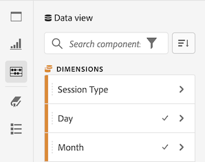

# Projects overview

Workspace projects allow you to combine data components, tables and visualizations to craft your analysis and share with anyone in your organization. Before starting your first project, learn about how to access, navigate and manage your projects.  

## Project list {#project-list}

When you first go to **[!UICONTROL Analytics]** > **[!UICONTROL Workspace]**, the page lists all the projects you own or have been shared to you. This is also the landing page for Adobe Analytics, unless you have previously set a custom landing page. 

The Projects page contains the following information: 

>[!NOTE]
>
>Some columns are not displayed by default. To customize the columns you see, click the **Customize table** icon .

|  Element  | Description  |
|---|---|
| [Edit preferences](/help/analysis-workspace/user-preferences.md) | Manage settings for Analysis Workspace and its related components for all new projects or panels that you create.  |
| [Create folder](/help/analysis-workspace/build-workspace-project/workspace-folders/create-folders.md)  | Add a new folder or subfolder to the list of projects and folders. |
| [Create project](/help/analysis-workspace/build-workspace-project/create-projects.md)  | Start a new project from scratch.  |
|  Show more  |Reveals options for creating a blank project or mobile scorecard, [viewing training tutorials](https://experienceleague.adobe.com/docs/analytics-learn/tutorials/analysis-workspace/analysis-workspace-basics/analysis-workspace-introduction.html), or [viewing release notes](/help/release-notes/latest.md).  |
| Show Folders & Projects| Choose whether to show the folder structure of projects. For more information, see [About Folders in Analytics](/help/analysis-workspace/build-workspace-project/workspace-folders/about-folders.md). |
|  Customize table (icon)  | Allows you to customize the information that shows for each project on the Projects page.  |
|  Name  | Name of the Workspace project.  |
| Type | Indicates whether this is a Workspace Project, a folder, or a [Mobile Scorecard](https://experienceleague.adobe.com/docs/analytics/analyze/mobapp/home.html). |
|  Tags  |Tags that were applied to the project.  |
| Scheduled | Indicates whether projects are scheduled to be emailed to recipients on a schedule. See [Schedule projects](/help/analysis-workspace/curate-share/t-schedule-report.md). |
| Shared link (anyone) | Projects can be shared with anyone--even with people who don't have access to Analysis Workspace. This column shows whether projects have been shared in this way. See [Share a project with anyone (no login required)](/help/analysis-workspace/curate-share/share-projects.md#share-public-link) in [Share projects](/help/analysis-workspace/curate-share/share-projects.md) for more information. |
| Data view | The data view that the project is associated with. |
| [Project Role](https://experienceleague.adobe.com/docs/analytics/analyze/analysis-workspace/curate-share/share-projects.html) | Indicates your role for the project - owners, edit, duplicate, view. |
|  Owner  | The person who created this project (either you or someone who shared the project with you.)  |
|  Shared with  | Users that the project has been shared with.  |
|  Last Modified  | Date and time when the project was last modified.  |
|  Last Opened  | Date and time when the project was last opened.  |
|  Project ID  | The ID of the project.  |
|  Longest Date Range  | The longest date range of the project.  |
|  Number of Queries  | The total number of queries contained in the project.  |
|  Location  | The folder where the project resides.  |

## Menu bar {#menu-bar}

Within a project, the menu provides options for managing your project, adding components, finding help, and more. Each menu option can also be accessed by keyboard [shortcuts](/help/analysis-workspace/build-workspace-project/fa-shortcut-keys.md).

|  Menu item  | Description  |
|---|---|
|  Project  | Includes common actions for project management, including New, Open, Save, and Save As. You can also refresh the entire project to retrieve the most recent data and definitions by clicking Refresh Project. [Download CSV and PDF](/help/analysis-workspace/curate-share/download-send.md) options enable you to export data from Workspace. **Project Info & Settings** (see below) offers many options for managing your project.  |
|  Edit  | Undo or redo your last action. Clear All will reset your project to a blank starting point. |
|  Insert  | Insert new panels or visualizations from this menu. You can also insert new panels and visualizations from the left rail.  |
|  [Components](/help/components/overview.md)  | Create new filters, calculated metric, date range, or alert components from your project. You can also create new components from the left rail. If your component definitions have recently changed, Refresh Components will retrieve the latest definitions. |
|  [Share](/help/analysis-workspace/curate-share/send-schedule-files.md)  | Curate, share and schedule PDF/CSV projects to recipients in your organization.  |
|  Help  | Access help documentation, videos, and the Analytics [Experience League community](https://experienceleaguecommunities.adobe.com/t5/adobe-analytics/ct-p/adobe-analytics-community). Manage the visibility of Workspace tips as well as the [debugger](https://www.adobe.io/apis/experiencecloud/analytics/docs.html#!AdobeDocs/analytics-2.0-apis/master/reporting-tricks.md). Find details about Workspace and factors that impact project [performance](/help/admin/optimizing-performance.md).  |
|  Share button or Owner  | If you are in an Own or Edit for the project, the Share button in the top-right gives you one-click access to manage your project recipients. If you are in a Duplicate or View role for the project, you will see the project owner's name. |

### Project Info & Settings {#info-settings}

**[!UICONTROL Workspace]** > **[!UICONTROL Project]** > **[!UICONTROL Project Info & Settings]** provides project-level information on the currently active project.

Settings include:

|  Setting  | Description  |
|---|---|
|  Project Name  | The name given to the project. You can double-click the name to edit it.  |
|  Created By  | Project owner name  |
|  Last Modified  | Date of last modification to the project.  |
|  Tags  |Lists any tags applied to a project for easier categorization.  |
|  Description  | A description is useful for clarifying the purpose of a project. You can double-click the description to edit it.  |
|  Count repeat instances in project  | Specifies whether repeat instances are counted in reports. Note: this setting does not apply to Flow or Fallout visualizations.  |
|  [Project color palette](/help/analysis-workspace/build-workspace-project/color-palettes.md)  | You can change the categorical color palette used in Workspace, by choosing from out-of-the-box palettes that have been optimized for color blindness, or by specifying your custom palette. This feature affects many things in Workspace, including most visualizations.  |
| [View Density](/help/analysis-workspace/build-workspace-project/view-density.md) | Lets you see more data on the screen by reducing the vertical padding of the left rail, freeform tables and cohort tables. |

## Left rail {#left-rail}

Within a project, [panels](/help/analysis-workspace/c-panels/panels.md), tables, [visualizations](/help/analysis-workspace/visualizations/freeform-analysis-visualizations.md), and [components] are accessed from the left rail. These are your project building blocks.

You can also access visualizations and panels from the [Blank Panel](/help/analysis-workspace/c-panels/blank-panel.md) as well. 

Components (Dimensions, Metrics, Filters, Date Ranges) in the left rail relate to the active panel data view. The active panel will have a blue border around it, and the active data view will be listed at the top of the component rail.

## Project canvas {#canvas}

The project canvas is where you bring together panels, tables, visualizations, and components to build your analysis. A project can contain many panels, and each panel can contain many tables and visualizations.

Panels are helpful when you want to organize your projects according to time periods, data views, or analysis use case. The active panel will have a blue border around it, and determines what components are available in the left rail.

Depending on the starting point you chose for your projects, you will either have a [freeform table](/help/analysis-workspace/visualizations/freeform-table/freeform-table.md) or a [blank panel](/help/analysis-workspace/c-panels/blank-panel.md) in the canvas to begin with. The quickest way to start analyzing is to select one or many components and simply drag & drop them into the project canvas. A table of data will automatically be rendered for you. [Learn more](/help/analysis-workspace/visualizations/freeform-table/freeform-table.md) about the different options for building a table, or leverage our [training tutorial](/help/analysis-workspace/home.md) for more guidance on building your first project.

## Project Manager {#manager}

Analysis Workspace projects can be managed under **Analytics > Components >  Projects**. The Project Manager shows the items that a specific user has created. Project ownership can be transferred to a new user under Admin > Analytics Users & Assets > Transfer Assets.

In the Projects Manager, you can add, tag, share, duplicate/copy, and more. Search for a project in the search bar or by using the filter options in the left rail. You can filter by tag, owners, project type and more.

The following are common actions in the Projects manager, and can be taken on one or many projects at once:

|  Action  | Description  |
|---|---|
|  Add  | Create a new project from scratch.  |
|  Tag or Approve  | Choose "Tag" or "Approve" to organize your projects and make them easier to search for.  |
|  [Share](/help/analysis-workspace/curate-share/share-projects.md)  | Make a project available to other Analysis Workspace users in your organization.  |
|  Delete  | Delete your project.  |
|  Rename  | Edit the name of your project.  |
|  Copy  | Create a duplicate copy of your project. This creates a new project and project ID. Any shares or schedules tied to the original project will not be copied. |
|  Export to CSV  | Download your project as a CSV file, which includes plain-text data.  |
