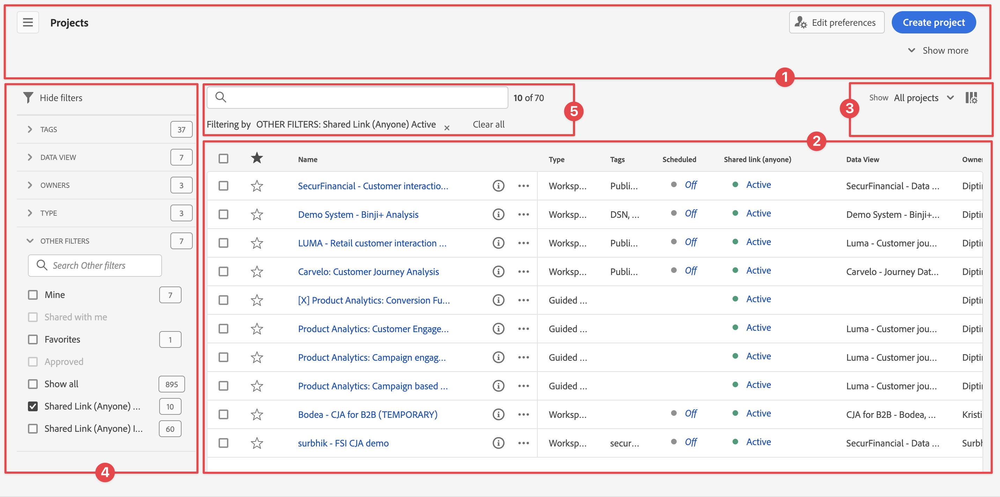

# Projects overview
 
Workspace projects allow you to combine panels, visualizations and components to craft your analysis and share with anyone in your organization. Before you start your first project, learn about how to access, navigate and manage your projects.  

To access projects in Customer Journey Analytics, select **[!UICONTROL Workspace]**.  The **[!UICONTROL Projects]** manager lists all the projects that you own or projects that are shared with you. The Project manager with the Project list is also the default landing page for Customer Journey Analytics, unless you have configured otherwise in Preferences. 

## Title area

From within title area ➊ you can create a project, create a folder, edit your preferences and show or hide a panel with additional tiles.

* To show or hide a left panel that allows you to select between **[!UICONTROL Projects]** and **[!UICONTROL Learning]**, select . 
* The title shows Projects, optionally added with a path to the folder you have selected. For example [!UICONTROL Projects] > **[!UICONTROL Company Folder]**. You can select individual subfolder parts to go directly to the specific folder. 
* To show tiles for a [**[!UICONTROL Blank project]**](create-projects.md), [**[!UICONTROL Blank mobile scorecard]**](/help/mobile-app/create-scorecard.md), [**[!UICONTROL Guided analysis]**](/help/guided-analysis/overview.md), **[!UICONTROL Open the documentation]** and **[!UICONTROL Open release notes]**, select  **[!UICONTROL Show more]**. To hide the area with tiles, select  **[!UICONTROL Show less]**.
* Based on what you select to show, using the [Show selector](#show-selector), you can edit preferences and perform actions on the current folder visible in **[!UICONTROL Projects]**:
  
  | Action | Description |
  |---|---|
  | **[!UICONTROL Create project]** | Select to [create a new project](create-projects.md). |
  |  **[!UICONTROL Create folder]** | Select to [create a new folder](workspace-folders/create-folders.md). |
  |  **[!UICONTROL Edit preferences]** | [Edit preferences](/help/analysis-workspace/user-preferences.md) for all your projects. When the breadcrumb results in limited space, this action is part of the  submenu. |
  | **[!UICONTROL Add projects]** | Select to [add projects](workspace-folders/add-projects.md) to the current folder. When the breadcrumb results in limited space, this action is part of the  submenu. |
  | **[!UICONTROL Rename folder]** | [Renames](workspace-folders/manage-folders.md#rename-folders) the current folder. |
  | **[!UICONTROL Move folder]** | [Moves](workspace-folders/manage-folders.md#move-folders) the current folder. |
  | **[!UICONTROL Delete folder]** | [Deletes](workspace-folders/manage-folders.md#delete-folders) the current folder. |

  

## Project list

The project list ➋ displays all the projects that you own and that have been shared with you. The list has the following columns:

| Column | Description |
| --- | --- |
|  | When one or more projects are selected, a blue action bar appears at the bottom of the Project interface. See [Actions](#actions) for more details. |
|   | Select to favor  or un-favor  a project. |
| **[!UICONTROL Title and description]** | To edit the project, select the title link, which opens the [Workspace project](/help/analysis-workspace/home.md). Projects shared with you are indicated with . Select  to display a popup menu with more details on the project. Select  to open a context menu with actions. See [Actions](#actions) for more details. |
| **[!UICONTROL Type]** | A Workspace project, a  folder, or a [Mobile Scorecard](/help/mobile-app/home.md). |
|  **[!UICONTROL Tags]**  | The tags applied to the project. |
| **[!UICONTROL Scheduled]** | Whether a project is scheduled o be emailed to recipients. Options are  **[!UICONTROL On]** or  **[!UICONTROL Off]**. See [Send project data to others](/help/analysis-workspace/export/t-schedule-report.md). |
| **[!UICONTROL Shared link (anyone)]** | Whether a project is shared with anyone, even with people who don't have access to Analysis Workspace. Options are  **[!UICONTROL Active]** or  **[!UICONTROL Inactive]**. See [Share a project with anyone (no login required)](/help/analysis-workspace/curate-share/share-projects.md#share-a-project-with-anyone-no-login-required) in [Share projects](/help/analysis-workspace/curate-share/share-projects.md) for more information. |
| **[!UICONTROL Project Role]** | Your role for the project. Options are: Edit, Duplicate, View. See [Project roles](/help/analysis-workspace/curate-share/curate.md) for more information. |
| **[!UICONTROL Data view]** | The data view that the project is associated with. |
| **[!UICONTROL Owner]**  | The person who created this project (either you or someone who shared the project with you.)  |
| **[!UICONTROL Shared with]**  | Users that the project has been shared with.  |
| **[!UICONTROL Last Modified]**  | Date and time when the project was last modified.  |
| **[!UICONTROL Last Opened]**  | Date and time when the project was last opened.  |
| **[!UICONTROL Project ID]**  | The ID of the project.  |
| **[!UICONTROL Longest Date Range]**  | The longest date range of any of the panels or visualizations in the project.  |
| **[!UICONTROL Number of Queries]**  | The total number of queries contained in the project.  |
| **[!UICONTROL Location]**  | The folder where the project resides.  |

Hover over any column header to display  and select from the context menu:

* **[!UICONTROL Sort Ascending]**
* **[!UICONTROL Sort Descending]**
* **[!UICONTROL Resize column]**. A blue line appears to assist you to resize the column.

### Actions

You can take actions on one or more projects using the context menu  or the blue action bar.

| Icon |Action  | Description |
|:---:| ---|---|
| | **[!UICONTROL *x* selected]** | Unselect your selected projects and folders and remove the blue action bar. |
|  |**[!UICONTROL Delete]** | Delete one or more projects or folders. You are prompted for a confirmation.
Projects that you delete:
<ul><li>Cannot be recovered</li><li>Are removed from the project list</li><li>Can no longer be accessed with their URL</li><li>Are no longer included in scheduled deliveries (in cases where they were previously configured for scheduled deliveries) For information about scheduled deliveries, see [Scheduled projects](/help/components/scheduled-projects-manager.md).  
 |
|  |**[!UICONTROL Share]** | Share a project. See [Share a project](/help/analysis-workspace/curate-share/share-projects.md) for more information. |
| | **[!UICONTROL Rename]** | Rename a project. Opens a **[!UICONTROL Rename: *project name dialog*]**. Enter a new name and select **[!UICONTROL Save]**. |
| | **[!UICONTROL Copy]** | Copy one or more projects. Project do get the same name and suffix `(Copy)`. |
| | **[!UICONTROL Pin]** or **[!UICONTROL Unpin]** | Pin or unpin one or more projects or folders. Pinned projects and folders appear at the top of the list and ignore the sorting order you specify. |
| | **[!UICONTROL Move up]** | Move a pinned project or folder up in the project list.  |
| | **[!UICONTROL Move down]** | Move a pinned project or folder down in the project list. |
| | **[!UICONTROL Tag]** | Tag one or more projects or folders. The **[!UICONTROL Tag Components]** dialog displays to select one or more tags. Select **[!UICONTROL Save]** to save the tags for the selected projects or folders. |
| | **[!UICONTROL Approve]** or **[!UICONTROL Unapprove]** | Approve or unapprove a project. Only administrators can approve projects. |
|  | **[!UICONTROL Export CSV]** | Export the selected projects to a CSV file with name `Project List.csv`. |
|  | **[!UICONTROL Add Projects]** | Add one or more projects to a selected folder. In **[!UICONTROL Add Projects]** you can select one or more projects. Select **[!UICONTROL Add]** to add the projects to the folder. See [Add projects to folders](workspace-folders/add-projects.md#from-inside-a-folder) for more information. |
| | **[!UICONTROL Move to]** | Move one or more selected projects to a folder. In the **[!UICONTROL Select Folder]**, select the folder to move the selected project to and select **[!UICONTROL Move]**. See [Add projects to folders](workspace-folders/add-projects.md#from-the-project-list) for more information. |

## Show selector

You can switch the look and feel of the Projects interface using the **[!UICONTROL Show]** selectors ➌. The **[!UICONTROL Show]** selector define what options are available in the [Title area](#title-area) and what columns are displayed in the [Project list](#project-list). 

* To change the options available for the [Title area](#title-area), select **[!UICONTROL Show]** **[!UICONTROL All projects]** or **[!UICONTROL Show]** **[!UICONTROL Folders & Projects]**.

* To define which columns to display for the [Project list](#project-list), select  and from the **[!UICONTROL Customize table]** dialog select or unselect columns. Select **[!UICONTROL Apply]** to apply the customization. See [Project list](#project-list) for more details on the columns.

## Filter panel

You can filter the projects and folders in the [Project list](#project-list) using the filter panel ➍. To show or hide the filter panel use .

The filter panel consists of the following sections.

### Tags

| Tags   | Description |
|---|---|
| {width="300"} | The **[!UICONTROL Tags]** section lets you filter on tags. <ul><li>You use  *Search Tags* to search for tags you want to use to filter.</li><li>You can select more than one tag. The tags available depend on selections made in other sections in the filter panel.</li><li>The numbers indicate:<ul><li>**2︎⃣**: The number of tags available for the projects resulting from the current filter.</li><li>7︎⃣: The number of projects associated with the specific tag.</li></ul></li></ul> |

### Data view

| Data view | Description |
|---|---|
| {width="300"} | The **[!UICONTROL Data view]** section lets you filter on data views. <ul><li>You use  *Search Data views* to search for data views you want to use to filter.</li><li>You can select more than one data view. The data views available depend on selections made in other sections in the filter panel.</li><li>The numbers indicate:<ul><li>**3︎⃣**: The number of data views available for the projects resulting from the current filter.</li><li>4︎⃣: The number of projects associated with the specific data view.</li></ul></li></ul> |

### Owners

| Owner | Description |
|---|---|
| {width="300"} | The **[!UICONTROL Owner]** section lets you filter on owners. <ul><li>You use  *Search Owners* to search for owners you want to use to filter.</li><li>You can select more than one owner. The owners available depend on selections made in other sections in the filter panel.</li><li>The numbers indicate:<ul><li>**3︎⃣**: The number of owners available for the projects resulting from the current filter.</li><li>4︎⃣: The number of projects associated with the specific owner.</li></ul></li></ul> |

### Type

| Type | Description |
|---|---|
| {width="300"} | The **[!UICONTROL Type]** section lets you filter on the type of projects or folders.<ul><li>You can select one or more of the following options:<ul><li> **[!UICONTROL folder]**</li><li>**[!UICONTROL Workspace project]**</li><li>**[!UICONTROL Mobile scorecard]**</li></ul> <li>You can select more than one other filter. The other filters available depend on selections made in other sections in the filter panel.</li><li>The numbers indicate:<ul><li>**5︎⃣**: The number of other filters available for the projects resulting from the current filter.</li><li>4︎⃣: The number of projects associated with the specific other filter.</li></ul></li></ul> |

### Other filters 

| Other filters | Description |
|---|---|
| {width="300"} | The **[!UICONTROL Other filters]** section lets you filter on other predefined filter.<ul><li>You can select one or more of the following options:<ul><li> **[!UICONTROL Show all]**</li><li>**[!UICONTROL Shared with me]**</li><li>**[!UICONTROL Mine]**</li><li>**[!UICONTROL Approved]**</li><li>**[!UICONTROL Favorites]**</li></ul> What you can select depends on your role and permissions.</li><li>You can select more than one other filter. The other filters available depend on selections made in other sections in the filter panel.</li><li>The numbers indicate:<ul><li>**5︎⃣**: The number of other filters available for the projects resulting from the current filter.</li><li>4︎⃣: The number of projects associated with the specific other filter.</li></ul></li></ul> |

## Search 

You use the Search area ➎ to search for projects and folders using the  field. Start typing and the [project list](#project-list) automatically filters on your search input.

The Search area also shows the filters applied from the Filter panel. 

* To remove a filter, select  in the filter.
* To remove all filters, select Clear all.

If space is limited to display the individual filters, you see **[!UICONTROL Segmenting by *x* filters]**. 

* To remove a filter:
  
  1. Use **[!UICONTROL *x* filters]**  top open a context menu listing the types of filters and the individual filters.
  1. Use  to remove a filter.

<!--

The Projects page contains the following information: 

>[!NOTE]
>
>Some columns are not displayed by default. To customize the columns you see, click the **Customize table** icon .

|  Element  | Description  |
|---|---|
| [Edit preferences](/help/analysis-workspace/user-preferences.md) | Manage settings for Analysis Workspace and its related components for all new projects or panels that you create.  |
| [Create folder](/help/analysis-workspace/build-workspace-project/workspace-folders/create-folders.md)  | Add a new folder or subfolder to the list of projects and folders. |
| [Create project](/help/analysis-workspace/build-workspace-project/create-projects.md)  | Start a new project from scratch.  |
|  Show more  |Reveals options for creating a blank project or mobile scorecard, [viewing training tutorials](https://experienceleague.adobe.com/docs/analytics-learn/tutorials/analysis-workspace/analysis-workspace-basics/analysis-workspace-introduction.html), or [viewing release notes](/help/release-notes/latest.md).  |
| Show Folders & Projects| Choose whether to show the folder structure of projects. For more information, see [About Folders in Analytics](/help/analysis-workspace/build-workspace-project/workspace-folders/about-folders.md). |
|  Customize table (icon)  | Allows you to customize the information that shows for each project on the Projects page.  |
|  Name  | Name of the Workspace project.  |
| Type | Indicates whether this is a Workspace Project, a folder, or a [Mobile Scorecard](https://experienceleague.adobe.com/docs/analytics/analyze/mobapp/home.html). |
|  Tags  |Tags that were applied to the project.  |
| Scheduled | Indicates whether projects are scheduled to be emailed to recipients on a schedule. See [Send project data to others](/help/analysis-workspace/export/t-schedule-report.md). |
| Shared link (anyone) | Projects can be shared with anyone--even with people who don't have access to Analysis Workspace. This column shows whether projects have been shared in this way. See [Share a project with anyone (no login required)](/help/analysis-workspace/curate-share/share-projects.md#share-public-link) in [Share projects](/help/analysis-workspace/curate-share/share-projects.md) for more information. |
| Data view | The data view that the project is associated with. |
| [Project Role](https://experienceleague.adobe.com/docs/analytics/analyze/analysis-workspace/curate-share/share-projects.html) | Indicates your role for the project - owners, edit, duplicate, view. |
|  Owner  | The person who created this project (either you or someone who shared the project with you.)  |
|  Shared with  | Users that the project has been shared with.  |
|  Last Modified  | Date and time when the project was last modified.  |
|  Last Opened  | Date and time when the project was last opened.  |
|  Project ID  | The ID of the project.  |
|  Longest Date Range  | The longest date range of the project.  |
|  Number of Queries  | The total number of queries contained in the project.  |
|  Location  | The folder where the project resides.  |

## Menu bar {#menu-bar}

Within a project, the menu provides options for managing your project, adding components, finding help, and more. Each menu option can also be accessed by keyboard [shortcuts](/help/analysis-workspace/build-workspace-project/fa-shortcut-keys.md).

|  Menu item  | Description  |
|---|---|
|  Project  | Includes common actions for project management, including New, Open, Save, and Save As. You can also refresh the entire project to retrieve the most recent data and definitions by clicking Refresh Project. [Download project data](/help/analysis-workspace/export/download-send.md) options enable you to export data from Workspace. **Project Info & Settings** (see below) offers many options for managing your project.  |
|  Edit  | Undo or redo your last action. Clear All will reset your project to a blank starting point. |
|  Insert  | Insert new panels or visualizations from this menu. You can also insert new panels and visualizations from the left panel.  |
|  [Components](/help/components/overview.md)  | Create new segments, calculated metric, date range, or alert components from your project. You can also create new components from the left panel. If your component definitions have recently changed, Refresh Components will retrieve the latest definitions. |
|  [Share](/help/analysis-workspace/curate-share/send-schedule-files.md)  | Curate, share and schedule PDF/CSV projects to recipients in your organization.  |
|  Help  | Access help documentation, videos, and the Analytics [Experience League community](https://experienceleaguecommunities.adobe.com/t5/adobe-analytics/ct-p/adobe-analytics-community). Manage the visibility of Workspace tips as well as the [debugger](https://experienceleague.adobe.com/en/docs/analytics-learn/tutorials/apis/using-analysis-workspace-to-build-api-2-requests). Find details about Workspace and factors that impact project [performance](/help/technotes/optimizing-performance.md).  |
|  Share button or Owner  | If you are in an Own or Edit for the project, the Share button in the top-right gives you one-click access to manage your project recipients. If you are in a Duplicate or View role for the project, you will see the project owner's name. |

### Project Info & Settings {#info-settings}

**[!UICONTROL Workspace]** > **[!UICONTROL Project]** > **[!UICONTROL Project info & settings]** provides project-level information on the currently active project.

Settings include:

|  Setting  | Description  |
|---|---|
|  Project Name  | The name given to the project. You can double-click the name to edit it.  |
|  Created By  | Project owner name  |
|  Last Modified  | Date of last modification to the project.  |
|  Tags  |Lists any tags applied to a project for easier categorization.  |
|  Description  | A description is useful for clarifying the purpose of a project. You can double-click the description to edit it.  |
|  Count repeat instances in project  | Specifies whether repeat instances are counted in reports. Note: this setting does not apply to Flow or Fallout visualizations.  |
|  [Project color palette](/help/analysis-workspace/build-workspace-project/color-palettes.md)  | You can change the categorical color palette used in Workspace, by choosing from out-of-the-box palettes that have been optimized for color blindness, or by specifying your custom palette. This feature affects many things in Workspace, including most visualizations.  |
| [View Density](/help/analysis-workspace/build-workspace-project/view-density.md) | Lets you see more data on the screen by reducing the vertical padding of the left panel, freeform tables and cohort tables. |

## Left panel

Within a project, various icons are available in the left panel, and each represents important parts of a project:

* [Panels](/help/analysis-workspace/c-panels/panels.md) 

* [Visualizations](/help/analysis-workspace/visualizations/freeform-analysis-visualizations.md)

* [Components](/help/components/overview.md)

* [Data dictionary](/help/components/data-dictionary/data-dictionary-overview.md)

* [Table of contents](/help/analysis-workspace/build-workspace-project/project-table-of-contents.md) 

Components (Dimensions, Metrics, Segments, Date Ranges) in the left panel relate to the active panel data view. The active panel is identified by the blue border that surrounds it, and the active data view is listed at the top of the component panel.

## Project canvas {#canvas}

The project canvas is where you bring together panels, tables, visualizations, and components to build your analysis. A project can contain many panels, and each panel can contain many tables and visualizations.

Panels are helpful when you want to organize your projects according to time periods, data views, or analysis use case. The active panel will have a blue border around it, and determines what components are available in the left panel.

Depending on the starting point you chose for your projects, you will either have a [freeform table](/help/analysis-workspace/visualizations/freeform-table/freeform-table.md) or a [blank panel](/help/analysis-workspace/c-panels/blank-panel.md) in the canvas to begin with. The quickest way to start analyzing is to select one or many components and simply drag & drop them into the project canvas. A table of data will automatically be rendered for you. [Learn more](/help/analysis-workspace/visualizations/freeform-table/freeform-table.md) about the different options for building a table, or leverage our [training tutorial](/help/analysis-workspace/home.md) for more guidance on building your first project.

## Project Manager {#manager}

Analysis Workspace projects can be managed under **Analytics > Components >  Projects**. The Project Manager shows the projects that a specific user created. You can transfer project ownership to a new user under Admin > Analytics Users & Assets > Transfer Assets.

In Projects Manager, you can add, tag, share, duplicate/copy, and more. Search for a project in the search bar or by using the filter options in the left panel. You can filter by tag, owners, project type and more.

The following are common actions in the Projects manager, and can be taken on one or many projects at once:

|  Action  | Description  |
|---|---|
|  Add  | Create a new project from scratch.  |
|  Tag or Approve  | Choose "Tag" or "Approve" to organize your projects and make them easier to search for.  |
|  [Share](/help/analysis-workspace/curate-share/share-projects.md)  | Make a project available to other Analysis Workspace users in your organization.  |
|  Delete  | Delete your project.  |
|  Rename  | Edit the name of your project.  |
|  Copy  | Create a duplicate copy of your project. This creates a new project and project ID. Any shares or schedules tied to the original project will not be copied. |
|  Export to CSV  | Download your project as a CSV file, which includes plain-text data.  |

-->

