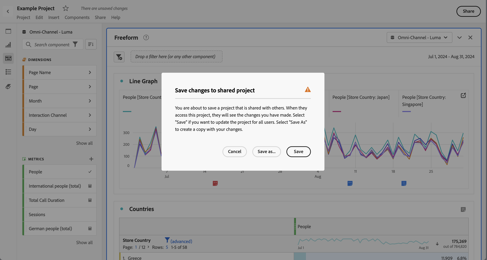

# Save projects {#save-projects}

<!-- markdownlint-disable MD034 -->

>[!CONTEXTUALHELP]
>id="workspace_project_addnotes"
>title="Add notes"
>abstract="Add notes about the project version being saved. These notes will be stored with the version and accessible under the **[!UICONTROL Project]** > **[!UICONTROL Open previous version]** menu."

<!-- markdownlint-enable MD034 -->

Projects in Analysis Workspace are automatically saved every 2 minutes. You can also save projects yourself, save a project as a duplicate or save a project with version notes.

## Save

To save a project manually, with your project open in Analysis Workspace, select **[!UICONTROL Project]**, then choose from the following options:

* **[!UICONTROL Save]**

  Save changes to your project. If the project is shared, recipients of the project also see the changes. 
  
  When you first save your project, a **[!UICONTROL Save]** dialog displays. 

  
  
  1. Specify the following:
  
     * **[!UICONTROL Name]** (required). name of your project.
     * **[!UICONTROL Description]**. A description of your project.
     * **[!UICONTROL Tags]**. Search for tags in the [!UICONTROL *Search tags*] field or add new tags using **[!UICONTROL ENTER]**. 
     * **[!UICONTROL Folder]**. Select a folder from the [!UICONTROL *Select a folder*] dropdown menu. If you do not specify a folder, the project is saved in the current folder from which you created a new project.
     * **[!UICONTROL Version notes]**. Add version notes in the *Add notes* text area. 

  1. Select **[!UICONTROL Save]** to save your project.

  Saving your project actually saves a version of your project that is stored for 90 days. 
  
  If you save a project that you have shared, a **[!UICONTROL Save changes to shared project]** warning dialog prompts you for confirmation.

  

  * Select **[!UICONTROL Save]** to save the project.
  * Select **[!UICONTROL Save as]** to save the project as a duplicate project with a new name.
  

* **[!UICONTROL Save with notes]**

  

  When you save your project add notes about what changed in the project. In the Save version notes dialog:

  1. Enter your **[!UICONTROL Version notes]** in the **[!UICONTROL Add notes]** text area.
  1. Select **[!UICONTROL Save]**.
  
  Notes are stored with the project version and are available when you [open a previous version](open-projects.md#open-previous-version) of the project. A version saved with notes is automatically stored for one year.

* **[!UICONTROL Save As]**

  

  Create a duplicate of your project with a new name. The Save as dialog displays.

  1. Specify the following:
  
     * **[!UICONTROL Name]** (required). name of your project.
     * **[!UICONTROL Description]**. A description of your project.
     * **[!UICONTROL Tags]**. Search for tags in the [!UICONTROL *Search tags*] field or add new tags using **[!UICONTROL ENTER]**. 
     * **[!UICONTROL Folder]**. Select a folder from the [!UICONTROL *Select a folder*] dropdown menu. If you do not specify a folder, the project is saved in the current folder from which you created a new project.
     * **[!UICONTROL Version notes]**. Add version notes in the *Add notes* text area. 

  1. Select **[!UICONTROL Save]** to save your project.
  
  You can save the project to a different folder. The original project is not affected.

  
<!-- Cannot find this option in CJA 
| **[!UICONTROL Save as template]** | Save your project as a [custom template](https://experienceleague.adobe.com/docs/analytics/analyze/analysis-workspace/build-workspace-project/starter-projects.html) that becomes available to your organization under **[!UICONTROL Project > New]** | 
-->

## Auto-save

>[!IMPORTANT]
>
>Even though new projects are auto-saved, you must save each new project manually the **first** time.
>

All projects in Analysis Workspace are automatically saved every 2 minutes to your local machine. This auto-save includes newly created projects that are not yet saved manually.

### New projects

Analysis Workspace prompts you to save new projects manually when switching to another project, closing the browser tab, and so forth. 

  If for any reason you unexpectedly lose access to a newly created project before manually saving it, a recovery version of your project is saved on the Analysis Workspace landing page in a folder called **[!UICONTROL Recovered Projects (Last 7 Days)]**. Restore the recovered project and manually save it to a desired location.

  To restore a recovered project:

  1. Go to the **[!UICONTROL Recovered Projects (Last 7 Days)]** folder on the Analysis Workspace landing page.
  
  <!-- 
     
  -->

  1. Open your project and save it to a desired location.

### Existing projects

If for any reason you leave a project with changes that are not yet auto-saved, Analysis Workspace either prompts you to save your changes or provides a warning message. 

Some common scenarios:

#### Open another project

If you open another project when working on a project that contains changes that are not yet auto-saved, Analysis Workspace prompts you to save the current project.

The following options are available:

* **[!UICONTROL Save]**: Replaces the most recent auto-saved local copy of your project with your latest changes.
* **[!UICONTROL Discard Changes]**: Discards your latest changes. The project retains the most recent auto-saved local copy.
* **[!UICONTROL Cancel]**: Cancel the action to open another project and keep the existing project open.

<!--  -->

#### Navigate away or close a tab

If you navigate away from the page or close the browser tab while viewing a project with changes that are not yet auto-saved, the browser warns you that your unsaved changes are lost. You can choose to leave or cancel. How the browser warns you depends on the browser you use.

### Browser crashes or session times out

If your browser crashes or if your session times out, then the next time you access Analysis Workspace you are prompted to recover any changes to your project that are not yet auto-saved.

* Select **[!UICONTROL Yes]** to restore the project from the most recent auto-saved copy.

* Select **[!UICONTROL No]** to delete the auto-saved copy and open the last user-saved version of the project.

<!---->

For **new** projects that have never been saved, unsaved changes are not recoverable.

<!-- Shouldn't this belong to another page?  Moved it to a new open projects page

## Open previously saved version

To open a previously saved version of a project:

1. Select **[!UICONTROL Open previous version]** from the **[!UICONTROL Project]** menu.

   

1. Review the list of previous versions available. You can switch between **[!UICONTROL All versions]** and **[!UICONTROL Only versions with notes]**.

   For each version, the list shows a timestamp
   [!UICONTROL Timestamp] and [!UICONTROL Editor] are shown, in addition to [!UICONTROL Notes] if they were added when the [!UICONTROL Editor] saved. Versions without notes are stored for 90 days; versions with notes are stored for 1 year.
1. Select a previous version and click **[!UICONTROL Load]**.
   The previous version then loads with a notification. The previous version does not become the current saved version of your project until you click **[!UICONTROL Save]**. If you navigate away from the loaded version, when you return, you will see the last saved version of the project.

-->
