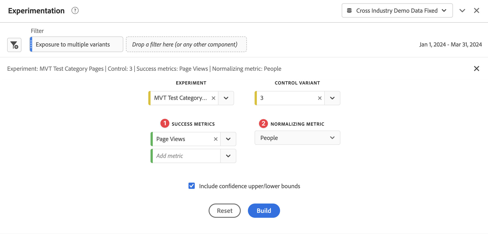

# Experimentation panel {#experimentation-panel}

<!-- markdownlint-disable MD034 -->

>[!CONTEXTUALHELP]
>id="workspace_experimentation_button"
>title="Experimentation"
>abstract="Create a panel to compare different user experiences, marketing, or messaging variations. And to determine which variation is best at driving a specific outcome."

<!-- markdownlint-enable MD034 -->

<!-- markdownlint-disable MD034 -->

>[!CONTEXTUALHELP]
>id="workspace_experimentation_panel"
>title="Experimentation"
>abstract="Compare different user experiences, marketing, or messaging variations to determine which is best at driving a specific outcome. Specify the experiment, the control variant to compare against, the success metric and the normalizing metric. Optionally, set upper and lower bounds for confidence."

<!-- markdownlint-enable MD034 -->

>[!BEGINSHADEBOX]

_This article documents the Experimentation panel in_  _**Customer Journey Analytics**._ _See [Analytics for Target panel](https://experienceleague.adobe.com/en/docs/analytics/analyze/analysis-workspace/panels/a4t-panel) for information on how to analyze Adobe Target activities and experiences in_  _**Adobe Analytics**._

>[!ENDSHADEBOX]

The **[!UICONTROL Experimentation]** panel lets analysts compare different user experiences, marketing, or messaging variations to determine which is best at driving a specific outcome. You can evaluate the lift and confidence of any A/B experiment from any experimentation platform: online, offline, from Adobe solutions like Target or Journey Optimizer, and even BYO (bring-your-own) data.

Read more about the [integration between Adobe Customer Journey Analytics and Adobe Target](https://experienceleague.adobe.com/en/docs/target/using/integrate/cja/target-reporting-in-cja).

## Access control {#access}

The Experimentation panel is available to use by all Customer Journey Analytics users. No Admin rights or other permissions are required. However, the prerequisites require actions that only administrators can perform.

## Functions in calculated metrics

Two advanced functions are available: Lift and Confidence. For more information, see [Reference - advanced functions](/help/components/calc-metrics/cm-adv-functions.md).

## Prerequisites

To use the experimentation panel, ensure you follow these prerequisites:

### Create connection to experiment datasets

The recommended data schema is for the experimentation data to be in an [Object array](https://experienceleague.adobe.com/en/docs/experience-platform/xdm/ui/fields/array) that contains the experiment and variant data in two separate dimensions. Both dimensions need to be in a **single** object array. If you have your experimentation data in a single dimension (with experiment and variant data in a delimited string), you can use the [substring](/help/data-views/component-settings/substring.md) setting in data views to split the dimension into two for use in the panel.

After your experimentation data has been [ingested](https://experienceleague.adobe.com/en/docs/experience-platform/ingestion/home) into Adobe Experience Platform, [create a connection in Customer Journey Analytics](/help/connections/create-connection.md) to one or more experiment datasets.

### Add context labels in data views

In Customer Journey Analytics data views settings, admins can add [context labels](/help/data-views/component-settings/overview.md) to a dimension or metric and Customer Journey Analytics services like [!UICONTROL Experimentation] panel can use these labels for their purposes. Two pre-defined labels are used for the Experimentation panel:

* [!UICONTROL Experimentation Experiment]
* [!UICONTROL Experimentation Variant]

In your data view that contains experimentation data, pick two dimensions, one with the experimentation data and one with the variant data. Then label those dimensions with the **[!UICONTROL Experimentation Experiment]** and the **[!UICONTROL Experimentation Variant]** labels.

Without these labels present, the Experiment panel does not work, since there are no experiments to work with.

## Use

To use an **[!UICONTROL Experimentation]** panel:

1. Create an **[!UICONTROL Experimentation]** panel. For information about how to create a panel, see [Create a panel](panels.md#create-a-panel).  

1. Specify the [input](#panel-input) for the panel.

1. Observe the [output](#panel-output) for the panel.

   >[!IMPORTANT]
   >
   >If the necessary setup in Customer Journey Analytics data views has not been completed, you receive this message before you can proceed: [!UICONTROL Please configure the experiment and variant dimensions in Data views].
   >

### Panel input

To use the Experimentation panel:

1. Configure the panel input settings:

   

   | Setting | Definition |
   | --- | --- |
   | **[!UICONTROL Date Range]** | The date range for the Experimentation panel is automatically set, based on the first event received in Customer Journey Analytics for the experiment selected. You can restrict or expand the date range to a more specific timeframe if needed. |
   | **[!UICONTROL Experiment]** | A set of variations on an experience that were exposed to end users to determine which is best to keep in perpetuity. An experiment is made up of two or more variants, one of which is considered the control variant. This setting is pre-populated with the dimensions that have been labeled with the **[!UICONTROL Experiment]** label in data views, and the last 3 months' worth of experimentation data. |
   | **[!UICONTROL Control variant]** | One of two or more alterations in an end user's experience that are being compared for the purpose of identifying the better alternative. One variant must be selected as the control, and only one variant can be considered to be the control variant. This setting is pre-populated with the dimensions that have been labeled with the **[!UICONTROL Variant]** label in data views. This setting pulls up the variant data that is associated with this experiment. |
   | **[!UICONTROL Success metrics]** ➊ | The metric or metrics that a user is comparing variants with. The variant with the most desirable outcome for the conversion metric (whether highest or lowest) is declared the *best performing variant* of an experiment. You can add up to 5 metrics. |
   | **[!UICONTROL Normalizing metric]** ➋| The basis (**[!UICONTROL Global Account]** [!BADGE B2B Edition]{type=Informative url="https://experienceleague.adobe.com/en/docs/analytics-platform/using/cja-overview/cja-b2b/cja-b2b-edition" newtab=true tooltip="Customer Journey Analytics B2B Edition"}, **[!UICONTROL Account]** [!BADGE B2B Edition]{type=Informative url="https://experienceleague.adobe.com/en/docs/analytics-platform/using/cja-overview/cja-b2b/cja-b2b-edition" newtab=true tooltip="Customer Journey Analytics B2B Edition"}, **[!UICONTROL Opportunity]** [!BADGE B2B Edition]{type=Informative url="https://experienceleague.adobe.com/en/docs/analytics-platform/using/cja-overview/cja-b2b/cja-b2b-edition" newtab=true tooltip="Customer Journey Analytics B2B Edition"}, **[!UICONTROL Buying Group]** [!BADGE B2B Edition]{type=Informative url="https://experienceleague.adobe.com/en/docs/analytics-platform/using/cja-overview/cja-b2b/cja-b2b-edition" newtab=true tooltip="Customer Journey Analytics B2B Edition"}, **[!UICONTROL People]**, **[!UICONTROL Sessions]**, or **[!UICONTROL Events]**) on which a test runs. For example, a test may compare the conversion rates of several variations where **[!UICONTROL Conversion rate]** is calculated as Page View. |
   | **[!UICONTROL Include confidence upper/lower bounds]** | Enable this option to show upper and lower bounds for confidence levels. |

1. Select **[!UICONTROL Build]**.

### Panel output

The Experimentation panel returns a rich set of data and visualizations to help you better understand how your experiments are performing. At the top of the panel, [summary change](../visualizations/summary-number-change.md) visualizations are provided to remind you of the panel settings you selected. At any time, you can edit the panel by selecting the edit pencil at the top right.

You also get a text summary that indicates whether the experiment is conclusive or not, and summarizes the outcome. Conclusiveness is based on statistical significance (see [Statistical methodology](#adobes-statistical-methodology).) You can see summary numbers for the best performing variant with the highest lift and confidence.

For each success metric you selected, a [freeform table](../visualizations/freeform-table/freeform-table.md) visualization and a conversion rate [line](../visualizations/line.md) visualization are shown.

>[!NOTE]
>
>This panel currently does not support analysis of A/A tests.

#### Interpret the results

1. **Experiment is conclusive**: Every time you view the experimentation report, the data that has accumulated in the experiment up to this point is analyzed. The analysis declares an experiment to be conclusive when the *anytime* valid confidence crosses a threshold of 95% for *at least one* of the variants. With more than two arms, a Benjamini-Hochberg correction is applied to correct for multiple hypothesis testing.  

2. **Best performing variant**: When an experiment is declared to be conclusive, the variant with the highest conversion rate is labeled as the best performing variant. Note that this variant must either be the control or baseline variant, or one of the variants that crosses the 95% *anytime* valid confidence threshold (with Benjamini-Hochberg corrections applied).

3. **Conversion rate**: The conversion rate that is shown is a ratio of the success metric value ➊ to the normalizing metric value ➋. Note that this value can be larger than 1, if the metric is not binary (1 or 0 for each unit in the experiment)

4. **Lift**: The Experiment report summary shows the Lift over Baseline, which is a measure of the percentage improvement in the conversion rate of a given variant over the baseline. Defined precisely, it is the difference in performance between a given variant and the baseline, divided by the performance of the baseline, expressed as a percentage.

5. **Confidence**: The anytime valid confidence that is shown is a probabilistic measure of how much evidence there is that a given variant is the same as the control variant. A higher confidence indicates less evidence for the assumption that control and non-control variant have equal performance. The confidence is a probability (expressed as a percentage) that you would have observed a smaller difference in conversion rates between a given variant and the control. While in reality there is no difference in the true underlying conversion rates. In terms of *p*-values, the confidence displayed is 1 - *p*-value.

>[!NOTE]
>
>A full description of results should consider all available evidence (for example experiment design, sample sizes, conversion rates, confidence, and others), and not just the declaration of conclusive or not. Even when a result is not yet conclusive, there can still be compelling evidence for one variant being different from another (for example confidence intervals are nearly non-overlapping). Ideally, all statistical evidence, interpreted on a continuous spectrum, should inform decision making.

## Adobe's statistical methodology {#statistics}

To provide easily interpretable and safe statistical inference, Adobe has adopted a statistical methodology based on [Anytime Valid Confidence Sequences](https://arxiv.org/abs/2103.06476).

A confidence sequence is a *sequential* analog of a confidence interval. To understand what a confidence sequence is, imagine you repeat your experiments one hundred times. And calculate an estimate of the mean business metric (for example the open rate of an email) and its associated 95%-confidence sequence for *every new user* that enters the experiment.

A 95% confidence sequence includes the "true" value of the business metric in 95 out of the 100 experiments that you ran. (A 95% confidence interval could only be calculated once per experiment to give the same 95% coverage guarantee; not with every single new user). Confidence sequences therefore allow you to monitor experiments continuously, without increasing false positive error rates, that is, they allow "peeking" at results.

## Interpret non-randomized dimensions {#non-randomized}

Customer Journey Analytics allows analysts to select any dimension as the experiment. But how do you interpret an analysis where the dimension chosen as the experiment is not one for which persons are randomized?

For example, consider an ad that a person sees. You may be interested in measuring the change in some metric (for example, average revenue) if you decide to show persons *ad B* instead of *ad A*. The causal effect of showing ad B, instead of ad A, is of central importance in arriving at the marketing decision. This causal effect may be measured as the average revenue over the whole population, if you replaced the status quo of showing ad A with the alternate strategy of showing ad B. 

A/B testing is the gold standard within the industry for objectively measuring the effects of such interventions. The critical reason why an A/B test gives rise to a causal estimate is due to the randomization of persons to receive one of the possible variants. 

Now, consider a dimension that is not achieved by randomization, for example, the US state of the person. Persons primarily come from two states, New York and California. The average revenue of sales of a winter clothing brand can be different in the two states due to the differences in the regional weather. In such a situation, the weather may be the true causal factor behind winter clothing sales, and not the fact that the geographical states of persons are different.

The experimentation panel in Customer Journey Analytics lets you analyze data as average revenue difference by states of the persons. In such a situation, the output does not have a causal interpretation. However, such an analysis may still be of interest. It provides an estimate (along with measures of uncertainty) of the difference in average revenue by states of the persons.  This value is also referred to as *Statistical Hypothesis Testing*. The output of this analysis may be interesting, but not necessarily actionable. Simply because you have not randomized and sometimes cannot randomize persons to one of the possible values of the dimension. 

The following illustration contrasts these situations:

When you want to measure the impact of intervention X on outcome Y, it is possible that the real cause of both is the confounding factor C. If the data is not achieved by randomizing persons on X, the impact is harder to measure, and the analysis explicitly accounts for C. Randomization breaks the dependence of X on C, allowing us to measure the effect of X on Y without having to worry about other variables. 

## Use calculated metrics in experimentation {#use-in-experimentation}

>[!NOTE]
>
>For organizations using both Customer Journey Analytics and Adobe Journey Optimizer, the information in this section also applies to experimentation features within Journey Optimizer.

Not all calculated metrics are compatible with the Experimentation panel. 

Calculated metrics that include any of the following metrics or constants are not compatible with the Experimentation panel:

* Base metrics from a [summary dataset](https://experienceleague.adobe.com/en/docs/analytics-platform/using/cja-dataviews/summary-data)
* Base metrics that are divided by each other or multiplied together (for example, `Revenue`/`Orders`)
* Constants that are added to or subtracted from a base metric (for example, `Revenue+50`)
* Any of the following base metrics: 
  * People

Calculated metrics that are not compatible with the Experimentation panel have the value [!UICONTROL **Everywhere in Customer Journey Analytics (excluding experimentation)**] in the [!UICONTROL **Product compatibility**] field when creating the calculated metric. For information about creating a calculated metric, see [Build metrics](/help/components/calc-metrics/cm-workflow/cm-build-metrics.md).

## Use calculated metrics in the Experimentation panel

Refer to this blog post for information on [using calculated metrics in the Experimentation panel](https://experienceleaguecommunities.adobe.com/t5/adobe-analytics-blogs/using-derived-metrics-in-cja-s-experimentation-panel/ba-p/593119).

>[!MORELIKETHIS]
>[Mastering Adobe Customer Journey Analytics Experimentation](https://experienceleaguecommunities.adobe.com/t5/adobe-analytics-blogs/mastering-adobe-customer-journey-analytics-experimentation-your/ba-p/732338)
>
