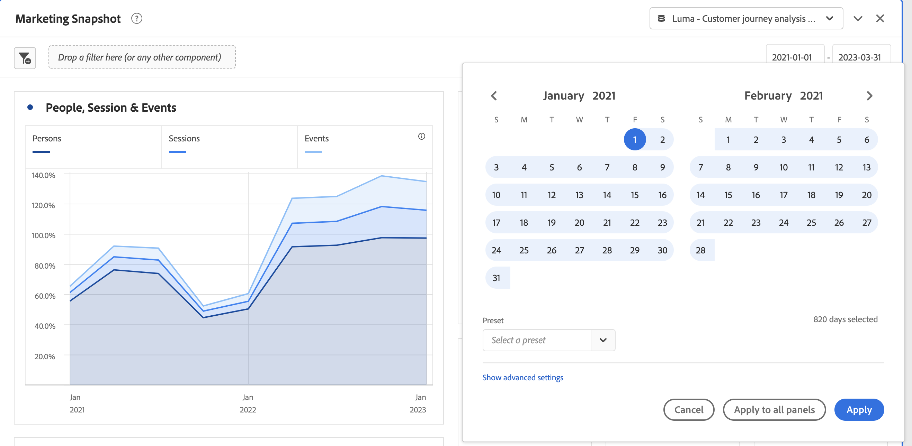
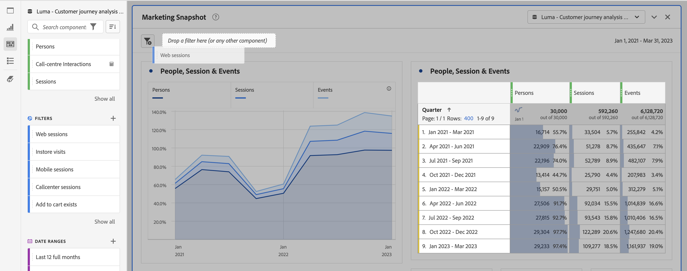
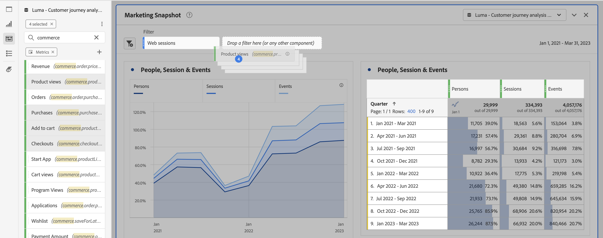
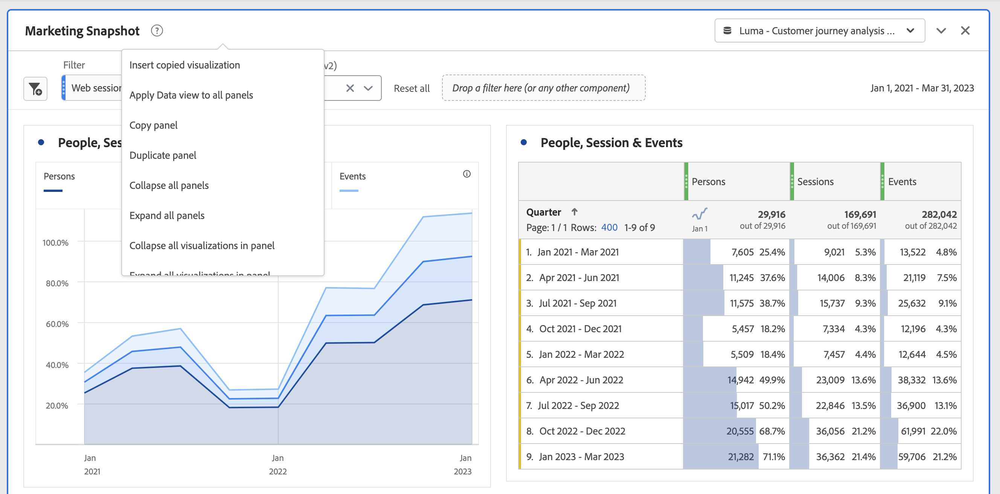

# Panels overview

A [!UICONTROL panel] is a collection of tables and visualizations. You can access panels from the top-left icon in Workspace or a [blank panel](/help/analysis-workspace/c-panels/blank-panel.md). Panels are helpful when you want to organize your projects according to time periods, data views, or analysis use case.

## Panel types

The following panel types are available in Analysis Workspace for [!UICONTROL Customer Journey Analytics]:

| Panel name | Description |
| --- | --- |
| [Blank panel](/help/analysis-workspace/c-panels/blank-panel.md) | Choose from available panels and visualizations to start your analysis. |
| [Attribution panel](attribution.md) | Quickly compare and visualize any number of attribution models using any dimension and conversion metric. |
| [Experimentation](experimentation.md) | Compare different user experiences, marketing, or messaging variations to determine which is best at driving a specific outcome. |
| [Freeform](freeform-panel.md) | Perform unlimited comparisons and breakdowns, then add visualizations to tell a rich data story. |
| [Media average minute audience](average-minute-audience-panel.md) | Analyze the average minute audience for a specific piece of content, or over a customized time period. | 
| [Media concurrent viewers](media-concurrent-viewers.md) | Analyze concurrent viewers over time, with details on peak concurrency and the ability to break down and compare. |
| [Media playback time spent](/help/analysis-workspace/c-panels/media-playback-time-spent.md) | Analyze playback time spent to understand where peak concurrencies occur or where drop offs happen. |
| [Next or previous item](next-previous.md) | Show the next or previous pages visitors go to. |
| [Quick Insights](quickinsight.md) | Quickly build a freeform table and an accompanying visualization to analyze and uncover insights faster. |

[!UICONTROL Quick Insights], [!UICONTROL Blank] and [!UICONTROL Freeform] panels are great places to start your analysis, while [!UICONTROL Attribution IQ] lends itself to more advanced analyses. A `"+"` button is available in projects so you can add blank panels at any time.

The default starting panel is the [!UICONTROL Freeform] panel, but you can make the [blank panel](/help/analysis-workspace/c-panels/blank-panel.md) your default as well.

## Create a panel

To create a panel:

* Drag and drop a panel from the **[!UICONTROL Panels]** left rail onto your canvas.
* Select a panel from the [Blank panel](blank-panel.md).

## Data view 

Each panel is associated with a [data view](/help/data-views/data-views.md), identified by  **[!UICONTROL *name of data view*]** in the dropdown list at the top right of the panel.

When you create a Blank Workspace project, the default data view for the initial panel is the data view you last worked on in Customer Journey Analytics.

When you create a new panel, the default data view is based on the data view of the panel you last worked on in the Workspace project.

>[!IMPORTANT]
>
>The selected data view determines what dimensions, metrics, and filters are available for building visualizations in a panel.
>
>
>When you switch a data view for a panel, some of the components might not be available in that new data view. This will cause your visualization to not properly render. You might see warning like 
>
>* This panel contains components that are not enabled in the selected data view. Please change the data view or enable the required components in the data view. 
>* Unable to render visualization: Please check your columns and rows to ensure they contain valid components.
>

## Calendar {#calendar}

The panel calendar controls the reporting range for tables and visualizations within a panel.

Note: If a (purple) date range component is used within a table, visualization or panel drop zone, the component overrides the panel calendar.

You can apply a minute-level date range under the advanced settings of your panel calendar. If you are reporting on a date range that spans many days, start time applies to the first day and end time applies to the last day in your range.

## Drop zone {#dropzone}

The panel drop zone enables you to apply filters and drop-down filters to all tables and visualizations within a panel. You can apply one or many filters to a panel. 

### Filters

Drag and drop any filters from the left rail into the panel drop zone to begin filtering your panel. Repeat this process to add additional filters to the panel. Filters appear side by side at the top of the panel.

#### Ad-hoc filters 

Non-filter components can also be dragged directly into the drop zone to create ad-hoc filters, saving you the time and effort of going to the Filter Builder. Filters created in this way are automatically defined as event-level filters. This definition can be modified by clicking the information icon (i) next to the filter, then the pencil-shaped edit icon and editing it in the Filter Builder.

Ad-hoc filters are a type of quick filter, and are local to the project. They only show up in the left rail when you make the ad-hoc filters public.

For more information, see [Quick filters](/help/components/filters/quick-filters.md).

### Static drop-down filters

Static drop-down filters enable you to interact with the data in a controlled way. For example, you can add a drop-down filter for Mobile Device Types so that you can filter the panel by Tablet, Mobile Phone, or Desktop.

Static drop-down filters can also be used to consolidate many projects into one. For example, if you have many versions of the same project with different Country filters applied, you can consolidate all versions into a single project and add a Country drop-down filter.

#### Create static drop-down filters

* For drop-down filters using dimension items, select a single dimension from the left rail and drop the dimension into the panel drop zone **while holding `[Shift]`**. This action creates a drop-down filter with all the dimension items that are associated with that dimension. 

  Or, if you want the drop-down filter to include only specific dimension items that are associated with a dimension, click the right arrow icon next to the desired dimension in the left rail. This action exposes all available dimension items. Select multiple dimension items from this list using `[Shift + Click]` or `[Ctrl + Click]`, then drop them into the panel drop zone **while holding** `[Shift]`.

* For drop-down filters using a single component type (for example, only dimensions, or only filters, or only metrics), select multiple items of the same type in the left rail using `[Shift + Click]` or `[Ctrl + Click]`. Then drop the items into the panel drop zone **while holding `[Shift]`**.

  A single drop-down filter is created with components that you selected.

* For drop-down filters using a mix of component types (such as 2 metrics and 3 filters), select multiple components using `[Shift + Click]` or `[Ctrl + Click]`. Drop the selection into the panel drop zone **while holding `[Shift]`**. In this context, all component types are treated as separate drop-down filters. For example, if you include both metrics and dimension items in your selection, two separate drop-down filters are created: one drop-down filter includes dimension items, and the other includes metrics.

A drop-down filter provides the following context menu options:

* **[!UICONTROL Delete drop-down]**: Removes the drop-down filter from the panel. 
* **[!UICONTROL Delete label]**: Remove the text displayed at a drop-down filter. To modify the label, select the pencil icon.
* **[!UICONTROL Add label]**: When you add a drop-down filter to a project, a label is automatically set to the component name. If you delete the label, you can add it again with this option.
* **[!UICONTROL Require selection]**: Requires that a filter is set on the panel. 

[Watch the video](https://experienceleague.adobe.com/en/docs/analytics-learn/tutorials/analysis-workspace/using-panels/using-panels-to-organize-your-analysis-workspace-projects) to learn more about how to add drop-down filters to your project.

#### Use static drop-down filters

Users can use the drop-down filter menu in any of the following ways to filter the panel:
     
* Apply a single filter to the panel by selecting the filter from the drop-down filter.

* Apply multiple filters to the panel by selecting more than one filter from the drop-down filter. The panel is filtered to include any of the selected filters. 

### Dynamic drop-down filters

Dynamic drop-down filters allow you to determine available values based on data within the panel's reporting range and values in other drop-down filters. For example, you can create two dynamic drop-downs using a Countries dimension and a Cities dimension. When you select a country from the UICONTROL Countries drop-down list, the Cities drop-down list dynamically adjusts to show only cities within that country.

This same concept applies to all dimensions; only dimension items that appear within the panel's date range and selected filters are visible. Dimension items selected in static drop-down filters affect available values in dynamic drop-down filters. However, the inverse is not true; Dimension items selected in dynamic drop-down filters do not affect available values in static drop-down filters.

Manual selection of dimension items is available if you anticipate a certain dimension item to be collected in the future. You can also clear a dynamic drop-down filter so that it does not contain a value, allowing other dynamic drop-down filters to contain more values. Select **[!UICONTROL Reset all]** to clear the selection from all drop-down filters for that panel.

To create a dynamic drop-down filter:

* Drag and drop a single dimension into the panel drop zone **while holding `[Shift]`**.
* Dynamic drop-down filters are not available for metrics, filters, or date ranges.
* Right-click a drop-down filter and select **[!UICONTROL Delete filter]** to delete it.

A dynamic drop-down filter provides the same context menu options as static drop-down filters.

## Context menu

Additional functionality for a panel is available through a context menu (right-click) on the panel header.

The following options are available:

| Option | Description |
| --- | --- |
| **[!UICONTROL Insert copied panel]** | Let you paste a copied panel to another place within the project, or into a different project.|
| **[!UICONTROL Insert copied visualization]** | Paste a copied visualization to another place within the panel, project, or into a different project. |
| **[!UICONTROL Apply Data view to all panels]** | Apply the data view for this panel to all other panels in the project. |
| **[!UICONTROL Copy panel]** | Copy a panel, so that you can insert it to another place within the project, or into a different project.|
| **[!UICONTROL Duplicate panel]** | Makes an exact duplicate of the current panel, which you can then modify. |
| **[!UICONTROL Collapse all panels]** | Collapse all project panels. |
| **[!UICONTROL Expand all panels]** | Expand all project panels. |
| **[!UICONTROL Collapse all visualizations in panel]** | Collapse all visualizations in the current panel. |
| **[!UICONTROL Expand all visualizations in panel]** | Expand all visualizations in the current panel. |
| **[!UICONTROL Edit Description]** | Add (or edit) a text description for the panel. |
| **[!UICONTROL Get Panel Link]** | Direct someone to a specific panel within a project. When the link is clicked, the recipient is required to log in before being directed to the exact panel linked to. |

