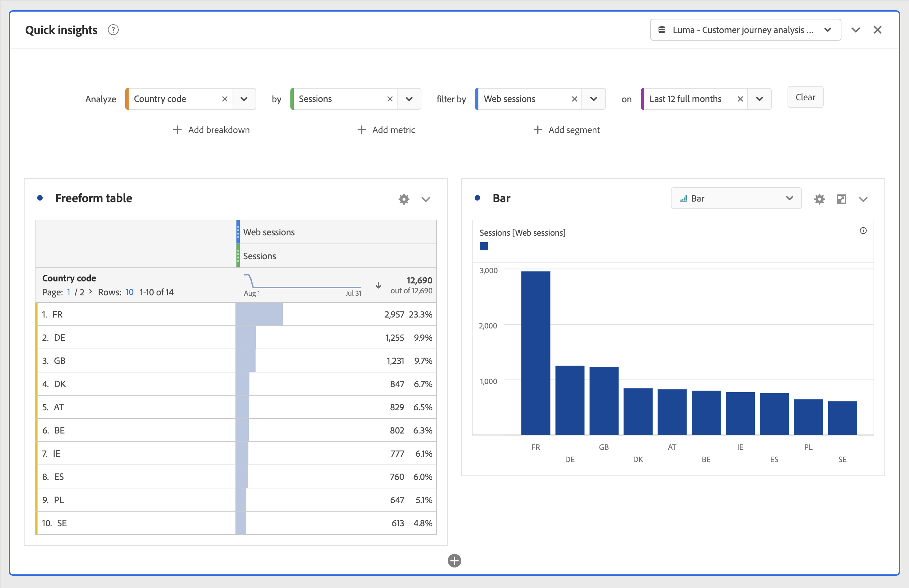
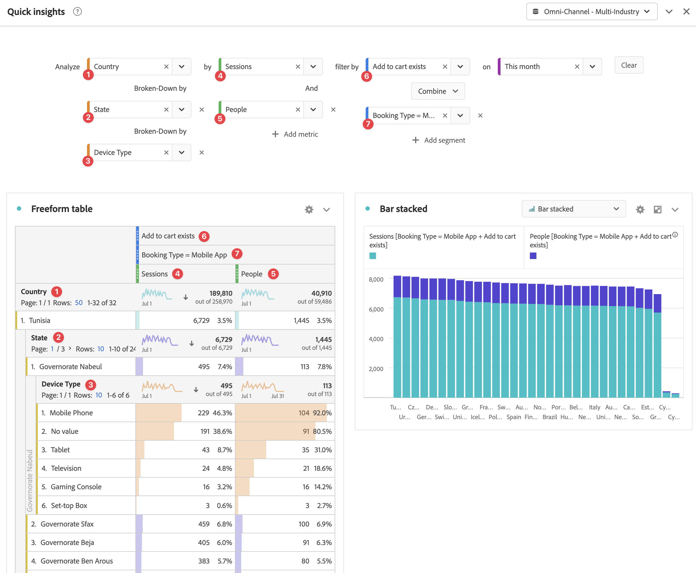

# Quick insights panel {#quick-insights-panel}

<!-- markdownlint-disable MD034 -->

>[!CONTEXTUALHELP]
>id="workspace_quickinsights_button"
>title="Quick insights"
>abstract="Create a panel to quickly build a freeform table and accompanying visualization to analyze and uncover insights faster."

<!-- markdownlint-enable MD034 -->

>[!BEGINSHADEBOX]

_This article documents the Quick insights panel in_  _**Customer Journey Analytics**_. _See [Quick insights panel](https://experienceleague.adobe.com/en/docs/analytics/analyze/analysis-workspace/panels/quickinsight) for the_  _**Adobe Analytics** version of this article._

>[!ENDSHADEBOX]

[!UICONTROL Quick Insights] provides guidance for non-analysts and new users of [!UICONTROL Analysis Workspace] to learn how to answer business questions quickly and easily. It is also a great tool for advanced users who want to answer a simple question quickly without having to build a table themselves.

When you first start using this [!UICONTROL Analysis Workspace], you might wonder:

* what visualizations would be most useful, 
* which dimensions and metrics might facilitate insights, 
* where to drag and drop items, 
* where to create a segment, 
* and more. 

To help with these questions,[!UICONTROL Quick insights] leverages an algorithm that presents you with the most popular dimensions, metrics, segments, and date ranges your company uses. This algorithm is based on your own company's usage of data components in [!UICONTROL Analysis Workspace]. In fact, you see dimensions, metrics, and segment tagged with [!UICONTROL POPULAR] in the drop-down list, as shown here:

[!UICONTROL Quick Insights] helps you

* Properly build a data table and an accompanying visualization in [!UICONTROL Analysis Workspace].
* Learn the terminology and vocabulary for basic components and pieces of [!UICONTROL Analysis Workspace].
* Do simple breakdowns of dimensions, add multiple metrics, or compare segments easily within a [!UICONTROL Freeform table].
* Change or try out various visualization types to find the find tool for your analysis quickly and intuitively.

## Basic key terminology

The following are some of the basic terms that you need to be familiar with. Each data table consists of 2 or more building blocks (components) that you use to tell your data story.

|Building block (Component)|Definition|
|---|---|
|**[!UICONTROL Dimension]** |Dimensions are descriptions or characteristics of metric data that can be viewed, broken down, and compared in a project. They are non-numeric values and dates that break down into dimension items. For example, *browser* or *page* is a dimension.|
|**[!UICONTROL Dimension item]** |Dimension items are individual values for a dimension. For example, dimension items for the browser dimension would be *Chrome*, *Firefox*, *Edge*, or others.|
|[!UICONTROL Metric]|Metrics are quantitative information about person activity, such as views, click-throughs, reloads, average time spent, units, orders, revenue, and so on.|
|**[!UICONTROL Visualization]**|Workspace offers [a number of visualizations](/help/analysis-workspace/visualizations/freeform-analysis-visualizations.md) to build visual representations of your data. Such as bar charts, donut charts, histograms, line charts, maps, scatterplots, and others.|
|**[!UICONTROL Dimension Breakdown]**|A dimension breakdown is a way to break down a dimension by other dimensions. For example, you could break down the US States by Mobile Devices to get the mobile device visits per state. Or you could break Mobile Devices down by Mobile Device types, by Regions, by Internal Campaigns, and more.|
|**[!UICONTROL Filter]**| Filters let you identify subsets of persons based on characteristics or website interactions. For example, you can build [!UICONTROL People] segments based on <li>attributes: browser type, device, number of visits, country, gender, or</li><li>interactions: campaigns, keyword search, search engine, or</li><li>exits and entries: persons from Facebook, a defined landing page, referring domain, or</li><li> custom variables: form field, defined categories, customer ID.  |

## Use

To use a **[!UICONTROL Quick insights]** panel:

1. Create a **[!UICONTROL Quick insights]** panel. For information about how to create a panel, see [Create a panel](panels.md#create-a-panel).

1. When you first use a **[!UICONTROL Quick insights]** panel, you might want to go through the short [!UICONTROL Intro tutorial] that teaches you some of the basics. Select  next to the Quick insights panel title and select **[!UICONTROL Intro tutorial]** from the popup. 

1. Specify the [input](#panel-input) for the panel.

1. Observe the [output](#panel-output) for the panel.

### Panel input

Select your building blocks: 

* **[!UICONTROL Analyze]** - specify a dimension (orange)
* **[!UICONTROL by]** - specify a metric (green)
* **[!UICONTROL segment by]** - specify a segment (blue)
* **[!UICONTROL on]** - specify a date range (purple).

You have to select at least one dimension and one metric for the visualization to function properly.

You can specify the building blocks in three ways:

* Drag and drop components from the left panel.
* Start typing in one of the building block fields. When input is found, the building block field auto populates with possible values.
* Specify a building block drop-down (for example `Country` in **[!UICONTROL Analyze]**) and search the list of possible value (using ) for the value you want to use (for example, **[!UICONTROL Country code]**).

Select **[!UICONTROL Clear]** to clear all input fields.

### Panel output

1. When you have added at least one dimension and one metric, you can see the results.
   
   

    * A Freeform table with the dimension (Country code) and metric (Sessions), segmented by Web sessions for the Last 12 months.

    * An accompanying visualization, in this case a [bar chart](/help/analysis-workspace/visualizations/bar.md). The visualization that is generated is based on the type of data you added to the table. Any time-based data (such as [!UICONTROL Sessions] per Day/Month) defaults to a [!UICONTROL Line] chart. Any non-time-based data (such as [!UICONTROL Sessions] per [!UICONTROL Device]) defaults to a [!UICONTROL Bar] chart. You can change the type of visualization by clicking on the drop-down arrow next to the visualization type.

1. Try adding some more refinements as described below under [More tips](#more-tips)

1. You might want to save your project, using **[!UICONTROL Project > Save]**.

## More tips

Other useful hints pop up in the [!UICONTROL Quick Insights Builder], some of them depending on your last action.

* First, you might want to complete the **[!UICONTROL More tips]** tutorial. This tutorial shows up 24 hours after you have created a project with at least one dimension and one metric. Select  next to the Quick insights panel title and select **[!UICONTROL More tips]** from the popup. 

    

* You can analyze multiple dimensions and metrics, combine or compare segments, and specify a date range:

  

  * **[!UICONTROL Analyze]** dimension **[!UICONTROL Broken-Down by]**: You can use up to 3 levels of breakdowns on dimensions to drill down to the data you really need. See ➊, ➋, and ➌.

  * Add more metrics **[!UICONTROL by]**: You can add up to 2 more metrics. See ➍ and ➎.

  * **[!UICONTROL segment by]**: You can add up to 2 more segments. For example, add Bookings as a segment and combine that segment with Frequent Bookers and First Time Fliers segments you compare. See ➏, ➐, and ➑.

  * on: You can specify the date range. See ➒.

## Known limitations

If you try to edit directly within the table, the [!UICONTROL Quick Insights] panel can become out of sync. Select **[!UICONTROL Resync Builder]** at the top right of the panel to restore it to the previous [!UICONTROL Quick Insights] settings.

You get a warning before adding anything directly to the table:

 

Otherwise, building directly causes the table to behave as a traditional Freeform table, without the helpful features for new users.

>[!MORELIKETHIS]
>
>[Create a panel](/help/analysis-workspace/c-panels/panels.md#create-a-panel)
>