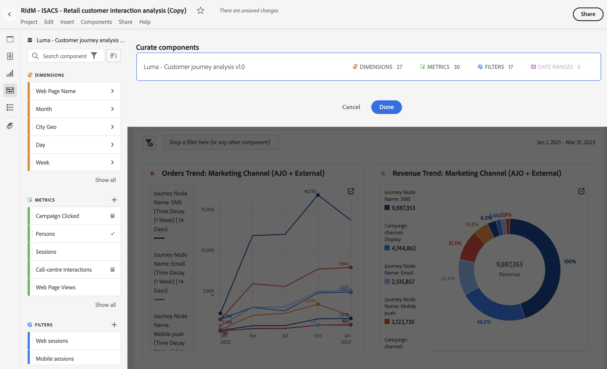

# Curate projects

Curation lets you limit the components (dimensions, metrics, segments, date ranges) before sharing a project. When a recipient opens the project, they will see a limited set of components that you have curated for them. Curation is an optional but recommended step before sharing a project. 

>[!NOTE]
> Product profiles are the primary mechanism governing which components a user can see. They are managed through the [Adobe Experience Cloud Admin Console](https://docs.adobe.com/content/help/en/core-services/interface/manage-users-and-products/admin-getting-started.html). Curation is a secondary filter. 

## Apply project curation

1. Click **[!UICONTROL Share]** > **[!UICONTROL Curate Project Data]**. 
   The components that are used in the project will automatically be added. 
   **Note**: If a project has multiple report suites, you will see a curate field for each report suite in the project. 
1. (Optional) To add more components, drag components you want to share from the left rail to the [!UICONTROL Curate Components] field.  
1. Click **[!UICONTROL Done]**.

Curation can also be applied from the [!UICONTROL Share] menu by clicking **[!UICONTROL Curate and Share]**. This option automatically curates the project to the components in use in the project. You can add additional components following the steps above.

## Curated project view

When a recipient opens a curated project, they will only see the curated set of components you have defined:

## Remove project curation

To remove project curation and restore the full set of components in the left rail:

1. Click **[!UICONTROL Share]** > **[!UICONTROL Curate Project Data]**. 
1. Click **[!UICONTROL Remove Curation]**. 
1. Click **[!UICONTROL Done]**.

## Component curation options

In a curated project, the recipient will be presented with the option to **[!UICONTROL Show All]** components in the left rail. [!UICONTROL Show All] reveals different sets of components, depending on:

* The user’s permission level (admin or non-admin)
* Project role (owner/editor or not)
* Type of curation applied (at the project level)

| Curation type | Admin can see | Non-admin project owner (or edit role) can see | Non-admin duplicate role can see |
| --- | --- | --- | --- |
| **Components "hidden" from a data view** | All data view components available for reporting (hidden components require clicking "Show all") | Not available for reporting | Not available for reporting |
| **Components added or removed from a data view** | Only components added to the data view (hidden or not hidden). Admins cannot report on fields or components that are not defined by the data view. | Only components added to the data view, or components owned by or shared with the user. Hidden components are not available (like VRS curation). | Only components added to the DV, are not hidden and have been included in the Project curation. | 
| **Curated components in a Project** | All data view components available for reporting (hidden components require clicking "Show all") | All non-hidden data view components (requires clicking "show all") | Only curated components, plus any components owned or shared with the user |
| **Curated Project using a data view with hidden components** | All data components available for reporting (hidden and non-curated components require clicking "Show all")| All non-curated project components, all non-hidden data view components, and any components owned by or shared with the user | Only curated components, plus any components owned by or shared with the user |
