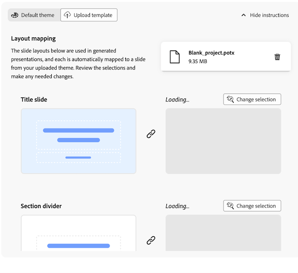

# Data storytelling: Generate slide presentations from Workspace reports {#generate-powerpoint}

>[!NOTE]
>
>Data Storytelling is a skill under Data Insights Agent and is available to eligible customers for a limited time. Access to Data Insights Agent will end on 28th February 2026. To continue using Data Insights Agent or other Adobe Experience Platform Agents without interruption, please contact your Adobe account representative to learn more about licensing Adobe Experience Platform Agent Orchestrator.

Users with [the necessary permissions](#permission-requirements-to-generate-slides) can automatically generate .pptx presentations based on Analysis Workspace projects. When generating these slide presentations, Customer Journey Analytics automatically creates a story from your data by identifying key insights and converting them into stakeholder-ready slides. 

This generated data story reduces the time, effort, and expertise required to surface findings from a Workspace project. Analysts can focus more on data exploration, while allowing Customer Journey Analytics to build and format the executive narrative and communicate the business impact to stakeholders.

## Understand data stories in slide presentations

A **data story** is the narrative that Customer Journey Analytics creates based on your Workspace data. Using generative AI, Customer Journey Analytics identifies important themes within the panels and visualizations that you choose to include in your slide presentation. It generates insights, then goes through a deduplication and scoring process to identify a subset of insights to use to create the data story. 

The following sections describe the additional value that data stories provide, the necessary elements of a project that help shape the narrative, and key elements that are included in the .pptx presentation output. 

### Additional value provided by data stories

Data stories provide value and insights to a Workspace project by making data accessible to users who are less experienced in data analysis. 

Data stories supplement an analysis for a given Workspace project by:

* Providing additional context

* Highlighting important insights

* Assessing whether certain variables are being under-valued or over-valued 

* Calling out hidden trends, anomalies, and other contributing factors

* Giving ideas for next steps

### Project elements that shape data stories

Analysis Workspace creates data stories by considering the following project elements:

* Inter-dimension and inter-metric relationships

* The individual elements that form the basis of the analysis (dimensions, metrics, filters, freeform table structure, visualizations, and panels) 

* The names given to the panels, tables and visualizations

* The ordering of metrics in a freeform table (to determine priority)

* The ordering of visualizations in a panel (to determine priority)

* Summary numbers and summary texts (to determine metrics that need to be highlighted in the data story)

### Presentation elements of a data story

Data stories consist of a title slide, executive summary slide, detail slides, and section dividers.

**Title slide:** Shows the title and presenter name that you specify. Information shows in the speaker notes that describes the process of how the theme and narrative were created, how many insights were generated and used, and which panels were used.

**Executive summary:** Prioritizes the highest-value insights and crafts an overarching story that is between 1 and 5 sentences in length.

**Detail slides:** Generates insights related to any tables, panels, or visualizations in a Workspace project. Insights consist of trends, seasonalities, anomalies, and correlations.

**Section dividers:** Divides insights with appropriately placed and named section dividers.

## Generate a .pptx presentation based on a Workspace project

<!-- markdownlint-disable MD034 -->

>[!CONTEXTUALHELP]
>id="cja-powerpoint-include-visualizations"
>title="Included panels and visualizations"
>abstract="Choose the panels and visualizations that you want to include in the presentation. You can include up to 50 visualizations."

<!-- markdownlint-enable MD034 -->

<!-- markdownlint-disable MD034 -->

>[!CONTEXTUALHELP]
>id="cja-presentation-emphasized-components"
>title="Emphasized components"
>abstract="Choose up to 5 metrics and 5 dimensions from your visualizations that you want to emphasize in the presentation. The metrics you choose are shown in italics, dimensions are shown in bold, and dimension items are shown in a contrasting color."

<!-- markdownlint-enable MD034 -->

1. Go to the Workspace project that contains the data that you want to use as the basis of your slide presentation.

1. Select **[!UICONTROL Generate slides]** in the upper-right corner of the page.

   The Generate slides dialog displays.

   

1. Specify the following information:

   |Option | Description |
   |---------|----------|
   | **[!UICONTROL Cover title]** | Specify a title for the presentation. This title appears on the title slide of the presentation.  |
   | **[!UICONTROL Include presenter name]** | Specify the name of the presenter. This name appears on the title slide of the presentation, below the cover title. |
   | **[!UICONTROL Panels and visualizations to include]** | Choose the panels and visualization that you want to include in the presentation. You can include up to 50 visualizations.
If a visualization is dimmed, it is either followed by the text **[!UICONTROL (unsupported)]** or **[!UICONTROL (restricted data)]**.
<ul><li>**Unsupported**: Most panels and visualizations are supported. For information about unsupported panels and visualization, see [Unsupported project elements and features](#unsupported-project-elements-and-features).</li><li>**Restricted data**: The visualization contains a component that is restricted from being exported by a data governance policy enforced by your organization. Contact your system administrator to see which components are restricted from being exported, then remove the restricted components before generating slides.</li></ul> |
   | **[!UICONTROL Emphasize components]** | Choose the metrics and dimensions from your visualizations that you want to emphasize in the presentation. The components you choose are ranked higher and given more weight when the themes and overarching narrative of the data story is created. 
When no emphasis is applied, components show in presentations as follows:<ul><li>**Metrics and dimensions:** Italics</li><li>**Dimension items:** Quotation marks</li></ul>

When emphasis is applied, components show in presentations as follows:
<ul><li>**Metrics and dimensions:** Italics and bold</li><li>**Dimension items:** Bold when the corresponding dimension is emphasized
A color is also applied to the dimension item when the dimension item is highlighted in the chart.
</li></ul> |

   <!-- add this later: - **[!UICONTROL Panel and visualization descriptions]** - Choose whether to include panel and visualization descriptions in your generated slide presentation. - 
   - **[!UICONTROL Annotations]** - Choose whether annotations are visible in your generated slide presentation. For more information about annotations, see [Annotations overview](/help/components/annotations/overview.md).  -  -->

1. (Conditional) Select **[!UICONTROL Default theme]** if you want to generate slides in fewer steps, and if a corporate theme is not required for your slide presentation. 

   Simply choose the color theme of your presentation by selecting the desired color.

   

1. (Conditional) Select **[!UICONTROL Upload template]** if your slide presentation needs to match a corporate theme. This option requires that you upload a custom template and apply your custom styles. 

   The most recent custom template you upload is stored locally in your browser cache, and is available when generating future slide presentations.

   

   To upload a custom template, do either of the following:
   
   +++(Recommended) Download a blank template and modify it

     1. Download [this blank template](https://d30ln29764hddd.cloudfront.net/deploy/builds/data-storytelling.2025-10-20T15:10:19/resources/components/Blank.potx?).

     1. Apply your custom styles to the blank template.

     1. Re-upload the template without changing any master layout names:

        From your file system, drag your blank template that has your custom styles applied to the drop area.
     
        Or
        
        Select **[!UICONTROL Browse]**, then browse to and select your blank template that has your custom styles applied from the file system. 

     1. In the **[!UICONTROL Layout mapping]** section, each slide layout that is used in generated presentations is automatically mapped to a slide from your uploaded theme. Review the selections to make sure they are correct.

        
     
     1. (Conditional) If a slide layout is mapped incorrectly, select **[!UICONTROL Change selection]** above the slide that was chosen from your uploaded presentation, then choose the slide that matches the layout. 

        Repeat this process for each slide that was incorrectly mapped.
   
   +++

   +++Upload a custom template directly 
   
     1. From your file system, drag your custom template to the drop area.
     
        Or
        
        Select **[!UICONTROL Browse]**, then browse to and select your custom template from the file system. 
        
        Make sure that the uploaded file has master layouts with the following names: "Title_Slide," "Section_Divider," "Title_Text," "Title_Chart," "Title_Two_Content_Mixed," "Title_Three_Content_Mixed."

        Up to 25 master layouts are supported.

        .pptx and .potx files up to 25MB in size are supported.

     1. In the **[!UICONTROL Layout mapping]** section, each slide layout that is used in generated presentations is automatically mapped to a slide from your uploaded theme. Review the selections to make sure they are correct.

        
     
     1. (Conditional) If a slide layout is mapped incorrectly, select **[!UICONTROL Change selection]** above the slide that was chosen from your uploaded presentation, then choose the slide that matches the layout. 

        Repeat this process for each slide that was incorrectly mapped.

   +++

1. Select **[!UICONTROL Export PPT]**.

   The .pptx presentation is automatically downloaded to your workstation. 

1. (Recommended) Open the .pptx presentation and review it. Make any needed changes.

## Permission requirements to generate slides

>[!AVAILABILITY]
>
>If your organization does not have access to generate slide presentations from a Workspace project, please contact your Adobe account representative to learn more about licensing.

The ability to generate slides is enabled by default for all users in organizations that have the required licensing. 

Product profile administrators whose organizations have licensing to generate slides can disable access if needed.

In the [!UICONTROL Adobe Admin Console], the [!UICONTROL Reporting Tools] **[!UICONTROL Data storytelling]** permission determines access to this capability. A [product profile admin](https://helpx.adobe.com/enterprise/using/manage-product-profiles.html) needs to follow these steps in the [!UICONTROL Admin Console] if they want to disable access:
   1. Navigate to **[!UICONTROL Admin Console]** > **[!UICONTROL Products and services]** > **[!UICONTROL Customer Journey Analytics]** > **[!UICONTROL Product Profiles]**
   1. Select the title of the product profile for which you want to provide access to [!UICONTROL Data storytelling].
   1. In the specific product profile, select **[!UICONTROL Permissions]**.
   1. Select  to edit **[!UICONTROL Reporting Tools]**.
   1. Select  to remove **Data storytelling** from the **[!UICONTROL Included permission items]**.
   
      <!--add screenshot of permission in the admin console-->

   1. Select **[!UICONTROL Save]** to save the permissions.

For more information, see [User-level access](/help/technotes/access-control.md#user-level-access) in  [Access control](/help/technotes/access-control.md#access-control) for more information.

## Unsupported project elements and features {#unsupported}

The following Analysis Workspace elements and features used in a project aren't supported when generating slides:

* Attribution panel

  This panel shows as dimmed when the configuration options are displayed.
  
  All other panels can be included in slides that are generated from a Workspace project.

* Some visualizations

  Most visualizations can be included in slides that are generated from a Workspace project. However, the following visualizations cannot be included, and show as dimmed when the configuration options are displayed:

  * Area
  
  * Bullet

  * Cohort table

  * Combo

  * Freeform tables with multiple dimension columns (tables with a single dimension column are supported)

  * Journey canvas

  * Scatter

  * Treemap

* Guided analyses

* Components that are restricted from being exported by a data governance policy
 
  For more information, see [Troubleshoot failed exports](/help/components/exports/troubleshoot-exports.md).

## Project elements and features with limited support

* Breakdowns

  As part of the deduplication and scoring process when generating relevant insights, each breakdown within a freeform table is analyzed independently, and only the first 5 breakdowns within a single freeform table are analyzed.
  
  Only the first level of a breakdown is supported. A breakdown of a breakdown is not included in the presentation.

  
