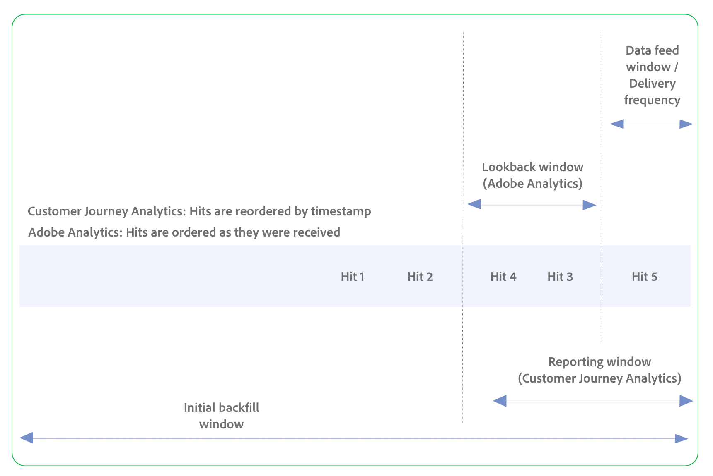

# Data feeds overview

Data feeds are a powerful way to get raw data out of Customer Journey Analytics. This raw data can be used in other platforms outside of Adobe to use at your organization's discretion. Data is delivered in hourly batches at the conclusion of each hour, or in daily batches at the conclusion of each day.

## Prerequisites

Make sure that you meet all the following requirements before using data feeds.

* A working implementation with data being ingested into Adobe Customer Journey Analytics. For more information, see [Data ingestion overview](/help/implement/launch/validate-publish-prod.md).
* Your account is an Analytics product admin, or your account belongs to a product profile with access to data feeds. <!--???-->
* A bucket configured on Amazon S3, Google Cloud Platform, Azure RBAC, or Azure SAS.<!--Which cloud providers do we support??-->
* (Legacy: Required only for legacy FTP and SFTP destination types) Have an FTP site and credentials handy (FTP credentials provided by your organization.)<!--Delete???-->

## Compare data feeds functionality in Customer Journey Analytics and Adobe Analytics

Data feeds in both Customer Journey Analytics and Adobe Analytics allow you to export raw data to third-party platforms. If you previously used data feeds in Adobe Analytics, use the following information to understand differences in available features, data processing behavior, and more.

| **Configuration options and concepts** | **Description** | **Customer Journey Analytics** | **Adobe Analytics** |
|---------|----------|---------|---------|
| Data input | The type of data that can be collected and included in data feeds. |Supports cross-channel data input, including web data, call center data, point-of-sale data, and more.  | Supports web and mobile data input only. |
| Data processing | Data often needs to be processed before it is useful for reporting, and this processing affects data feeds functionality. Data is processed at different stages, depending whether you are using Customer Journey Analytics or Adobe Analytics. | Data is processed at report time, and therefore many reporting features in Customer Journey Analytics can be used to change historical data, such as stitching, derived fields, Data Prep, segmentation, and the reporting window.  | Data is processed at collection time, and therefore reporting features such as processing rules, VISTA rules, stitching, and segmentation do not affect historical data.  |
| Data feed window / Delivery frequency |  Determines:<ul><li>How often the data feed is sent</li><li>The window of time included in the data feed
In other words, after the data feed window ends and the data feed is sent, a new data feed window begins.
</li></ul>
The following options are available:
<ul><li>**Daily**: Feeds contain a full day's worth of data, from midnight to midnight in the report suite's time zone. Use this option for backfill or historical data, or for continuing feeds.</li><li>**Hourly**: Feeds contain a single hour's worth of data. Use this option for continuing feeds.</li></ul>  |  Hourly and daily feeds.
Included in the **[!UICONTROL Reporting window]**
  
Example: 1 hour
 | Hourly and daily feeds. In addition, 15-minute feeds are possible, but are not available by default. For this option to become available in your environment, you must first contact Adobe Customer Care and request that your report suite is configured to support 15-minute exports.

Late-arriving hits are configurable based on the **[!UICONTROL Lookback window]**.

Example: 1 hour
 |
| Lookback window (Adobe Analytics only) | The cutoff for late or out-of-order hits that are delivered outside of the **[!UICONTROL Delivery frequency]** that is selected (such as **[!UICONTROL Hour]** or **[!UICONTROL Day]**). Visits must start after this cutoff in order to be included; visits that start before the cutoff and end within the lookback window are not included.
Not used for persistence, sessions, or dimensions (these are included in the raw data that is collected).
 | Included in the **[!UICONTROL Reporting window]**. | Supported
Example: 23 hours
 |
| Reporting window (Customer Journey Analytics only) | The window of time that includes:<ul><li>The current data feed window (the most recent hour or day, as selected in the **[!UICONTROL Delivery frequency]** field).</li><li>A specified amount of time prior to the current data feed window that allows for any late or out-of-order hits.</li></ul> 
Required for sessions, persistence, and segments.

Not used for dimensions. Dimensions are controlled per dimension based on the dimension's allocation and expiration. Dimension lookbacks cannot exceed the reporting window.
 | Supported
Example: 24 hours
 | N/A
See "Lookback window"
 |
| Initial backfill window |  | Example: 7 days | Example: 7 days |
| Hits |  | Only Hit 5 is in the data feed window. However, because the reporting window also includes Hit 4 and Hit 3 (which are late-arriving hits with timestamps from a previous data feed window), they are also included in the current data feed window.
Hits are reordered in the data feed according to their timestamp, as follows: Hit 3, Hit 4, Hit 5.
 | Only Hit 5 is in the data feed window. However, because a lookback is configured and it includes Hit 4 and Hit 3 (which are late-arriving hits with timestamps from a previous data feed window), they are also included in the current data feed window. (If a lookback was not configured, only Hit 5 would be included in the data feed.) 
Hits are shown in the data feed in the order they were received, as follows: Hit 4, Hit 3, Hit 5.
 |
| Late-arriving hits / Out-of-order hits | (In AA: Out of order data means: Out of order per visitor. In CJA: It means out of order per person. If you send us data that is out of order per person would be if you are setting the timestamp. You can set the timestamp in 2 ways: you can have Adobe set the timestamp, based on when we received the data. Or you can set it yourself. If you're setting the timestamps and you sending us data that is out of order, it messes things up in AA. In AA, data needs to come in order per visitor. We need the right order of events. But in CJA, it doesn't matter what timestamps are on the data. CJA doesn't assign a timestamp to a hit. That is done upstream. CJA reorders the data once it arrives, so that everything is in the proper time sequence. Then we can do the report-time processing. That means you can have both streaming data and batch data. It doesn't matter. At the time it arrives, we reorder it and it becomes in order per person as a result. So in CJA we'll give you all the data we received in the last day or hour, but it's limited to the beginning of the reporting window. Most likely a huge chunk of the data you get in a day or hour belongs to that day or hour. If all you did was batch data from a call center, then that is what you would get out. In CJA, data can come in and it doesn't matter when it came in. So the data feed ustomer has to be able to handle this on their side. So wherever they're putting the data, it needs to handle the fact that timestamps could potentially be all over the place. This might be a challenge for some customers. They need to know this. Needs to be able to handle out of order data per person. It doesn't matter across people. ) Hits that should have been included in a previous data feed, but for some reason they arrived late (such as through timestamped hits or data sources). 
These late-arriving hits are included in the current data feed at the time they arrive, even though their timestamps are within a previous data feed window. Every time a data feed processes data, it looks at any late hits that have arrived and batches them in the next data feed file that is sent.
  | Late-arriving hits that occur within the **[!UICONTROL Reporting window]** are always included. 
The lookback window for these late-arriving hits is controlled through the **[!UICONTROL Reporting window]** configuration option.

Hits are automatically reordered based on timestamps; original values are persisted (no change feed).
 | Can be included or excluded. Configurable with the **[!UICONTROL Late-arriving hits]** configuration option.
The lookback window for these hits is configured through the **[!UICONTROL Lookback window]** configuration option that is available for this specific purpose.

Hits are shown in the order in which they are received; they are not reordered according to timestamp.
 |
| Segmentation |   | Segmets that you configure in Customer Journey Analytics can be applied to data feeds or to the data view.
(Person, Session, Event) Person containers use the entire reporting window; can expand DF hit output based on segment logic.
 | Segments cannot be applied. |
| Stitching | (could be included in the data processing section instead) | Stitching can be used to join multiple datasets (to support cross-channel analysis). | Stitching is not supported. |
| Schema | (could be included in the data processing section instead) | Uses structured, hierarchical fields, potentially containing multiple dimensions and metrics within a single column (arrays; arrays within arrays). | Uses a product list with a long string of proprietary, semicolon-delimited fields.|
| Lookups | (could be included in the data processing section instead)Dynamic lookups allow you to receive additional lookup files in your data feed otherwise not available. | Not needed, because browser dimensions are included in the data view. A broader term that includes the same things as AA, but also includes Classifications, Lookup datasets. You can create any lookup dataset that you want and apply it to CJA. And you don't get separate files; they're exposed as dimensions. You don't add a lookups file, you just choose which dimensions you want to use.  | Used to match a number from a data feed column to an actual value. Specific to a certain set of things (Browser, OS, Mobile device, and they're applied as a separate file that comes with the data feed.)|
| Session definition | (could be included in the data processing section instead) It's not a config option in the data feed. But you define it in the data view.  | Defined in the data view | Defined at collection time. |
| Calculated metrics |   | Not available | Not available |
| Coverage of Reporting Window in DF Output  - Merge with late-arriving hits section | In CJA, we don't keep track of whether we have received all of the data for the reporting window before we send the data feed. We're not waiting for the data, we just wait until the end of the hour/day, and then take all the data that came during that time period (which includes late-arriving hits).  In AA, we do keep track of all the data coming in, and then we send it when we know we have it all. Because we keep track of it, we can give the customer the option to include or exclude late-arriving hits.  | DF outputs only part of the reporting window (only current window), even though session/segment logic may examine the broader window. | Entire DF output is limited to the fixed window (hour/day/15-min). |
| Persistence model |  (could be included in the data processing section instead) | Supports all the dimension allocation settings that are available in a data view (link to page that talks about them. Original, most recent, all, first-known, last-known, b2b). Flexible; based on reporting window evaluation. | Only "Last Touch" (Most Recent) and "First Touch" (Original). |
| Output file format | The format in which data feed data is sent. | Parquet (supports structured fields and is accepted by modern data warehouses) | C3 |
| Delivery destinations | The destinations where data feed data can be sent. | Cloud destinations, including Amazon S3, Azure RBAC, Azure SAS, and Google Cloud Platform. | Cloud destinations, including Amazon S3, Azure RBAC, Azure SAS, and Google Cloud Platform.
Also supports SFTP.
|

Diagram on the AA side needs to show that it needs to be received in order per visitor. 

### Unsupported fields in Customer Journey Analytics

There are going to be fields in AA data feeds that don't exist in CJA. E.g. Visit num. (We will have a session ID, but we won't have a session number.) There are others. Need to get a full list.

## Next steps

The following resources help you understand the basic workflow of obtaining data feeds. After you understand the basic workflow, you can work with teams within your organization to store or ingest raw data into a database.

* [Data feed best practices](/help/export/analytics-data-feed/data-feeds-best-practices.md): Best practices for creating and managing data feeds.
* [Create a data feed](create-feed.md): Technical details for creating a data feed, explaining individual fields in more detail
* [Manage data feeds](df-manage-feeds.md): Learn more about navigating the data feed interface
* [Data feed contents](c-df-contents/datafeeds-contents.md): Understand what is inside the compressed file <!-- Is this still the output users can download from the destination? I aske Jun. -->
* [Data column definitions](c-df-contents/datafeeds-reference.md): A comprehensive list of all available columns.

>[!BEGINSHADEBOX]

See  [Navigate the data feed interface](https://video.tv.adobe.com/v/25452?quality=12&learn=on){target="_blank"} for a demo video.

>[!ENDSHADEBOX]

>[!BEGINSHADEBOX]

See  [Find your data feed id](https://video.tv.adobe.com/v/335747?quality=12&learn=on){target="_blank"} for a demo video.

>[!ENDSHADEBOX]
