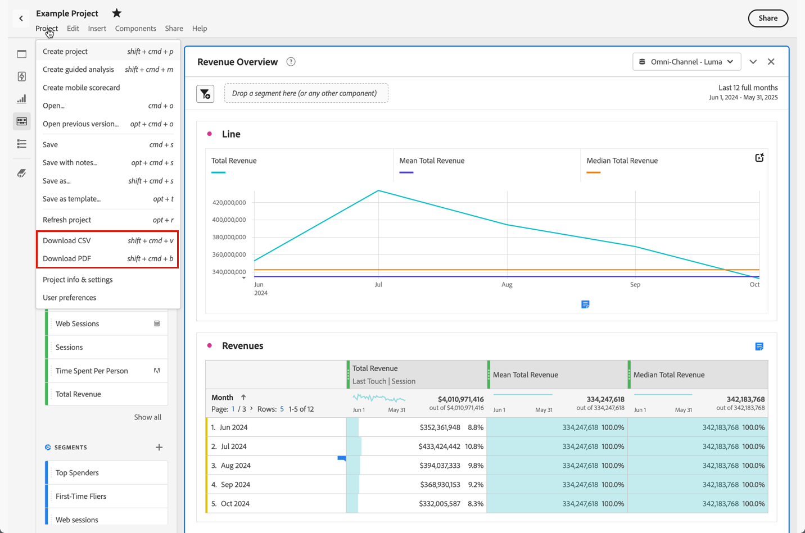

# Download projects and data

You can download Analysis Workspace projects and data to your local device. This download can be copied data, a CSV (comma separated value data) file, or a PDF (portable document format) document. 

* Select the PDF option if you want visualizations included in the downloaded file. 
* Select the CSV and copied data options if you simply need plain-text data.

Additional methods to export Customer Journey Analytics data are described in the [Export overview](/help/analysis-workspace/export/export-project-overview.md).

## Download as CSV or PDF {#download-project}

Consider the following when you download a project as a PDF:

* The download can take several minutes as the project is rerun on Adobe servers to render in PDF format. Do not leave the project until the project downloads in your browser.  You can continue to make changes to the project while the download is rendered. If a PDF takes longer than 5 minutes to render, you are prompted to [email the PDF](../curate-share/send-schedule-files.md) instead.
* Downloads are rendered as a single page with no pagination applied.
* The PDF contain what is visible in the browser page in Analysis Workspace. You need to auto-size custom-sized visualizations and panels to avoid truncated content. Select  to auto-size a custom-sized visualization or panel.
* [Hyperlinks](/help/analysis-workspace/visualizations/freeform-table/freeform-table-hyperlinks.md) within freeform tables  as hyperlinks in the downloaded PDF. 

To download a project as a PDF file:

1. Select **[!UICONTROL Project]** > **[!UICONTROL Download PDF]**. 
   A green bar with the message  **[!UICONTROL Your download has been requested. Please wait.]** is displayed.
   
1. As soon your download is ready, a green bar with the message  **[!UICONTROL *Name of the project* PDF is ready.]** appears.
Select **[!UICONTROL Download]** to download the PDF. How exactly the PDF is presented or downloaded is dependent on your browser configuration to handle PDF documents.

To download a project as a CSV file:

* Select **[!UICONTROL Project]** > **[!UICONTROL Download CSV]**. The project directly downloads to the download folder configured as part of your browser configuration. The file name is composed of *project name* - *report suite name* - *date*, for example `Example Project - Omni-Channel - Luma - Jun 30, 2025.csv`.

## Copy to clipboard {#copy-data}

The **[!UICONTROL Copy to clipboard]** option from the context menu lets you quickly copy data from Analysis Workspace and paste the data in a third-party tool. 

* If you want the displayed table data copied, select the table header and select **Copy data to clipboard** from the context menu.
* If you want a subset of the data copied, make a selection in the table and select **Copy selection to clipboard** from the context menu.

>[!TIP]
>
>You can use the hotkey **_cmd + c_** (macOS) or **_ctrl + c_** (Windows) to copy your selection to the clipboard. Then use **_cmd + v_** (macOS) or **_ctrl + v_** (Windows) to paste the data.

{zoomable="yes"}

## Download as CSV {#download-data}

The download as CSV options from the context menu allow you to download a table of data or the data source of any visualization as a CSV.

To do so:

* From the header of any table or visualization, select **[!UICONTROL Download data as CSV]** from the context menu. This downloads the displayed data in the table or the underlying data source for a visualization as a CSV. 

<!-- Only relevant as soon as CJA supports Map visualization 
  >[!NOTE]
  >
  >  Note: the Map visualization does not support this option.
-->

* Within a table, select **[!UICONTROL Download selection as CSV]** from the context menu. Only the selection is downloaded with this option, as opposed to the full, displayed table.

## Download items as CSV {#download-items}

If you want to analyze more than the visible 400 rows of data in a table, select  **Download items as CSV (_Dimension name_)** from the context menu of the table header or any row. This option exports up to 50,000 dimension items (based on the table sort) for the selected dimension, with sort options and filters applied. If you select this option from the top of the table, the first dimension in the table is exported. 

No limits are enforced in the freeform table. To ensure optimal performance, the recommendation is to use this option in tables with fewer than 20 columns.

>[!TIP]
>
> If your dimension exceeds 50,000 items, download the file with different sort metrics applied or apply a segment. For example, sort descending by Visits in one download and then ascending by Visits in a second download. This tip can help you retrieve longer-tail items.

You can multi-task within the project and even navigate to a new Workspace project in the same tab while the download is in progress. The download pauses if you open a new browser tab. The download is canceled if you leave Workspace completely or close the browser tab.

### Downloaded items file {#items-file}

The following features of a freeform table are applied to the downloaded file:

* All panel segments are applied as filters.
* Breakdowns **above** the selected dimension in the table are applied as filters above each column. 
* Breakdowns **below** the selected dimension in the table are removed.

### Download notifications {#notifications}

As the file downloads, you see the following notifications:

* A blue **[!UICONTROL _Table name_ - _Dimension_.csv has been requested. _x_% complete]** indicating the progress. To cancel the download at any time, select **[!UICONTROL Cancel download]**. Select  if you want to close the message, which does not cancel the download.
* A green **[!UICONTROL _Table name_ - _Dimension_.csv has been downloaded]** completion notification once the file download is completed. The file is downloaded to the downloads folder configured for your browser.

If you request more than one download at a time, you receive a notification that each additional download is queued until the prior download completes.

## Download sensitive data {#sensitive}

Imagine a [data governance policy](/help/data-views/data-governance.md) that prevents the download of data. And that this policy is turned on in the data view you are reporting on. As a result, any download (such as when you email or share PDF files) of projects hashes the data fields labeled as sensitive. You can still do analysis on these fields in Analysis Workspace. If you try to email or otherwise share a project, the sensitive data fields appear as empty in the PDF or CSV file.

If data fields that are labeled as sensitive are included in the data view, the option to select and copy data from the screen is restricted for all data in the data view.

## FAQ {#faq}

| Question | Answer |
| --- | --- |
| Why does my downloaded PDF consist of of only one page? | The [Download PDF](#download-as-csv-or-pdf) functionality does not paginate downloaded PDFs. |
| Can I export more than 50,000 items with the **[!UICONTROL Download items as CSV]** option? | While each download can contain up to 50,000 dimension items, you can change the sort of your table to retrieve longer tail items, or apply a filter to download more specific items. |
| What does **[!UICONTROL Copy visualization]** do? | Unlike [!UICONTROL **Copy data to clipboard**] or [!UICONTROL **Copy selection to clipboard**], the **[!UICONTROL Copy visualization]** context menu option is not an export option. This option allows you to [copy a visualization](/help/analysis-workspace/visualizations/freeform-analysis-visualizations.md#context-menu) or [copy a panel](/help/analysis-workspace/c-panels/panels.md#context-menu) from one place in Workspace to another. For example, from one panel to another in the same project, or from one project to another project. |
