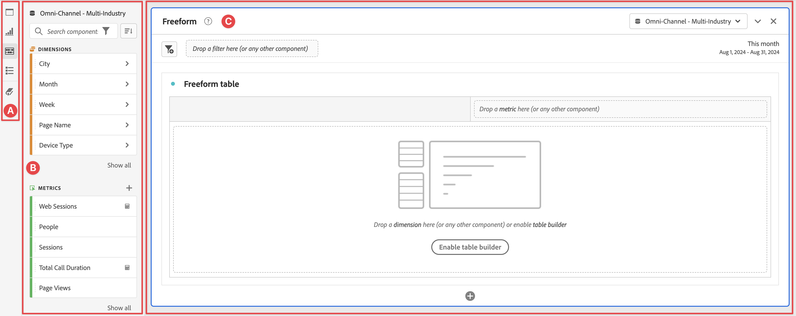

# Analysis Workspace overview {#analysis-workspace-overview}

Analysis Workspace allows you to build analyses quickly to gather insights and then share those insights with others. Using the drag-and-drop browser interface, you can craft your analysis, add visualizations to bring data to life, curate a dataset, and share and schedule projects with anyone you choose.

The following video provides a brief overview with examples of what is possible.

>[!VIDEO](https://video.tv.adobe.com/v/26266/?quality=12)

## Areas of Analysis Workspace

The following image and accompanying table explain some of the main areas in Analysis Workspace:

| Location in image | Name and function |
|---------|----------|
| A | **Button rail:** Contains buttons for adding  **[!UICONTROL Panels]**,  **[!UICONTROL Visualizations]**, and  **[!UICONTROL Components]** to your project in Analysis Workspace. The rail also contains a  **[!UICONTROL Table of contents]** and  **[!UICONTROL Data Dictionary]** button to open the Data Dictionary. |
| B | **Left rail:** Depending on which button is selected in the far left rail, this area contains individual panels, visualizations, or components. |
| C | **Canvas:** The main area where you drag content from the left rail to build your project. The project dynamically updates as you add panels, add visualizations to panels, and add components to visualizations. You can create multiple panels, and within each panel you can create multiple visualizations. Each panel is based on a selected data view, that determines available components like metrics and dimensions. See [Panels - Data view](/help/analysis-workspace/c-panels/panels.md#data-view) for more information. | 

## Features in Analysis Workspace {#analysis}

Some of the key features available in Analysis Workspace: 

### Panels

**Panels** are used to organize your analysis within a project and can contain many tables & visualizations. Many of the panels provided in Analysis Workspace generate a full set of analyses based on a few user inputs. On the far left rail, select the top **[!UICONTROL Panels]** icon to see a full list of panels available.

To learn more about panels, see [Panels overview](/help/analysis-workspace/c-panels/panels.md).

### Visualizations

**Visualizations**, such as a bar or line chart, can be used to visually bring data to life. On the far left rail, select the middle **[!UICONTROL Visualizations]** icon to see the full list of visualizations available. 

To learn more about visualizations, see [Visualizations overview](/help/analysis-workspace/visualizations/freeform-analysis-visualizations.md).

### Components

Components in Analysis Workspace consist of the following:

*  Dimensions

*  Metrics

*  Filters

*  Date ranges

To learn more about each of these component types, see [Components overview](/help/components/overview.md). 

Each of these component types can be added to a visualization (such as a Freeform table) to start answering your business questions. 

After you understand component terminology, you can drag components into visualizations (including Freeform tables) to [build your analysis](/help/analysis-workspace/visualizations/freeform-table/freeform-table.md).

### Data Dictionary

The Data Dictionary in Analysis Workspace helps both users and administrators keep track of and better understand the components in their Analytics environment.

To learn more about the Data Dictionary, see [Data Dictionary overview](/help/components/data-dictionary/data-dictionary-overview.md).

## Data Sources

Synchronizing visualizations lets you control which data table or data source corresponds to a visualization. Here is more information on how you can [manage data sources](/help/analysis-workspace/visualizations/t-sync-visualization.md).

## Start using Analysis Workspace

### Log in to Adobe Analytics {#login}

To start using Analysis Workspace, log in to Adobe Analytics by going to [experience.adobe.com/analytics](https://experience.adobe.com/analytics). The Projects page of Analysis Workspace is shown by default. If a specific project has been selected for you, that project is shown by default.

### Create a project {#new-project}

An analysis in Analysis Workspace is referred to as a [project](/help/analysis-workspace/build-workspace-project/freeform-overview.md).  

You can create a project in Analysis Workspace as described in [Create projects](/help/analysis-workspace/build-workspace-project/create-projects.md).

Projects can be organized into folders and subfolders, as described in [Folders in Analysis Workspace](/help/analysis-workspace/build-workspace-project/workspace-folders/about-folders.md).

### Save and share a project

As you create an analysis in Analysis Workspace, your work is [automatically saved](/help/analysis-workspace/build-workspace-project/save-projects.md). 

When you finish building out the project and it's gathering actionable insights, the project is ready to be consumed by others. You can share the project with users and groups in your organization, or even with people outside your organization. For information about sharing a project, see [Share projects](/help/analysis-workspace/curate-share/share-projects.md).

## Additional resources {#resources}

* Adobe offers hundreds of [Analytics video training tutorials](https://experienceleague.adobe.com/docs/analytics-learn/tutorials/overview.html).
* See [Adobe Experience Cloud release notes](https://experienceleague.adobe.com/docs/release-notes/experience-cloud/current.html#analytics) for updates about new features.
* A great way to become acquainted with Analysis Workspace is through the Analysis Workspace Training Tutorial template. This template walks you through common terminology and steps for building your first analysis in Workspace. To begin the tutorial:
  1. On the [!UICONTROL **Workspace**] tab in Adobe Analytics, select **[!UICONTROL Learning]** on the left.
  1. Select **[!UICONTROL Open Tutorial]**.
     
