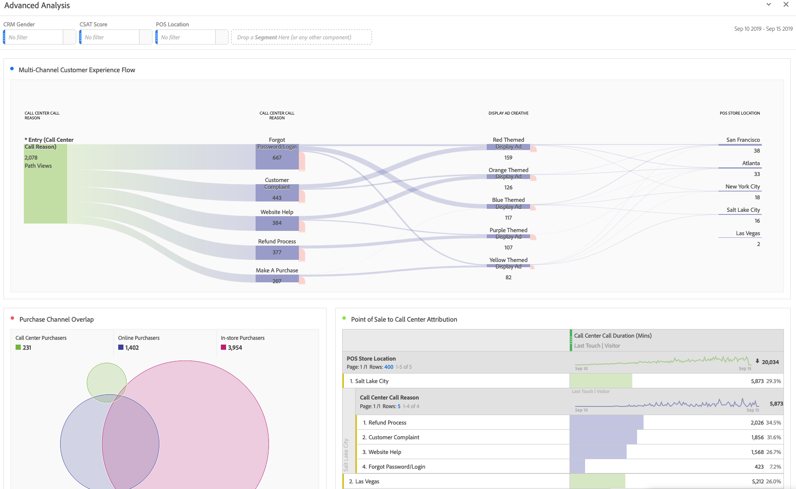
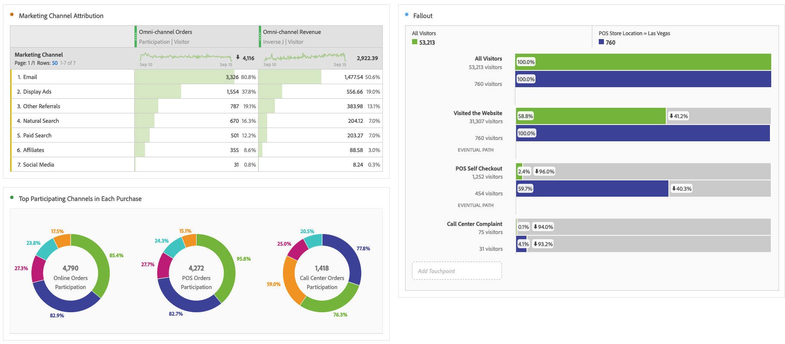

# Perform advanced analysis

Before you start with building advanced analysis reports and visualizations, as described below, make sure you understand [basic analysis](/help/analysis-workspace/perform-basic-analysis.md).

Advanced analysis leverages features like [Flow](/help/analysis-workspace/visualizations/c-flow/flow.md) diagrams, [Attribution](/help/analysis-workspace/c-panels/attribution.md), [Fallout](/help/analysis-workspace/visualizations/fallout/fallout-flow.md) diagrams, and [dimension breakdowns](/help/components/dimensions/t-breakdown-fa.md).

 

 
