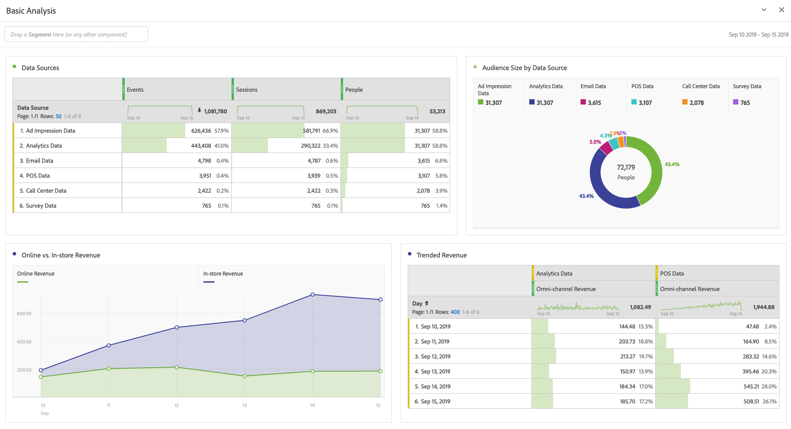
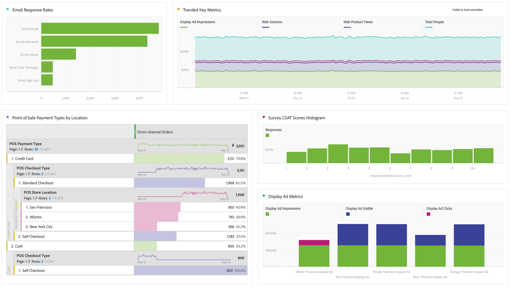

# Perform basic analysis

Customer Journey Analytics lets you analyze data using the power and flexibility of Analysis Workspace. 

>[!TIP]
>
>If no data is available in Analysis Workspace, make sure that you followed the [data ingestion process](/help/data-ingestion/data-ingestion.md), which includes the following:<ul><li>[Create a connection](/help/connections/create-connection.md#create-and-configure-the-connection)  Make sure the connection is configured to import new data, backfill data, or both.</li><li>[Add datasets](/help/connections/create-connection.md#add-and-configure-datasets)</li><li>[Create data views](/help/data-views/create-dataview.md)</li></ul>

Feel free to experiment and drag in dimensions and metrics, change dimension and metrics attribution settings, friendly names, time zone, session settings, etc.

Here is a sample of basic visualizations in Workspace. For example, you can

* Create a ranked report of which data sources show the most events, sessions, and people.

* Create a trended report of online versus in-store revenue that compares the two data sources over time.

* Depict audience size by data sources, such as ad impression data, Customer Journey Analytics data, email data, POS data, call center data, and survey data.

 

 
