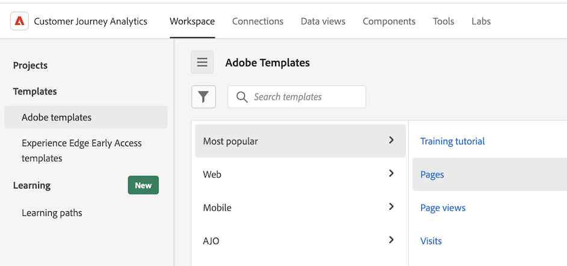

# Use templates

Templates (or company templates) in Analysis Workspace provide quick insights into the most common reporting scenarios. Following are some examples of questions that you can answer with templates:

* How many people visit your site 
* How many of those visitors are unique visitors (counted only once) 
* How they came to the site (such as whether they followed a link or came there directly) 
* What keywords visitors used to search site content 
* How long visitors stayed on a given page or on the entire site 
* What links visitors clicked, and when they left the site 
* Which marketing channels are most effective at generating revenue or conversion events 
* How much time they spent watching a video 
* Which browsers and devices they used to visit your site

The following information describes how to access and use templates from the [!UICONTROL Templates] tab in Analysis Workspace.

## Access and run a template

1. In Analysis Workspace, select the [!UICONTROL **Workspace**] tab.

   

1. In the [!UICONTROL **Templates**] section, select either of the following tabs:

   * **[!UICONTROL Adobe templates]**: Shows all templates provided by Adobe.

   * **[!UICONTROL _login_company_name_ templates]**: Shows all company templates that have been created for your organization.

     Company templates can be created only by an administrator. For information about how to create a company template, see [Create and manage templates](/help/analysis-workspace/templates/create-templates.md).

1. Use either of the following options to change how you view the available templates:

   * Choose whether to view templates in a column view or a card view by selecting either the column view  or the card view  icon.

   * When using the card view , choose from the following sort orders: **[!UICONTROL Most recently used]**, **[!UICONTROL Most popular]**, **[!UICONTROL Alphabetical]**, **[!UICONTROL Categorical]**.

1. In the search field, begin typing the name of the template you want to find, then select it from the list of templates. 

   Or

   Select the category of template that you want to view, then select the template from the list of templates.

   >[!TIP]
   >
   >To navigate the menu using the arrow keys, press the Forward Slash key (/), and then press the Down Arrow key. Press Enter to load the selected template.

   For a list of templates that are available, see the [Available templates](#available-templates) section below.

1. (Optional) You can view templates that contain components that are not available in your data view. (By default, templates are shown only if they use components that are available in your data view.) 

   >[!NOTE]
   >
   >   Before you can use these templates, an administrator must first add the required context labels for these missing components to the data view. For more information, see [Add missing components to the data view for a given template](/help/analysis-workspace/templates/create-templates.md#add-missing-components-to-the-data-view-for-a-given-template) in [Use templates](/help/analysis-workspace/templates/create-templates.md).

   1. Select the filter icon.
   
   1. Select **[!UICONTROL Not ready for use]** to show templates that require additional components.

      

1. Select the template to create a report based on the template you chose. 

1. (Conditional) If the template contains components that are not available in your data view, the Incompatible data view dialog displays, stating that the data view is incompatible with the template and showing which components are missing.

   Do either of the following:
   
   * Choose a different data view in the **[!UICONTROL Change data view]** drop-down menu.
   
   * Select **[!UICONTROL Continue anyway]** to view the template with the missing components.

## Create a project based on a template {#use-reports}

A template might not fit your needs exactly, but it can get you close. In these cases, you can use the template as a starting point for your project, then customize it to best suit your specific purposes. 

If you navigate away from a template after making changes, you are prompted to save or discard your changes. Saving changes to a template saves the template as a new project.

To customize a template and save it as a project:

1. In Customer Journey Analytics, select the [!UICONTROL **Workspace**] tab.

1. Select the [!UICONTROL **Templates**] tab.

1. Select the template you want to view. For example, under [!UICONTROL **Most popular**], select the [!UICONTROL **Pages**] template.

   The Pages template, as displayed in Analysis Workspace, shows two [visualizations](/help/analysis-workspace/visualizations/freeform-analysis-visualizations.md) ([Bar chart](/help/analysis-workspace/visualizations/bar.md) and [Summary number](/help/analysis-workspace/visualizations/summary-number-change.md)) and a [Freeform table](/help/analysis-workspace/visualizations/freeform-table/freeform-table.md). The metric used is Occurrences.

   <!--update screenshot. The following is AA -->

   

1. Do any of the following:

   * View the template.
   * Drag one or more filters into the Filter drop zone at the top. For example, drag the filter [!UICONTROL **Mobile Customers**] and view the results. 
   * Change the date range by going to the calendar at the top-right.
   * Add dimension breakdowns, drag in other metrics, and generally customize the template to suit your needs.

1. (Optional) Save the template as a project by selecting [!UICONTROL **Project**] > [!UICONTROL **Save**].

   The template is saved as a new project; it does not modify the existing template. For more information about saving projects, see [Save projects](/help/analysis-workspace/build-workspace-project/save-projects.md).

## Available templates

To access all available pre-built templates:

1. In Adobe Analytics, select the [!UICONTROL **Workspace**] tab, then select the [!UICONTROL **Templates**] tab.

   Pre-built templates are organized by category. 

   <!--add screenshot-->

1. Select a category to view the templates within it.

   The following sections correspond to the available categories and provide information about each template.
   
   * [[!UICONTROL **Most popular**]](#most-popular)

   * [[!UICONTROL **Web**] > [!UICONTROL **Engagement**]](#engagement)

   * [[!UICONTROL **Web**] > [!UICONTROL **Conversion**]](#web-conversion)

   * [[!UICONTROL **Web**] > [!UICONTROL **Audience**]](#web-audience)

   * [[!UICONTROL **Web**] > [!UICONTROL **Acquisition**]](#web-acquisition)

   * [[!UICONTROL **Mobile**] > [!UICONTROL **Mobile App**]](#mobile-mobile-app)

   * [[!UICONTROL **Mobile**] > [!UICONTROL **Mobile Device Information**]](#mobile-mobile-device-information)

   * [[!UICONTROL **Time Parting**]](#time-parting)
   
   * [[!UICONTROL **Cross-Channel**]](#cross-channel)

   * [[!UICONTROL **Other Channels**]](#other-channels)

   * [[!UICONTROL **AJO**]](#ajo)

### Most popular {#most-popular}

<!--AA only-->

<!-- markdownlint-disable MD034 -->

>[!CONTEXTUALHELP]
>id="aa-template--unitsOvertimeReport"
>title="View the total number of units purchased within all orders. Data is shown over a period of time and compared with prior periods."
>abstract="**This can help you** better understand how unit sales are increasing or decreasing over time. You could apply a segment to learn which customers or geographies are purchasing the most units and how those unit sales are trending over time. **Based on what you learn, you might** do any number of things, like assess the effectiveness of a recently launched marketing campaign by comparing unit sales before and after the campaign launched. Or you might compare year-over-year unit sales during the holidays. This template uses the Day dimension and the Units metric."

<!-- markdownlint-enable MD034 -->

<!--both AA and CJA-->

<!-- markdownlint-disable MD034 -->

>[!CONTEXTUALHELP]
>id="template--training"
>title="Training Tutorial template"
>abstract="Learn common Analysis Workspace terminology and steps for building your first analysis."

<!-- markdownlint-enable MD034 -->

<!-- markdownlint-disable MD034 -->

>[!CONTEXTUALHELP]
>id="template--pagesRankedReport"
>title="Identify the most popular and least popular pages."
>abstract="**This can help you** better understand your audience and the kind of information they're most interested in. **Based on what you learn, you might** do any number of things, like adjust page metadata in order to increase visibility on lesser-viewed pages, or spend time improving the content of your most-viewed pages. This template uses the Page dimension and the Page Views metric."

<!-- markdownlint-enable MD034 -->

<!-- markdownlint-disable MD034 -->

>[!CONTEXTUALHELP]
>id="template--pageViewsOvertimeReport"
>title="View the total number of page views. Data is shown over a period of time and compared with prior periods. "
>abstract="**This can help you** better understand how traffic on your site might be increasing or decreasing over time. **Based on what you learn, you might** do any number of things, like assess the effectiveness of a recently launched marketing campaign by comparing site traffic before and after the campaign launched. Or you might compare year-over-year holiday traffic. This template uses the Day dimension and the Page Views metric."

<!-- markdownlint-enable MD034 -->

<!-- markdownlint-disable MD034 -->

>[!CONTEXTUALHELP]
>id="template--visitsOvertimeReport"
>title="View the total number of visits. Data is shown over a period of time and compared with prior periods."
>abstract="**This can help you** better understand how traffic on your site might be increasing or decreasing over time. **Based on what you learn, you might** do any number of things, like assess the effectiveness of a recently launched marketing campaign by comparing site traffic before and after the campaign launched. Or you might compare year-over-year holiday traffic. This template uses the Day dimension and the Visits metric."

<!-- markdownlint-enable MD034 -->

<!-- markdownlint-disable MD034 -->

>[!CONTEXTUALHELP]
>id="template--visitorsOvertimeReport"
>title="View the total number of unique visitors. Data is shown over a period of time and compared with prior periods. "
>abstract="**This can help you** better understand how the reach and audience size of your site is increasing or decreasing over time or compared with a prior period. **Based on what you learn, you might** do any number of things, like assess whether a recently launched marketing campaign was successful at attracting new people to the site by comparing unique visitors before and after the campaign launched. Or you might compare the number of people to visit the site during the holidays year-over-year. This template uses the Day dimension and the Unique Visitors metric. "

<!-- markdownlint-enable MD034 -->

<!-- markdownlint-disable MD034 -->

>[!CONTEXTUALHELP]
>id="template--keyMetricsReport"
>title="View a report that shows the page views, visits, and unique visitors metrics side by side. Data is shown over a period of time and compared with prior periods."
>abstract="**This can help you** compare these important metrics to gain a more complete picture of the number of unique people visiting the site, the number of times pages were visited, and the number of sessions. **Based on what you learn, you might** do any number of things, like assess the average number of pages each person viewed when visiting the site in a given week or month, and how that changed during certain times of the year or before and after marketing campaigns were run.  This template uses the Day dimension, Page Views metric, Visits metric, and the Unique Visitors metric."

<!-- markdownlint-enable MD034 -->

<!-- markdownlint-disable MD034 -->

>[!CONTEXTUALHELP]
>id="template--siteSectionRankedReport"
>title="View the most popular or highest performing sections of your site."
>abstract="**This can help you** better understand which sections of your site are the most visited. **Based on what you learn, you might** do any number of things, like assess which products or services that you provide generate the most interest. This template uses the Site Section dimension and the Visits metric."

<!-- markdownlint-enable MD034 -->

<!-- markdownlint-disable MD034 -->

View the most common places people go immediately after visiting a certain page. 
**This can help you** better understand user behavior after visiting a certain page.

**Based on what you learn, you might** do any number of things, like assess whether the page design or layout could be optimized to direct people to more desirable pages, such as a page to make a purchase or leave a review.
 
This template uses the Page dimension and the Events metric.

>[!CONTEXTUALHELP]
>id="template--next-page-report"
>title="View the most common places people go immediately after visiting a certain page."
>abstract="**This can help you** better understand user behavior after visiting a certain page. **Based on what you learn, you might** do any number of things, like assess whether the page design or layout could be optimized to direct people to more desirable pages, such as a page to make a purchase or leave a review. This template uses the Page dimension and the Events metric."

<!-- markdownlint-enable MD034 -->

<!-- markdownlint-disable MD034 -->

>[!CONTEXTUALHELP]
>id="template--previous-page-report"
>title="View the most common places people go immediately before visiting a certain page."
>abstract="**This can help you** better understand which pages direct the most traffic to a certain page. **Based on what you learn, you might** do any number of things, like assess whether pages that aren't appearing as previous pages need more prominent links to the current page."

<!-- markdownlint-enable MD034 -->

<!-- markdownlint-disable MD034 -->

>[!CONTEXTUALHELP]
>id="template--campaignRankedReport"
>title="View the links that were most successful in driving traffic to your site."
>abstract="**This can help you** better understand which tracking codes (and the links they are associated with) were the most used in accessing your site. **Based on what you learn, you might** do any number of things, like adjust your strategy for where you add links to your site. This template uses the Tracking Code dimension and the Visits metric."

<!-- markdownlint-enable MD034 -->

<!-- markdownlint-disable MD034 -->

>[!CONTEXTUALHELP]
>id="template--productsRankedReport"
>title="View the number of orders by product. Data is shown over a period of time."
>abstract="**This can help you** understand which products are in the highest or lowest demand. **Based on what you learn, you might** do any number of things, like adjust your marketing strategies to promote high-performing products or to improve or discontinue under-performing products. You could also adjust your product inventory based on your analysis of the data. This template uses the Product dimension and the Orders metric."

<!-- markdownlint-enable MD034 -->

<!-- markdownlint-disable MD034 -->

>[!CONTEXTUALHELP]
>id="template--lastTouchChannelRankedReport"
>title="View the most recent marketing channels visitors match with during their engagement period (30 days by default)."
>abstract="**This can help you** understand which marketing channels were most effective at bringing people to your site that result in conversions. **Based on what you learn, you might** do any number of things, like allocate more resources to high-performing channels, or allocate fewer resources to under-performing channels. This template uses the Last Touch Channel dimension and the Unique Visitors metric."

<!-- markdownlint-enable MD034 -->

<!-- markdownlint-disable MD034 -->

>[!CONTEXTUALHELP]
>id="template--lastTouchChannelDetailRankedReport"
>title="View details about the most recent marketing channels visitors match with during their engagement period (30 days by default)."
>abstract="**This can help you** understand not only which marketing channels were most effective at bringing people to your site that result in conversions, but details about those marketing channels. For example, if a visitor arrived to your site and matched with the 'Paid search' Marketing channel, you could use the channel detail to see which search engine was used, or which keyword they searched for. **Based on what you learn, you might** do any number of things, like allocate more resources to high-performing channels, or allocate fewer resources to under-performing channels. This template uses the Last Touch Channel Detail dimension and the Unique Visitors metric. "

<!-- markdownlint-enable MD034 -->

<!-- markdownlint-disable MD034 -->

>[!CONTEXTUALHELP]
>id="template--revenueOvertimeReport"
>title="View the monetary amount of products purchased within all orders. Data is shown over a period of time and compared with prior periods."
>abstract="**This can help you** understand how revenue is increasing or decreasing over time. You can combine this metric with any dimension to learn which dimension items contributed to revenue. **Based on what you learn, you might** do any number of things, like project future revenue based on previous trends. You could also add another dimension, like the Tracking code dimension, to learn which campaigns are generating the most revenue. This template uses the Day dimension and the Revenue metric."

<!-- markdownlint-enable MD034 -->

<!-- markdownlint-disable MD034 -->

>[!CONTEXTUALHELP]
>id="template--ordersOvertimeReport"
>title="View the total number of purchase events. Data is shown over a period of time and compared with prior periods."
>abstract="**This can help you** better understand how interest in your products and services are increasing or decreasing over time. You could apply a segment to learn which customers or geographies are placing the most orders and how those orders are trending over time. **Based on what you learn, you might** do any number of things, like assess the effectiveness of a recently launched marketing campaign by comparing orders before and after the campaign launched. Or you might compare year-over-year holiday orders. This template uses the Day dimension and the Orders metric."

<!-- markdownlint-enable MD034 -->

The following templates are available:

| Template name | Why use this template <!-- What do you do with it? What can it help you learn? and What are the potential actions? --> |
| --- | --- | 
| [!UICONTROL **Training Tutorial**] | Learn common Analysis Workspace terminology and steps for building your first analysis | 
| [!UICONTROL **Pages**]  | <!--duplicated in Engagement section--> Identify the most popular and least popular pages. 
**This can help you** better understand your audience and the kind of information they're most interested in.

**Based on what you learn, you might** do any number of things, like adjust page metadata in order to increase visibility on lesser-viewed pages, or spend time improving the content of your most-viewed pages.

This template uses the Page dimension and the Page Views metric.
  | 
| [!UICONTROL **Page Views**] | <!--duplicated in Engagement section--> View the total number of page views. Data is shown over a period of time and compared with prior periods. 
**This can help you** better understand how traffic on your site might be increasing or decreasing over time.

**Based on what you learn, you might** do any number of things, like assess the effectiveness of a recently launched marketing campaign by comparing site traffic before and after the campaign launched. Or you might compare year-over-year holiday traffic.

This template uses the Day dimension and the Page Views metric.
  | 
| [!UICONTROL **Web Visits**] | <!--duplicated in Engagement section--> View the total number of visits. Data is shown over a period of time and compared with prior periods. 
**This can help you** better understand how traffic on your site might be increasing or decreasing over time.

**Based on what you learn, you might** do any number of things, like assess the effectiveness of a recently launched marketing campaign by comparing site traffic before and after the campaign launched. Or you might compare year-over-year holiday traffic.

This template uses the Day dimension and the Visits metric.
  | 
| [!UICONTROL **Web Visitors**] | <!--duplicated in Engagement section--> View the total number of unique visitors. Data is shown over a period of time and compared with prior periods. 
**This can help you** better understand how the reach and audience size of your site is increasing or decreasing over time or compared with a prior period.

**Based on what you learn, you might** do any number of things, like assess whether a recently launched marketing campaign was successful at attracting new people to the site by comparing unique visitors before and after the campaign launched. Or you might compare the number of people to visit the site during the holidays year-over-year.

This template uses the Day dimension and the Unique Visitors metric.
   | 
| [!UICONTROL **Key Metrics**] | <!--duplicated in Engagement section--> View a report that shows the page views, visits, and unique visitors metrics side by side. Data is shown over a period of time and compared with prior periods. 
**This can help you** compare these important metrics to gain a more complete picture of the number of unique people visiting the site, the number of times pages were visited, and the number of sessions.

**Based on what you learn, you might** do any number of things, like assess the average number of pages each person viewed when visiting the site in a given week or month, and how that changed during certain times of the year or before and after marketing campaigns were run. 

This template uses the Day dimension, Page Views metric, Visits metric, and the Unique Visitors metric.
  | 
| [!UICONTROL **Site sections**] | View the most popular or highest performing sections of your site. 
**This can help you** better understand which sections of your site are the most visited.

**Based on what you learn, you might** do any number of things, like assess which products or services that you provide generate the most interest.
 
This template uses the Site Section dimension and the Visits metric.
  | 
| [!UICONTROL **Next page**] | View the most common places people go immediately after visiting a certain page. 
**This can help you** better understand user behavior after visiting a certain page.

**Based on what you learn, you might** do any number of things, like assess whether the page design or layout could be optimized to direct people to more desirable pages, such as a page to make a purchase or leave a review.
 
This template uses the Page dimension and the Events metric.
  | 
| [!UICONTROL **Previous page**] | View the most common places people go immediately before visiting a certain page. 
**This can help you** better understand which pages direct the most traffic to a certain page.

**Based on what you learn, you might** do any number of things, like assess whether pages that aren't appearing as previous pages need more prominent links to the current page.

This template uses the Page dimension and the Events metric.
  | 
| [!UICONTROL **Campaigns (Tracking code)**] | View the links that were most successful in driving traffic to your site. 
**This can help you** better understand which tracking codes (and the links they are associated with) were the most used in accessing your site.

**Based on what you learn, you might** do any number of things, like adjust your strategy for where you add links to your site.

This template uses the Tracking Code dimension and the Visits metric.
  | 
| [!UICONTROL **Products**] | View the number of orders by product. Data is shown over a period of time. 
**This can help you** understand which products are in the highest or lowest demand.

**Based on what you learn, you might** do any number of things, like adjust your marketing strategies to promote high-performing products or to improve or discontinue under-performing products. You could also adjust your product inventory based on your analysis of the data.

This template uses the Product dimension and the Orders metric.
   | 
| [!UICONTROL **Last Touch Marketing Channel**] | View the most recent marketing channels visitors match with during their engagement period (30 days by default).
**This can help you** understand which marketing channels were most effective at bringing people to your site that result in conversions.

**Based on what you learn, you might** do any number of things, like allocate more resources to high-performing channels, or allocate fewer resources to under-performing channels.

This template uses the Last Touch Channel dimension and the Unique Visitors metric.
  | 
| [!UICONTROL **Last Touch Marketing Channel Detail**] | View details about the most recent marketing channels visitors match with during their engagement period (30 days by default).
**This can help you** understand not only which marketing channels were most effective at bringing people to your site that result in conversions, but details about those marketing channels. For example, if a visitor arrived to your site and matched with the 'Paid search' Marketing channel, you could use the channel detail to see which search engine was used, or which keyword they searched for.

**Based on what you learn, you might** do any number of things, like allocate more resources to high-performing channels, or allocate fewer resources to under-performing channels.

This template uses the Last Touch Channel Detail dimension and the Unique Visitors metric.
  | 
| [!UICONTROL **Revenue**] | <!--duplicated in Web Conversion section-->View the monetary amount of products purchased within all orders. Data is shown over a period of time and compared with prior periods.
**This can help you** understand how revenue is increasing or decreasing over time. You can combine this metric with any dimension to learn which dimension items contributed to revenue.

**Based on what you learn, you might** do any number of things, like project future revenue based on previous trends. You could also add another dimension, like the Tracking code dimension, to learn which campaigns are generating the most revenue.

This template uses the Day dimension and the Revenue metric.
  | 
| [!UICONTROL **Orders**] | <!--duplicated in Web Conversion section-->View the total number of purchase events. Data is shown over a period of time and compared with prior periods. 
**This can help you** better understand how interest in your products and services are increasing or decreasing over time. You could apply a segment to learn which customers or geographies are placing the most orders and how those orders are trending over time.

**Based on what you learn, you might** do any number of things, like assess the effectiveness of a recently launched marketing campaign by comparing orders before and after the campaign launched. Or you might compare year-over-year holiday orders.

This template uses the Day dimension and the Orders metric.
  |  

### Web: Engagement {#web-engagement}

<!--AA only-->

<!-- markdownlint-disable MD034 -->

>[!CONTEXTUALHELP]
>id="aa-template--real-time"
>title="View the dimensions and metrics that are currently being collected on your site."
>abstract="**This can help you** better understand what is trending on your site. **Based on what you learn, you might** do any number of things, like respond to and actively manage the performance of your current marketing content and campaigns."

<!-- markdownlint-enable MD034 -->

<!-- markdownlint-disable MD034 -->

>[!CONTEXTUALHELP]
>id="aa-template--timeSpentVisitOvertimeReport"
>title="View the average time visitors spend on your site during each visit. Data is shown over a period of time and compared with prior periods."
>abstract="**This can help you** better understand visitor engagement levels and how much time visitors are spending on the site. **Based on what you learn, you might** do any number of things, like assess whether changes to your site result in visitors spending more time on the site. This template uses the Day dimension and the Time Spent per Visit (seconds) metric."

<!-- markdownlint-enable MD034 -->

<!-- markdownlint-disable MD034 -->

>[!CONTEXTUALHELP]
>id="aa-template--timePriorRankedReport"
>title="View the average time users spend prior to a success event."
>abstract="**This can help you** better understand how much time it takes visitors to perform a desired action, such as making a purchase. **Based on what you learn, you might** do any number of things, like assess whether changes to your site improve visitors' ability to quickly reach a success event. This template uses the Time Prior to Event dimension and the Unique Visitors metric."

<!-- markdownlint-enable MD034 -->

<!-- markdownlint-disable MD034 -->

>[!CONTEXTUALHELP]
>id="aa-template--falloutReport"
>title="View where people leave or continue through a predefined sequence of pages."
>abstract="**This can help you** better understand where people are falling out of the user journey. **Based on what you learn, you might** do any number of things, like analyze conversion rates through specific processes on your site (such as a purchase or registration process), or analyze correlations between events on your site. (For example, what percentage of people who looked at your privacy policy went on to purchase a product.) You can also use this template to perform side-by-side comparisons of two different segments in the same report. This template uses the Fallout visualization."

<!-- markdownlint-enable MD034 -->

<!-- markdownlint-disable MD034 -->

>[!CONTEXTUALHELP]
>id="aa-template--cross-device-analysis"
>title="View which devices people used across all points of the journey."
>abstract="**This can help you** better understand how many people interact with your brand, the types of devices they use, and how their use of multiple devices affects their experience. For example, how often do people begin a task on a mobile device and then later move to a desktop to complete a task? What are the most common paths users take from one device to another? Where do they drop out? Where do they succeed? And so forth. **Based on what you learn, you might** do any number of things, like optimize certain parts of the user journey for a mobile experience. This template uses the Flow visualization, Fallout visualization, Cohort analysis, the People metric, and the Unique devices metric."

<!-- markdownlint-enable MD034 -->

<!-- markdownlint-disable MD034 -->

>[!CONTEXTUALHELP]
>id="aa-template--web-retention"
>title="View who your loyal users are and what they are doing on your site."
>abstract="**This can help you** better understand the number of times the average person visits your site, the frequency with which people return to the site, and the number of days between return visits. **Based on what you learn, you might** do any number of things, like analyze what content is most effective at bringing people back to the site. This template uses the Visits metric and the Unique visitors metric."

<!-- markdownlint-enable MD034 -->

<!-- markdownlint-disable MD034 -->

>[!CONTEXTUALHELP]
>id="aa-template--audio-consumption-template"
>title="View  trends and top metrics of media audio consumption across all digital devices."
>abstract="**This can help you** better understand how visitors are consuming audio content on your site. **Based on what you learn, you might** do any number of things, like analyze what content is being consumed most. This template uses the Visits metric and the Unique visitors metric."

<!-- markdownlint-enable MD034 -->

<!-- markdownlint-disable MD034 -->

>[!CONTEXTUALHELP]
>id="aa-template--media-recency-frequency-loyalty"
>title="View  trends and top metrics of media consumption across all digital devices."
>abstract="**This can help you** better understand the number of times the average person visits your site, the frequency with which people return to the site, and the number of days between return visits. **Based on what you learn, you might** do any number of things, like analyze what content is most effective at bringing people back to the site. This template uses the Visits metric and the Unique visitors metric."

<!-- markdownlint-enable MD034 -->

<!-- markdownlint-disable MD034 -->

>[!CONTEXTUALHELP]
>id="aa-template--reloadsRankedReport"
>title="View the number of times a dimension item was present during a reload. A visitor refreshing their browser is the most common way to trigger a reload."
>abstract="**This can help you** identify when issues might be occuring on a certain page that would prompt a visitor to reload the page. **Based on what you learn, you might** do any number of things, like assess which pages have issues that need to be addressed. This template uses the Reloads metric."

<!-- markdownlint-enable MD034 -->

<!-- markdownlint-disable MD034 -->

>[!CONTEXTUALHELP]
>id="aa-template--timeSpentPageRankedReport"
>title="View the average time visitors spend on your site during each visit. Data is shown over a period of time and compared with prior periods."
>abstract="**This can help you** better understand visitor engagement levels and how much time visitors are spending on the site. **Based on what you learn, you might** do any number of things, like assess whether changes to your site result in visitors spending more time on the site. This template uses the Day dimension and the Time Spent per Visit (seconds) metric."

<!-- markdownlint-enable MD034 -->

<!-- markdownlint-disable MD034 -->

>[!CONTEXTUALHELP]
>id="aa-template--entryPageOriginalRankedReport"
>title="View the top pages that people access upon first visiting your site over a visitor's lifetime."
>abstract="**This can help you** better understand which pages are driving the most traffic to your site or understand more about the first impressions visitors have on your site. **Based on what you learn, you might** do any number of things, like optimize the initial experience people get on the site, or ensure that the pages people first see upon entering your site are welcoming and provide the necessary links to other areas of your site. This template uses the Sessions metric. It also uses the Bar visualization and the Freeform table visualization."

<!-- markdownlint-enable MD034 -->

<!-- markdownlint-disable MD034 -->

>[!CONTEXTUALHELP]
>id="aa-template--singlePageVisitsRankedReport"
>title="View the number of visits that consisted of a single unique page."
>abstract="**This can help you** better understand visitor engagement levels and how much time visitors are spending on the site. **Based on what you learn, you might** do any number of things, like assess whether changes to your site result in visitors spending more time on the site. This template uses the Single page visits dimension."

<!-- markdownlint-enable MD034 -->

<!-- markdownlint-disable MD034 -->

>[!CONTEXTUALHELP]
>id="aa-template--sitePerformanceOverview"
>title="View performance data for your Adobe Experience Manager site."
>abstract="**This can help you** better understand value realization from Adobe Experience Manager. **Based on what you learn, you might** do any number of things, like optimize your Experience Manager settings."

<!-- markdownlint-enable MD034 -->

<!-- markdownlint-disable MD034 -->

>[!CONTEXTUALHELP]
>id="aa-template--itp-impact"
>title="View and analyze the effects of Intelligent Tracking Prevention (ITP) on data collection and reporting."
>abstract="**This can help you** better understand potential data loss due to cookie restrictions imposed by ITP. **Based on what you learn, you might** do any number of things, like adapt your analytics setup to minimize the impact of ITP."

<!-- markdownlint-enable MD034 -->

<!--Both AA and CJA-->

<!-- markdownlint-disable MD034 -->

>[!CONTEXTUALHELP]
>id="cja_template_time_spent"
>title="View the average time visitors spend on your site during each visit, as well as the average time users spend prior to a success event. Data is shown over a period of time and compared with prior periods."
>abstract="**This can help you** better understand visitor engagement levels and how much time it takes visitors to perform a desired action, such as making a purchase. **Based on what you learn, you might** do any number of things, like assess whether changes to your site improve visitors' ability to quickly reach a success event. This template uses the Day dimension and the Time Spent per Visit (seconds) metric, the Day dimension, and the Time Spent per Visit (seconds) metric."

<!-- markdownlint-enable MD034 -->

<!-- markdownlint-disable MD034 -->

>[!CONTEXTUALHELP]
>id="template--web-content-consumption"
>title="View which web content is consumed most and is engaging users."
>abstract="**This can help you** better understand where people go upon first entering the site, which sections of the site people are visiting most, and which pages are most likely to drive people away from the site. **Based on what you learn, you might** do any number of things, like assess which paths on the site drive people to the most important pages, and which pages are more likely to lead people away from the site. This template uses the Page dimension and the Page Views metric, the Visits metric, the Unique Visitors metric, the Entry Rate metric, the Bounce Rate metric, the Exit Rate metric, and the Content Velocity metric. It also uses Flow visualizations for entry, exit, and top sections."

<!-- markdownlint-enable MD034 -->

<!-- markdownlint-disable MD034 -->

>[!CONTEXTUALHELP]
>id="template--media-content-consumption"
>title="View which media content is consumed most and is engaging users."
>abstract="**This can help you** better understand where people go upon first entering the site, which sections of the site people are visiting most, and which pages are most likely to drive people away from the site. **Based on what you learn, you might** do any number of things, like assess which paths on the site drive people to the most important pages, and which pages are more likely to lead people away from the site. This template uses the Page dimension and the Page Views metric, the Visits metric, the Unique Visitors metric, the Entry Rate metric, the Bounce Rate metric, the Exit Rate metric, and the Content Velocity metric. It also uses Flow visualizations for entry, exit, and top sections; a Satterplot visualization that shows page views for the most common pages; a Bar visualization that shows page views by bucketed time; and a Line visualization that shows a trended view of the average time spent on the site."

<!-- markdownlint-enable MD034 -->

<!-- markdownlint-disable MD034 -->

>[!CONTEXTUALHELP]
>id="template--flowreport"
>title="View the most common places people go immediately after visiting or immediately before visiting a certain place."
>abstract="**This can help you** understand how traffic moves from a given page to other parts of your site, and understand the paths people take to arrive at a given page. **Based on what you learn, you might** do any number of things, like assess whether the page design or layout could be optimized to direct people to more desirable pages, such as a page to make a purchase or leave a review. Or assess whether the information on the current page is likely to provide the direction or actions that people are looking for as they arrive from previous pages. Or you might assess whether pages that aren't appearing as previous pages need more prominent links to the current page. This template uses the Next or previous item panel."

<!-- markdownlint-enable MD034 -->

<!-- markdownlint-disable MD034 -->

>[!CONTEXTUALHELP]
>id="template--page-summary-report"
>title="View key information about any page across your properties. Shows page views, a trend line, a flow visualization, and more."
>abstract="**This can help you** better understand how people interact with a given page. **Based on what you learn, you might** do any number of things, like analyze the page's performance over a period of time or better understand what drives traffic to the page. This template uses the the Page Views metric. It also uses the Line visualization and Flow visualization."

<!-- markdownlint-enable MD034 -->

<!-- markdownlint-disable MD034 -->

>[!CONTEXTUALHELP]
>id="template--entryPageRankedReport"
>title="View the top pages that people access upon first visiting your site."
>abstract="**This can help you** better understand which pages are driving the most traffic to your site or understand more about the first impressions visitors have on your site. **Based on what you learn, you might** do any number of things, like optimize the initial experience people get on the site, or ensure that the pages people first see upon entering your site are welcoming and provide the necessary links to other areas of your site. This template uses the Sessions metric. It also uses the Bar visualization and the Freeform table visualization."

<!-- markdownlint-enable MD034 -->

<!-- markdownlint-disable MD034 -->

>[!CONTEXTUALHELP]
>id="template--exitPageRankedReport"
>title="View the top pages that people access immediately before leaving your site."
>abstract="**This can help you** better understand which pages are leading people away from the site.  **Based on what you learn, you might** do any number of things, like update common exit pages to optimize the experience people get before they leave, or include content or links to encourage people to stay on your site. This template uses the Sessions metric. It also uses the Bar visualization and the Freeform table visualization."

<!-- markdownlint-enable MD034 -->

The following templates are available:

| Template name | Why use this template <!-- What do you do with it? What can it help you learn? and What are the potential actions? --> |
| --- | --- | 
| [!UICONTROL **Key Metrics**] | <!--duplicated in Most popular section--> View a report that shows the page views, visits, and unique visitors metrics side by side. Data is shown over a period of time and compared with prior periods. 
**This can help you** compare these important metrics to gain a more complete picture of the number of unique people visiting the site, the number of times pages were visited, and the number of sessions.

**Based on what you learn, you might** do any number of things, like assess the average number of pages each person viewed when visiting the site in a given week or month, and how that changed during certain times of the year or before and after marketing campaigns were run. 

This template uses the Day dimension, Page Views metric, Visits metric, and the Unique Visitors metric.
  | 
| [!UICONTROL **Page Views**] | <!--duplicated in Most popular section-->View the total number of page views. Data is shown over a period of time and compared with prior periods. 
**This can help you** better understand how traffic on your site might be increasing or decreasing over time.

**Based on what you learn, you might** do any number of things, like assess the effectiveness of a recently launched marketing campaign by comparing site traffic before and after the campaign launched. Or you might compare year-over-year holiday traffic.

This template uses the Day dimension and the Page Views metric.
  | 
| [!UICONTROL **Pages**]  | <!--duplicated in Most popular section-->Identify the most popular and least popular pages. 
**This can help you** better understand your audience and the kind of information they're most interested in.

**Based on what you learn, you might** do any number of things, like adjust page metadata in order to increase visibility on lesser-viewed pages, or spend time improving the content of your most-viewed pages.

This template uses the Page dimension and the Page Views metric.
 | 
| [!UICONTROL **Visits**] | <!--duplicated in Most popular section-->View the total number of visits. Data is shown over a period of time and compared with prior periods. 
**This can help you** better understand how traffic on your site might be increasing or decreasing over time.

**Based on what you learn, you might** do any number of things, like assess the effectiveness of a recently launched marketing campaign by comparing site traffic before and after the campaign launched. Or you might compare year-over-year holiday traffic.

This template uses the Day dimension and the Visits metric.
  | 
| [!UICONTROL **Visitors**] | <!--duplicated in Most popular section-->View the total number of unique visitors. Data is shown over a period of time and compared with prior periods. 
**This can help you** better understand how the reach and audience size of your site is increasing or decreasing over time or compared with a prior period.

**Based on what you learn, you might** do any number of things, like assess whether a recently launched marketing campaign was successful at attracting new people to the site by comparing unique visitors before and after the campaign launched. Or you might compare the number of people to visit the site during the holidays year-over-year.

This template uses the Day dimension and the Unique Visitors metric.
   |   
| [!UICONTROL **Time Spent**] | View the average time visitors spend on your site during each visit, as well as the average time users spend prior to a success event. Data is shown over a period of time and compared with prior periods. 
**This can help you** better understand visitor engagement levels and how much time it takes visitors to perform a desired action, such as making a purchase.

**Based on what you learn, you might** do any number of things, like assess whether changes to your site improve visitors' ability to quickly reach a success event.

This template uses the Day dimension and the Time Spent per Visit (seconds) metric, the Day dimension, and the Time Spent per Visit (seconds) metric.
 |   
| [!UICONTROL **Site Sections**] | <!--duplicated in Most popular section-->View the most popular or highest performing sections of your site. 
**This can help you** better understand which sections of your site are the most visited.

**Based on what you learn, you might** do any number of things, like assess which products or services that you provide generate the most interest.
 
This template uses the Site Section dimension and the Visits metric.
 | 
| [!UICONTROL **Web Content Consumption**] | View which web content is consumed most and is engaging users.
**This can help you** better understand where people go upon first entering the site, which sections of the site people are visiting most, and which pages are most likely to drive people away from the site.

**Based on what you learn, you might** do any number of things, like assess which paths on the site drive people to the most important pages, and which pages are more likely to lead people away from the site <!-- not sure about these takeaways... -->.
 
This template uses the Page dimension and the Page Views metric, the Visits metric, the Unique Visitors metric, the Entry Rate metric, the Bounce Rate metric, the Exit Rate metric, and the Content Velocity metric. It also uses Flow visualizations for entry, exit, and top sections.
 |
| [!UICONTROL **Media Content Consumption**] | View which media content is consumed most and is engaging users.
**This can help you** better understand where people go upon first entering the site, which sections of the site people are visiting most, and which pages are most likely to drive people away from the site.

**Based on what you learn, you might** do any number of things, like assess which paths on the site drive people to the most important pages, and which pages are more likely to lead people away from the site <!-- not sure about these takeaways... -->.
 
This template uses the Page dimension and the Page Views metric, the Visits metric, the Unique Visitors metric, the Entry Rate metric, the Bounce Rate metric, the Exit Rate metric, and the Content Velocity metric. It also uses Flow visualizations for entry, exit, and top sections; a Satterplot visualization that shows page views for the most common pages; a Bar visualization that shows page views by bucketed time; and a Line visualization that shows a trended view of the average time spent on the site.
 |
| [!UICONTROL **Next and previous page flow**] | View a flow visualization of the most common places people go immediately after visiting and immediately before visiting a certain page. 
**This can help you** understand how traffic moves from a given page to other parts of your site, and understand the paths people take to arrive at a given page.

**Based on what you learn, you might** do any number of things, like assess whether the page design or layout could be optimized to direct people to more desirable pages, such as a page to make a purchase or leave a review. Or assess whether the information on the current page is likely to provide the direction or actions that people are looking for as they arrive from previous pages. Or you might assess whether pages that aren't appearing as previous pages need more prominent links to the current page.

This template uses the Next or previous item panel.
   | 
| **Page Summary** | View key information about any page across your properties. Shows page views, a trend line, a flow visualization, and more.  
**This can help you** better understand how people interact with a given page.

**Based on what you learn, you might** do any number of things, like analyze the page's performance over a period of time or better understand what drives traffic to the page.

This template uses the the Page Views metric. It also uses the Line visualization and Flow visualization.
 |
| **Entry Pages** | View the top pages that people access upon first visiting your site. 
**This can help you** better understand which pages are driving the most traffic to your site or understand more about the first impressions visitors have on your site.

**Based on what you learn, you might** do any number of things, like optimize the initial experience people get on the site, or ensure that the pages people first see upon entering your site are welcoming and provide the necessary links to other areas of your site.

This template uses the Sessions metric. It also uses the Bar visualization and the Freeform table visualization.
 | 
| **Exit Pages** | View the top pages that people access immediately before leaving your site.
**This can help you** better understand which pages are leading people away from the site. 

**Based on what you learn, you might** do any number of things, like update common exit pages to optimize the experience people get before they leave, or include content or links to encourage people to stay on your site.

This template uses the Sessions metric. It also uses the Bar visualization and the Freeform table visualization.
 | 

### Web: Conversion {#web-conversion}

<!--AA only-->

<!-- markdownlint-disable MD034 -->

>[!CONTEXTUALHELP]
>id="aa-template--categoryRankedReport"
>title="."
>abstract=""

<!-- markdownlint-enable MD034 -->

<!-- markdownlint-disable MD034 -->

>[!CONTEXTUALHELP]
>id="aa-template--commerce-and-marketing-management"
>title="View pre-built insights for retailers on your commerce activities to help improve sales. This is targeted at users of Magento, but it can be leveraged by any online retailer."
>abstract="**This can help you** better understand how how your commerce activities are contributing to sales numbers. **Based on what you learn, you might** do any number of things, like adjust budgets to activites that are getting the most ROI."

<!-- markdownlint-enable MD034 -->

<!--Both AA and CJA-->

<!-- markdownlint-disable MD034 -->

>[!CONTEXTUALHELP]
>id="template--productConversionReport"
>title="Product Conversion Funnel template"
>abstract=""

<!-- markdownlint-enable MD034 -->

<!-- markdownlint-disable MD034 -->

>[!CONTEXTUALHELP]
>id="template--retail-products-template"
>title="View which products are the highest performing."
>abstract="**This can help you** better understand which products are most successful. **Based on what you learn, you might** do any number of things, like increase funding to successful products and decrease funding to less successful products. This template uses the Product Views, Cart Additions, Orders, Revenue, and Units metrics. It also uses the Product dimension."

<!-- markdownlint-enable MD034 -->

<!-- markdownlint-disable MD034 -->

>[!CONTEXTUALHELP]
>id="template--cartConversionReport"
>title="View the number of times people performed key checkout events, such as adding items to their cart, viewing their cart, removing items from their cart, and checking out."
>abstract="**This can help you** better understand which parts of the checkout process funnel that lead to conversion and which are more prone to cart abandonment. **Based on what you learn, you might** do any number of things, like reduce friction at certain steps of the checkout process. This template uses the"

<!-- markdownlint-enable MD034 -->

<!-- markdownlint-disable MD034 -->

>[!CONTEXTUALHELP]
>id="template--cartsOvertimeReport"
>title="View the number of people who added a product to their cart."
>abstract="**This can help you** better understand the number of people who add a product to their cart, as opposed to the overall number of products that are added to a cart. **Based on what you learn, you might** do any number of things, like measure the effectiveness of your product pages. This template uses the Carts metric."

<!-- markdownlint-enable MD034 -->

<!-- markdownlint-disable MD034 -->

>[!CONTEXTUALHELP]
>id="template--cartViewsOvertimeReport"
>title="View the number of times people viewed their shopping cart."
>abstract="**This can help you** better understand the checkout experience in an effort to reduce cart abandonment rates, or analyze the time between cart additions and checkouts among different products. **Based on what you learn, you might** do any number of things, like offer promotions for products that stay in carts the longest and are at the greatest risk for abandonment. This template uses the Cart Views metric."

<!-- markdownlint-enable MD034 -->

<!-- markdownlint-disable MD034 -->

>[!CONTEXTUALHELP]
>id="template--cartAdditionsOvertimeReport"
>title="View the number of times people added something to their cart."
>abstract="**This can help you** better understand the part of the conversion funnel where customer interest in a product is high enough that they add it to their cart. **Based on what you learn, you might** do any number of things, like improve product recommendations for all customers. This can be done by analyzing which products are frequently added to the same carts and suggesting related products based on items already in the cart."

<!-- markdownlint-enable MD034 -->

<!-- markdownlint-disable MD034 -->

>[!CONTEXTUALHELP]
>id="template--cartRemovalsOvertimeReport"
>title="View the number of times people removed something from their cart."
>abstract="**This can help you** better understand the part of the conversion funnel where customers are no longer interested in a product, or it can help you understand where problems might exist in the checkout process. **Based on what you learn, you might** do any number of things, like remove any potential barriers that might exist in the checkout process, such as a complicated user experience. This template uses the Cart Removals metric."

<!-- markdownlint-enable MD034 -->

<!-- markdownlint-disable MD034 -->

>[!CONTEXTUALHELP]
>id="template--purchaseConversionReport"
>title="Purchase Conversion Funnel template"
>abstract=""

<!-- markdownlint-enable MD034 -->

The following templates are available:

| Template name | Why use this template <!-- What do you do with it? What can it help you learn? and What are the potential actions? --> |
| --- | --- | 
| [!UICONTROL **Product Conversion Funnel**] | 
**This can help you** better understand

**Based on what you learn, you might** do any number of things, like 

This template uses the  |  
| **Products** | View which products are driving key metrics, such as top sellers or most viewed. 
**This can help you** better understand which products are most successful.

**Based on what you learn, you might** do any number of things, like increase funding to successful products and decrease funding to less successful products.

This template uses the Orders metric and the Product dimension. |
| **Product Performance** | View which products are the highest performing.
**This can help you** better understand which products are most successful.

**Based on what you learn, you might** do any number of things, like increase funding to successful products and decrease funding to less successful products.

This template uses the Product Views, Cart Additions, Orders, Revenue, and Units metrics. It also uses the Product dimension. | 
| **Cart Conversion Funnels** | View the number of times people performed key checkout events, such as adding items to their cart, viewing their cart, removing items from their cart, and checking out. 
**This can help you** better understand which parts of the checkout process funnel that lead to conversion and which are more prone to cart abandonment.

**Based on what you learn, you might** do any number of things, like reduce friction at certain steps of the checkout process.

This template uses the  | 
| **Carts** | View the number of people who added a product to their cart.
**This can help you** better understand the number of people who add a product to their cart, as opposed to the overall number of products that are added to a cart.

**Based on what you learn, you might** do any number of things, like measure the effectiveness of your product pages.

This template uses the Carts metric. | 
| **Cart Views** | View the number of times people viewed their shopping cart. 
**This can help you** better understand the checkout experience in an effort to reduce cart abandonment rates, or analyze the time between cart additions and checkouts among different products.

**Based on what you learn, you might** do any number of things, like offer promotions for products that stay in carts the longest and are at the greatest risk for abandonment.

This template uses the Cart Views metric. | 
| **Cart Additions** | View the number of times people added something to their cart. 
**This can help you** better understand the part of the conversion funnel where customer interest in a product is high enough that they add it to their cart.

**Based on what you learn, you might** do any number of things, like improve product recommendations for all customers. This can be done by analyzing which products are frequently added to the same carts and suggesting related products based on items already in the cart. | 
| **Cart Removals** | View the number of times people removed something from their cart.
**This can help you** better understand the part of the conversion funnel where customers are no longer interested in a product, or it can help you understand where problems might exist in the checkout process.

**Based on what you learn, you might** do any number of things, like remove any potential barriers that might exist in the checkout process, such as a complicated user experience.

This template uses the Cart Removals metric. | 
| **Purchase Conversion Funnel** | 
**This can help you** better understand

**Based on what you learn, you might** do any number of things, like 

This template uses the  | 
| **Revenue** | <!--duplicated in Most popular section-->View the monetary amount of products purchased within all orders.
**This can help you** better understand which dimension items contributed to revenue, by combining the Revenue metric with any dimension. For example, you could see the top campaigns (using the Tracking code dimension) that contributed to revenue. 

**Based on what you learn, you might** do any number of things, like adjust campaigns that aren't meeting the revenue targets you would expect.

This template uses the Revenue metric. |
| **Orders** | <!--duplicated in Most popular section-->View the total number of purchase events made on your site. 
**This can help you** better understand which dimension items contributed to an order, by combining the Orders metric with any dimension. For example, you could see the top campaigns (using the Tracking code dimension) that contributed to purchases.

**Based on what you learn, you might** do any number of things, like adjust campaigns that aren't meeting the purchase targets you would expect. 

This template uses the Orders metric. |

### Web: Audience {#web-audience}

<!--AA only-->

<!-- markdownlint-disable MD034 -->

>[!CONTEXTUALHELP]
>id="template--people"
>title="View the number of people who are interacting with your brand."
>abstract="**This can help you** better understand usage trends on your site. **Based on what you learn, you might** do any number of things, like measure the effectiveness of recent marketing efforts in generating new visitors to your site."

<!-- markdownlint-enable MD034 -->

<!-- markdownlint-disable MD034 -->

>[!CONTEXTUALHELP]
>id="template--bots"
>title="View page views and trends regarding bot traffic on your site."
>abstract="**This can help you** better understand the amount of bot traffic being filtered from your reporting, according to the bot rules you have configured. **Based on what you learn, you might** do any number of things, like continue to monitor bot activity in order to identify new patterns."

<!-- markdownlint-enable MD034 -->

<!-- markdownlint-disable MD034 -->

>[!CONTEXTUALHELP]
>id="template--firstvsrepeatvisitors"
>title="View a comparison of first-time visitors to repeat visitors."
>abstract="**This can help you** better understand your site's effectiveness in retaining customer loyalty, or the rate at which you are acquiring new customers. **Based on what you learn, you might** do any number of things, like offer incentives for future purchases to first-time visitors in order to entice them to return."

<!-- markdownlint-enable MD034 -->

<!-- markdownlint-disable MD034 -->

>[!CONTEXTUALHELP]
>id="aa-template--timeZoneRankedReport"
>title="View the top time zones of visitors accessing your site."
>abstract="**This can help you** better understand in which time zones your visitors live. **Based on what you learn, you might** do any number of things, like adjust site maintenance at times that will affect the fewest number of people."

<!-- markdownlint-enable MD034 -->

<!-- markdownlint-disable MD034 -->

>[!CONTEXTUALHELP]
>id="aa-template--location"
>title="View an overview of visitor location in a map visualization."
>abstract="**This can help you** better understand where visitors are located who are visiting your site.  **Based on what you learn, you might** do any number of things, like focus marketing resources in the locations where you see the most interest and opportunity."

<!-- markdownlint-enable MD034 -->

<!-- markdownlint-disable MD034 -->

>[!CONTEXTUALHELP]
>id="aa-template--domainRankedReport"
>title="View the top domains of visitors accessing your site."
>abstract="**This can help you** better understand which organizations your visitors are coming from. **Based on what you learn, you might** do any number of things, like target your content at your biggest customers."

<!-- markdownlint-enable MD034 -->

<!-- markdownlint-disable MD034 -->

>[!CONTEXTUALHELP]
>id="aa-template--topLevelDomainRankedReport"
>title="View the top domains of visitors accessing your site."
>abstract="**This can help you** better understand which organizations your visitors are coming from. **Based on what you learn, you might** do any number of things, like target your content at your biggest customers."

<!-- markdownlint-enable MD034 -->

<!-- markdownlint-disable MD034 -->

>[!CONTEXTUALHELP]
>id="aa-template--browserWidthRankedReport"
>title="View top browser widths that people use to access your site."
>abstract="**This can help you** better understand how content displays to visitors. **Based on what you learn, you might** do any number of things, like improve site quality by testing new versions of your site using the most common browser widths. Doing so can maximize quality control efforts. This template uses the Browser dimension."

<!-- markdownlint-enable MD034 -->

<!-- markdownlint-disable MD034 -->

>[!CONTEXTUALHELP]
>id="aa-template--browserHeightRankedReport"
>title="View top browser heights that people use to access your site."
>abstract="**This can help you** better understand how content displays to visitors. **Based on what you learn, you might** do any number of things, like improve site quality by testing new versions of your site using the most common browser heights. Doing so can maximize quality control efforts. This template uses the Browser dimension. "

<!-- markdownlint-enable MD034 -->

<!-- markdownlint-disable MD034 -->

>[!CONTEXTUALHELP]
>id="aa-template--operatingSystemRankedReport"
>title="View the name of the operating systems and version that people use to access your site."
>abstract="**This can help you** better understand the most common operating systems and versions that visitors use. **Based on what you learn, you might** do any number of things, like improve site quality by testing new versions of your site using the top operating systems and version. Doing so can maximize quality control efforts."

<!-- markdownlint-enable MD034 -->

<!-- markdownlint-disable MD034 -->

>[!CONTEXTUALHELP]
>id="aa-template--operatingSystemTypeRankedReport"
>title="View the name of the operating systems that people use to access your site."
>abstract="**This can help you** better understand the most common operating systems that visitors use. **Based on what you learn, you might** do any number of things, like improve site quality by testing new versions of your site using the top operating systems. Doing so can maximize quality control efforts."

<!-- markdownlint-enable MD034 -->

<!-- markdownlint-disable MD034 -->

>[!CONTEXTUALHELP]
>id="aa-template--returnFrequencyRankedReport"
>title="View the telecommunications company that provides cellular network connectivity to the mobile devices.that people use to access your site."
>abstract="**This can help you** better understand which mobile carriers are most popular among your user base. **Based on what you learn, you might** do any number of things, like tailor your content delivery based on the network capabilities of different carriers to ensure a smooth user experience. This template uses the Mobile Carrier dimension."

<!-- markdownlint-enable MD034 -->

<!-- markdownlint-disable MD034 -->

>[!CONTEXTUALHELP]
>id="aa-template--returnVisitorsOvertimeReport"
>title="View the telecommunications company that provides cellular network connectivity to the mobile devices.that people use to access your site."
>abstract="**This can help you** better understand which mobile carriers are most popular among your user base. **Based on what you learn, you might** do any number of things, like tailor your content delivery based on the network capabilities of different carriers to ensure a smooth user experience. This template uses the Mobile Carrier dimension."

<!-- markdownlint-enable MD034 -->

<!-- markdownlint-disable MD034 -->

>[!CONTEXTUALHELP]
>id="aa-template--visitNumberRankedReport"
>title="View how many times a visitor has visited the site."
>abstract="**This can help you** better understand how engaged visitors are when returning to your site. This applies to the lifetime of the visitor, regardless of project date range. **Based on what you learn, you might** do any number of things, like adjust marketing efforts for frequent visitors. This template uses the Visit number dimension."

<!-- markdownlint-enable MD034 -->

<!-- markdownlint-disable MD034 -->

>[!CONTEXTUALHELP]
>id="aa-template--customerLoyaltyRankedReport"
>title="View the number of visitors to your site that have made 0 prior purchases, 1 prior purchase, 2 prior purchases, or 3+ prior purchases."
>abstract="**This can help you** better understand how your site affects purchasing behavior. . **Based on what you learn, you might** do any number of things, like focus on visitors that return to make a purchase, so that you can encourage similar behavior for new visitors. This template uses the Customer loyalty dimension."

<!-- markdownlint-enable MD034 -->

<!-- markdownlint-disable MD034 -->

>[!CONTEXTUALHELP]
>id="aa-template--daysBeforeFirstPurchaseRankedReport"
>title="View the number of days that pass between the first time a visitor reaches your site and when they make a purchase. For example, if a visitor makes a purchase one day after first visiting, then any subsequent visit or event belongs to the 1 Day dimension item."
>abstract="**This can help you** better understand how long it takes visitors to make a purchase. **Based on what you learn, you might** do any number of things, like update your site to encourage faster acquisition. This template uses the Days before first purchase dimension."

<!-- markdownlint-enable MD034 -->

<!-- markdownlint-disable MD034 -->

>[!CONTEXTUALHELP]
>id="aa-template--daysSinceLastPurchaseRankedReport"
>title="View the amount of time passed between the current hit of the visitor and their most recent purchase at that time."
>abstract="**This can help you** better understand visitor behavior after purchasing something on your site. **Based on what you learn, you might** do any number of things, like update your site to encourage follow-up purchases. This template uses the Days since last purchase dimension."

<!-- markdownlint-enable MD034 -->

<!-- markdownlint-disable MD034 -->

>[!CONTEXTUALHELP]
>id="aa-template--mobileScreenSizeRankedReport"
>title="View the top mobile screen sizes that people use to access your site."
>abstract="**This can help you** better understand how content displays to visitors. **Based on what you learn, you might** do any number of things, like improve site quality by testing new versions of your site using the most common mobile screen sizes. Doing so can maximize quality control efforts."

<!-- markdownlint-enable MD034 -->

<!-- markdownlint-disable MD034 -->

>[!CONTEXTUALHELP]
>id="aa-template--mobileScreenHeightRankedReport"
>title="View top mobile screen heights that people use to access your site."
>abstract="**This can help you** better understand how content displays to visitors. **Based on what you learn, you might** do any number of things, like improve site quality by testing new versions of your site using the most common mobile screen heights. Doing so can maximize quality control efforts."

<!-- markdownlint-enable MD034 -->

<!-- markdownlint-disable MD034 -->

>[!CONTEXTUALHELP]
>id="aa-template--mobileScreenWidthRankedReport"
>title="View top mobile screen widths that people use to access your site."
>abstract="**This can help you** better understand how content displays to visitors. **Based on what you learn, you might** do any number of things, like improve site quality by testing new versions of your site using the most common mobile screen widths. Doing so can maximize quality control efforts."

<!-- markdownlint-enable MD034 -->

<!--Both AA and CJA-->

<!-- markdownlint-disable MD034 -->

>[!CONTEXTUALHELP]
>id="template--countryGeoReport"
>title="View the country from which people visiting the site originated."
>abstract="**This can help you** better understand what the most popular countries visitors originate from who visit your site. **Based on what you learn, you might** do any number of things, like use the data to focus on marketing efforts in these countries, or make sure that your site experience is optimal in countries that have different primary languages. This template uses the Countries dimension."

<!-- markdownlint-enable MD034 -->

<!-- markdownlint-disable MD034 -->

>[!CONTEXTUALHELP]
>id="template--stateGeoReport"
>title="View the state (in the United States) from which people visiting the site originated. This is similar to the Geo Regions template, except that it is specific to the United States."
>abstract="**This can help you** better understand the most popular U.S. states visitors originate from who visit your site. **Based on what you learn, you might** do any number of things, like use the data to focus on marketing efforts in these states. This template uses the US States dimension."

<!-- markdownlint-enable MD034 -->

<!-- markdownlint-disable MD034 -->

>[!CONTEXTUALHELP]
>id="template--regionGeoReport"
>title="View the geographic region from which people visiting the site originated. A region is a geographic area that is smaller than a country but larger than a city. In some countries, a region is a state, province, or prefecture. In other areas, it is a constituent country, department, or metropolitan region. "
>abstract="**This can help you** better understand the most popular regions visitors originate from who visit your site. **Based on what you learn, you might** do any number of things, like use the data to focus on marketing efforts in these regions, or make sure that your site experience is optimal in regions that have different primary languages.  This template uses the ID(variables/geocountry) and Regions dimensions. "

<!-- markdownlint-enable MD034 -->

<!-- markdownlint-disable MD034 -->

>[!CONTEXTUALHELP]
>id="template--cityGeoReport"
>title="View the city from which people visiting the site originated."
>abstract="**This can help you** better understand the most popular cities visitors originate from who visit your site. **Based on what you learn, you might** do any number of things, like use the data to focus on marketing efforts in these cities.  This template uses the Cities dimension"

<!-- markdownlint-enable MD034 -->

<!-- markdownlint-disable MD034 -->

>[!CONTEXTUALHELP]
>id="template--dmaGeoReport"
>title="View the designated marketing areas (DMAs) within the United States from which people visiting the site originated."
>abstract="**This can help you** better understand the most popular regions visitors originate from who visit your site. **Based on what you learn, you might** do any number of things, like use the data to focus on marketing efforts in the most successful regions. "

<!-- markdownlint-enable MD034 -->

<!-- markdownlint-disable MD034 -->

>[!CONTEXTUALHELP]
>id="template--languageRankedReport"
>title="View the top languages that visitors prefer to see content in."
>abstract="**This can help you** better understand the most frequently preferred languages of visitors. **Based on what you learn, you might** do any number of things, like focus localization efforts or marketing efforts for the most popular languages. This template uses the Language dimension."

<!-- markdownlint-enable MD034 -->

<!-- markdownlint-disable MD034 -->

>[!CONTEXTUALHELP]
>id="template--web-technology-template"
>title="Technology overview"
>abstract=""

<!-- markdownlint-enable MD034 -->

<!-- markdownlint-disable MD034 -->

>[!CONTEXTUALHELP]
>id="template--browserRankedReport"
>title="View the name and version of the top browsers people use to access your site."
>abstract="**This can help you** better understand the most common browsers that visitors use. **Based on what you learn, you might** do any number of things, like improve site quality by testing new versions of your site using the top browsers. Doing so can maximize quality control efforts. This template uses the Browser dimension."

<!-- markdownlint-enable MD034 -->

<!-- markdownlint-disable MD034 -->

>[!CONTEXTUALHELP]
>id="template--browserTypeRankedReport"
>title="View the names of the organizations who made the top browsers that people use to access your site. This differs from the Browser template in that it does not list different versions of the same browser as separate dimension items."
>abstract="**This can help you** better understand the most common browsers that visitors use **Based on what you learn, you might** do any number of things, like improve site quality by testing new versions of your site using the top browsers. Doing so can maximize quality control efforts.  This template uses the Browser type dimension. "

<!-- markdownlint-enable MD034 -->

The following templates are available:

| Template name | Why use this template <!-- What do you do with it? What can it help you learn? and What are the potential actions? --> |
| --- | --- | 
| [!UICONTROL **First vs Repeat Users**] | View a comparison of first-time visitors to repeat visitors. 
**This can help you** better understand your site's effectiveness in retaining customer loyalty, or the rate at which you are acquiring new customers.

**Based on what you learn, you might** do any number of things, like offer incentives for future purchases to first-time visitors in order to entice them to return.
<!-- This template uses the --> |  
| **Person ID** | View individual user behavior across various channels.
**This can help you** better understand the complete customer journey and interactions across multiple touchpoints.

**Based on what you learn, you might** do any number of things, like personalize marketing efforts to better target user preferences.
<!-- This template uses the --> |
| **Geo Countries** | View the country from which people visiting the site originated.
**This can help you** better understand what the most popular countries visitors originate from who visit your site.

**Based on what you learn, you might** do any number of things, like use the data to focus on marketing efforts in these countries, or make sure that your site experience is optimal in countries that have different primary languages.

This template uses the Countries dimension. 
 |
| **Geo US States** | View the state (in the United States) from which people visiting the site originated. This is similar to the Geo Regions template, except that it is specific to the United States.
**This can help you** better understand the most popular U.S. states visitors originate from who visit your site.

**Based on what you learn, you might** do any number of things, like use the data to focus on marketing efforts in these states.

This template uses the US States dimension. 
 |
| **Geo Regions** | View the geographic region from which people visiting the site originated. A region is a geographic area that is smaller than a country but larger than a city. In some countries, a region is a state, province, or prefecture. In other areas, it is a constituent country, department, or metropolitan region. 
**This can help you** better understand the most popular regions visitors originate from who visit your site.

**Based on what you learn, you might** do any number of things, like use the data to focus on marketing efforts in these regions, or make sure that your site experience is optimal in regions that have different primary languages. 

This template uses the ID(variables/geocountry) and Regions dimensions. 
 |
| **Geo Cities** | View the city from which people visiting the site originated. 
**This can help you** better understand the most popular cities visitors originate from who visit your site.

**Based on what you learn, you might** do any number of things, like use the data to focus on marketing efforts in these cities. 

This template uses the Cities dimension. 
 |
| **Geo US DMA** | View the designated marketing areas (DMAs) within the United States from which people visiting the site originated.
**This can help you** better understand the most popular regions visitors originate from who visit your site.

**Based on what you learn, you might** do any number of things, like use the data to focus on marketing efforts in the most successful regions. 
<!-- This template uses the --> |
| **Languages** | View the top languages that visitors prefer to see content in. 
**This can help you** better understand the most frequently preferred languages of visitors.

**Based on what you learn, you might** do any number of things, like focus localization efforts or marketing efforts for the most popular languages.

This template uses the Language dimension.
  |
| **Technology Overview** | 
**This can help you** better understand

**Based on what you learn, you might** do any number of things, like 

This template uses the 
  |
| **Browsers** | View the name and version of the top browsers people use to access your site.
**This can help you** better understand the most common browsers that visitors use.

**Based on what you learn, you might** do any number of things, like improve site quality by testing new versions of your site using the top browsers. Doing so can maximize quality control efforts.

This template uses the Browser dimension. 
 |
| **Browser Types** | View the names of the organizations who made the top browsers that people use to access your site. This differs from the Browser template in that it does not list different versions of the same browser as separate dimension items.
**This can help you** better understand the most common browsers that visitors use

**Based on what you learn, you might** do any number of things, like improve site quality by testing new versions of your site using the top browsers. Doing so can maximize quality control efforts. 

This template uses the Browser type dimension. 
 |

### Web: Acquisition {#web-acquisition}

<!--CJA only-->

<!--AA only-->

<!-- markdownlint-disable MD034 -->

>[!CONTEXTUALHELP]
>id="aa-template--mobile-app-acquisition-template"
>title="View how your website obtains visitors on mobile devices."
>abstract="**This can help you** better understand more about the various factors that lead to acquisition, such as search keywords, referring domain, and so forth. **Based on what you learn, you might** do any number of things, like focus marketing efforts into the most effective channels. This template uses the Bounce Rate metric and the Bounces metric. It also uses the Search Engine dimension, Search Keyword dimension, Entry Page dimension, Referring Domain dimension, Tracking Code dimension, and Referrer dimension."

<!-- markdownlint-enable MD034 -->

<!-- markdownlint-disable MD034 -->

>[!CONTEXTUALHELP]
>id="aa-template--advertisingAnalyticsPaidSearch"
>title="View all your Google and Bing Paid Search data side by side."
>abstract="**This can help you** better understand the amount of traffic being sent to your site and whether customers are converting. **Based on what you learn, you might** do any number of things, like  estimate the cost effectiveness of an ad campaign."

<!-- markdownlint-enable MD034 -->

<!-- markdownlint-disable MD034 -->

>[!CONTEXTUALHELP]
>id="aa-template--searchEngineRankRankedReport"
>title="View which page of search results a visitor clicked through to your site. For example, if your site appears on the second page of a search engine's search results, the dimension item for this variable is Search Page 2."
>abstract="**This can help you** better understand the how high your pages are ranking in search results. **Based on what you learn, you might** do any number of things, improve your SEO strategy to ensure your content is showing up on the first page of search results."

<!-- markdownlint-enable MD034 -->

<!--Both AA and CJA-->

<!-- markdownlint-disable MD034 -->

>[!CONTEXTUALHELP]
>id="template--marketing-channel-overview-template"
>title="When using custom attribution, this template shows how visitors arrive on your site."
>abstract="**This can help you** better understand which of your marketing channels are most effective. **Based on what you learn, you might** do any number of things, like invest more heavily in effective marketing channels and divest from less effecting marketing channels. This template uses the ID(variables/marketingchannel) dimension and the Revenue metric."

<!-- markdownlint-enable MD034 -->

<!-- markdownlint-disable MD034 -->

>[!CONTEXTUALHELP]
>id="template--firstouchChannelRankedReport"
>title="View the first marketing channel a visitor matches with during that visitor's engagement period (30 days by default)."
>abstract="**This can help you** better understand which marketing channels drive initial traffic to your site. **Based on what you learn, you might** do any number of things, like focus marketing efforts in areas that are most effective. This template uses the First  Touch Channel dimension."

<!-- markdownlint-enable MD034 -->

<!-- markdownlint-disable MD034 -->

>[!CONTEXTUALHELP]
>id="template--firstouchChannelDetailRankedReport"
>title="View details about the first marketing channel a visitor matches with during that visitor's engagement period (30 days by default)."
>abstract="**This can help you** better understand what contributed to the hit matching a marketing channel. For example, if a visitor arrived to your site and matched with the 'Paid search' Marketing channel, you could use the channel detail to see which search engine was used, or which keyword they searched for. **Based on what you learn, you might** do any number of things, like focus marketing efforts in areas that are most effective. This template uses the First Touch Channel Detail dimension."

<!-- markdownlint-enable MD034 -->

<!-- markdownlint-disable MD034 -->

>[!CONTEXTUALHELP]
>id="template--campaignConversionReport"
>title="Campaign conversion funnel"
>abstract=""

<!-- markdownlint-enable MD034 -->

<!-- markdownlint-disable MD034 -->

>[!CONTEXTUALHELP]
>id="template--retail-campaign-performance-template"
>title="View details about how your marketing campaigns are performing."
>abstract="**This can help you** better understand more about the various success indicators associated with campaigns, such as revenue, product views, orders, and so forth. **Based on what you learn, you might** do any number of things, like focus marketing efforts on the campaigns that drive the most revenue.  This template uses the Revenue metric, Product Views metric, Cart Additions metric, Orders metric, and Units metric. It also uses the Tracking Code dimension and the Referring Domain dimension."

<!-- markdownlint-enable MD034 -->

<!-- markdownlint-disable MD034 -->

>[!CONTEXTUALHELP]
>id="template--web-acquisition-template"
>title="View how your website obtains visitors."
>abstract="**This can help you** better understand more about the various factors that lead to acquisition, such as search keywords, referring domain, and so forth. **Based on what you learn, you might** do any number of things, like focus marketing efforts into the most effective channels. This template uses the Bounce Rate metric and the Bounces metric. It also uses the Search Engine dimension, Search Keyword dimension, Entry Page dimension, Referring Domain dimension, Tracking Code dimension, and Referrer dimension."

<!-- markdownlint-enable MD034 -->

<!-- markdownlint-disable MD034 -->

>[!CONTEXTUALHELP]
>id="template--searchKeywordRankedReport"
>title="View the search keywords that visitors use to reach your site, regardless whether it is paid or natural."
>abstract="**This can help you** better understand the keywords people use in searches that result in site traffic.  **Based on what you learn, you might** do any number of things, like identify and fill SEO gaps between keywords being used and those that are driving site traffic. This template uses the Search Keyword dimension."

<!-- markdownlint-enable MD034 -->

<!-- markdownlint-disable MD034 -->

>[!CONTEXTUALHELP]
>id="template--searchPaidKeywordRankedReport"
>title="View the search keywords that visitors use to reach your site, which matched paid search detection."
>abstract="**This can help you** better understand the keywords people use in searches that result in site traffic. **Based on what you learn, you might** do any number of things, like identify and fill SEO gaps between keywords being used and those that are driving site traffic.  This template uses the Search Keyword - Paid dimension. "

<!-- markdownlint-enable MD034 -->

<!-- markdownlint-disable MD034 -->

>[!CONTEXTUALHELP]
>id="template--searchNaturalKeywordRankedReport"
>title="View the search keywords that visitors use to reach your site, which did not match paid search detection."
>abstract="**This can help you** better understand the keywords people use in searches that result in site traffic. **Based on what you learn, you might** do any number of things, like identify and fill SEO gaps between keywords being used and those that are driving site traffic. This template uses the Search Keyword - Natural dimension. "

<!-- markdownlint-enable MD034 -->

<!-- markdownlint-disable MD034 -->

>[!CONTEXTUALHELP]
>id="template--searchRankedReport"
>title="View the search engines that visitors use to reach your site, regardless whether it is paid or natural."
>abstract="**This can help you** better understand the search engines people use that result in site traffic.  **Based on what you learn, you might** do any number of things, like focus your SEO efforts on the search engines that drive the most traffic to the site. This template uses the Search Engine dimension. "

<!-- markdownlint-enable MD034 -->

<!-- markdownlint-disable MD034 -->

>[!CONTEXTUALHELP]
>id="template--searchPaidRankedReport"
>title="View the search engines that visitors use to reach your site, which matched paid search detection."
>abstract="**This can help you** better understand the search engines people use that result in site traffic. **Based on what you learn, you might** do any number of things, like focus your SEO efforts on the search engines that drive the most traffic to the site.  This template uses the Search Engine - Paid dimension."

<!-- markdownlint-enable MD034 -->

<!-- markdownlint-disable MD034 -->

>[!CONTEXTUALHELP]
>id="template--searchNaturalRankedReport"
>title="View the search keywords that visitors use to reach your site, which did not match paid search detection."
>abstract="**This can help you** better understand the search engines people use that result in site traffic. **Based on what you learn, you might** do any number of things, like focus your SEO efforts on the search engines that drive the most traffic to the site. This template uses the Search Engine - Natural dimension."

<!-- markdownlint-enable MD034 -->

<!-- markdownlint-disable MD034 -->

>[!CONTEXTUALHELP]
>id="template--referringDomainRankedReport"
>title="View which domains people click through to reach your site."
>abstract="**This can help you** better understand which third-party sites drive the most traffic to yours. (A link must exist on the external site and a visitor must click it in order for the dimension item to show up.) **Based on what you learn, you might** do any number of things, like create or adjust content to better align with the interests of visitors coming from top referring domains.  This template uses the Referring Domain dimension."

<!-- markdownlint-enable MD034 -->

<!-- markdownlint-disable MD034 -->

>[!CONTEXTUALHELP]
>id="template--referringDomainOriginalRankedReport"
>title="View the first referring domain that people clicked through to reach your site. (Once it is set, it contains the same value for the entire lifetime of that visitor ID.)"
>abstract="**This can help you** better understand which third-party sites originally drive traffic to your site. **Based on what you learn, you might** do any number of things, like create or adjust content to better align with the interests of visitors coming from top original referring domains.  This template uses the Original Referring Domain dimension."

<!-- markdownlint-enable MD034 -->

<!-- markdownlint-disable MD034 -->

>[!CONTEXTUALHELP]
>id="template--referrerRankedReport"
>title="View which URLs visitors were on when clicking through to reach your site. (A link must exist on the external URL and a visitor must click it in order for the dimension item to show up.)"
>abstract="**This can help you** better understand which specific URLs drive the most traffic to your site. **Based on what you learn, you might** do any number of things, like create or adjust content to better align with the interests of visitors coming from top URLs.  This template uses the Referring Domain dimension.
"

<!-- markdownlint-enable MD034 -->

<!-- markdownlint-disable MD034 -->

>[!CONTEXTUALHELP]
>id="template--referrerTypeRankedReport"
>title="View which generic channels visitors clicked through to arrive at your site. Adobe maintains the rules for each channel. Possible channels include search engines, social networks, other web sites, hard drive, or email."
>abstract="**This can help you** better understand which type of referrers drive the most traffic to your site. **Based on what you learn, you might** do any number of things, like create or adjust content to better align with the interests of visitors coming from a certain channel. This template uses the Referrer Type dimension."

<!-- markdownlint-enable MD034 -->

The following templates are available:

| Template name | Why use this template <!-- What do you do with it? What can it help you learn? and What are the potential actions? --> |
| --- | --- | 
| [!UICONTROL **Marketing Channels**] > [!UICONTROL **Marketing Channel Overview Report**] | When using custom attribution, this template shows how visitors arrive on your site.
**This can help you** better understand which of your marketing channels are most effective.

**Based on what you learn, you might** do any number of things, like invest more heavily in effective marketing channels and divest from less effecting marketing channels.

This template uses the ID(variables/marketingchannel) dimension and the Revenue metric.
   | 
| [!UICONTROL **Marketing Channels**] > [!UICONTROL **First Touch Marketing Channel**] | View the first marketing channel a visitor matches with during that visitor's engagement period (30 days by default). 
**This can help you** better understand which marketing channels drive initial traffic to your site.

**Based on what you learn, you might** do any number of things, like focus marketing efforts in areas that are most effective.

This template uses the First  Touch Channel dimension.
  | 
| [!UICONTROL **Marketing Channels**] > [!UICONTROL **First Touch Marketing Channel Detail**] |  View details about the first marketing channel a visitor matches with during that visitor's engagement period (30 days by default).
**This can help you** better understand what contributed to the hit matching a marketing channel. For example, if a visitor arrived to your site and matched with the 'Paid search' Marketing channel, you could use the channel detail to see which search engine was used, or which keyword they searched for.

**Based on what you learn, you might** do any number of things, like focus marketing efforts in areas that are most effective.

This template uses the First Touch Channel Detail dimension.
 | 
| [!UICONTROL **Marketing Channels**] > [!UICONTROL **Last Touch Marketing Channel**] | View the most recent marketing channel a visitor matches with during that visitor's engagement period (30 days by default).
**This can help you** better understand which marketing channels drive traffic to your site that result in conversions.

**Based on what you learn, you might** do any number of things, like focus marketing efforts in areas that are most effective.

This template uses the Last Touch Channel dimension.  
 | 
| [!UICONTROL **Marketing Channels**] > [!UICONTROL **Last Touch Marketing Channel Detail**] | View details about the most recent marketing channel a visitor matches with during that visitor's engagement period (30 days by default)
**This can help you** better understand what contributed to the hit matching a marketing channel. For example, if a visitor arrived to your site and matched with the 'Paid search' Marketing channel, you could use the channel detail to see which search engine was used, or which keyword they searched for.

**Based on what you learn, you might** do any number of things, like focus marketing efforts in areas that are most effective. 

This template uses the Last Touch Channel Detail dimension. 
| 
| [!UICONTROL **Campaigns**] > [!UICONTROL **Campaigns (Tracking Code)**] | View the names of tracking codes on your site. You can place links with different query string parameter values in different places across the internet.
**This can help you** better understand which links were the most successful in driving traffic to your site. Appending tracking code query strings are common in emails, advertisements, social media posts, and other marketing efforts that your organization uses

**Based on what you learn, you might** do any number of things, like focus marketing efforts on the campaigns that drive the most revenue.

This template uses the Tracking Code dimension. 
 | 
| [!UICONTROL **Campaigns**] > [!UICONTROL **Campaign Conversion Funnel**] | 
**This can help you** better understand

**Based on what you learn, you might** do any number of things, like 

This template uses the  
 | 
| [!UICONTROL **Campaigns**] > [!UICONTROL **Campaign Performance**] | View details about how your marketing campaigns are performing.
**This can help you** better understand more about the various success indicators associated with campaigns, such as revenue, product views, orders, and so forth.

**Based on what you learn, you might** do any number of things, like focus marketing efforts on the campaigns that drive the most revenue. 

This template uses the Revenue metric, Product Views metric, Cart Additions metric, Orders metric, and Units metric. It also uses the Tracking Code dimension and the Referring Domain dimension. 
 | 
| **Web Acquisition** | View how your website obtains visitors.
**This can help you** better understand more about the various factors that lead to acquisition, such as search keywords, referring domain, and so forth.

**Based on what you learn, you might** do any number of things, like focus marketing efforts into the most effective channels.

This template uses the Bounce Rate metric and the Bounces metric. It also uses the Search Engine dimension, Search Keyword dimension, Entry Page dimension, Referring Domain dimension, Tracking Code dimension, and Referrer dimension.  
|
| **Search Keywords-All** | View the search keywords that visitors use to reach your site, regardless whether it is paid or natural. 
**This can help you** better understand the keywords people use in searches that result in site traffic. 

**Based on what you learn, you might** do any number of things, like identify and fill SEO gaps between keywords being used and those that are driving site traffic.

This template uses the Search Keyword dimension. 
 |
| **Search Keywords-Paid** | View the search keywords that visitors use to reach your site, which matched paid search detection.
**This can help you** better understand the keywords people use in searches that result in site traffic.

**Based on what you learn, you might** do any number of things, like identify and fill SEO gaps between keywords being used and those that are driving site traffic. 

This template uses the Search Keyword - Paid dimension. 
 |
| **Search Keywords-Natural** | View the search keywords that visitors use to reach your site, which did not match paid search detection.
**This can help you** better understand the keywords people use in searches that result in site traffic.

**Based on what you learn, you might** do any number of things, like identify and fill SEO gaps between keywords being used and those that are driving site traffic.

This template uses the Search Keyword - Natural dimension. 
 |
| **Search Engines-All** | View the search engines that visitors use to reach your site, regardless whether it is paid or natural. 
**This can help you** better understand the search engines people use that result in site traffic. 

**Based on what you learn, you might** do any number of things, like focus your SEO efforts on the search engines that drive the most traffic to the site.

This template uses the Search Engine dimension. 
 |
| **Search Engines-Paid** | View the search engines that visitors use to reach your site, which matched paid search detection.
**This can help you** better understand the search engines people use that result in site traffic.

**Based on what you learn, you might** do any number of things, like focus your SEO efforts on the search engines that drive the most traffic to the site. 

This template uses the Search Engine - Paid dimension. 
 |
| **Search Engines-Natural** | View the search keywords that visitors use to reach your site, which did not match paid search detection.
**This can help you** better understand the search engines people use that result in site traffic.

**Based on what you learn, you might** do any number of things, like focus your SEO efforts on the search engines that drive the most traffic to the site.

This template uses the Search Engine - Natural dimension. 
 |
| **Referring Domains** | View which domains people click through to reach your site.
**This can help you** better understand which third-party sites drive the most traffic to yours. (A link must exist on the external site and a visitor must click it in order for the dimension item to show up.)

**Based on what you learn, you might** do any number of things, like create or adjust content to better align with the interests of visitors coming from top referring domains. 

This template uses the Referring Domain dimension. 
 |
| **Original Referring Domains** | View the first referring domain that people clicked through to reach your site. (Once it is set, it contains the same value for the entire lifetime of that visitor ID.)
**This can help you** better understand which third-party sites originally drive traffic to your site.

**Based on what you learn, you might** do any number of things, like create or adjust content to better align with the interests of visitors coming from top original referring domains. 

This template uses the Original Referring Domain dimension. 
 |
| **Referrers** | View which URLs visitors were on when clicking through to reach your site. (A link must exist on the external URL and a visitor must click it in order for the dimension item to show up.)  
**This can help you** better understand which specific URLs drive the most traffic to your site.

**Based on what you learn, you might** do any number of things, like create or adjust content to better align with the interests of visitors coming from top URLs. 

This template uses the Referring Domain dimension 

This template uses the Referrer dimension. 
 |
| **Referrer Types** |  View which generic channels visitors clicked through to arrive at your site. Adobe maintains the rules for each channel. Possible channels include search engines, social networks, other web sites, hard drive, or email.
**This can help you** better understand which type of referrers drive the most traffic to your site.

**Based on what you learn, you might** do any number of things, like create or adjust content to better align with the interests of visitors coming from a certain channel.

This template uses the Referrer Type dimension.
 |

### Mobile: Mobile App {#mobile-app} 

<!-- markdownlint-disable MD034 -->

>[!CONTEXTUALHELP]
>id="template--mobileappscreens"
>title="View the number of events, sessions, and people associated with each screen on the mobile app."
>abstract="**This can help you** better understand which screens on your site are the most popular. **Based on what you learn, you might** do any number of things, like improve content on the most popular screens."

<!-- markdownlint-enable MD034 -->

<!-- markdownlint-disable MD034 -->

>[!CONTEXTUALHELP]
>id="template--mobileappactions"
>title="View the actions people are taking on your mobile app."
>abstract="**This can help you** better understand how people are using your app and the value they're getting form it. **Based on what you learn, you might** do any number of things, like improve develop features that compliment or improve upon those that are most popular."

<!-- markdownlint-enable MD034 -->

<!--CJA only-->

<!-- markdownlint-disable MD034 -->

>[!CONTEXTUALHELP]
>id="template--mobile-lifecycle-metrics-app-usage-template"
>title="View the number of users, launches, and first launches on your app, as well as the average session length."
>abstract="**This can help you** better understand how much your app is being used.  **Based on what you learn, you might** do any number of things, like improve app performance so it can scale to the amount of usage."

<!-- markdownlint-enable MD034 -->

<!-- markdownlint-disable MD034 -->

>[!CONTEXTUALHELP]
>id="template--mobile-app-journeys"
>title="View the prominent usage patterns for your mobile app."
>abstract="**This can help you** better understand how people are using your app.  **Based on what you learn, you might** do any number of things, like improve how people can get from one screen to another to target the most common workflows."

<!-- markdownlint-enable MD034 -->

<!-- markdownlint-disable MD034 -->

>[!CONTEXTUALHELP]
>id="template--mobile-app-key-metrics"
>title="View some of the most common mobile app metrics."
>abstract="**This can help you** better understand basic performance of your mobile app. **Based on what you learn, you might** do any number of things, like assess the overall health and perfomance of your app."

<!-- markdownlint-enable MD034 -->

<!-- markdownlint-disable MD034 -->

>[!CONTEXTUALHELP]
>id="template--mobile-app-messaging"
>title="View performance data for in-app messaging and push messaging for your app."
>abstract="**This can help you** better understand how people are using in-app messaging capabilities, as well as how effectively push notifications are driving traffic to your app. **Based on what you learn, you might** do any number of things, like improve the in-app messaging push notification experience."

<!-- markdownlint-enable MD034 -->

<!-- markdownlint-disable MD034 -->

>[!CONTEXTUALHELP]
>id="template--mobile-app-performance-template"
>title="View how your app is performing and where users are experiencing issues."
>abstract="**This can help you** better understand if people using your app are encountering slowness or a degraded performance.  **Based on what you learn, you might** do any number of things, like fix existing issues or improve app performance before issues occur."

<!-- markdownlint-enable MD034 -->

<!-- markdownlint-disable MD034 -->

>[!CONTEXTUALHELP]
>id="template--mobile-app-retention"
>title="View which users are the most loyal users of your app and what they do within the app."
>abstract="**This can help you** better understand how your most loyal users are using your app. **Based on what you learn, you might** do any number of things, like improve your marketing efforts for the features that your most loyal users are using."

<!-- markdownlint-enable MD034 -->

The following templates are available:

| Template name | Why use this template <!-- What do you do with it? What can it help you learn? and What are the potential actions? --> |
| --- | --- | 
| [!UICONTROL **Mobile App Screens**] | View the number of events, sessions, and people associated with each screen on the mobile app.
**This can help you** better understand which screens on your site are the most popular.

**Based on what you learn, you might** do any number of things, like improve content on the most popular screens.

This template uses the Events, Sessions, People, and Percent change metrics. It also uses the Page Title dimension.
  | 
| **Mobile App Actions** | View the actions people are taking on your mobile app. 
**This can help you** better understand how people are using your app and the value they're getting form it.

**Based on what you learn, you might** do any number of things, like improve develop features that compliment or improve upon those that are most popular.

This template uses the Events, Sessions, People, and Percent change metrics. |
| **Mobile App Usage** | View the number of users, launches, and first launches on your app, as well as the average session length.
**This can help you** better understand how much your app is being used. 

**Based on what you learn, you might** do any number of things, like improve app performance so it can scale to the amount of usage.
<!-- This template uses the --> |
| **Mobile App Journeys** | View the prominent usage patterns for your mobile app. 
**This can help you** better understand how people are using your app. 

**Based on what you learn, you might** do any number of things, like improve how people can get from one screen to another to target the most common workflows. 
<!-- This template uses the --> |
| **Mobile App Metrics** | View some of the most common mobile app metrics. 
**This can help you** better understand basic performance of your mobile app.

**Based on what you learn, you might** do any number of things, like assess the overall health and perfomance of your app.
<!-- This template uses the --> |
| **Mobile App Messaging** | View performance data for in-app messaging and push messaging for your app.
**This can help you** better understand how people are using in-app messaging capabilities, as well as how effectively push notifications are driving traffic to your app.

**Based on what you learn, you might** do any number of things, like improve the in-app messaging push notification experience.
<!-- This template uses the --> |
| **Mobile App Performance** | View how your app is performing and where users are experiencing issues. 
**This can help you** better understand if people using your app are encountering slowness or a degraded performance. 

**Based on what you learn, you might** do any number of things, like fix existing issues or improve app performance before issues occur.
<!-- This template uses the -->  |
| **Mobile App Retention** | View which users are the most loyal users of your app and what they do within the app. 
**This can help you** better understand how your most loyal users are using your app.

**Based on what you learn, you might** do any number of things, like improve your marketing efforts for the features that your most loyal users are using.
<!-- This template uses the --> |

### Mobile: Mobile Device Information {#mobile-devices}

<!-- markdownlint-disable MD034 -->

>[!CONTEXTUALHELP]
>id="template--mobileCarrierRankedReport"
>title="View the telecommunications company that provides cellular network connectivity to the mobile devices.that people use to access your site."
>abstract="**This can help you** better understand which mobile carriers are most popular among your user base. **Based on what you learn, you might** do any number of things, like tailor your content delivery based on the network capabilities of different carriers to ensure a smooth user experience. This template uses the Mobile Carrier dimension."

<!-- markdownlint-enable MD034 -->

<!-- markdownlint-disable MD034 -->

>[!CONTEXTUALHELP]
>id="template--mobileDeviceNameRankedReport"
>title="View the make and model of mobile devices that people use to access your site."
>abstract="**This can help you** better understand which mobile devices are most popular among your user base. **Based on what you learn, you might** do any number of things, like optimize the rendering of your site for the most common mobile devices. This template uses the Mobile Device Name dimension."

<!-- markdownlint-enable MD034 -->

<!-- markdownlint-disable MD034 -->

>[!CONTEXTUALHELP]
>id="template--mobileDeviceTypeRankedReport"
>title="View the mobile device types that people use to access your site, such as phones and tablets."
>abstract="**This can help you** better understand the various kinds of mobile devices that are being used to access your site. **Based on what you learn, you might** do any number of things, like optimize your site for the types of mobile devices that are being used the most. This template uses the Mobile Device Type dimension."

<!-- markdownlint-enable MD034 -->

<!-- markdownlint-disable MD034 -->

>[!CONTEXTUALHELP]
>id="template--mobileManufacturerRankedReport"
>title="View which manufacturers produce the mobile devices that people use to access your site, such as Apple and Samsung."
>abstract="**This can help you** better understand which manufacturers are most popular among your user base. **Based on what you learn, you might** do any number of things, like tailor your content delivery based on the abilities of different manufacturers to ensure a smooth user experience. This template uses the Mobile Manufacturer dimension."

<!-- markdownlint-enable MD034 -->

The following templates are available:

| Template name | Why use this template <!-- What do you do with it? What can it help you learn? and What are the potential actions? --> |
| --- | --- | 
| [!UICONTROL **Mobile Carrier**] | View the telecommunications company that provides cellular network connectivity to the mobile devices.that people use to access your site.
**This can help you** better understand which mobile carriers are most popular among your user base.

**Based on what you learn, you might** do any number of things, like tailor your content delivery based on the network capabilities of different carriers to ensure a smooth user experience.

This template uses the Mobile Carrier dimension.
 | 
| **Mobile Devices** | View the make and model of mobile devices that people use to access your site.
**This can help you** better understand which mobile devices are most popular among your user base.

**Based on what you learn, you might** do any number of things, like optimize the rendering of your site for the most common mobile devices.

This template uses the Mobile Device Name dimension.
  |
| **Mobile Device Type** | View the mobile device types that people use to access your site, such as phones and tablets.
**This can help you** better understand the various kinds of mobile devices that are being used to access your site.

**Based on what you learn, you might** do any number of things, like optimize your site for the types of mobile devices that are being used the most.

This template uses the Mobile Device Type dimension.
  |
| **Manufacturer** |  View which manufacturers produce the mobile devices that people use to access your site, such as Apple and Samsung.
**This can help you** better understand which manufacturers are most popular among your user base.

**Based on what you learn, you might** do any number of things, like tailor your content delivery based on the abilities of different manufacturers to ensure a smooth user experience.

This template uses the Mobile Manufacturer dimension.
  |

### Time Parting {#time-parting}

<!--CJA only-->

<!-- markdownlint-disable MD034 -->

>[!CONTEXTUALHELP]
>id="cja-template--minuteOfHour"
>title="View the number of events, sessions, and people on your site, broken down by minute. For example, if you have a report with a reporting timeframe of a single day, the first minute of each hour in the day is grouped into the same dimension item."
>abstract="**This can help you** better understand trends at a granular level. **Based on what you learn, you might** do any number of things, like optimize resources for peak times, down to the minute. This template uses the Minute of Hour dimension."

<!-- markdownlint-enable MD034 -->

<!-- markdownlint-disable MD034 -->

>[!CONTEXTUALHELP]
>id="cja-template--hourOfDay"
>title="View events, sessions, and people on your site, broken down by hour of day. For example, if you have a report spanning January 1 - January 7, the first hour of each day is grouped into the same dimension item."
>abstract="**This can help you** better understand the the time of day when your site is most frequently and least frequently visited. **Based on what you learn, you might** do any number of things, like assign more computing resources to your site during high-traffic hours. This template uses the Hour of Day dimension."

<!-- markdownlint-enable MD034 -->

<!-- markdownlint-disable MD034 -->

>[!CONTEXTUALHELP]
>id="cja-template--am-pm"
>title="View events, sessions, and people on your site, broken down by AM and PM. For example, if you have a report spanning January 1 - January 7, the AM hours of each day are grouped into the same dimension item."
>abstract="***This can help you** better understand understand the the time of day when your site is most frequently and least frequently visited. **Based on what you learn, you might** do any number of things, like assign more computing resources to your site during high-traffic hours. This template uses the AM/PM dimension."

<!-- markdownlint-enable MD034 -->

<!-- markdownlint-disable MD034 -->

>[!CONTEXTUALHELP]
>id="cja-template--dayOfWeek"
>title="View events, sessions, and people on your site, broken down by day of week. For example, if you have a report spanning the month of January, each day of the week is grouped into the same dimension item."
>abstract="**This can help you** better understand which days of the week your site is most frequently and least frequently visited. **Based on what you learn, you might** do any number of things, like staff your call center more appropriately for high-traffic days. This template uses the Day of Week dimension."

<!-- markdownlint-enable MD034 -->

<!-- markdownlint-disable MD034 -->

>[!CONTEXTUALHELP]
>id="cja-template--dayOfMonth"
>title="View events, sessions, and people on your site, broken down by day of month. For example, if you have a report spanning a full year, each day of the month is grouped into the same dimension item."
>abstract="**This can help you** better understand which days of each month your site is most frequently and least frequently visited. **Based on what you learn, you might** do any number of things, like staff your call center more appropriately for high-traffic days. This template uses the Day of Month dimension."

<!-- markdownlint-enable MD034 -->

<!-- markdownlint-disable MD034 -->

>[!CONTEXTUALHELP]
>id="cja-template--dayOfYear"
>title="View events, sessions, and people on your site, broken down by day of year. For example, if you have a report spanning multiple years, each day of the year is grouped into the same dimension item."
>abstract="**This can help you** better understand which days of each year your site is most frequently and least frequently visited. **Based on what you learn, you might** do any number of things, like staff your call center more appropriately for high-traffic days. This template uses the Day of Year dimension."

<!-- markdownlint-enable MD034 -->

<!-- markdownlint-disable MD034 -->

>[!CONTEXTUALHELP]
>id="cja-template--weekdayWeekend"
>title="View events, sessions, and people on your site, broken down by weekdays and weekends. For example, if you have a report spanning the month of January, weekdays and weekends are grouped into separate dimension items."
>abstract="**This can help you** better understand the differences in site traffic for weekdays versus weekends. **Based on what you learn, you might** do any number of things, like staff your call center more heavily on the weekends, if the report indicates that weekends are busier than weekdays. This template uses the Weekday/Weekend dimension."

<!-- markdownlint-enable MD034 -->

<!-- markdownlint-disable MD034 -->

>[!CONTEXTUALHELP]
>id="cja-template--weekOfYear"
>title="View events, sessions, and people on your site, broken down by week of year. For example, if you have a report spanning multiple years, each week is grouped into the same dimension item."
>abstract="**This can help you** better understand which weeks of the year your site is most frequently and least frequently visited. **Based on what you learn, you might** do any number of things, like staff your call center more appropriately for high-traffic weeks, such as during the holidays. This template uses the Week of Year dimension."

<!-- markdownlint-enable MD034 -->

<!-- markdownlint-disable MD034 -->

>[!CONTEXTUALHELP]
>id="cja-template--monthOfYear"
>title="View events, sessions, and people on your site, broken down by month of year. For example, if you have a report spanning multiple years, each month is grouped into the same dimension item."
>abstract="**This can help you** better understand which months your site is most frequently and least frequently visited. **Based on what you learn, you might** do any number of things, like staff your call center more appropriately for high-traffic months, such as during the holidays. This template uses the Month of Year dimension."

<!-- markdownlint-enable MD034 -->

<!-- markdownlint-disable MD034 -->

>[!CONTEXTUALHELP]
>id="cja-template--quarterOfYear"
>title="View events, sessions, and people on your site, broken down by quarter of the year. For example, if you have a report spanning multiple years, each quarter is grouped into the same dimension item."
>abstract="**This can help you** better understand which quarters your site is most frequently and least frequently visited. **Based on what you learn, you might** do any number of things, like time the launch of products in order to boost historically low-traffic quarters. This template uses the Quarter of Year dimension."

<!-- markdownlint-enable MD034 -->

The following templates are available:

| Template name | Why use this template <!-- What do you do with it? What can it help you learn? and What are the potential actions? --> |
| --- | --- | 
| [!UICONTROL **Minute of Hour**] | View the number of events, sessions, and people on your site, broken down by minute. For example, if you have a report with a reporting timeframe of a single day, the first minute of each hour in the day is grouped into the same dimension item.
**This can help you** better understand trends at a granular level.

**Based on what you learn, you might** do any number of things, like optimize resources for peak times, down to the minute.

This template uses the Minute of Hour dimension.
 | 
| **Hour of Day** | View events, sessions, and people on your site, broken down by hour of day. For example, if you have a report spanning January 1 - January 7, the first hour of each day is grouped into the same dimension item.
**This can help you** better understand the the time of day when your site is most frequently and least frequently visited.

**Based on what you learn, you might** do any number of things, like assign more computing resources to your site during high-traffic hours.

This template uses the Hour of Day dimension.
  |
| **AM/PM** | View events, sessions, and people on your site, broken down by AM and PM. For example, if you have a report spanning January 1 - January 7, the AM hours of each day are grouped into the same dimension item.
**This can help you** better understand understand the the time of day when your site is most frequently and least frequently visited.

**Based on what you learn, you might** do any number of things, like assign more computing resources to your site during high-traffic hours.

This template uses the AM/PM dimension.
  |
| **Day of Week** |  View events, sessions, and people on your site, broken down by day of week. For example, if you have a report spanning the month of January, each day of the week is grouped into the same dimension item. 
**This can help you** better understand which days of the week your site is most frequently and least frequently visited.

**Based on what you learn, you might** do any number of things, like staff your call center more appropriately for high-traffic days.

This template uses the Day of Week dimension.
  |
| **Day of Month** | View events, sessions, and people on your site, broken down by day of month. For example, if you have a report spanning a full year, each day of the month is grouped into the same dimension item. 
**This can help you** better understand which days of each month your site is most frequently and least frequently visited.

**Based on what you learn, you might** do any number of things, like staff your call center more appropriately for high-traffic days.

This template uses the Day of Month dimension.
  |
| **Day of Year** | View events, sessions, and people on your site, broken down by day of year. For example, if you have a report spanning multiple years, each day of the year is grouped into the same dimension item. 
**This can help you** better understand which days of each year your site is most frequently and least frequently visited.

**Based on what you learn, you might** do any number of things, like staff your call center more appropriately for high-traffic days.

This template uses the Day of Year dimension.</> |
| **Weekday/Weekend** | View events, sessions, and people on your site, broken down by weekdays and weekends. For example, if you have a report spanning the month of January, weekdays and weekends are grouped into separate dimension items. 
**This can help you** better understand the differences in site traffic for weekdays versus weekends.

**Based on what you learn, you might** do any number of things, like staff your call center more heavily on the weekends, if the report indicates that weekends are busier than weekdays.

This template uses the Weekday/Weekend dimension.
  |
| **Week of Year** | View events, sessions, and people on your site, broken down by week of year. For example, if you have a report spanning multiple years, each week is grouped into the same dimension item.
**This can help you** better understand which weeks of the year your site is most frequently and least frequently visited.

**Based on what you learn, you might** do any number of things, like staff your call center more appropriately for high-traffic weeks, such as during the holidays.

This template uses the Week of Year dimension.
   |
| **Month of Year** | View events, sessions, and people on your site, broken down by month of year. For example, if you have a report spanning multiple years, each month is grouped into the same dimension item.
**This can help you** better understand which months your site is most frequently and least frequently visited.

**Based on what you learn, you might** do any number of things, like staff your call center more appropriately for high-traffic months, such as during the holidays.

This template uses the Month of Year dimension.
   |
| **Quarter of Year** | View events, sessions, and people on your site, broken down by quarter of the year. For example, if you have a report spanning multiple years, each quarter is grouped into the same dimension item.
**This can help you** better understand which quarters your site is most frequently and least frequently visited.

**Based on what you learn, you might** do any number of things, like time the launch of products in order to boost historically low-traffic quarters.

This template uses the Quarter of Year dimension.
   |

### Cross-Channel {#cross-channel}

<!--CJA only-->

<!-- markdownlint-disable MD034 -->

>[!CONTEXTUALHELP]
>id="cja-template--multiChannelOverview"
>title="View the distribution of traffic across multiple channels."
>abstract="**This can help you** better understand which channels are more successfully driving traffic and engagement.  **Based on what you learn, you might** do any number of things, like focus marketing efforts on the the channels that are achieving the highest return on investment. This template uses the user, session, and event metrics."

<!-- markdownlint-enable MD034 -->

<!-- markdownlint-disable MD034 -->

>[!CONTEXTUALHELP]
>id="cja-template--callCenterDeflection"
>title="View how web traffic affects call center traffic."
>abstract="**This can help you** better understand how successfully the self-service content on your website is deflecting traffic to your call center. **Based on what you learn, you might** do any number of things, like enhance self-service content in order to decrease traffic to your call center, or measure the ROI of your self-service content by calculating the amount saved through fewer support calls. This template uses the Web Sessions, Mobile App Sessions, and Web+App Cross-Channel Sessions metrics."

<!-- markdownlint-enable MD034 -->

<!-- markdownlint-disable MD034 -->

>[!CONTEXTUALHELP]
>id="cja-template--webAppTemplate"
>title="View web traffic and mobile traffic together."
>abstract="**This can help you** better understand the distribution of web and mobile traffic to your site. **Based on what you learn, you might** do any number of things, like dedicate more resources to your mobile app experience when it reaches a certain level of traffic. This template uses the Web Sessions, Mobile App Sessions, and Web+App Cross-Channel Sessions metrics."

<!-- markdownlint-enable MD034 -->

<!-- markdownlint-disable MD034 -->

>[!CONTEXTUALHELP]
>id="cja-template--onlineOffline"
>title="View online and offline traffic together."
>abstract="**This can help you** better understand the distribution of online and offline traffic to your site. **Based on what you learn, you might** do any number of things, like dedicate more resources to your online experience when it reaches a certain level of traffic."

<!-- markdownlint-enable MD034 -->

The following templates are available:

| Template name | Why use this template <!-- What do you do with it? What can it help you learn? and What are the potential actions? --> |
| --- | --- | 
| [!UICONTROL **Multi-Channel Overview**] | View the distribution of traffic across multiple channels. 
**This can help you** better understand which channels are more successfully driving traffic and engagement. 

**Based on what you learn, you might** do any number of things, like focus marketing efforts on the the channels that are achieving the highest return on investment.

This template uses the user, session, and event metrics.
  | 
| **Call Center Deflection (Web+Call Center)** | View how web traffic affects call center traffic.
**This can help you** better understand how successfully the self-service content on your website is deflecting traffic to your call center.

**Based on what you learn, you might** do any number of things, like enhance self-service content in order to decrease traffic to your call center, or measure the ROI of your self-service content by calculating the amount saved through fewer support calls.

This template uses the Web Sessions, Mobile App Sessions, and Web+App Cross-Channel Sessions metrics.
   |
| **Web+App** | View web traffic and mobile traffic together.
**This can help you** better understand the distribution of web and mobile traffic to your site.

**Based on what you learn, you might** do any number of things, like dedicate more resources to your mobile app experience when it reaches a certain level of traffic.

This template uses the Web Sessions, Mobile App Sessions, and Web+App Cross-Channel Sessions metrics.
   |
| **Online/Offline** | View online and offline traffic together.
**This can help you** better understand the distribution of online and offline traffic to your site.

**Based on what you learn, you might** do any number of things, like dedicate more resources to your online experience when it reaches a certain level of traffic.
<!-- This template uses the ... -->  |

### Other Channels {#other-channels}

<!-- markdownlint-disable MD034 -->

>[!CONTEXTUALHELP]
>id="cja-template--pointOfSale"
>title="View point-of-sale (POS) transaction data, including revenue earned, orders made, and units sold. This template also includes visualizations that display information about top stores, top products, and top product categories, as well as online vs. offline sales."
>abstract="**This can help you** better understand which are your top-selling products across store location and online. **Based on what you learn, you might** do any number of things, like assign more marketing resources to your highest-performing products and channels."

<!-- markdownlint-enable MD034 -->

<!-- markdownlint-disable MD034 -->

>[!CONTEXTUALHELP]
>id="cja-template--survey"
>title="View user engagement for your surveys. View the number of starts and completions, the top questions and answers, and the number of first vs. repeat participants."
>abstract="**This can help you** better understand the engagement levels and success rate of your surveys. **Based on what you learn, you might** do any number of things, like adjust future surveys to yield better participation."

<!-- markdownlint-enable MD034 -->

The following templates are available:

| Template name | Why use this template <!-- What do you do with it? What can it help you learn? and What are the potential actions? --> |
| --- | --- | 
| [!UICONTROL **Call Center Dashboard**] | 
**This can help you** better understand

**Based on what you learn, you might** do any number of things, like 

This template uses the  | 
| **POS/Offline** | View point-of-sale (POS) transaction data, including revenue earned, orders made, and units sold. This template also includes visualizations that display information about top stores, top products, and top product categories, as well as online vs. offline sales. 
**This can help you** better understand which are your top-selling products across store location and online.

**Based on what you learn, you might** do any number of things, like assign more marketing resources to your highest-performing products and channels.

This template uses the Users, Revenue, and Orders metrics.
  |
| **Email/Journey Optimizer** | 
**This can help you** better understand

**Based on what you learn, you might** do any number of things, like 

This template uses the   |
| **Survey** | View user engagement for your surveys. View the number of starts and completions, the top questions and answers, and the number of first vs. repeat participants.
**This can help you** better understand the engagement levels and success rate of your surveys.

**Based on what you learn, you might** do any number of things, like adjust future surveys to yield better participation.

This template uses the Users, Events, Suvey starts, Survey completes, and Survey completion rate metrics.
  |

### Journey Optimizer {#AJO-templates}

<!--CJA only-->

<!-- markdownlint-disable MD034 -->

>[!CONTEXTUALHELP]
>id="cja-template--ajo-campaign"
>title="View essential metrics for your Journey Optimizer campaigns, including email campaigns, experimentation, in-app, SMS, and more."
>abstract="**This can help you** better understand details such as the count of clicks and number of delivered messages, offering a comprehensive insight into your campaign's effectiveness and level of engagement. **Based on what you learn, you might** do any number of things, like adjust your campaigns based on the engagement levels of your target audience."

<!-- markdownlint-enable MD034 -->

<!-- markdownlint-disable MD034 -->

>[!CONTEXTUALHELP]
>id="cja-template--ajo-journey"
>title="View essential metrics for your Journey Optimizer journeys, including email journeys, experimentation, in-app, SMS, and more."
>abstract="**This can help you** better understand details such as the count of clicks and number of delivered messages, offering a comprehensive insight into your journey's effectiveness and level of engagement. **Based on what you learn, you might** do any number of things, like adjust your campaigns based on the engagement levels of your target audience."

<!-- markdownlint-enable MD034 -->

<!-- markdownlint-disable MD034 -->

>[!CONTEXTUALHELP]
>id="cja-template--ajo-landing-page"
>title="View user behavior, engagement patterns, conversion rates, and other key metrics."
>abstract="**This can help you** better understand the effectiveness of your landing page.  **Based on what you learn, you might** do any number of things, like optimize your landing page performance."

<!-- markdownlint-enable MD034 -->

<!-- markdownlint-disable MD034 -->

>[!CONTEXTUALHELP]
>id="cja-template--ajo-channel"
>title="View a thorough summary of traffic and engagement metrics for all campaigns and journeys within your environment."
>abstract="**This can help you** better understand the high-level effectiveness of your campaigns and journeys.  **Based on what you learn, you might** do any number of things, like adjust your campaigns and journeys based on the engagement levels of your target audience."

<!-- markdownlint-enable MD034 -->

<!-- markdownlint-disable MD034 -->

>[!CONTEXTUALHELP]
>id="cja-template--ajo-subscription"
>title="View profiles' subscriptions and unsubscriptions associated with particular lists."
>abstract="**This can help you** better understand the effectiveness of different subscription campaigns and initiatives in driving engagement and conversions. **Based on what you learn, you might** do any number of things, like adjust your subscription campaigns based on the engagement levels of your target audience."

<!-- markdownlint-enable MD034 -->

The following templates are available:

| Template name | Why use this template <!-- What do you do with it? What can it help you learn? and What are the potential actions? --> |
| --- | --- | 
| [!UICONTROL **Journey Optimizer campaigns**] | View essential metrics for your Journey Optimizer campaigns, including email campaigns, experimentation, in-app, SMS, and more.
**This can help you** better understand details such as the count of clicks and number of delivered messages, offering a comprehensive insight into your campaign's effectiveness and level of engagement.

**Based on what you learn, you might** do any number of things, like adjust your campaigns based on the engagement levels of your target audience.
   | 
| **Journey Optimizer journeys** | View essential metrics for your Journey Optimizer journeys, including email journeys, experimentation, in-app, SMS, and more.
**This can help you** better understand details such as the count of clicks and number of delivered messages, offering a comprehensive insight into your journey's effectiveness and level of engagement.

**Based on what you learn, you might** do any number of things, like adjust your campaigns based on the engagement levels of your target audience.
  |
| **Journey Optimizer landing pages** | View user behavior, engagement patterns, conversion rates, and other key metrics.
**This can help you** better understand the effectiveness of your landing page. 

**Based on what you learn, you might** do any number of things, like optimize your landing page performance.
 |
| **Journey Optimizer overview report** | View a thorough summary of traffic and engagement metrics for all campaigns and journeys within your environment.
**This can help you** better understand the high-level effectiveness of your campaigns and journeys. 

**Based on what you learn, you might** do any number of things, like adjust your campaigns and journeys based on the engagement levels of your target audience.
  |
| **Journey Optimizer subscriptions** | View profiles' subscriptions and unsubscriptions associated with particular lists.
**This can help you** better understand the effectiveness of different subscription campaigns and initiatives in driving engagement and conversions.

**Based on what you learn, you might** do any number of things, like adjust your subscription campaigns based on the engagement levels of your target audience.
 |

