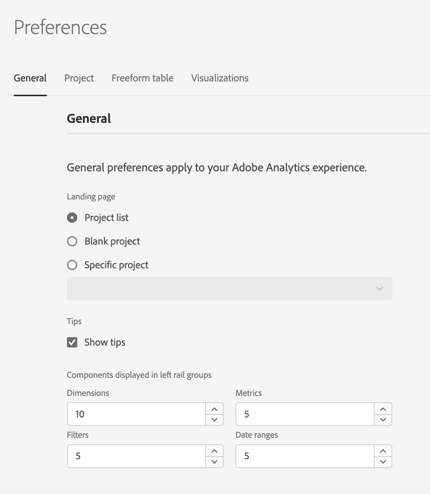

# User preferences

>[!NOTE]
>
>This feature is coming soon. General Availability is March 25, 2021.

The [!UICONTROL Components] > [!UICONTROL User preferences] page lets you manage Analysis Workspace settings and its related components for your users. User preferences apply to *all* new projects or panels.

## General preferences

General preferences apply to your CJA experience in the browser.

| Preference | Options |
| --- | --- |
| Landing page | <ul><li>Project list (default)</li><li>Blank project</li><li>Specific project</li></ul> |
| Tips | <ul><li>Enabled (default)</li><li>Disabled</li></ul> |