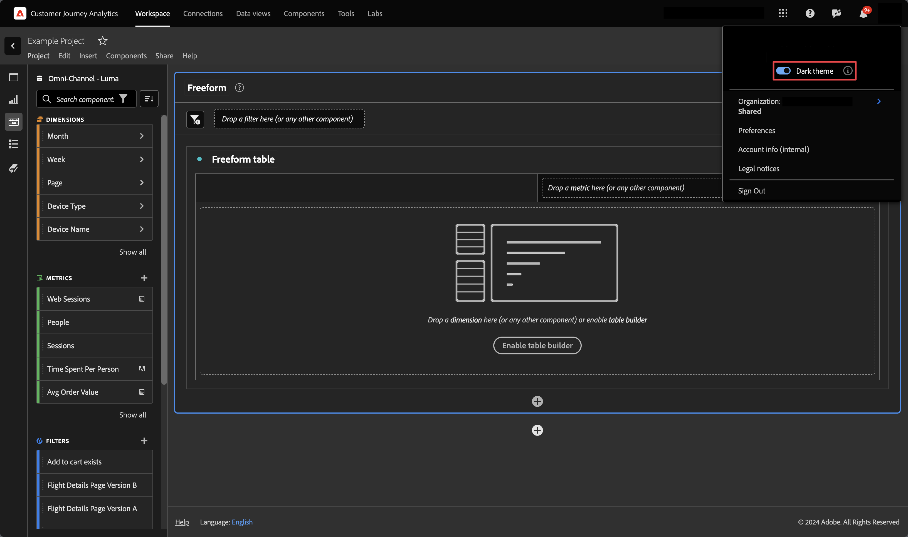

# User preferences

You can manage user settings or preferences for Analysis Workspace and related components for all new projects or panels that you create. Existing projects and panels are not affected.

## Edit preferences

You can update your preferences in the following ways:

- Select  **[!UICONTROL Edit preferences]** from the Workspace main interface.
- Select **[!UICONTROL Project]** > **[!UICONTROL User preferences]** from the menu when working in a Workspace project.
- Select **[!UICONTROL Components]** > **[!UICONTROL Preferences]** from the top menu bar in Customer Journey Analytics (only available for product administrators).

## Configure preferences

You can configure the following preferences: 

### General preferences

General preferences apply to your Customer Journey Analytics experience in the browser. For information about how to access these preferences, see [Update preferences](#update-preferences). 

| Preference | Options |
| --- | --- |
| **[!UICONTROL Landing page]** | Choose what page displays as the default page when you access Customer Journey Analytics: <ul><li>Project list (default)</li><li>Blank project</li><li>Blank Trends guided analysis</li><li>Specific project, selected from a list</li></ul> |
| **[!UICONTROL Tips]** | Displays tips in a blue box in the lower-right area of Analysis Workspace. 
This option is enabled by default.
 |
| **[!UICONTROL Components displayed in left panel groups]** | Choose how many of each component group to display in the Components menu in the left panel. 
If you choose 0 for a component group, the component group is no longer accessible from the left panel.

By default, 5 components are displayed for each of the following component groups:
 <ul><li>Dimensions</li><li>Metrics</li><li>Segments</li><li>Date ranges</li></ul> 
For more information about Components in Analysis Workspace, see [Components overview](/help/components/overview.md).
 |

### IMS Organization preferences {#ims-organization-preferences}

>[!CONTEXTUALHELP]
>id="workspace_prefs_shareonlyworkspace"
>title="Allow sharing only with Workspace users"
>abstract="When enabled, the **[!UICONTROL Share with anyone]** option is no longer available to users when sharing an Analysis Workspace project. People who previously received access to a project through this share option can no longer access the project."

>[!CONTEXTUALHELP]
>id="workspace_prefs_requireexperiencecloudauth"
>title="Require Experience Cloud authentication"
>abstract="When enabled, people who are given access to a project from the **[!UICONTROL Share with anyone]** option in Analysis Workspace must authenticate using their Experience Cloud credentials."

>[!CONTEXTUALHELP]
>id="workspace_prefs_projectcommenting"
>title="Allow commenting on projects"
>abstract="When enabled, a comments area is available in the right rail of each project in Analysis Workspace."

You can update company preferences that apply to all users and projects within your organization. For information about how to access these preferences, see [Update preferences](#update-preferences). 

| Section | Preference | Options |
| --- | --- | --- |
| **Templates Tab tab** | | |
|  | Hide Templates Tab | Hides the Templates Tab for all users in your organization. |
| **Project sharing** | | |
| | Allow sharing only with Workspace users | When this option is enabled, users in your organization cannot see the **[!UICONTROL Share with anyone]** option in the **[!UICONTROL Share]** menu. This means that users cannot share projects with people who don't have an Analysis Workspace account in your organization as described in [Share a project with anyone (no login required)](/help/analysis-workspace/curate-share/share-projects.md#share-public-link) in [Share projects](/help/analysis-workspace/curate-share/share-projects.md). This option is disabled by default for all organizations (meaning that users can share projects with people outside the organization) except for customers who have licensed Healthcare Shield. 
Consider the following when enabling or disabling this option:<ul><li>When you enable this option, people who previously received access to a project through the [!UICONTROL Share with anyone] share option can no longer access the project.</li><li>If this option is enabled (to allow sharing only with Workspace users) and then later disabled (to allow sharing with anyone), people who previously received access to a project through the [!UICONTROL Share with anyone] share option do not automatically regain their access to the project. In this case, the user who shared the project must enable the [!UICONTROL **Link is active**] option that is available when sharing a project with anyone **([!UICONTROL Share]** > **[!UICONTROL Share with anyone]**), as described in [Share a project with anyone (no login required)](/help/analysis-workspace/curate-share/share-projects.md#share-public-link) in [Share projects](/help/analysis-workspace/curate-share/share-projects.md).</li><li>**For customers who license Healthcare Shield:** This option is enabled by default and cannot be disabled. Before you can disable this option so that users can use the [!UICONTROL Share with anyone] share option, you first need to add the [!UICONTROL Share project links with anyone] permission (located under [!UICONTROL Reporting Tools]) in the Adobe Admin Console. After the permission is added, you can disable this option, then accept the resulting legal notice. For information about how to add a permission in the Admin Console, see [Manage product permissions in the Admin Console](https://helpx.adobe.com/enterprise/using/manage-permissions-and-roles.html).</li></ul> |
| | Require Experience Cloud authentication | When this option is enabled, people who are given access to a project from the **[!UICONTROL Share with anyone]** option in Analysis Workspace must authenticate using their Experience Cloud credentials.
After this option is enabled, any time a user shares a project using the [!UICONTROL Share with anyone] share option, the [!UICONTROL Require Experience Cloud authentication] option is enabled in the share dialog and it cannot be disabled by the user who is sharing the project. For information about how users can share projects with anyone, see [Share a project with anyone (no login required)](/help/analysis-workspace/curate-share/share-projects.md#share-public-link) in [Share projects](/help/analysis-workspace/curate-share/share-projects.md). 
 
Consider the following when enabling this option: <ul><li>When you enable this option, all projects that were previously shared with the [!UICONTROL Share with anyone] share option, and do not have the [!UICONTROL Require Experience Cloud authentication] option enabled, are deactivated.
If this option is enabled (to require Experience Cloud authentication) and then later disabled (to allow anyone with the link to access the project), people who previously received access to a project through the [!UICONTROL Share with anyone] share option do not automatically regain their access to the project. In this case, the user who shared the project must enable the [!UICONTROL Link is active] option that is available when sharing a project with anyone **([!UICONTROL Share]** > **[!UICONTROL Share with anyone]** > **[!UICONTROL Link is active]**), as described in [Share a project with anyone (no login required)](/help/analysis-workspace/curate-share/share-projects.md#share-public-link) in [Share projects](/help/analysis-workspace/curate-share/share-projects.md).</li><li>This option is available only if SSO is implemented in your organization. For information about how system administrators can enable SSO for your organization, see [Set up identity and Single Sign-On](https://helpx.adobe.com/enterprise/using/set-up-identity.html).

If SSO is configured for your organization, check to see if any kind of auto-account creation is implemented in the console. Typically, a system administrator would set this up, as described in [Enable automatic account creation](https://helpx.adobe.com/enterprise/using/automatic-account-creation.html).</li><li>If your organization licenses Healthcare Shield, this option is enabled by default and cannot be disabled.</li></ul>|
| Project commenting | Allow commenting on projects | When this option is enabled, a comments area is available in the right rail of each project in Analysis Workspace. 
Project owners can disable the comments area for a given project, as described in [Create projects](/help/analysis-workspace/build-workspace-project/create-projects.md).
 
For more information about commenting in Analysis Workspace projects, see [Add and manage comments in projects](/help/analysis-workspace/build-workspace-project/comment-projects.md).
 |

{style="table-layout:auto"}

### Projects & Analyses preferences {#project-and-analysis-preferences}

>[!CONTEXTUALHELP]
>id="workspace_prefs_categoricalpalette"
>title="Categorical palette"
>abstract="Applied to many visualizations in Analysis Workspace and Guided analysis. Each color represents a distinct categorical value."

>[!CONTEXTUALHELP]
>id="workspace_prefs_divergingpalette"
>title="Diverging palette"
>abstract="Applied to the Cohort table in Analysis Workspace and User growth guided analysis. This palette holds a numeric meaning with two extremes and a baseline in the middle."

>[!CONTEXTUALHELP]
>id="workspace_prefs_sequentialpalette"
>title="Sequential palette"
>abstract="Applied to the Frequency trends (stacked bar) guided analysis. This palette holds a numeric meaning from light to dark."

You can customize these preferences for all new Analysis Workspace projects, new Analysis Workspace panels, and new guided analyses. For information about how to access these preferences, see [Update preferences](#update-preferences). 

Some of these same preferences can also be customized for individual projects in Analysis Workspace, as described in [Project overview](/help/analysis-workspace/build-workspace-project/freeform-overview.md). 

<!--
>[!IMPORTANT]
>
>You can no longer define the number format in the **[!UICONTROL Project & Analyses]** > **[!UICONTROL Data]** section of **[!UICONTROL User preferences]**. The number format is automatically determined by the [default language that is configured](https://experienceleague.adobe.com/en/docs/core-services/interface/features/browser-language) for the logged in user.
>
-->

| Section | Preference | Options |
| --- | --- | --- |
| **Display** | | |
|  | [View density](/help/analysis-workspace/build-workspace-project/view-density.md) | Choose how much content to display on the screen by reducing the vertical padding of the left panel, freeform tables, and cohort tables. <ul><li>Compact</li><li>Comfortable</li><li>Expanded (default)</li></ul> |
| | [Color palette](/help/analysis-workspace/build-workspace-project/color-palettes.md) | Choose the visualization color palettes that are used in Analysis Workspace and guided analysis. <ul><li> Categorical palette: Applied to many visualizations in Analysis Workspace and guided analysis. Each color represents a distinct categorical value. Choose from Adobe-provided options or enter a custom palette defined by comma-delimited hex values.</li><li> Divergent palette: Applied to the Cohort table in Analysis Workspace and User growth guided analysis. This palette holds a numeric meaning with two extremes and a baseline in the middle.<li> Sequential palette: Applied to the Frequency trends (stacked bar) guided analysis. This palette holds a numeric meaning from light to dark.</li></ul> |
| **Data** | | |
|  | [Data view](/help/analysis-workspace/c-panels/panels.md#data-view) | Choose the data where tables and visualizations derive their data. <ul><li>Most recent (default)</li><li>Specific data view selected from a list</li></ul> |
|  | [Calendar](/help/analysis-workspace/c-panels/panels.md#calendar) | Select from a list of: <ul><li>Adobe-provided ranges (default is This Month)</li><li>You can enable [!UICONTROL Make date range components relative to panel calendar by default].</li></ul> |
|  | [Panel Type](/help/analysis-workspace/c-panels/panels.md#panel-types) | <ul><li>Freeform (default)</li><li>Blank</li><li>Quick Insights</li></ul> |
|  | Instance counting  | Enable [!UICONTROL Count repeat instances] to specifies whether repeat instances are counted in reports. For example, when enabled, multiple consecutive page views to the same page are treated as multiple page views. When disabled, multiple consecutive page views to the same page count as a single page view. 
**Note:** This setting affects only certain metrics (such as Sessions) and it does not apply to Flow or Fallout visualizations.
 |
|  | Number format | <ul><li>1,000.00 (default)</li><li>1.000,00</li><li>1 000,00</li></ul> |
|  | CSV separator character | <ul><li>Comma (default)</li><li>Semicolon</li><li>Colon</li><li>Pipe</li><li>Period</li><li>Space</li><li>Tab</li></ul> |
|  | Show annotations | Choose whether annotations are visible in your projects. For more information about annotations, see [Annotations overview](/help/components/annotations/overview.md). |

### Freeform table preferences {#freeform-table-preferences}

>[!CONTEXTUALHELP]
>id="workspace_prefs_showanomalies"
>title="Show anomalies"
>abstract="Selecting **[!UICONTROL Show anomalies]** will automatically run anomaly detection on the first metric column added to a time series Freeform table visualization."

>[!CONTEXTUALHELP]
>id="workspace_prefs_showforecast"
>title="Show forecast"
>abstract="Selecting **[!UICONTROL Show forecast]** will automatically forecast the first metric column added to a time series Freeform table visualization."

>[!CONTEXTUALHELP]
>id="workspace_prefs_defaulttablemetric"
>title="Default table metric"
>abstract="Select the default metric to use for freeform tables. If the selected data view does not contain the selected default metric, the table automatically switches to another primary metric."

You can customize freeform table preferences for all new projects that you create in Analysis Workspace. For information about how to access these preferences, see [Update preferences](#update-preferences). 

Some of these same preferences can also be customized for individual tables.

Select the linked section titles for more information and context about the available preferences.

| Section | Preference | Options |
| --- | --- | --- |
| **Table** | | |
| | Table type | <ul><li>Freeform</li><li>Table builder</li></ul> |
| | Default table metric | <ul><li>Events</li><li>Sessions</li><li>People</li></ul> |
| | Default table dimension | Choose from Minute, Hour, Day, Week, Month, Quarter, or Year. |
| | Align dates | Select this option to align dates from each column to all start on the same row. |
| **[Column](/help/analysis-workspace/visualizations/freeform-table/column-row-settings/column-settings.md)** | | |
| | Wrap header text | Lets you wrap the header text in Freeform tables to make headers more readable and tables more shareable. This is useful for .pdf rendering and for metrics with long names. Enabled by default. |
| | Show totals | This totals number is typically equal to or a subset of the [!UICONTROL Grand Total]. It reflects any table segments applied within the freeform table, including the [!UICONTROL Include None] option. |
| | Show grand totals | This totals number represents all events that have been collected, sometimes referred to as *data view total*. When a segment is applied either at the panel level or within the freeform table, this total adjusts to reflect all events that match the segment criteria. Grand total is not supported for tables or breakdowns with [static rows](/help/analysis-workspace/visualizations/freeform-table/workspace-totals.md). |
| | Show sparkline  | Show or hide line charts at the bottom of the chart. When hidden, the legend changes to no longer visually reference the lines. |
| | Number | Determines if a cell shows/hides the numeric value for the metric. For example, if the metric is Page Views, the numeric value is the number of page views for the row item. |
| | Percent | Determines if a cell shows/hides the percent value for the metric. For example, if the metric is page views, the percent value is the number of page views for the row item divided by the total page views for the column.  Note:  You can show percentages greater than 100%, to be more accurate. You can also move the upper bound cap to 1,000% to ensure that columns can grow in widths too large. |
| | Show anomalies <!-- This setting was moved from the "Project" tab. this is already in the tool/docs under "Freeform table, But the doc doesn't give a definition. --> | Determines if anomaly detection is run on the values in this column. |
| | Show forecast | Determines if forecast values are shown automatically for the first metric column in any time-series freeform table you create. |
| | Interpret zero as no value | For cells with a 0 value, determines whether to show a 0 or a blank cell. This is useful when you look at data for each day of a month, and some days haven't happened yet.  Instead of showing 0's for future dates, blank cells can be shown instead. Charts respect this setting as well (for example, carts do not show a line or bar with 0 values when this setting is checked). |
| | Background | Determines if a cell shows/hides all cell formatting, including the bar graph and conditional formatting <ul><li>Bar graph</li> Shows a horizontal bar graph representing the cell's value relative to the total for the column. <li>Conditional formatting</li>For more information about conditional formatting, see "Conditional formatting" in [Column Settings](/help/analysis-workspace/visualizations/freeform-table/column-row-settings/column-settings.md)</ul> |
| | Cell preview | Shows a preview of how each cell appears with the currently selected formatting options applied. |
| **[Row](/help/analysis-workspace/visualizations/freeform-table/column-row-settings/table-settings.md)** | | |
| | Breakdown by position | Select this option if you want the breakdown to remain with the position of the item rather than with the item itself. For more information about breakdowns, see [Break down dimensions](/help/components/dimensions/t-breakdown-fa.md). |
| | Percentage calculation | <ul><li>Column</li><li>Row</li></ul> |
| | Column totals (Static rows only) |<ul><li>Display sum of rows: Shows the sum of the individual line items </li><li>Display grand total: Shows the de-duplicated sum of rows.</li></ul> |

### Visualizations preferences {#visalization-preferences}

>[!CONTEXTUALHELP]
>id="workspace_prefs_defaultflowcontainer"
>title="Default container"
>abstract="Select the default container to use for [!UICONTROL Flow] visualizations. If the selected data view does not contain the selected default container, the [!UICONTROL Flow] visualization automatically switches to another primary container."

>[!CONTEXTUALHELP]
>id="workspace_prefs_defaultfalloutcontainer"
>title="Default container"
>abstract="Select the default container to use for [!UICONTROL Fallout] visualizations. If the selected data view does not contain the selected default container, the [!UICONTROL Fallout] visualization automatically switches to another primary container."

>[!CONTEXTUALHELP]
>id="workspace_prefs_defaulthistogramcountingmethod"
>title="Default counting method"
>abstract="Select the default counting method to use for [!UICONTROL Histogram] visualizations. If the selected data view does not contain the selected default counting method, the [!UICONTROL Histogram] visualization automatically switches to another primary counting method."

>[!CONTEXTUALHELP]
>id="workspace_prefs_defaultjourneycanvascontainer"
>title="Default container"
>abstract="Select the default container to use for [!UICONTROL Journey canvas] visualizations. If the selected data view does not contain the selected default container, the [!UICONTROL Journey canvas] visualization automatically switches to another primary container."

You can update visualization preferences for all new prjects that you create in Analysis Workspace. For information about how to access these preferences, see [Update preferences](#update-preferences). 

Some of these same preferences can also be customized for individual visualizations. 

Select the linked section titles for more information and context about the available preferences. 

| Section | Preference | Options |
| --- | --- | --- |
| **General Defaults** | | |
| | Percentages | Displays values in percentages for all visualizations. |
| | Legend visible | Lets you hide the detailed legend text for all visualizations.  |
| | Limit max items | Reduces the number of items on the X-axis for all visualizations. This preference can be useful if you have a large dataset.  |
| | Display dual axis (when applicable) | Only applies if you have two metrics - you can have a y-axis on the left (for one metric) and on the right (for the other metric). This preference is helpful when plotted metrics are of very different magnitudes.  |
| | Normalization (when applicable) | Forces metrics to equal proportions. This preference is helpful when plotted metrics are of very different magnitudes.  |
| | Anchor Y-axis at zero | If all the values plotted on the chart are considerably above zero, the chart default updates the bottom of the y-axis to NON-ZERO. If you check this box, the y-axis is forced to zero (and re-draws the chart).  |
| | Anchor anomalies to scale Y-axis | The y-axis is scaled using anomaly values. |
| **[Line](/help/analysis-workspace/visualizations/line.md)** | | |
| | Percentages  | Displays values in percentages for the Line visualizations. |
| | Legend visible | Lets you hide the detailed legend text for the Line visualization. |
| | Limit max items | Reduces the number of items on the X-axis in the Line visualization. This preference can be useful if you have a large dataset. |
| | Display dual axis (when applicable) | Only applies if you have two metrics - you can have a y-axis on the left (for one metric) and on the right (for the other metric). This preference is helpful when plotted metrics are of very different magnitudes. |
| | Normalization (when applicable) | Forces metrics to equal proportions. This preference is helpful when plotted metrics are of very different magnitudes. |
| | Show x-axis | Displays the x-axis on the Line chart. |
| | Show y-axis | Displays the y-axis on the Line chart.  |
| | Anchor Y-axis | If all the values plotted on the chart are considerably above zero, the chart default renders the bottom of the y-axis NON-ZERO. If you check this box, the y-axis will be forced to zero (and re-draws the chart). |
| | Allow anomalies to scale Y-axis | If you have multiple metrics in a chart, you have to hover over each anomaly to see the confidence band for that metric. To make the visualization more legible, the Anomaly Detection confidence interval does not automatically scale the y-axis. This setting allows the confidence interval to scale the visualization. 
For more information, see [View anomalies in Analysis Workspace](/help/analysis-workspace/c-anomaly-detection/view-anomalies.md).
  |
| | Allow forecast to scale Y-axis | If you have forecast values that are outside of upper and lower bounds of the historical values, the y-axis does not automatically scale these forecasted values. When turned on, this option does properly scale the y-axis for the forecasted values. |
| | Show min | Overlay a minimum value label to highlight quickly the valleys in a metric. Note: The min values are derived from the visible data points in the visualization, not the full set of values within a dimension. |
| | Show max | overlay a maximum value label to highlight quickly the peaks in a metric. Note: The max values are derived from the visible data points in the visualization, not the full set of values within a dimension. |
| | Show trendline | Show a regression or moving average trendline to your line series. Trendlines help to depict a clearer pattern in the data. |
| **[Cohort](/help/analysis-workspace/visualizations/cohort-table/t-cohort.md)** | | |
| | [!BADGE B2B Edition]{type=Informative url="https://experienceleague.adobe.com/en/docs/analytics-platform/using/cja-overview/cja-b2b/cja-b2b-edition" newtab=true tooltip="Customer Journey Analytics B2B Edition"} Container | Select the preferred container for cohort analysis in case of an account-based [!BADGE B2B Edition]{type=Informative url="https://experienceleague.adobe.com/en/docs/analytics-platform/using/cja-overview/cja-b2b/cja-b2b-edition" newtab=true tooltip="Customer Journey Analytics B2B Edition"} connection. 
The following options are available:
 <ul><li>Global Accounts [!BADGE B2B Edition]{type=Informative url="https://experienceleague.adobe.com/en/docs/analytics-platform/using/cja-overview/cja-b2b/cja-b2b-edition" newtab=true tooltip="Customer Journey Analytics B2B Edition"}</li><li>Accounts [!BADGE B2B Edition]{type=Informative url="https://experienceleague.adobe.com/en/docs/analytics-platform/using/cja-overview/cja-b2b/cja-b2b-edition" newtab=true tooltip="Customer Journey Analytics B2B Edition"}</li><li>Buying Groups [!BADGE B2B Edition]{type=Informative url="https://experienceleague.adobe.com/en/docs/analytics-platform/using/cja-overview/cja-b2b/cja-b2b-edition" newtab=true tooltip="Customer Journey Analytics B2B Edition"}</li><li>Opportunities [!BADGE B2B Edition]{type=Informative url="https://experienceleague.adobe.com/en/docs/analytics-platform/using/cja-overview/cja-b2b/cja-b2b-edition" newtab=true tooltip="Customer Journey Analytics B2B Edition"}</li><li>Person</li></ul> |
| | Granularity | For trended visualizations, you can change the time granularity (Day, Week, Month, Quarter, or Year). This change also applies to the data source table. |
| | Only show percent | Removes the number value and only shows the percentage. |
| | Round percent to nearest whole | Rounds the percent value to the nearest whole instead of showing the decimal value. |
| | Show average percent row | Inserts a new row at the top of the table and then adds the average for the values within each column.  |
| **[Combo charts](/help/analysis-workspace/visualizations/combo-charts.md)** | | |
| | Show X-axis | Displays the x-axis on the Combo chart. |
| | Show Y-axis | Displays the y-axis on the Combo chart. |
| | Display barbells on lines | Show barbells on lines in Combo charts. |
| **[Key Metric Summary](/help/analysis-workspace/visualizations/key-metric.md)** | | |
| | Summary display type | <ul><li>Emphasize percent change</li><li>Emphasize number value</li></ul> |
| | Show sparklines | how or hide line charts at the bottom of the chart. When hidden, the legend changes to no longer visually reference the lines. |
| | Show max and min on sparklines | Show minimum and maximum values on primary and comparison line charts. |
| | Show comparison | Show comparison data. When hidden, both the comparison line chart and summary change objects are hidden from view. |
| | Number value options | In the [!UICONTROL **Key Metric Summary**] section <ul><li>Show percent change</li><li>Show raw difference</li>Raw difference between the total value of the metric in the primary date range and the secondary date range</ul> |
| **[Fallout](/help/analysis-workspace/visualizations/fallout/configuring-fallout.md)** | | |
| | Container | Select the preferred container to analyze pathing. The preferred container helps you to understand account engagement at various B2B container levels [!BADGE B2B Edition]{type=Informative url="https://experienceleague.adobe.com/en/docs/analytics-platform/using/cja-overview/cja-b2b/cja-b2b-edition" newtab=true tooltip="Customer Journey Analytics B2B Edition"}, person engagement at the person level (across sessions), or constrain the analysis to a single session. 
The following options are available:
 <ul><li>Global Accounts [!BADGE B2B Edition]{type=Informative url="https://experienceleague.adobe.com/en/docs/analytics-platform/using/cja-overview/cja-b2b/cja-b2b-edition" newtab=true tooltip="Customer Journey Analytics B2B Edition"}</li><li>Accounts [!BADGE B2B Edition]{type=Informative url="https://experienceleague.adobe.com/en/docs/analytics-platform/using/cja-overview/cja-b2b/cja-b2b-edition" newtab=true tooltip="Customer Journey Analytics B2B Edition"}</li><li>Buying Groups [!BADGE B2B Edition]{type=Informative url="https://experienceleague.adobe.com/en/docs/analytics-platform/using/cja-overview/cja-b2b/cja-b2b-edition" newtab=true tooltip="Customer Journey Analytics B2B Edition"}</li><li>Opportunities [!BADGE B2B Edition]{type=Informative url="https://experienceleague.adobe.com/en/docs/analytics-platform/using/cja-overview/cja-b2b/cja-b2b-edition" newtab=true tooltip="Customer Journey Analytics B2B Edition"}</li><li>Session</li><li>Person</li></ul> |
| **[Flow](/help/analysis-workspace/visualizations/c-flow/create-flow.md)** | | |
| | Container | Select the preferred container to analyze. The preferred container helps you to understand account engagement at various B2B container levels [!BADGE B2B Edition]{type=Informative url="https://experienceleague.adobe.com/en/docs/analytics-platform/using/cja-overview/cja-b2b/cja-b2b-edition" newtab=true tooltip="Customer Journey Analytics B2B Edition"}, person engagement at the person level (across sessions), or constrain the analysis to a single session. 
The following options are available:
 <ul><li>Global Accounts [!BADGE B2B Edition]{type=Informative url="https://experienceleague.adobe.com/en/docs/analytics-platform/using/cja-overview/cja-b2b/cja-b2b-edition" newtab=true tooltip="Customer Journey Analytics B2B Edition"}</li><li>Accounts [!BADGE B2B Edition]{type=Informative url="https://experienceleague.adobe.com/en/docs/analytics-platform/using/cja-overview/cja-b2b/cja-b2b-edition" newtab=true tooltip="Customer Journey Analytics B2B Edition"}</li><li>Buying Groups [!BADGE B2B Edition]{type=Informative url="https://experienceleague.adobe.com/en/docs/analytics-platform/using/cja-overview/cja-b2b/cja-b2b-edition" newtab=true tooltip="Customer Journey Analytics B2B Edition"}</li><li>Opportunities [!BADGE B2B Edition]{type=Informative url="https://experienceleague.adobe.com/en/docs/analytics-platform/using/cja-overview/cja-b2b/cja-b2b-edition" newtab=true tooltip="Customer Journey Analytics B2B Edition"}</li><li>Session</li><li>Person</li></ul>  |
| | Wrap labels | Normally, the labels on the Flow elements are truncated to save screen real estate, but you can make the entire label visible by checking this box. Default = unchecked. |
| | Include repeat instances | Flow visualizations are based on instances of a dimension. This setting gives you the option to include or exclude repeated instances, for example, Page reloads. However, repeats cannot be removed from Flow visualizations that include multi-valued dimensions, such as listVars, listProps, s.product, merchandising eVars, etc. Default = unchecked. |
| | Show tooltips | Determines whether tooltips, containing node data, are shown when hovering over individual nodes within a flow visualization. |
| | Number of columns | Determines how many columns you want in your Flow diagram. |
| | Items expanded per column | How many items you want in each column. |
| **[Journey canvas](/help/analysis-workspace/visualizations/journey-canvas/journey-canvas.md)** | | |
| | Container | Select the preferred container to analyze pathing. The preferred container helps you to understand account engagement at various B2B container levels [!BADGE B2B Edition]{type=Informative url="https://experienceleague.adobe.com/en/docs/analytics-platform/using/cja-overview/cja-b2b/cja-b2b-edition" newtab=true tooltip="Customer Journey Analytics B2B Edition"}, person engagement at the person level (across sessions), or constrain the analysis to a single session. 
The following options are available:
 <ul><li>Global Accounts [!BADGE B2B Edition]{type=Informative url="https://experienceleague.adobe.com/en/docs/analytics-platform/using/cja-overview/cja-b2b/cja-b2b-edition" newtab=true tooltip="Customer Journey Analytics B2B Edition"}</li><li>Accounts [!BADGE B2B Edition]{type=Informative url="https://experienceleague.adobe.com/en/docs/analytics-platform/using/cja-overview/cja-b2b/cja-b2b-edition" newtab=true tooltip="Customer Journey Analytics B2B Edition"}</li><li>Buying Groups [!BADGE B2B Edition]{type=Informative url="https://experienceleague.adobe.com/en/docs/analytics-platform/using/cja-overview/cja-b2b/cja-b2b-edition" newtab=true tooltip="Customer Journey Analytics B2B Edition"}</li><li>Opportunities [!BADGE B2B Edition]{type=Informative url="https://experienceleague.adobe.com/en/docs/analytics-platform/using/cja-overview/cja-b2b/cja-b2b-edition" newtab=true tooltip="Customer Journey Analytics B2B Edition"}</li><li>Session</li><li>Person</li></ul>  |
| **Stacked Charts** | | |
| | 100% stacked | This setting on area stacked, bar stacked or horizontal bar stacked visualizations turns the chart into a "100% stacked" visualization. 
For more information, see [Bar and bar stacked](/help/analysis-workspace/visualizations/bar.md).
 |
| **[Histogram](/help/analysis-workspace/visualizations/histogram.md)** | | |
| | Number of buckets | Choose the number of date ranges (buckets) in the visualization. The maximum number of buckets is 50. 
For more information, see [Histogram](/help/analysis-workspace/visualizations/histogram.md).
 |
| | Counting method | Choose from the following options: <ul><li>Hit</li><li>Session</li><li>Person</li></ul> 
For example, when used with page views, you could choose page views per person, page views for visit, or page views per event. For Hit, "Occurrences" is used as the y-axis metric in a freeform table.
 |
| **[Summary Change](/help/analysis-workspace/visualizations/summary-number-change.md)** | | |
| | Value | <!-- Seem to be basically the same options as in "Number value options" --> <ul><li>Percent change</li><li>Raw difference</li></ul>  |
| | Percentages | Displays values in percentages for the Summary Change visualizations. |
| | Legend visible | Lets you hide the detailed legend text for the Summary Change visualization. |
| **[Summary Number](/help/analysis-workspace/visualizations/summary-number-change.md)** | | |
| | Percentages | Displays values in percentages for the Summary Number visualizations. |
| | Legend visible | Lets you hide the detailed legend text for the Summary Number visualization. |
| | Summary value by | Choose from Max, Min, Mean, Median, and Sum. |
| | Abbreviate value | In the **[!UICONTROL Summary Number]** section |
| **[Treemap](/help/analysis-workspace/visualizations/treemap.md)** | | |
| | Percentages | Displays values in percentages for the Treemap visualizations. |
| | Limit max items | Reduces the number of items on the X-axis in the Treemap visualization. This preference can be useful if you have a large dataset. |
| **[Venn](/help/analysis-workspace/visualizations/venn.md)** | | |
| | Legend visible | Lets you hide the detailed legend text for the Venn visualization. |
| **[Scatter](/help/analysis-workspace/visualizations/scatterplot.md)** | | |
| | Percentages | Displays values in percentages for the Scatter visualizations. |
| | Legend visible | Lets you hide the detailed legend text for the Scatter visualization. |
| | Limit max items | Reduces the number of items on the X-axis in the Scatter visualization.  This preference can be useful if you have a large dataset. |
| | Anchor y-axis at zero | If all the values plotted on the chart are considerably above zero, the chart default renders the bottom of the y-axis NON-ZERO. If you check this box, the y-axis is forced to zero (and re-draws the chart). |

## Restore default preferences

You can restore all your user preferences to the system defaults. This preference does not affect administrator preferences under the Company tab.

This action cannot be undone.

1. In Customer Journey Analytics, select [!UICONTROL **Components**] **>** [!UICONTROL **Preferences**] from the top menu. Or select **[!UICONTROL Project]** > **[!UICONTROL User settings]** from the Workspace menu.

1. In the upper-right, select **[!UICONTROL Restore defaults]**.

1. Select **[!UICONTROL Restore defaults]** in **[!UICONTROL Restore system default settings]**.

## [!UICONTROL Dark theme]

If you prefer to have a dark background for your Customer Journey Analytics user interface, you can toggle to [!UICONTROL Dark theme].

1. Select the Experience Cloud user icon at the top right.

   

1. Enable **[!UICONTROL Dark theme]**.

