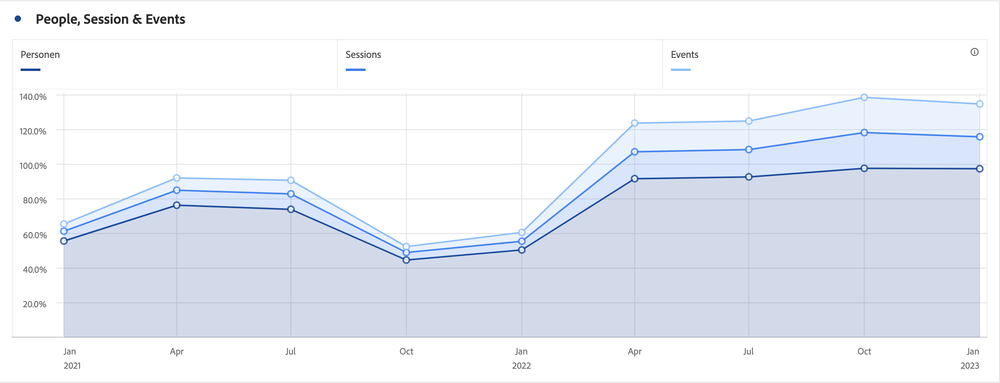

# Area and area stacked

## Area {#Area}

This visualization is like a line graph, but with a colored area below the line. Use an area graph when you have multiple metrics and want to visualize the area expressed by the intersection of two or more metrics.

## Area stacked {#stacked}

This visualization is like an Area Chart, but each series begins at the top of the previous series.

A new visualization setting on area stacked visualizations turns the chart into a "100% stacked" visualization.

