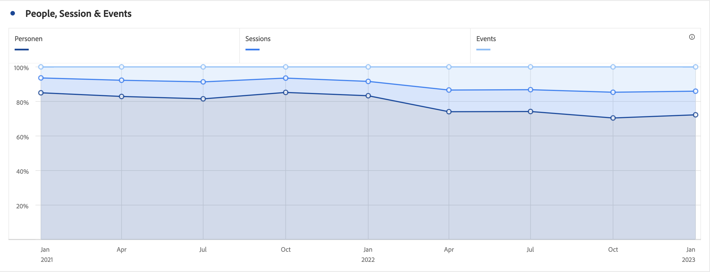

# Area and area stacked

## Area

The  [!UICONTROL Area] visualization is like a line graph, but with a colored area below the line. Add an  area graph when you have multiple metrics and want to visualize the area expressed by the intersection of two or more metrics.

## Area stacked

This  [!UICONTROL Area stacked] visualization is like an Area, but each series begins at the top of the previous series.

Use the **[!UICONTROL 100% stacked]** option in  **[!UICONTROL Settings]** to turn the chart into a 100% stacked visualization.

>[!MORELIKETHIS]
>
>[Add a visualization to a panel](/help/analysis-workspace/visualizations/freeform-analysis-visualizations.md#add-visualizations-to-a-panel)
>[Visualization settings](/help/analysis-workspace/visualizations/freeform-analysis-visualizations.md#settings)
>[Visualization context menu](/help/analysis-workspace/visualizations/freeform-analysis-visualizations.md#context-menu)
>
