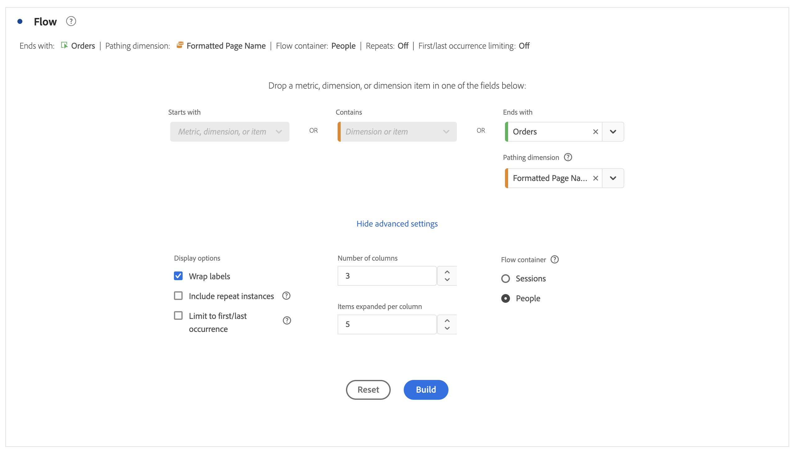

# Configure a flow visualization {#configure-a-flow-visualization}

>[!CONTEXTUALHELP]
>id="workspace_flow_container"
>title="Flow container"
>abstract="Select the container to use to display (numbers for) the pathing."

Flow visualizations help you understand the journey originating from a specific conversion event on your website or your app. Or leading up to a specific conversion event. The visualization traces a path through your dimensions (and dimension items) or metrics. 

You can configure the start or end of the path you are interested in. Or analyze all paths that flow through a dimension or dimension item.

## Use

1. Add a  **[!UICONTROL Flow]** visualization. See [Add a visualization to a panel](../freeform-analysis-visualizations.md#add-visualizations-to-a-panel).

1. Anchor your Flow visualization using one of the following options:

   * [!UICONTROL **Starts with**] (metrics, dimensions, or items), or
   * [!UICONTROL **Contains**] (dimensions, or items), or
   * [!UICONTROL **Ends with**] (metrics, dimensions, or items)

   Each of these categories is shown onscreen as a *drop zone*. You can populate the drop zone in 3 ways:

   * Use the drop-down menu to select metrics or dimensions.
   * Drag dimensions or metrics from the left panel.
   * Begin typing the name of a dimension or metric, then select it when it appears in the drop-down list.

   >[!IMPORTANT]
   >
   >Calculated metrics cannot be used in the **[!UICONTROL Starts with]** or **[!UICONTROL Ends with]** fields.

1. If you choose a metric, you also need to provide a [!UICONTROL **Pathing Dimension**] to use as your path leading to or coming from your selected component, as shown here. The default is [!UICONTROL **Page**].

    

1. (Optional) Select **[!UICONTROL Show advanced settings]** to configure any of the following options:

   | Setting | Description |
   | --- | --- |
   | **[!UICONTROL Wrap labels]** | Normally, the labels on the Flow elements are truncated to save screen real estate, but you can make the entire label visible by checking this box.  Default = unchecked. |
   | **[!UICONTROL Include repeat instances]** | Flow visualizations are based on instances of a dimension. This setting gives you the option to include or exclude repeated instances, for example, Page reloads. However, repeats cannot be removed from Flow visualizations that include multi-valued dimensions, such as listVars, listProps, s.product, merchandising eVars, etc. 
This option is disabled by default.
 |
   | **[!UICONTROL Limit to first/last occurrence]** | Limit paths to paths that start or end with the first or last occurrence of a dimension, item, or metric. See [Limit to first/last occurrence](#example-scenario-for-limit-to-firstlast-occurrence) for a more detailed explanation. |
   | **[!UICONTROL Number of columns]** | The number of columns you want in your Flow diagram. You can specify a maximum of 5 columns. |
   | **[!UICONTROL Items expanded per column]** | The number of items you want in each column. You can specify a maximum of 10 items expanded per column. |
   | **[!UICONTROL Flow container]** | You can switch between **[!UICONTROL Global Account]** [!BADGE B2B Edition]{type=Informative url=“<https://experienceleague.adobe.com/en/docs/analytics-platform/using/cja-overview/cja-b2b/cja-b2b-edition>" newtab=true tooltip="Customer Journey Analytics B2B Edition"}, **[!UICONTROL Account]** [!BADGE B2B Edition]{type=Informative url=“<https://experienceleague.adobe.com/en/docs/analytics-platform/using/cja-overview/cja-b2b/cja-b2b-edition>" newtab=true tooltip="Customer Journey Analytics B2B Edition"}, **[!UICONTROL Opportunity]** [!BADGE B2B Edition]{type=Informative url=“<https://experienceleague.adobe.com/en/docs/analytics-platform/using/cja-overview/cja-b2b/cja-b2b-edition>" newtab=true tooltip="Customer Journey Analytics B2B Edition"}, **[!UICONTROL Buying Group]** [!BADGE B2B Edition]{type=Informative url=“<https://experienceleague.adobe.com/en/docs/analytics-platform/using/cja-overview/cja-b2b/cja-b2b-edition>" newtab=true tooltip="Customer Journey Analytics B2B Edition"}, **[!UICONTROL Sessions]** and **[!UICONTROL Person]** to analyze pathing. These settings help you understand a person's engagement at the person level (across sessions), or constrain the analysis to a single session.  |

   >[!IMPORTANT]
   >
   >The combination of **[!UICONTROL Number of columns]** and **[!UICONTROL Items expanded per column]** determine the number of underlying requests required to create the flow visualization. The higher those numbers, the longer it takes to render a visualization.

1. Select **[!UICONTROL Build]**.

### Example 

Suppose that you want to trace the path that users took both to and from the most popular pages on your site.

1. Create a flow visualization as described above.
1. Drag the [!UICONTROL **Page**] dimension into the **[!UICONTROL Contains]** field, then select [!UICONTROL **Build**].
1. The Flow visualization builds, with the most-viewed page visible in the focus node, at the center of the visualization. You also see the top pages leading into that page (to the left of the focus node) as well as the top pages leading out of that page (to the right of the focus node).
1. Analyze data in the flow, as described in [Configure](#configure).

## Configure

A summary of the Flow configuration appears at the top of the visualizations. The paths in the diagram are proportional. Paths with more activity appear thicker. 

To drill down further into the data, you have several options:

* The flow diagram is interactive. Mouse over the diagram to change the details that are shown.

* When you select on a node in the diagram, the details for that node appear. Select the node again to collapse it.

   

* You can filter a column to display only certain results, such as including and excluding, specifying criteria, etc.

* Select  on the left or right side to expand a column.

* To customize the output, use the [context menu](#context-menu) options.

* To edit the flow or rebuild it with different options, select  next to the configuration summary.

## Filter

Above each column, a filter  appears when you hover over it. By selecting the filter, you get the same filter dialog that exists in the Freeform table. See [Filter and sort](freeform-table/../../freeform-table/filter-and-sort.md).

* Use **[!UICONTROL Show advanced]** to configure advanced settings to include or exclude certain criteria with a list of operators. See [Filters and sort](../freeform-table/filter-and-sort.md) for more information.
* Once you have filtered a column, that specific column reflects the filtering. A blue  indicates that the column is filtered.  The filter either reduces the column to show only the item allowed in the filter. Or it removes all items, except for the one item you want in the filter.
* All downstream and upstream columns persist, as long as there is data flowing into the remaining nodes. 
* To remove a filter, select  to open the filter menu. Remove any filters applied and then select **[!UICONTROL Save]**. The flow should return to its previous, unfiltered state.

## Context menu

Use a context menu on any node in the flow visualization with the following options:

| Option | Description |
|--- |--- |
| **[!UICONTROL Focus on this node]** | Change the focus to the selected node. The focus node appears at the center of the Flow diagram. |
| **[!UICONTROL Start over]** | Return you to the Freeform diagram builder, where you can build a new Flow diagram. |
| **[!UICONTROL Create a filter for this path]** | Create a filter. This selection takes you into the Filter builder, where you can configure the new filter. |
| **[!UICONTROL Breakdown]** | Break the node down by available Dimensions, Metrics, or Time. |
| **[!UICONTROL Filter column]** | The same filter options appear as are available in the Freeform table. For more information about the available options, see the section "Apply a simple or advanced filter to a table" in [Filter and sort tables](/help/analysis-workspace/visualizations/freeform-table/filter-and-sort.md).|
| **[!UICONTROL Exclude item]** or **[!UICONTROL Restore excluded items]** | Removes a specific node from the column and automatically creates it as a filter at the top of the column. To restore the excluded item, from the context menu select **[!UICONTROL Restore Excluded Item]**. you can also open the filter at the top of the column and remove the pillbox with the item you just excluded. |
| **[!UICONTROL Trend]** | Create a trended diagram for the node. |
| **[!UICONTROL Show next column]** / **[!UICONTROL Show previous column]** | Reveals the next (right) or previous (left) column of the visualization. |
| **[!UICONTROL Hide colum]**n | Hides the selected column from the visualization. | 
| **[!UICONTROL Expand entire column]** | Expand a column to show all nodes. By default, only the top five nodes display. |
| **[!UICONTROL Create audience from selection]** | Creates an audience based on the column that is selected. |
| **[!UICONTROL Collapse entire column]** | Hide all nodes in a column. |

## Limit to first/last occurrence

When using this option, keep in mind that:

* **[!UICONTROL Limit to first/last occurrence]** counts only the first/last occurrence in the series. All other occurrences of the **[!UICONTROL Starts with]** or **[!UICONTROL Ends with]** criteria are discarded. 
* If used with a **[!UICONTROL Starts with]** flow, only the first occurrence that matches the start criteria is included. 
  In the example below, **all** occurrences of *Add to cart* and *Product main category* in each step of the flow are included.
  

  In the example below, only the **first** occurrences of *Add to cart* and *Product main category* in each step of the flow are included.
  
* If used with an **[!UICONTROL Ends with]** flow, only the last occurrence that matches the end criteria is included. 
  In the example below, **all** occurrences of *Product main category* and *Add to cart* in each step of the flow are included.
  

  In the example below, only the **last** occurrences of *Product main category* and *Add to cart* in each step of the flow are included.
  
* The series used differs based on the container. If using the **[!UICONTROL Person]** container, the series of events are the session. If using the **[!UICONTROL Session]** container, the series of events are all the events for a given user in the provided date range. 
* The **[!UICONTROL Limit to first/last occurrence]** option can be configured in the advanced settings when using a Metric or Dimension Item in the **[!UICONTROL Starts with]** or **[!UICONTROL Ends with]** fields.

>[!MORELIKETHIS]
>
>[Add a visualization to a panel](/help/analysis-workspace/visualizations/freeform-analysis-visualizations.md#add-visualizations-to-a-panel)
>[Visualization settings](/help/analysis-workspace/visualizations/freeform-analysis-visualizations.md#settings)
>[Visualization context menu](/help/analysis-workspace/visualizations/freeform-analysis-visualizations.md#context-menu)
>

