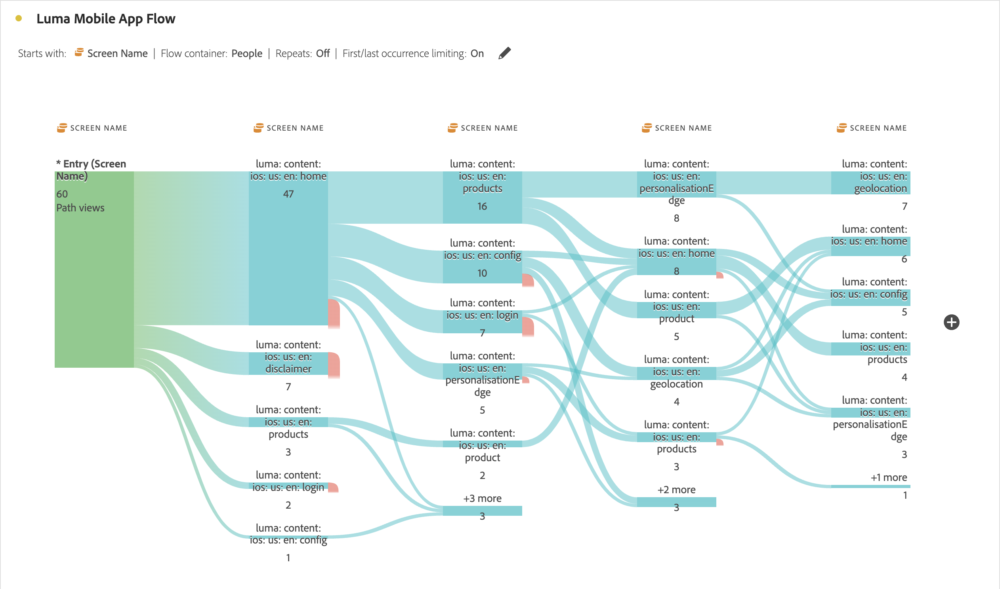

# Inter-dimensional flows

An inter-dimensional flow lets you examine user paths across various dimensions. This article shows how to use this flow for two use cases: mobile app interactions and events, and how campaigns drive web visits

<!--
A dimension label at the top of each Flow column makes using multiple dimensions in a flow visualization more intuitive:

-->

## Mobile app interactions and events

The [!UICONTROL Screen Name] dimension is used in this example flow to see how users use the various screens (scenes) in the app. The top screen returned is **[!UICONTROL luma: content: ios: en: home]**, which is the home page of the app:

To explore the interaction between screens and event types (like add to cart, purchases, and others) in this app, drag and drop the **[!UICONTROL Event Types]** dimension:

* On top of any available step in the flow, to replace that dimension:

  

* Outside of the current flow visualization, to add the dimension:

  

The flow visualization below shows the result of adding the **[!UICONTROL Event Types]** dimension. The visualization provides insights to how mobile app users move through various screens in the app before adding products to a cart, close the application, are presented an offer, and more.

## How campaigns drive web visits

You want to analyze which campaigns drive visits to the web site. You create a flow visualization with the **[!UICONTROL Campaign Name]** as the dimension

You replace the last **[!UICONTROL Campaign Name]** dimension with the **[!UICONTROL Formatted Page Name]** dimension and add another **[!UICONTROL Formatted Page Name]** dimension at the end of the flow visualization.

You can hover over any of the flows to see more details. For example which campaigns have resulted in a Cart checkout.

