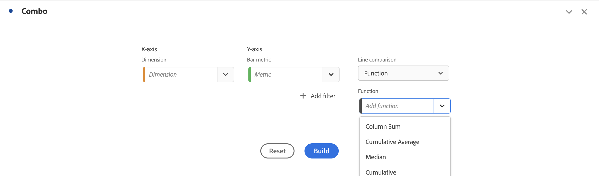

# Combo chart

The  [!UICONTROL Combo chart] visualization makes it easy to build quickly a comparison visualization without having to build a table first. You can easily view trends in your data in a line/bar combination.

Use a [!UICONTROL Combo chart] to:

* Compare this week's orders to orders at the same time last month (and last year).
* Quickly analyze and compare multiple metrics (like [!UICONTROL Unique Visitors] and [!UICONTROL Revenue]) against one another on the same chart.
* Analyze a metric against a function (such as [!UICONTROL Cumulative Average]) over a time horizon.

Keep in mind that:

* You can add multiple comparisons in a single [!UICONTROL Combo chart].
* If you add one or more comparisons, they have to be of the same type, such as [!UICONTROL Time comparison].
* You can add up to 5 comparisons.
* You can apply up to 3 filters to a metric.
* Calculated metrics are not supported in Combo charts.

## Build a Combo chart

1. Add a  combo chart. See [Add a visualization to a panel](freeform-analysis-visualizations.md#add-visualizations-to-a-panel)

1. From the drop-down lists, select a dimension for the X-axis and a metric for the Y-axis.

1. Select the type of [!UICONTROL Line comparison] that you want to use.

   | Line comparison type | Definition |
   | --- | --- |
   | **[!UICONTROL Time comparison]** | The most common type of comparison - comparing this time period to 4 weeks ago, for example. If you selected [!UICONTROL Time comparison], make a secondary selection as to which time period you want to compare.
 |
   | **[!UICONTROL Function]** | You could introduce a function like [!UICONTROL Average] into the comparison. See a list of supported functions below.
 |
   | **[!UICONTROL Secondary metric]** | You could, for example, compare [!UICONTROL Revenue] to another metric.
 |

   {style="table-layout:auto"}

1. Click **[!UICONTROL Build]**.

   The output looks similar to:

   

   The current period is shown in the bar chart. The line chart represents the comparison period. The dots on the line chart are known as *bar bells*.

## Supported functions

If you select **[!UICONTROL Function]** as the [!UICONTROL Line comparison type], a function of the metric chosen is returned.

| Function | Definition |
| --- | --- |
| **[!UICONTROL Column Sum]** | Adds all numeric values for a metric within a column (across the elements of a dimension) |
| **[!UICONTROL Cumulative Average]** | Return the average of the last N rows. |
| **[!UICONTROL Median]** | Returns the median for a metric in a column. The median is the number in the middle of a set of numbers. Half the numbers have values that are greater than or equal to the median, and half the number have values that are less than or equal to the median. |
| **[!UICONTROL Cumulative]** | The cumulative sum of N rows.  |
| **[!UICONTROL Column Maximum]** | Returns the largest value in a set of dimension elements for a metric column. |
| **[!UICONTROL Mean]** | Returns the arithmetic mean, or average, for a metric. |
| **[!UICONTROL Column Minimum]** | Returns the smallest value in a set of dimension elements for a metric column. |

{style="table-layout:auto"}

Here is an example of the cumulative average of the Revenue metric:

Here is an example of a combo chart with both Cumulative average and Mean functions:

>[!MORELIKETHIS]
>
>[Add a visualization to a panel](/help/analysis-workspace/visualizations/freeform-analysis-visualizations.md#add-visualizations-to-a-panel)
>[Visualization settings](/help/analysis-workspace/visualizations/freeform-analysis-visualizations.md#settings)
>[Visualization context menu](/help/analysis-workspace/visualizations/freeform-analysis-visualizations.md#context-menu)
>