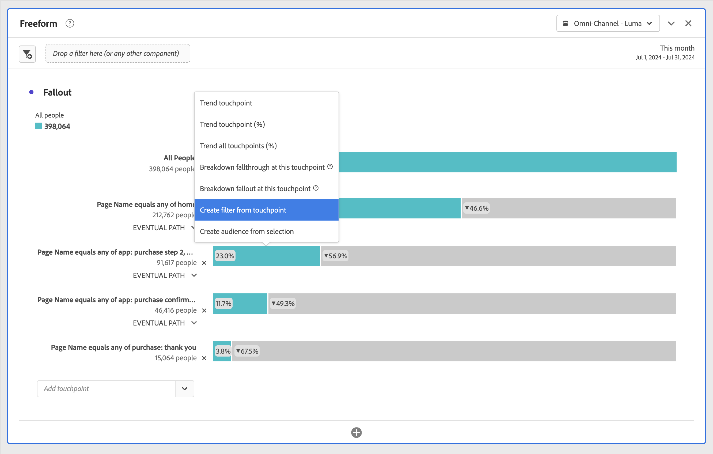

# Apply segments in fallout analysis

You can create segments from a touchpoint, add filters as touchpoint, and compare key workflows across various filters in Analysis Workspace.

>[!IMPORTANT]
>
>Filters used as checkpoints in Fallout must use a container that is at a lower level than the overall context of the Fallout visualization. With a person-context Fallout, filters used as checkpoints must be session or event-based filters. With a session-context Fallout, filters used as checkpoint must be event-based filters. If you use an invalid combination, the fallout is 100%. You see a warning to the Fallout visualization when you add an incompatible filter as a touchpoint. Certain invalid filter container combinations lead to invalid Fallout diagrams, such as:
>
>* Using a person-based filter as a touchpoint inside a person-context Fallout visualization
>* Using a person-based filter as a touchpoint inside a session-context Fallout visualization
>* Using a session-based filter as a touchpoint inside a session-context Fallout visualization

## Create a filter from a touchpoint

1. Create a filter from a specific touchpoint that you are especially interested in and that might be useful to apply to other reports. Right-click the touchpoint and select **[!UICONTROL Create filter from touchpoint]**.

   

   The [!UICONTROL Filter builder] opens, pre-populated with the pre-built sequential filter that matches the touchpoint you selected:

   

1. Give the filter a title and description and save it.

   You can now use this filter in any project you wish.

## Add a filter as a touchpoint

If you want to see, for example, how your US users trend and affect the fallout, just drag the US users filter into the fallout:

Or you can create an AND touchpoint by dragging the US users filter onto another checkpoint.

## Compare filters in fallout

You can compare an unlimited number of filters in the Fallout visualization.

1. Select the filters that you want to compare from the [!UICONTROL Filter] panel on the left. In the example, three filters are selected: *Flight Details: Page Version A*, *Flight Details: Page Version B*, and *Flight Details: Page Version C*.
1. You drag the three filters onto the Filter drop zone at the top of the visualization.

1. Optional: You can keep *All Visits* as the default container or delete the container.

   

1. You can now compare the fallout across the three filters, such as where one filter is outperforming another, or other insights.
