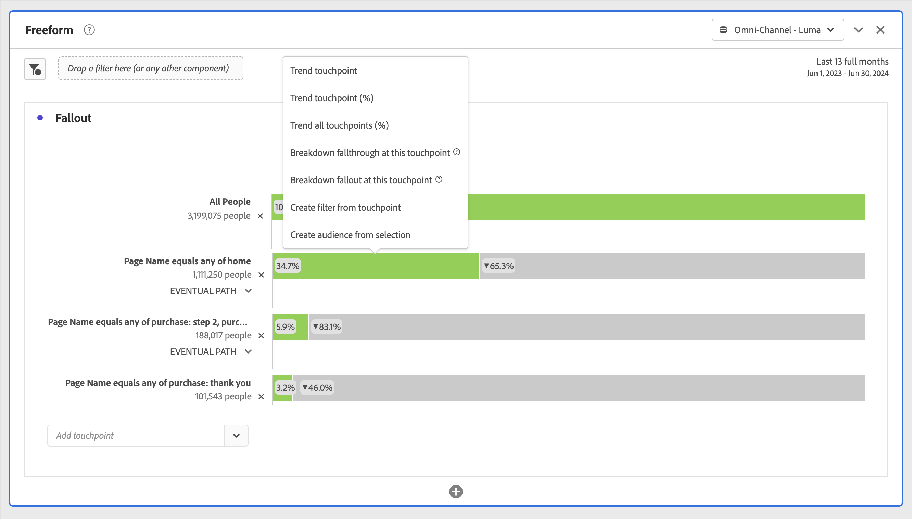

# Configure a fallout visualization

You can specify the touchpoints to create a multi-dimensional fallout sequence. Commonly, a touchpoint is a page on your site. However, touchpoints are not limited to pages. For example, you can add events, such as units, as well as unique persons and return visits. You can also add dimensions, such as a category, browser type, or internal search term.

You can even add filters within a touchpoint. For example, you might want to compare filters, such as iOS and Android users. Drag the desired filters to the top of the fallout and information about those filters is added to the fallout report. If you want to show only those filters, can you remove the All Visits baseline.

There is no limitation on the number of steps you can add or the number of dimensions used.

You can do pathing on eVars, including merchandising eVars and [listVars](https://experienceleague.adobe.com/docs/analytics/implementation/vars/page-vars/page-variables.html) (variables that can have multiple values per event, such as products, listVars, merchandising eVars and list props). For example, suppose someone is looking at shoes,shirt on one page, and on the next page they're looking at shirt,socks. The next product flow report from shoes will be shirt and socks, NOT shirt.

1. Add a  **[!UICONTROL Fallout]** visualization. See [Add a visualization to a panel](../freeform-analysis-visualizations.md#add-visualizations-to-a-panel).
1. Drag a page, for example home, from the Page dimension onto the Add touchpoint dropdown list.

   

   Hover over a touchpoint to see the fallout and other information about that level, such as the name of the touchpoint, the person count at that point, and see the success rate for that touchpoint (as well as compare the success rate to other touchpoints.)

   The circled numbers in the gray portion of the bar show the fallout between touchpoints (not the overall fallout to that point). The Touchpoint % shows the successful fallthrough from the previous step to the current step in the fallout report.

   You can also add a single page to the fallout report, rather than the entire dimension. Click the right arrow ">" on the page dimension to pick the specific page to add to the fallout report.

1. Continue adding touchpoints until your sequence is complete.

   You can **combine multiple touchpoints** by dragging one or more additional ones onto a touchpoint.

   >[!NOTE]
   >
   >Multiple filters are joined with AND, but multiple items such as dimension items and metrics are joined with OR.

   

1. You can also **constrain individual touchpoints to the next event** (as opposed to "eventually") within the path. Underneath each touchpoint, there is a selector with the options "Eventual Path" and "Next Hit", as shown here:

   

   <table id="table_A91D99D9364B41929CC5A5BC907E8985"> 
   <tbody> 
   <tr> 
      <td colname="col1"> 
Eventual Path 
 
(Default) 
 </td> 
      <td colname="col2"> 
Visitors are counted that will "eventually" land on the next page in the path, but not necessarily on the next event. 
 </td> 
   </tr> 
   <tr> 
      <td colname="col1"> 
Next Hit 
 </td> 
      <td colname="col2"> 
Visitors are counted that will land on the next page in the path on the very next event. 
 </td> 
   </tr> 
   </tbody> 
   </table>

## Fallout container settings

Select  **[!UICONTROL Settings]** to open the settings for Fallout visualization and for fallout container. 

| Fallout container | Description |
|--- |--- |
| Session or Person|  Lets you switch between Session and Person to analyze person pathing. The default is Person.  These settings help you understand person engagement at the person level (across sessions), or constrain the analysis to a single session. |

When you right-click a touchpoint, the following options appear:

| Option | Description |
|--- |--- |
|Trend touchpoint|See trend data for a touchpoint in a line graph, with some pre-built anomaly detection data.|
|Trend touchpoint (%)|Trends the total fallout percentage.|
|Trend all touchpoints (%)|Trends all the touchpoint percentages in the fallout (except "All Visits", if it's included), on the same chart.|
|Break down fallthrough at this touchpoint|View what persons did between two touchpoints (this touchpoint and the next touchpoint) if they continued to the next touchpoint. This creates a freeform table showing your dimensions. You can replace dimensions and other elements of the table.|
|Break down fallout at this touchpoint|View what people who did not make it through the funnel did immediately after the selected step.|
|Create filter from touchpoint|Create a new filter from the selected touchpoint.|
