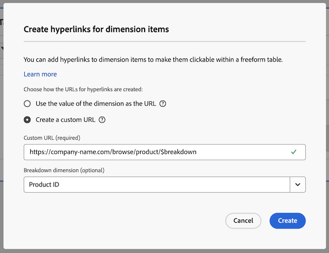

# Add hyperlinks to dimensions in a freeform table

You can add hyperlinks to dimension items to make them clickable within a freeform table in Analysis Workspace. 

This functionality is particularly useful when adding hyperlinks to the following types of dimension items:

* Dimension items that have URL values that you want to link to (for example, a Page URL dimension)

* Dimension items that contain breakdowns that have URL values that you want to link to (for example, a Page Name dimension that has a breakdown of a Page URL dimension)

* Dimension items or breakdowns that have values that are part of a URL that you want to link to (for example, a Page Name dimension that is part of a URL)

## Add hyperlinks to one or more dimension items

1. In a freeform table in Analysis Workspace, do one of the following:

   * **Add a hyperlink to a single dimension item:** Right-click the dimension item within the table where you want to add the hyperlink.

   <!-- add screenshot -->

   * **Add hyperlinks to all dimension items in a dimension column:** Right-click the dimension name in the dimension column header.

   <!-- add screenshot -->

1. Select [!UICONTROL **Add hyperlink**] from the right-click menu.

   The [!UICONTROL **Create hyperlinks for dimension items**] dialog is displayed. If you are adding a hyperlink to a single dimension item, the name of the dimension item is listed in the dialog title. 

   

1. Choose from the following options:

   * [!UICONTROL **Use the value of the dimension item as the URL**]: Choose this option for dimension items that have URL values, such as a Page URL dimension. 
   
     For example, if you are using a Page URL dimension where the value of each dimension item is a URL, then selecting this option creates a hyperlink to the URL.

   * [!UICONTROL **Create a custom URL**]: Specify either a static or dynamic custom URL. Choose this option to add hyperlinks to dimension items that do not have URL values. 
   
     For example, if you are using a Page Name dimension where the value of each dimension item is the name of a page (and not a full URL), then selecting this option allows you to specify a hyperlink to use as the link for the dimension item.
   
     If you want to create dynamic URLs for multiple dimension items, you can use the `$value` and `$breakdown` variables within your custom URL. See the table below for more information.

      To create a custom URL, specify the following information:

      |Field | Description | 
      |---------|----------|
      | [!UICONTROL **Custom URL**] | Specify a custom URL that you want to use for the hyperlink. URLs must be entered as fully qualified URLs. For example: https://www.example.com
The custom URL that you add can be static or dynamic:
 <ul><li>**Static URLs:** If you are adding a hyperlink to an individual dimension item, a static URL might be sufficient. 
For example, if you have a Page Name dimension item, you can add a static URL that links users to the specific web page that you want to associate with the page name.
</li><li>**Dynamic URLs:** If you are adding a hyperlink to multiple dimension items or to all dimension items in a dimension column, then a dynamic URL is probably more practical. 
To make custom URLs dynamic, you include variables within the URL that allow the URL to dynamically change based on the value of the dimension itself, or the value of the breakdown dimension.

The following variables are available:
 <ul><li>**`$value`:** Allows you to insert the value of the dimension item into the URL that you specify. 
Consider the following scenario as an example:

Suppose that you want to add hyperlinks to all Page Name dimension items in a freeform table, where the value of each dimension item is part of a webpage's URL. In this case, you can construct a single custom URL that dynamically adjusts for each dimension item. 

You can accomplish this by adding the `$value` variable to the end of the custom URL that you specify. For example:
 
https://company-name.com/browse/product#$value

When this custom URL is applied to your Page Name dimension items whose values are "ProductY" and "ProductZ", the generated hyperlinks would look something like this: 

https://company-name.com/browse/product#ProductY

and

 https://company-name.com/browse/product#ProductZ. 

</li><li>**`$breakdown`:** Allows you to insert the value of the breakdown dimension item into the URL that you specify. This allows you to show a user-friendly name in your report while creating the hyperlink based on a breakdown dimension that might be less user-friendly, such as an ID or URL. 
The breakdown dimension is the dimension that you specify in the [!UICONTROL **Breakdown dimension**] field below.
 
Consider the example scenario described for the [!UICONTROL **Breakdown dimension**] field below.
</li></ul>   | 
      | [!UICONTROL **Breakdown dimension (optional)**] | Begin typing the name of the breakdown dimension that you want to use, then select it from the drop-down list. 
If you select a breakdown dimension in this field, you must reference it by using the `$breakdown` variable in the URL that you specify in the [!UICONTROL **Custom URL**] field.

Consider the following scenario as an example:

Suppose that you want to create hyperlinks for all Product Name dimension items in a freeform table. Each Product Name dimension item contains a breakdown of a Product ID dimension.

In this case, you can create hyperlinks to each Product Name dimension that directs users to the product page by using the value of the Product ID breakdown dimension. 

You can accomplish this by adding the `$breakdown` variable to the end of the custom URL that you specify in the [!UICONTROL **Custom URL**] field. For example:

https://company-name.com/browse/product/$breakdown

When this custom URL is applied to your Product Name dimension items that have breakdown dimension items whose values are "ProductY" and "ProductZ", the generated hyperlinks would look something like this:

https://company-name.com/browse/product/ProductY

and

https://company-name.com/browse/product/ProductZ

You would then select the Product ID dimension in the [!UICONTROL **Breakdown dimension**] field 

 | 

1. Select [!UICONTROL **Create**].

   Users who view the freeform table see the hyperlinked dimension items. When clicking a dimension item, users are taken to the hyperlinked pages that you added. Hyperlinked pages are launched in a separate browser tab. <!--true?-->
 
   <!-- add screenshot of a table with hyperlinks.-->

## Edit hyperlinks

## Delete hyperlinks

