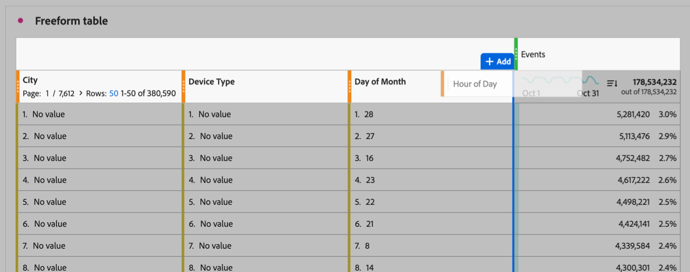

# Include multiple dimensions in a freeform table

You can include multiple dimension columns in a freeform table. Including multiple dimension columns allows you to:

* View dimension items side by side

* Apply sorting to multiple columns (including all dimension and metric columns)

## Add dimension columns

You can add dimension columns one at a time or in bulk.

The simplest way to add dimensions to a freeform table is to drag them into a freeform table.

1. In Analysis Workspace, create a freeform table. 

   For more information, see [Add visualizations to a panel](/help/analysis-workspace/visualizations/freeform-analysis-visualizations.md#add-visualizations-to-a-panel) in [Visualizations overview](/help/analysis-workspace/visualizations/freeform-analysis-visualizations.md).

1. Add dimensions to the freeform table. You can add multiple dimensions at once or you can add dimensions one at a time. 

   * Select up to 5 dimensions in the component menu and drag them into the freeform table. Dimensions are added to the table from left to right in the order you select them.

     To select multiple dimensions, hold the ***Command*** key (on Mac) or the ***Ctrl*** key (on Windows).

     

   * Drag dimensions one at a time into the freeform table.

     

   

## Filter and sort table columns

You can sort the data of a freeform table by any columns in Analysis Workspace that are either a dimension or a metric. You can sort by a single column or by multiple columns. For more information, see [Filter and sort tables](/help/analysis-workspace/visualizations/freeform-table/filter-and-sort.md).
