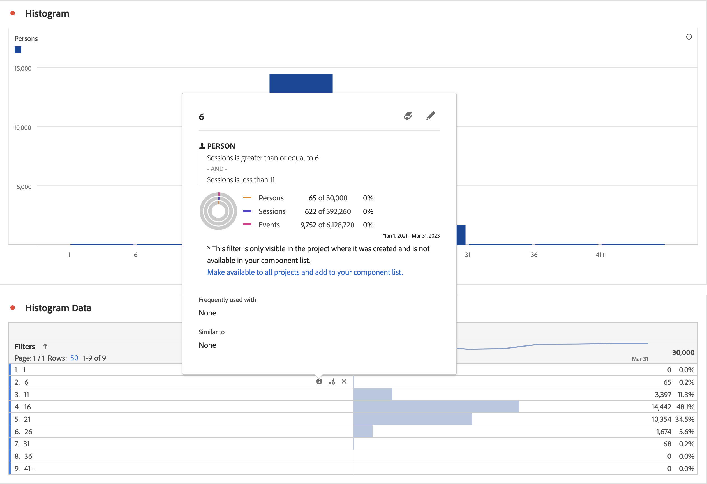

# Histogram

A histogram is similar to a bar chart, but it groups numbers into ranges (buckets). Analytics automates the "bucketing" of numbers into ranges, but you can change the settings in [Advanced Settings](#advanced-settings).

## Build a histogram {#section_74647707CC984A1CB6D3097F43A30B45}

To create a histogram:

1. Click **[!UICONTROL Visualizations]** in the left rail.
1. Drag **[!UICONTROL Histogram]** to the panel.
1. Choose a Metric to drag to the Histogram visualization and click **[!UICONTROL Build]**.

>[!NOTE]
>
>Histograms support only standard metrics, not calculated metrics.

Here we have used the Page Views Metric per Unique Visitors. The first (left) bucket corresponds to 1 page view per unique person, the second bucket to two page views, etc.

In the example below, a histogram is used to bucket sessions for the number of persons. The histogram shows that most persons do have between 16-21 sessions for the selected data range.

## Advanced settings {#section_09D774C584864D4CA6B5672DC2927477}

To adjust your histogram settings, click the Settings ("gear") icon in the upper right corner. Here are the settings you can modify: 

|  Histogram Settings  | What it Does  |
|---|---|
|  Starting Bucket  | Determines which bucket the histogram starts with. "1" is the default. You can set starting numbers from 0 to infinity (no negative numbers).  |
|  Metric Buckets  | Lets you increase/decrease the number of data ranges (buckets.) The maximum number of buckets is 50.  |
|  Metric Bucket Size  | Lets you set the size of each bucket. For example, you can change the bucket size from 1 page view to 2 page views.  |
|  Counting Method  | Lets you choose among [Visitor](https://experienceleague.adobe.com/docs/analytics/components/metrics/unique-visitors.html), [Visit](https://experienceleague.adobe.com/docs/analytics/components/metrics/visits.html), or Hit Type. For example, page views per visit or page views per person or page views per event. For Hit, "Occurrences" is used as the y-axis metric in a freeform table.  |

<!--Russ or Meike - Check Hit Type link above. -->

**Examples**:

* Starting Bucket: 1; Metric Buckets: 5; Metric Bucket Size: 2 will result in this histogram: 1-2, 3-4, 5-6, 7-8, 9-10.
* Starting Bucket: 0; Metric Buckets: 3; Metric Bucket Size: 5 will result in this histogram: 0-4, 5-9, 10-14

## View and edit histogram data

To view or change the data source for the histogram chart, click the colored dot next to the Histogram header to go to **[!UICONTROL Data Source Settings]** > **[!UICONTROL Show Data Source]**.

Pre-built filters that show up in the table are internal filters and won't show up in the filter selector. Select  next to the filter name, then select **[!UICONTROL Make available to all projects and add to your components list]** to make the filter public.

To explore more ways to manage Freeform data tables and other visualizations, such as doing data breakdowns, go [here](https://experienceleague.adobe.com/docs/analytics/analyze/analysis-workspace/visualizations/freeform-analysis-visualizations.html).

## Blog post

Refer to this blog post about information on [using histograms to identify unexpected data values](https://experienceleaguecommunities.adobe.com/t5/adobe-analytics-blogs/using-histograms-to-identify-unexpected-data-values/ba-p/596168).
