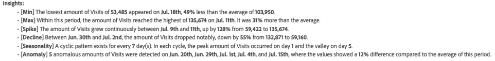
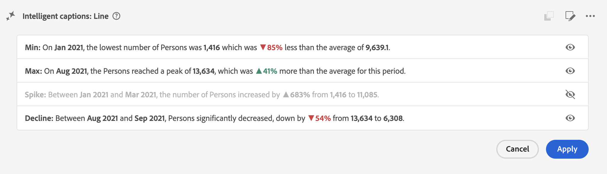
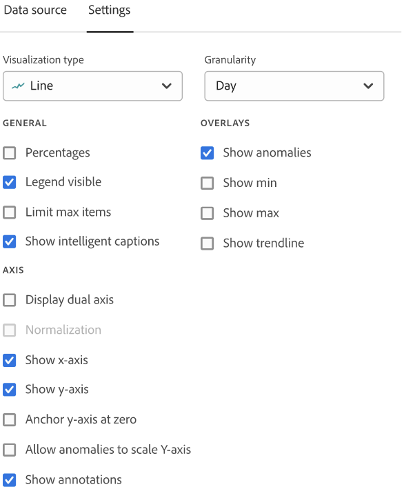

# Intelligent captions {#intelligent-captions}

>[!CONTEXTUALHELP]
>id="workspace_intelligentcaptions"
>title="Intelligent captions"
>abstract="Generate insights in natural-language form to help you more easily understand and interpret data for this visualization."

 
The Intelligent captions functionality uses advanced Generative AI to provide key insights for the most frequently used Workspace visualizations in natural language. 

Intelligent captions are geared towards:

* Analysts, who need narratives to share with other users. Analysts need these insights to be able to provide context to their users.
* Business users, who want to discover high-level takeaways quickly.

>[!BEGINSHADEBOX]

See  [Intelligent captions](https://experienceleague.adobe.com/en/docs/customer-journey-analytics-learn/tutorials/analysis-workspace/visualizations/intelligent-captions){target="_blank"} for a demo video.

>[!ENDSHADEBOX]

## Launch intelligent captions {#launch}

To launch auto-generated intelligent captions for a visualization, select  at the top right of the visualization. This selection generates natural-language insights. 

Keep in mind that:

* You need a minimum of 3 data points to generate captions successfully. Otherwise, you might get an error like **[!UICONTROL Not enough data to analyze]**.

* Captions are generated every time the underlying selected data changes in the table that powers the visualization. 

* If there are multiple metrics in an associated freeform table, captions are only generated for the first metric or the metric currently selected by the user. However, captions can be generated for multiple metrics for the line and area visualizations. 

* If you save the project at a specific point, and re-load it later, the captions are auto-updated with new data. The same applies to scheduled projects and PDF files exported from a project.

## Visualizations {#visualizations}

Intelligent captions are supported on the following visualizations:

* [Line](line.md) (including multi-line)
* [Bar](bar.md)
* [Horizontal bar](horizontal-bar.md)
* [Area](area.md) (including multiple Area lines)
* [Donut](donut.md)
* [Fallout](fallout/fallout-flow.md)
* [Flow](c-flow/flow.md)

<!--
Here is an example of what intelligent captions could look like:

-->

## Actions

You can perform the following actions on intelligent captions:

### Copy to clipboard {#copy}

You can copy the captions to a clipboard and paste them into a PowerPoint or other tools. You can copy individual captions in the one-by-one view, or you can copy all captions at once in the expanded caption view. 

* To copy the captions, select  at the top right of the captions dialog.

### Show all or individual intelligent captions  {#show-all-or-individual}

You can show all intelligent captions at once in an expanded view, or you can show individual inteliigent captions in a one-by-one view. 

* To show all intelligent captions, select . 
* To show individual intelligent captions, one-by-one, select .

### Edit display {#edit}

You can edit the display of captions, such as hiding or unhiding a particular category of insights. 

1. Select  in the Intelligent captions dialog.

1. Toggle between  to display a specific insight (like **[!UICONTROL Min]**), or  to hide a specific insight (like **[!UICONTROL Spike]**).

   

1. Select **[!UICONTROL Apply]**.

### Provide feedback

You can provide feedback on the generated intelligent captions (feedback can only be provided in the expanded caption view).

1. Select  in the Intelligent captions dialog.

1. Select  **[!UICONTROL Good response]**,  **[!UICONTROL Bad response]**, or  **[!UICONTROL Report]**.

1. In the **[!UICONTROL Thank you for your feedback]** dialog, provide your feedback and select **[!UICONTROL Submit]** to submit the feedback.

### Export {#export}

You can export intelligent captions as part of a PDF, as long as the project is saved with the intelligent captions generated.

### Toggle off {#toggle}

If you would rather not show intelligent captions, you can toggle the feature off. 

1. Go to [Visualizations preferences](/help/analysis-workspace/user-preferences.md#visualizations-preferences).
1. Uncheck **[!UICONTROL Show intelligent captions]**.

   

1. Select **[!UICONTROL Save]** to save the preference.

## Intelligent captions in Mobile Scorecards

Intelligent captions are also available in Customer Journey Analytics [mobile scorecards](https://experienceleague.adobe.com/en/docs/analytics-platform/using/cja-dashboards/manage-scorecard#captions).

## Feature Access

The following parameters govern access to Intelligent captions:

* **Solution access**: The Intelligent captions feature is available in Customer Journey Analytics, but not in Adobe Analytics.

* **Contractual access**: If you are not able to use Intelligent captions, please contact your organization's administrator or Adobe Account Representative (Admin). Before you can use Intelligent captions in your organization, you must agree to certain Generative AI related legal terms.

* **Permissions**: In the [!UICONTROL Adobe Admin Console], the [!UICONTROL Reporting Tools] **[!UICONTROL Intelligent Captions]** permission determines access. A [product profile admin](https://helpx.adobe.com/enterprise/using/manage-product-profiles.html) needs to follow these steps in the [!UICONTROL Admin Console]:
   1. Navigate to **[!UICONTROL Admin Console]** > **[!UICONTROL Products and services]** > **[!UICONTROL Customer Journey Analytics]** > **[!UICONTROL Product Profiles]**.
   1. Select the title of the product profile for which you want to provide access to Intelligent captions.
   1. In the specific product profile, select **[!UICONTROL Permissions]**.
   1. Select  to edit **[!UICONTROL Reporting Tools]**.
   1. Select  to add **Intelligent Captions** to **[!UICONTROL Included permission items]**.

      

   1. Select **[!UICONTROL Save]** to save the permissions.

See [Access control](/help/technotes/access-control.md#access-control) for more information.
