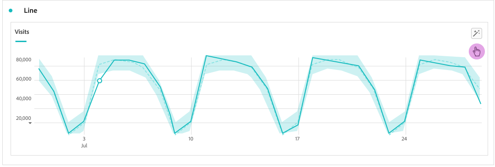

# Intelligent Captions

{{release-limited-testing}}

Intelligent captions use data science to provide valuable natural-language insights for Workspace visualizations. The initial release provides auto-generated insights for the [Line](line.md) visualization. (Other visualizations will follow.)

Intelligent captions are geared towards:

* Analysts who need narratives to share with other users. Analysts need these insights to be able to provide context to their users.
* Business users who want to quickly discover high-level takeaways.

Captions are available to all CJA users and do not require special permissions. 

## Launch intelligent captions {#launch}

To launch auto-generated captions for a line visualization, click the **[!UICONTROL Intelligent captions]** icon at the top right of the visualization.

Natural-language insights are now being generated.

If you save the project at this point, and re-load it later, the captions are auto-updated with new data. The same applies to scheduled projects and PDF files exported from this project.

## View and interpret captions {#view}

Here is a sample of what the captions could look like:

## Copy to clipboard {#copy}

You can copy the captions to a clipboard and paste them into a Powerpoint or other tool. Find the **[!UICONTROL Copy captions to clipboard]** icon at the top right of the captions dialog.

## Edit captions {#edit}

You can edit the captions, such as hiding or unhiding a particular category of insights. For example, if you don't want the insight about the minimum order, you can just hide it and click apply and it will not show again. 

1. Click **[!UICONTROL Edit intelligent captions display]** icon next to the clipboard icon.

1. In the edit dialog, click the eye icon next to the insight you would like to hide.

1. Click **[!UICONTROL Apply]**.

Use the same process to unhide captions.

## Export captions {#export}

You can **export captions via PDF**, as long as the project is saved with the captions generated.

## Toggle captions off {#toggle}

If you would rather not have intelligent captions generated, you can toggle this feature off by going to the Line settings gear icon and unchecking **[!UICONTROL Show intelligent captions]**.

## Reorder captions {#reorder}

You can reorder how the captions are displayed by dragging a caption to a new position.