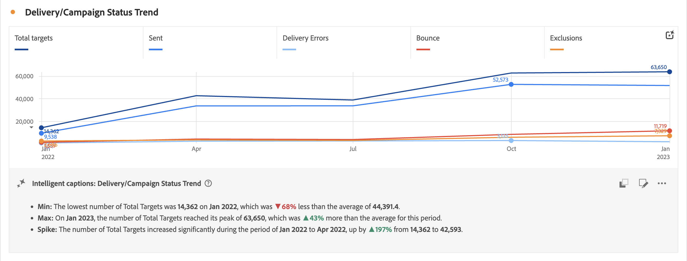

# Intelligent Captions

Intelligent captions use data science to provide natural-language insights for Workspace visualizations. The initial release provides auto-generated insights for the [Line](line.md) visualization.

Intelligent captions are geared towards:

* Business users who want to quickly discover high-level takeaways.
* Analysts who need narratives to share with other users.

Captions are available to all CJA users and do not require special permissions. Here is a sample of what the captions could look like:

## Configure intelligent captions