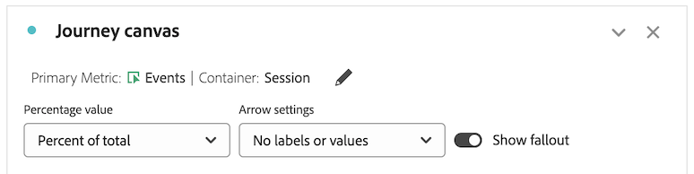
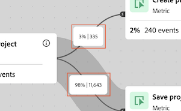
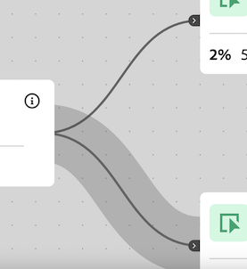

# Configure a Journey canvas visualization

{{release-limited-testing}}

The Journey canvas visualization allows you to analyze and gain deep insights on the journeys that you provide to your users and customers. 

## Journey canvas overview

See [Journey canvas overview](/help/analysis-workspace/visualizations/journey-canvas/journey-canvas.md) to learn more about Journey canvas, including:

* Key features 

* Potential insights 

* Differences between Journey canvas and Fallout

* Details about analyzing Journey Optimizer journeys

* And more

## Begin building a Journey canvas visualization

1. Add a blank panel to your project, select the [!UICONTROL **Visualizations**] icon in the left rail, then drag the  [!UICONTROL **Journey canvas**] visualization into the panel.

   Or

   Add a Journey canvas visualization in any of the ways described in the [Add visualizations to a panel](/help/analysis-workspace/visualizations/freeform-analysis-visualizations.md#add-visualizations-to-a-panel) section in [Visualizations overview](/help/analysis-workspace/visualizations/freeform-analysis-visualizations.md).

   

1. Specify the following basic information to configure Journey canvas:
   
   | Field | Function | 
   |---------|----------|
   | [!UICONTROL **Primary metric**] | Determines the metric that is used when calculating the percentage and number values on each node in the journey. 
**Note**: The scope of the data included in each percentage and number value is determined by the metric that you choose in the **[!UICONTROL Journey canvas container]** field. For example, if **[!UICONTROL Person]** is set as the container, then the statistics shown in the journey span multiple sessions for a given person. If **[!UICONTROL Session]** is set as the container, then the statistics shown in the journey are constrained to a single defined session for a given person.

Consider the following examples:
<ul><li>If _People_ is the primary metric and _Person_ is the container, then only those people who have an event that matches the criteria of each successive node in the journey move throughout the journey. Fallout occurs on a node when a person never arrived at any of the immediate next nodes in the journey. They might have performed other actions on the site, but they did not meet the criteria defined by any of the nodes that immediately follow.</li><li>If _People_ is the primary metric and _Session_ is the container, then only those people who have an event that matches the criteria of each node in the journey within a single session move throughout the journey. Fallout occurs on a node when a person never arrived at any of the immediate next nodes in the journey within a single session. They might have performed other actions on the site within the session, but they did not meet the criteria defined by any of the nodes that immediately follow.</li></ul> 
The primary metric affects the following aspects of the Journey canvas visualization:
<ul><li>The total number shown on each node.  
For example, if Events is the primary metric, each node shows the number of people who had an event that matches the criteria of that node (and each previous node leading up to it in the journey).
</li><li>The percentage shown on each node. (After the visualization is built, you can use the **[!UICONTROL Percentage value]** drop-down menu to choose to show either the percentage of the total, the percentage of the previous node, or the percentage of the starting node.)</li>
For example, if Events is the primary metric, each node shows the percentage of people who had an event that matches the criteria of that node (and each previous node leading up to it in the journey).
</li><li>When a dimension is added to the visualization, the top 3 nodes of the visualization are added, based on the primary metric.</li></ul>  | 
   | [!UICONTROL **Secondary metric**] | Determines the secondary metric that is used when calculating the percentage and number values on each node in the journey. The secondary metric is optional. 
**Note**: The scope of the data included in each percentage and number value is determined by the metric that you choose in the **[!UICONTROL Journey canvas container]** field. For example, if **[!UICONTROL Person]** is set as the container, then the statistics shown in the journey span multiple sessions for a given person. If **[!UICONTROL Session]** is set as the container, then the statistics shown in the journey are constrained to a single defined session for a given person.

When a secondary metric is selected, it affects the following aspects of the Journey canvas visualization:
<ul><li>The total number shown on each node below the primary metric. 
For example, if Accounts is the secondary metric, the number of accounts is shown on the node for all people who reached that node ionly those peopleeach node shows the number of sessions that reached that node in the journey.
</li><li>The percentage shown on each node below the primary metric. (After the visualization is built, you can choose to show either the percentage of the total or of the starting node.)</li>
For example, if Sessions is the secondary metric, each node shows the percentage of sessions that reached that node in the journey (either the percentage of the total or of the starting node).
</li></ul> |
   | [!UICONTROL **Journey Optimizer journey**]<!-- name? --> |  Select the Journey Optimizer journey that you want to use as the basis for your analysis in Journey canvas. Journeys with any of the following statuses are available: Live, Stopped, or Finished 
Alternatively, you can leave this option blank if you want a blank canvas from which to build your analysis within Analysis Workspace.
 
When you analyze a Journey Optimizer journey in Journey canvas, the journey is displayed with the same order, sequence, and structure as it has in Journey Optimizer. For more information, see [Analyze Journey Optimizer journeys](/help/analysis-workspace/visualizations/journey-canvas/journey-canvas.md#analyze-journey-optimizer-journeys) in [Journey canvas overview](/help/analysis-workspace/visualizations/journey-canvas/journey-canvas.md).

**Note**: This option displays only when Journey Optimizer data is detected in the same data view that is selected in the Analysis Workspace panel where you are adding the visualization. For information about changing the data view on a panel in Analysis Workspace, see [Analysis Workspace overview](/help/analysis-workspace/home.md).
 |

1. (Optional) Select [!UICONTROL **Show advanced settings**], then specify the following information:

   | Field | Function | 
   |---------|----------|
   | [!UICONTROL **Journey canvas container**] | Choose the container that you want to focus on throughout the journey. The container that you choose determines the scope of the data captured in the journey. This affects the statistics that are displayed in the visualization. (If your container names differ from the default names shown below, they were customized in your data view.)<ul><li>**Session:** Constrains the statistics of the visualization to fall within a single defined session for a given person. This means that the numbers and percentages that appear on each node (that are based on the primary and secondary metrics) must occur within a single session for each person. In other words, one person can be represented multiple times in a single journey.
This container uses the Sessions metric.
</li><li>**Person:** (Default) Allows the statistics of the visualization to span multiple sessions for a given person. This means that the numbers and percentages that appear on each node (that are based on the primary and secondary metrics) can occur across any number of sessions, as long as the sessions belong to the same person. In other words, one person can be represented only one time in a single journey.
This container uses the People metric.
</li></ul> | 

1. Select [!UICONTROL **Build**].

   If you have Journey Optimizer and you selected a Journey Optimizer journey, the journey is displayed with the same order, sequence, and structure as it has in Journey Optimizer. 

   <!-- add screen shot -->

   If you do not have Journey Optimizer or if you didn't select a Journey Optimizer journey, a blank canvas displays where you can begin adding nodes to the journey.

   <!-- add screen shot -->

1. Whether you are creating a new analysis from a blank canvas or you are analyzing a Journey Optimizer journey, you can configure the journey as described in [Configure visualization settings](#configure-visualization-settings). 

## Configure visualization settings

Various configuration options are available in the Journey canvas header. 

To configure settings for the Journey canvas visualization:

1. In Analysis Workspace, open an existing Journey canvas visualization, or [begin building a new one](#begin-building-a-journey-canvas-visualization).

   Options that allow you to configure the Journey canvas visualization are available in the header:

   

1. Configure any of the following settings that are displayed across the top of the visualization:

   | Setting | Function | 
   |---------|----------|
   | [!UICONTROL **Node type**] | Allows you to configure which node types are shown in the visualization. The journey is recalculated when nodes types are added or removed from the journey.
To hide a node type from the visualization, select the (x) next to the node type, or deselect it from the drop-down menu. To show a hidden node type, select it from the drop-down menu. (Nodes are not deleted from the journey when you hide them. For information about how to delete a node, see [Delete nodes](#delete-nodes).)

The node types that are available in this field depend on the following factors:
<ul><li>For journeys that originated in Journey canvas, the following node types are available:<ul><li>Dimension</li><li>Metric</li><li>Filter</li><li>Date range</li></ul></li><li>For journeys that originated in Journey Optimizer and that have been significantly modified in Journey canvas, the following node types are available: (Significant modifications include adding or removing nodes, adding or removing arrows, or changing the components of a node.)<ul><li>Dimension</li><li>Metric</li><li>Filter</li><li>Date range</li><li>Journey Optimizer node types, such as Read segment, End, and so forth</li></ul></li><li>For journeys that originated in Journey Optimizer and that have not been significantly modified in Journey canvas, the following node types are available: (Significant modifications include adding or removing nodes, adding or removing arrows, or changing the components of a node.)<ul><li>Journey Optimizer node types, such as Read segment, End, and so forth</li></ul></li></ul>   | 
   | [!UICONTROL **Percentage value**] | The percentage value shown on each node in the journey.

 
Consider the following when configuring the percentage values shown on nodes in the journey:
<ul><li>A percentage is shown on each node for the primary metric. A percentage is also shown for the secondary metric if one is configured. (For more information about the primary and secondary metric settings, see [Begin building a Journey canvas visualization](#begin-building-a-journey-canvas-visualization).)</li><li>Percentages include all people or sessions that are included in the data view within the panel's date range. Whether _people_ or _sessions_ is used depends on the container setting. (For more information about the container setting, see [Begin building a Journey canvas visualization](#begin-building-a-journey-canvas-visualization).)</li></ul> 
Choose from the following options:
 <ul><li>[!UICONTROL **Percent of start node**]: Calculates the percentages shown on each node in relation to the start node. Percentages are based on the primary and secondary metric that you selected. 
A _start node_ is a node that has no connected nodes preceding it.

A journey can contain multiple start nodes. However, [!UICONTROL **Percent of total**] is used if the journey contains 2 or more start nodes that lead to a common node. If you want to use [!UICONTROL **Percent of start node**], update the journey so that each node in the journey can be traced back to a single start node.
</li><li>[!UICONTROL **Percent of previous node**]: Calculates the percentages shown on each node in relation to the previous node. Percentages are based on the primary and secondary metric that you selected.</li><li>[!UICONTROL **Percent of total**]: Calculates the percentages shown on each node in relation to all data in the data view. Percentages are based on the primary and secondary metric that you selected.</li></ul> | 
   | [!UICONTROL **Arrow settings**] | The arrows that appear between nodes in Journey canvas can be configured to show custom labels and values. 

_Labels_ are custom names that appear on arrows. Only a single label is shown on a given arrow. Labels can be any of the following, and are shown in this order of preference:
<ol><li>A custom name added from Journey canvas (as described in [Add or update a label on an arrow](#add-or-update-a-label-on-an-arrow))</li><li>A Journey Optimizer label</li><li>A Journey Optimizer condition</li></ol>
_Values_ are the numbers and percentages that appear on arrows, and they indicate the people or sessions who moved from one node to the next node in the journey. (In other words, those who did not fall out of the journey at a given step.) 

The following options are available for journeys that did not originate from Journey Optimizer and for Journey Optimizer journeys that have not been significantly modified in Journey canvas: (Significant modifications include adding or removing nodes, adding or removing arrows, or changing the components of a node.)
<ul><li>[!UICONTROL **No labels**]: No labels are shown on arrows in the journey.   This option is available only if the journey has been modified in </li><li>[!UICONTROL **Labels only**]: Labels are shown on arrows in the journey.</li></ul>
The following options are available for Journey Optimizer journeys that have been significantly modified in Journey canvas: (Significant modifications include adding or removing nodes, adding or removing arrows, or changing the components of a node.)(**Note**: These options displays only when Journey Optimizer data is detected in the same data view that is selected in the Analysis Workspace panel where you are adding the visualization. For information about changing the data view on a panel in Analysis Workspace, see [Analysis Workspace overview](/help/analysis-workspace/home.md).)
<ul><li>[!UICONTROL **No labels or values**]: No labels or values are shown on arrows in the journey.</li><li>[!UICONTROL **Labels only**]: Only labels are shown on arrows in the journey. Values are not shown.</li><li>[!UICONTROL **Values only**]: Only values are shown on arrows in the journey. Labels are not shown.</li><li>[!UICONTROL **Values and labels**]: Both labels and values are shown on arrows in the journey.</li></ul>  |
   | [!UICONTROL **Show fallout**] | Fallout data shows a percentage and number falling out of each node of the journey. Fallout data is based on the metric associated with the journey's container settings; it is not based on the primary or secondary metric. 

By default, the container is _Person_, so the metric used for fallout data is _People_. If the container is changed to _Session_, the metric used for fallout data is _Sessions_, and so on.

For example, with _Person_ as the container setting, fallout shows the percentage and number of people on each node of the journey who never arrived at any of the immediate next nodes. They might have performed other actions on the site, but they did not meet the criteria defined by any of the nodes that immediately follow.
 
For more information about the Journey canvas container setting, see [Begin building a Journey canvas visualization](#begin-building-a-journey-canvas-visualization). |
   | **Zoom controls** | The following zoom controls are available in the upper-right corner of the canvas:<ul><li>**Zoom in** : Enlarges specific areas of the visualization.
You can also use mouse controls, such as pinching on a trackpad.
</li><li>**Zoom out** : Shrinks the visualization to allow more room on the canvas.
You can also use mouse controls, such as pinching on a trackpad.
</li><li>**Fit screen** : Adjusts current zoom and pan settings to fill the screen with the full visualization.</li></ul>
To pan across the canvas after zooming in or out, click your mouse and drag to the desired location.
 |

1. Continue with [Add nodes](#add-nodes). 

## Add nodes

Nodes in a Journey canvas visualization represent the events or actions of a user journey. 

You create nodes in the following ways: by dragging Workspace components from the left rail to the canvas; by allowing Journey canvas to choose the top next or previous nodes based on existing nodes; or by duplicating existing nodes.

### Drag components from the left rail

1. In Analysis Workspace, open an existing Journey canvas visualization, or [begin building a new one](#begin-building-a-journey-canvas-visualization).

1. Drag metrics, dimensions, dimension items, filters, or date ranges from the left rail onto the canvas. Metrics that are based on a [derived field](/help/data-views/derived-fields/derived-fields.md) are supported. However, calculated metrics, as well as any metrics or dimensions that are based on a [summary dataset](/help/data-views/summary-data.md) are not supported.
     
   You can select multiple components in the left rail by holding Shift, or by holding Command (on Mac) or Ctrl (on Windows).

   The visualization is updated as follows, depending on the component type and the area of the canvas where you place it: 
   
   |  Component type | Placement of component | Visualization updates after node is added | 
   |---------|----------|----------|
   | Metric | Blank area of the canvas | The node displays where the component was dropped, unconnected with any existing nodes. | 
   | Metric | An existing node | The component is automatically combined with the existing node. (See [Combine nodes](#combine-nodes) for more information.)
 |
   | Metric | An arrow between 2 existing nodes | The node displays between the two existing nodes where the component was dropped and is connected to both existing nodes. (See [Connect nodes](#connect-nodes) for more information.)
 |
   | Dimension | Blank area of the canvas | 3 nodes are created for the top 3 dimension items where the component was dropped, unconnected with any existing nodes. (**Note:** If only 1 or 2 nodes display, it means that data is available for only 1 or 2 of the dimension items. If no nodes display, it means that data is not available for any of the dimension items. In this case, try adding it to a different point of the journey, adjust the visualization's date range, or choose a different dimension.)
Hold the Shift key when you drop the dimension onto the canvas to add it as a single node with 3 dimension items.

 |
   | Dimension | An existing node | A breakdown is automatically applied to the node with the top 5 dimension items displayed.<!--what happens if you hold Shift?-->
To view the breakdown in a new freeform table visualization, select the [!UICONTROL **Open in a freeform table**] link on the node.
 |
   | Dimension | An arrow that connects 2 existing nodes | 3 nodes are created for the top 3 dimension items that follow the first event after the first node (of people/sessions who eventually reach the second node). The nodes display between the two existing nodes where the component was dropped and each node is connected to both existing nodes. (**Note:** If only 1 or 2 nodes display, it means that data is available for only 1 or 2 of the dimension items. If no nodes display, it means that data is not available for any of the dimension items. In this case, try adding it to a different point of the journey, adjust the visualization's date range, or choose a different dimension.)
Hold the Shift key when you drop the dimension onto the canvas to add it as a single node with 3 dimension items. (See [Connect nodes](#connect-nodes) for more information.)
 |
   | Dimension item | Blank area of the canvas | The node displays where the component was dropped, unconnected with any existing nodes. |
   | Dimension item | An existing node | The component is automatically combined with the existing node. |
   | Dimension item | An arrow that connects 2 existing nodes | The node displays between the two existing nodes where the component was dropped and is connected to both existing nodes. (See [Connect nodes](#connect-nodes) for more information.)
 |
   | Filter | Blank area of the canvas  | The node displays where the component was dropped unconnected with any other nodes.
The number and percentage that appear on the node include the total of the primary metric, filtered by the filter you selected.
 
For example, if People is selected as the primary metric for the journey, then adding a filter of Today to a blank area of the canvas shows all the people who had an event today.
 |
   | Filter | An existing node | Applies the filter to the existing node. |
   | Filter | An arrow that connects 2 nodes | The node displays between the two existing nodes where the component was dropped and is connected to both existing nodes. (See [Connect nodes](#connect-nodes) for more information.)

Applies the filter to the point on the path where the component was dropped.
 |
   | Date range | Blank area of the canvas | The node displays where the component was dropped, unconnected with any other nodes.
The number and percentage that appear on the node include the total of the primary metric, filtered by the date range you selected.
 
For example, if People is selected as the primary metric for the journey, then adding a date range of This month to a blank area of the canvas shows all the people who had an event during the current month.
 |
   | Date range | An existing node | Applies the date range to the existing node. |
   | Date range | An arrow that connects 2 nodes | The node displays between the two existing nodes where the component was dropped and is connected to both existing nodes. (See [Connect nodes](#connect-nodes) for more information.)

Applies the date range to the point on the path where the component was dropped.
 |
   | Multiple components | A blank area of the canvas | **If none of the components are dimensions:**
Each component displays as a separate node where the components were dropped, unconnected with any existing nodes.

Hold the Shift key when you drop the components onto the canvas to add them as one combined node. 

**If any of the components you are adding are dimensions:**

Each component displays as a separate node where the components were dropped, unconnected with any existing nodes.

Only one dimension can be added at a time. When the dimension is added, 3 nodes are created for the top 3 dimension items where the component was dropped.

Hold the Shift key when you drop the components onto the canvas to add them as one combined node. The top 3 dimension items are combined with each node. (See [Combine nodes](#combine-nodes) for more information.)
 |
   | Multiple components | An existing node | All components are combined with the existing node.
If any of the components you are adding are dimensions, then the top 3 dimension items are combined with the node.
 
Only one dimension can be added at a time.
 |
   | Multiple components | An arrow that connects 2 existing nodes | **If none of the components are dimensions:**
Each component displays as a separate node where the components were dropped and each node is connected to both existing nodes. (See [Connect nodes](#connect-nodes) for more information.)

Hold the Shift key when you drop the components onto the canvas to add them as one combined node. (Components must be of the same type to be combined into a single node.) (See [Combine nodes](#combine-nodes) for more information.)

**If any of the components you are adding are dimensions:**

Each component displays as a separate node where the components were dropped and each node is connected to both existing nodes.

Only one dimension can be added at a time. When the dimension is added, 3 nodes are created for the dimension's top 3 items that follow the first event after the first node (of people/sessions who eventually reach the second node). Each node is connected to both existing nodes. (See [Connect nodes](#connect-nodes) for more information.)

Hold the Shift key when you drop the components onto the canvas to add them as one combined node. The top 3 dimension items are combined with each node, and each node is connected to both existing nodes. (See [Combine nodes](#combine-nodes) for more information.)
|

   Nodes display as a rectangular box with the following information:

   * Component name

   * The component type (such as metric or dimension)

   * Primary metric statistics (total and percent)

   * Secondary metric statistics (total and percent) 

   A pulsing or glowing node indicates that data is loading for that node. 

1. Repeat this process to continue adding nodes to build out your journey. 

1. Continue customizing the journey as described in the sections below. You can connect nodes, rename nodes, apply breakdowns, create audiences, add time constraints, and more. 

### Show the top nodes based on existing nodes

You can automatically show the top nodes based on the nodes that are already on the canvas. You can add the top nodes to Journey canvas or view them in a freeform table.

This option is available for the following objects on the canvas:

* Individual nodes 

* The arrow between nodes

#### Show top nodes after an existing node

You can select a node and show the top dimension items that come after it in the journey. You can add the top 3 dimension items to Journey canvas as separate nodes, or you can view all top dimension items in a freeform table.

1. Right-click the node where you want to show the top dimension items that come after it in the journey.

   The node cannot have any existing nodes going out of it in the journey.

1. Select [!UICONTROL **Show top nodes after this node**].

1. Select where you want to show the dimension items: 

   * [!UICONTROL **In Journey canvas**]: Adds the top 3 nodes to the canvas that come after this node in the journey. Each node is connected to the node that you selected as a separate branch on the canvas.

   * [!UICONTROL **In a Freeform table**]: Creates a freeform table visualization showing all top dimension items that come after this node in the journey. 

1. Select the desired dimension from the list of dimensions.

   Depending on what you chose in the previous step, the top 3 dimension items are added to the canvas as 3 separate nodes, or all top dimension items are shown in a freeform table.

#### Show top nodes before an existing node

You can select a node and show the top dimension items that come before it in the journey. You can add the top 3 dimension items to Journey canvas as separate nodes, or you can view all top dimension items in a freeform table.

1. Right-click the node where you want to show the top dimension items that come before it in the journey.

   This node cannot have any existing nodes coming into it in the journey.

1. Select [!UICONTROL **Show top nodes before this node**].

1. Select where you want to show the dimension items: 

   * [!UICONTROL **In Journey canvas**]: Adds the top 3 nodes to the canvas that come before this node in the journey. Each node is connected to the node that you selected as a separate branch on the canvas.

   * [!UICONTROL **In a Freeform table**]: Creates a freeform table visualization showing all top dimension items that come before this node in the journey. 

1. Select the desired dimension from the list of dimensions.

   Depending on what you chose in the previous step, the top 3 dimension items are added to the canvas as 3 separate nodes, or all top dimension items are shown in a freeform table.

#### Show top nodes between existing nodes

You can select an arrow and show the top dimension items that come between 2 existing nodes in the journey. You can add the top 3 dimension items to Journey canvas as separate nodes, or you can view all top dimension items in a freeform table.

1. Right-click the arrow between the 2 nodes where you want to show the top dimension items.

1. Select [!UICONTROL **Show top nodes between these nodes**].

1. Select where you want to show the dimension items: 

   * [!UICONTROL **In Journey canvas**]: Adds the top 3 nodes to the canvas that come between the 2 existing nodes. Each node is connected to the surrounding nodes as a separate branch on the canvas.

   * [!UICONTROL **In a Freeform table**]: Creates a freeform table visualization showing all top dimension items that come between the 2 existing nodes. 

1. Select the desired dimension from the list of dimensions.

   Depending on what you chose in the previous step, the top 3 dimension items are added to the canvas as 3 separate nodes, or all top dimension items are shown in a freeform table. 

### Duplicate nodes

The option to duplicate is available for the following objects on the canvas:

* Individual nodes

* Multiple nodes

To duplicate nodes:

1. Select one or more nodes that you want to duplicate. 

   To select multiple nodes, hold Command (on Mac) or Ctrl (on Windows).

1. Right-click one of the selected nodes, then select [!UICONTROL **Duplicate**].

## Design the journey

The order of nodes and the connections between them affect Journey canvas data. Journeys should visually and accurately reflect the sequence of events that you want to report on. 

After nodes are added to the canvas, you can rearrange them, combine them, connect them, and add time constraints between them. 

### Rearrange nodes

Journeys in Journey canvas consist of a flexible graph of nodes and arrows representing any combination of events, dimension items, and filters. 

You can drag nodes on the canvas to rearrange the events and conditions of the journey. 

 As you rearrange the order of nodes in the journey, data updates accordingly. 

### Combine nodes

A combined node in Journey canvas is a single point in the user journey (node) that contains 2 or more components that are joined together through logic. 

#### Create combined nodes

You can do any of the following to combine nodes in Journey canvas:

* From the left rail, drag a single component onto a node on the canvas.

* From the left rail, drag multiple components simultaneously onto a node on the canvas.

* From the left rail, drag multiple components simultaneously onto a blank area of the canvas while holding the Shift key.

<!-- * On the canvas, select the nodes that you want to combine, right-click one of the selected nodes, then select **Combine**. Is there a limit on how many you can combine? -->

#### Logic when combining nodes

The logic that is applied to nodes when they are combined differs depending on which component types you are combining, as follows:

>[!TIP]
>
>You can view the logic of a combined node by right-clicking the node, then selecting [!UICONTROL **Create filter from node**]. The logic is shown in the [!UICONTROL **Definition**] section.

| Component types to combine | Logic (operator) used |
|---------|----------|
| Metric + Metric | Joined with OR | 
| Dimension item + Dimension item (from the same parent dimension) | Joined with OR |
| Dimension item + Dimension item (from different parent dimensions) | Joined with AND |
| Filter + Filter | Joined with AND | 
| Dimension + Metric, Date range, or Filter | Joined with AND | 
| Date range + Metric, Filter, or Dimension | Joined with AND | 
| Filter + Metric, Date range, or Dimension | Joined with AND | 

### Connect nodes

You can connect nodes that are already on the canvas, or you can connect a node when adding it to the canvas.

You connect nodes to define the journey's sequence of events.

#### Arrows between nodes

Nodes are connected by an arrow. Both the arrow direction and width have significance:

* **Direction**: Indicates the sequence of events of the journey

* **Width**: Indicates percentage volume from one node to another

  

#### Logic when connecting nodes

When you connect nodes in Journey canvas, they are connected using the THEN operator. This is also known as [sequential filtering](/help/components/filters/seg-sequential-build.md). 

Nodes are connected as an "eventual path," which means that visitors are counted as long as they eventually move from one node to the other, regardless of any events occurring between the 2 nodes. The time allotted for users to move along the path is determined by the container setting. <!-- It can also be controlled by [adding a time constraint](#add-a-time-constraint-between-nodes). -->

You can view the logic of connected nodes by right-clicking the node, then selecting [!UICONTROL **Create filter from node**]. The logic is shown in the [!UICONTROL **Definition**] section.

#### Connect existing nodes

Journeys cannot be circular, looping back to previously connected nodes.

To connect nodes in Journey canvas:

1. In a Journey canvas visualization, hover over the node that comes first in the journey sequence that you want to connect to another node. 

   4 blue dots appear on each side of the selected node.

1. Drag any of the 4 blue dots to any of the 4 sides of the node that you want to connect to.

   An arrow appears, connecting the 2 nodes. See [Arrows between nodes](#arrows-between-nodes) for more information.

#### Connect nodes when adding a node

When adding a node to the canvas, you can place it between two connected nodes. The node is added to the journey's flow between the 2 existing nodes. 

For more information, see [Add nodes](#add-nodes).

<!--

### Add a time constraint between nodes

>[!AVAILABILITY]
>
>This feature is not yet available.

You can set a time constraint between nodes. When a time constraint is in place, people are considered to have fallen out of the journey if they follow the defined journey but take longer than the allotted time period to move between the nodes.

The option to add a time constraint is available for the following objects on the canvas:

* The arrow between nodes

To add a time constraint:

1. In a Journey canvas visualization, right-click the arrow between 2 nodes, then select [!UICONTROL **Add time constraint**].

from Travis: You can set time to be within X amount of time or after X amount of time (those are the only two options I think, but we can check with Brandon). 
1. Choose from the following options: 

--> 

## Manage nodes or arrows

<!--

### Change the color of a node or arrow

>[!AVAILABILITY]
>
>This feature is not yet available.

You can visually customize a journey by changing the color of any node or arrow on the canvas. For example, you could adjust colors to indicate a desirable or undesirable event.

The option to change the color is available for the following objects on the canvas:

* Individual nodes

* The arrow between nodes

To change the color of a node or arrow:

1. In a Journey canvas visualization, right-click the node or arrow whose color you want to change.

1. Select [!UICONTROL **Change color**]. 

1. Select the desired color. 

   The following colors are available: 

-->

### Rename a node

When you drag a component to a Journey canvas visualization, it creates a node with the same name as the component name. You can rename the node to better match the step of the journey that the node represents.

The option to rename is available for the following objects on the canvas:

* Individual nodes

To rename a node:

1. In a Journey canvas visualization, right-click the node that you want to rename.

1. Select [!UICONTROL **Rename**]. 

1. Specify a new name, then press Enter.<!--is that right?-->

### Add or update a label on an arrow

The arrows that appear between nodes in Journey canvas can be configured to show custom labels and values. 

Labels are custom names that appear on arrows. Only a single label is shown on a given arrow.

For more information about the labels and values that appear on arrows, see "Arrow settings" in [Configure visualization settings](#configure-visualization-settings).

The option to add or update a label is available for the following objects on the canvas:

* The arrow between nodes 

To add a label to an arrow:

1. In a Journey canvas visualization, right-click the arrow where you want to add a label.

1. Select **[!UICONTROL Add label]**.

1. Specify a name for the label, then press Enter.

   If arrow settings are currently configured to hide labels, a message displays, prompting you to show labels.

To update an existing label on an arrow:

1. In a Journey canvas visualization, right-click the arrow where you want to add a label.

1. Select **[!UICONTROL Update label]**.

1. Specify a name for the label, then press Enter.

   If arrow settings are currently configured to hide labels, a message displays, prompting you to show labels.

### Apply a breakdown

The option to apply a breakdown to your data is available for the following objects on the canvas:

* Individual nodes

* Multiple nodes

* The arrow between nodes

* Multiple arrows between nodes

Consider the following when applying a breakdown:

* Breakdowns are applied to the primary metric. The secondary metric is not affected.

* Applying a breakdown does not change the journey. Rather, it simply shows a breakdown of the data for the node where it is applied.

* If a node already has a breakdown, applying a new breakdown replaces the existing one. 

* Breakdown data is updated if changes are made at an earlier point in the journey.

#### Apply a breakdown to one or more nodes or arrows

1. In a Journey canvas visualization, select one or more nodes where you want to apply a breakdown, then right-click one of the selected nodes.

   Or

   In a Journey canvas visualization, select one or more arrows between 2 nodes where you want to apply the breakdown, then right-click one of the selected arrows.

   To select multiple nodes or arrows, hold Command (on Mac) or Ctrl (on Windows).

1. Select [!UICONTROL **Breakdown**].

1. Choose where you want to view the breakdown:

   * [!UICONTROL **In Journey canvas**]

   * [!UICONTROL **In a freeform table**]

1. Select the dimension that you want to use for the breakdown.

   If you chose to view the breakdown in Journey canvas, the top 5 dimension items are shown on the node. An option is available on the node to open the breakdown in a freeform table.
   
   If you chose to view the breakdown in a freeform table, the top dimension items are shown in a new freeform table immediately above the Journey canvas visualization. 

#### Apply a breakdown to an individual node

You can drag a dimension from the left rail onto the node on the canvas where you want to apply the breakdown. 

For more information, see [Add nodes](#add-nodes).

#### Remove a breakdown

To remove a breakdown that has been applied:

1. Right-click the node that has the breakdown applied.

1. Select **[!UICONTROL Remove breakdown]**.

### Create an audience

The option to create an audience is available for the following objects on the canvas:

* Individual nodes

* Multiple nodes

* The arrow between nodes

* Multiple arrows between nodes 

When you create an audience from multiple nodes or arrows, they are joined with the OR operator.

To create an audience:

1. In a Journey canvas visualization, select one or more nodes where you want to create an audience, then right-click one of the selected nodes.

   Or

   In a Journey canvas visualization, select one or more arrows between 2 nodes where you want to create an audience, then right-click one of the selected arrows.

   To select multiple nodes or arrows, hold Command (on Mac) or Ctrl (on Windows).

   >[!NOTE]
   >
   >Audiences cannot include calculated metrics or any metrics that are based on a [summary dataset](/help/data-views/summary-data.md). If you try to create an audience from any area of Journey canvas that contains a calculated metric or a metric that is based on a summary dataset, the calculated metric will not be included in the audience definition.

1. Select [!UICONTROL **Create audience from node**] or [!UICONTROL **Create audience from arrow**].

1. Continue creating and publishing the audience as described in [Create and publish audiences](/help/components/audiences/publish.md).

### View trend data

You can view the trend data in a line graph for objects in Journey canvas. <!--, with some prebuilt anomaly detection data (this is the definition in Fallout) -->

The option to trend is available for the following objects on the canvas:

* Individual nodes

* Multiple nodes

* The arrows between nodes

* Multiple arrows between nodes

To view trend data:

1. In a Journey canvas visualization, select one or more nodes for which you want to view trend data, then right-click one of the selected nodes.

   Or

   In a Journey canvas visualization, select one or more arrows between 2 nodes for which you want to view trend data, then right-click one of the selected arrows.

   To select multiple nodes or arrows, hold Command (on Mac) or Ctrl (on Windows).

1. Select [!UICONTROL **Trend**].

### Create a filter based on a node or arrow

You can create a new filter based on a node or arrow within a journey. After the filter is created, you can use it anywhere in Analysis Workspace. 

Filters created from Journey canvas use [sequential filtering](/help/components/filters/seg-sequential-build.md). This means that the filter uses the THEN operator to link together the sequence of events (the journey) that people flowed through, leading up to the selected node or arrow. All events that match the selected node or arrow are included in the filter.

If you create a filter based on a node that has multiple paths flowing into it, all paths are included in the filter. Separate paths are joined with the OR operator.

To create a filter:

1. In a Journey canvas visualization, right-click the node or arrow that you want to use to create the filter.

1. Select [!UICONTROL **Create filter from node**] or [!UICONTROL **Create filter from arrow**].

   The Filter builder displays. In the [!UICONTROL **Definition**] section, the filter definition is created based on the node or arrow you selected and its context within the journey. 

1. Specify a title for the filter and make any other changes. For more information about creating a filter, see [Filter builder](/help/components/filters/filter-builder.md).

1. Select [!UICONTROL **Save**] to save the filter.

### Delete nodes

You can delete one or more nodes at a time within a journey. When you delete a node that is connected between 2 nodes within the journey, the 2 remaining nodes become directly connected.

To delete nodes in Journey canvas:

1. In a Journey canvas visualization, select one or more nodes that you want to delete, then right-click one of the selected nodes.

1. Select [!UICONTROL **Delete**].

### Delete arrows between nodes

You can delete one or more arrows at a time within a journey. When you delete an arrow between 2 nodes, the nodes are no longer connected. If the arrow was part of a longer path, the path is disconnected.

To delete arrows between nodes in Journey canvas:

1. In a Journey canvas visualization, select one or more arrows between 2 nodes that you want to delete, then right-click one of the selected arrows.

1. Select [!UICONTROL **Delete**].

## Open a journey from Journey Optimizer

When viewing a journey in Journey Optimizer, you can choose to view it in Journey canvas. 

1. In Journey Optimizer, open the journey that you want to analyze in Journey canvas.

1. Select [!UICONTROL **Analyze in CJA**]. <!-- ?? -->
