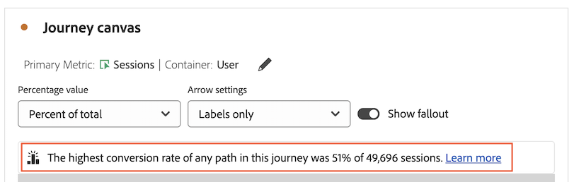

# Journey canvas overview {#journey-canvas-overview}

<!-- markdownlint-disable MD034 -->

>[!CONTEXTUALHELP]
>id="cja_journeycanvas_button"
>title="Journey canvas"
>abstract="Shows how people proceed through or fall out of a series of touchpoints. Use for journeys with multiple entry points and paths, or to analyze journeys created in Journey Optimizer."

<!-- markdownlint-enable MD034 -->

<!-- markdownlint-disable MD034 -->

>[!CONTEXTUALHELP]
>id="cja_journeycanvas_panel"
>title="Journey canvas"
>abstract="Analyze how people proceed through or fall out of a defined journey. Build analyses of user journeys by creating a flexible graph of nodes and arrows representing any combination of events, dimension items, and segments. Drag nodes on the canvas to rearrange the events and conditions of the journey. As you do, data updates accordingly.   Customers with access to Adobe Journey Optimizer can analyze existing Journey Optimizer journeys."

<!-- markdownlint-enable MD034 -->

<!-- markdownlint-disable MD034 -->

>[!CONTEXTUALHELP]
>id="journeycanvas_button"
>title="Journey canvas"
>abstract="Shows how people proceed through or fall out of a series of touchpoints. Use for journeys with multiple entry points and paths, or to analyze journeys created in Journey Optimizer."

<!-- markdownlint-enable MD034 -->

<!-- markdownlint-disable MD034 -->

>[!CONTEXTUALHELP]
>id="journeycanvas_panel"
>title="Journey canvas"
>abstract="Analyze how people proceed through or fall out of a defined journey. Build analyses of user journeys by creating a flexible graph of nodes and arrows representing any combination of events, dimension items, and segments. Drag nodes on the canvas to rearrange the events and conditions of the journey. As you do, data updates accordingly.   Customers with access to Adobe Journey Optimizer can analyze existing Journey Optimizer journeys."

<!-- markdownlint-enable MD034 -->

>[!BEGINSHADEBOX]

_This article documents the Journey canvas visualization in_  _**Customer Journey Analytics**. There is no equivalent visualization in **Adobe Analytics**._

>[!ENDSHADEBOX]

The Journey canvas visualization allows you to analyze and gain deep insights on the journeys that you provide to your users and customers. It allows you to define a journey from scratch or view one from Journey Optimizer, then see how people left (fell out) or continued through (fell through) the journey. 

You can [build analyses of user journeys](/help/analysis-workspace/visualizations/journey-canvas/configure-journey-canvas.md) by using any combination of events, dimension items, segments, and date ranges to create journey nodes. Connect the nodes to create the journey's flow, and include multiple paths and decision points. Drag nodes on the canvas to rearrange the events and conditions of the journey. Data updates in real time as you make changes. 

[Nodes are connected](/help/analysis-workspace/visualizations/journey-canvas/configure-journey-canvas.md#logic-when-connecting-nodes) as an "eventual path," which means that visitors are counted as long as they eventually move from one node to the other, regardless of any events occurring between the 2 nodes. The time allotted for users to move along the path is determined by the container setting. 

## Key features

Key features of the Journey canvas visualization include:

* Deep analysis of fallout and fallthrough that accommodates the most complex user journeys.

* A canvas for mapping and visualizing the various entry points, nodes, and paths of a user journey.

* Drag-and-drop interactions for adding components to the canvas and for repositioning existing nodes.

* The option to build analyses of user journeys within Journey canvas or to create them automatically based on Journey Optimizer journeys.

## Potential insights

Journey canvas provides actionable insights for the most complex journeys. 

### Path with the highest conversion rate {#conversion-rate-caption}

The most prominent insight in Journey canvas is shown as a caption at the top of the canvas itself. 

This caption summarizes which of all the paths in the journey had the highest conversion rate. 

When the journey contains multiple start nodes, the caption looks like this:

When the journey contains a single start node, the caption looks like this: 

Consider the following when interpreting this caption:

* A _path_ is defined as a start node that is connected by arrows to an end node, with any number of nodes connected between them. 

* The conversion rate calculation depends on the type of journey (the number of start nodes and end nodes contained in the journey, and whether the paths intersect between them).

  The following table describes how conversion rates are calculated based on the journey type:

  | Journey type | Conversion rate calculation | Example |
  |---------|----------|---------|
  | **A single start node and a single end node** | Conversion rate is calculated by dividing the number of the end node by that of the start node. |  |
  | **A single start node and multiple end nodes** | Conversion rate is calculated by finding the end node with the highest number, and dividing that number by that of the start node. |  |
  | **Multiple standalone paths, with each path containing a single start node and a single end node** | Conversion rate is calculated by dividing the number of the end node by that of the start node. The path with the highest conversion rate is described in the caption. |  |
  | **Multiple start nodes that at any point in the journey converge into a common node** | Conversion rate is calculated by finding the end node with the highest number, and dividing that number by that of the start node with the lowest number. |  |

### Fallthrough, Fallout, and more

Following are a few examples of other insights Journey canvas can help provide. You can choose whether these insights are based on all people in the data view, all people who started the journey, or all people from the previous node of the journey.

#### Fallthrough 

* The number and percentage of people who completed the journey (arrived at the ending node)

* The number and percentage of people who arrived at a given node of the journey

* The most common step that came after or before a given node of the journey

#### Fallout

* The nodes of the journey where people most commonly fell out of the journey (never arrived at any of the immediate next nodes)

#### Additional data for each node

* Add a breakdown dimension on any node of the journey to view additional data for that specific node

## Choose between Journey canvas, Fallout, or Flow visualizations

The Journey canvas visualization has similarities with the [Fallout visualization](/help/analysis-workspace/visualizations/fallout/fallout-flow.md) and the [Flow visualization](/help/analysis-workspace/visualizations/c-flow/flow.md), but with important differences. 

### Understand the differences

<!-- Information in this snippet is shared between Journey canvas, Fallout, and Flow visualization docs -->

{{journey-visualization-comparisons}}

### When to use Journey canvas

Journey canvas is essential for:

* Fallout analysis involving journeys with multiple entry points and paths.

* Non-linear journeys with multiple entry points and paths, with a predefined sequence of pages.

* Exploratory, ad hoc analysis that is based on a predefined journey.

* Analysis that requires a primary metric other than Session, Person, or Occurrences.

* Deeper analysis of journeys that originated in Adobe Journey Optimizer.

Use [the table above](#understand-the-differences) to understand the differences between Journey canvas, Fallout, and Flow visualizations.

## Analyze Journey Optimizer journeys

>[!NOTE]
>
>If your organization doesn't have access to Journey Optimizer, you can still [build analyses in Journey canvas](#build-analyses-in-customer-journey-analytics).

Analyzing Journey Optimizer journeys in Journey canvas provides deep, actionable insights on how people interact with a journey. 

When you analyze a Journey Optimizer journey in Journey canvas, the journey displays with the same order, sequence, and structure as it has in Journey Optimizer. If you make significant changes to a journey within Journey canvas, [changes are no longer synchronized from Journey Optimizer](#synchronization-between-journey-optimizer-and-journey-canvas).

### Benefits of analyzing Journey Optimizer journeys with Journey canvas

Journey canvas provides deep, thorough analysis that isn't possible in Journey Optimizer. 

Using Journey canvas to analyze journeys that were created in Journey Optimizer provides various benefits:

* Create events by using any Customer Journey Analytics dimensions, metrics, segments, or date ranges. 
  
  In Journey Optimizer, a technical user must create an event before it can be added to a journey.

* Create audiences based on a custom node that you create (launches the Customer Journey Analytics audience builder).
  
  In Journey Optimizer, you can create audiences only for pre-defined activities.

* Analyze fallthrough and fallout 

* Break down events with any dimension

* Combine events

* Connect events

* Rename and delete events

* Much more

### Synchronization between Journey Optimizer and Journey canvas

Consider the following behaviors to understand synchronization between Journey Optimizer and Journey canvas:

* **Data synchronization is one-way only** 
  
  After you create an analysis of a Journey Optimizer journey in Journey canvas, data syncs in only one direction, from Journey Optimizer to Journey canvas. This means that changes made to a journey in Journey canvas are never reflected in Journey Optimizer.

* **Modifying a journey in Journey canvas stops synchronization** 

  Changes made to a journey in Journey Optimizer sync to Journey canvas [only if the journey has not been significantly modified in Journey canvas](#differences-after-modifying-a-journey-in-journey-canvas). After you modify a journey in Journey canvas, any changes you make to the journey in Journey Optimizer are not reflected in Journey canvas. To see the changes reflected in Journey canvas, you can delete and [re-create the journey in Journey canvas](/help/analysis-workspace/visualizations/journey-canvas/configure-journey-canvas.md).

* **Using a "Share with anyone" link requires that the project is saved in Customer Journey Analytics after changes are made in Journey Optimizer** 

  When using a "Share with anyone" link, changes made in Journey Optimizer are not reflected in Journey canvas until the project is saved in Customer Journey Analytics.

  For more information about "Share with anyone" links, see [Share a project with anyone (no longin required)](/help/analysis-workspace/curate-share/share-projects.md#share-a-project-with-anyone-no-login-required) in [Share projects](/help/analysis-workspace/curate-share/share-projects.md).

### Differences after modifying a journey in Journey canvas {#differences-after-modifying}

After you modify a Journey Optimizer journey in Journey canvas, changes can occur in data processing, available features, and synchronization behavior.

If you make a significant modification to a Journey Optimizer journey in Journey canvas, changes can occur in data processing, available features, and synchronization behavior. A significant modification includes any of the following:

* Adding or removing a node

* Adding or removing an arrow between nodes

* Changing the components on a node

If you make other changes to a Journey Optimizer journey in Journey canvas, such as dragging a node or adding a breakdown, the differences described in the following sections do not apply.

>[!NOTE]
>
>To return the journey to its original state, you can press Ctrl+z after making your first change in Journey canvas. Or, you can delete and [re-create the journey in Journey canvas](/help/analysis-workspace/visualizations/journey-canvas/configure-journey-canvas.md)

#### Data processing differences

After you modify a Journey Optimizer journey in Journey canvas, you might notice changes to your data if your journey contains metrics that have non-default attribution models. 

This is because, unlike Journey Optimizer, Journey canvas allows you to apply multiple dimensions within a single journey. This capability means that [metric attribution](/help/data-views/component-settings/attribution.md) is not supported.  

#### Feature differences

After you modify a Journey Optimizer journey in Journey canvas, the options that are available in the [!UICONTROL **Arrow settings**] drop-down field change, depending on your modifications. For more information, see [Configure settings](/help/analysis-workspace/visualizations/journey-canvas/configure-journey-canvas.md).

The [!UICONTROL **Node type**] field is available only in Journey Optimizer. It is not available when viewing a Journey Optimizer journey in Journey canvas, regardless of whether you make modifications to the journey in Journey canvas. 

#### Synchronization differences

Changes made to a journey in Journey Optimizer sync to Journey canvas only if the journey remains unmodified in Journey canvas. 

After you modify a Journey Optimizer journey in Journey canvas, any changes you make to the journey in Journey Optimizer are not reflected in Journey canvas. To see the changes reflected in Journey canvas, you can delete and [re-create the journey in Journey canvas](/help/analysis-workspace/visualizations/journey-canvas/configure-journey-canvas.md).

### Terminology differences between Journey Optimizer and Customer Journey Analytics

Certain terms that mean one thing in Journey Optimizer mean something else in Customer Journey Analytics. When using Journey canvas, the Customer Journey Analytics terms are used.

|Term | Journey canvas | Journey Optimizer |
|---------|----------|---------|
| **Event** | One of several standard metrics that is available in Customer Journey Analytics. This metric counts things like revenue, subscriptions, or leads generated. | The category of activity that triggers a personalized journey, such as an online purchase.  |

### Analyze a Journey Optimizer journey in Journey canvas

For information about analyzing a Journey Optimizer journey in Journey canvas, see [Configure a Journey canvas visualization](/help/analysis-workspace/visualizations/journey-canvas/configure-journey-canvas.md).

## Build analyses in Journey canvas

You can build analyses in Journey canvas that are based on any dimensions or metrics that are available in Analysis Workspace. Or, you can analyze journeys that were created in Journey Optimizer. For more information, see [Configure a Journey canvas visualization](/help/analysis-workspace/visualizations/journey-canvas/configure-journey-canvas.md).

>[!MORELIKETHIS]
>
> * [A Guide to Journey Canvas Visualization in Adobe Customer Journey Analytics](https://experienceleaguecommunities.adobe.com/t5/adobe-analytics-blogs/a-guide-to-journey-canvas-visualization-in-adobe-customer/ba-p/737857)

