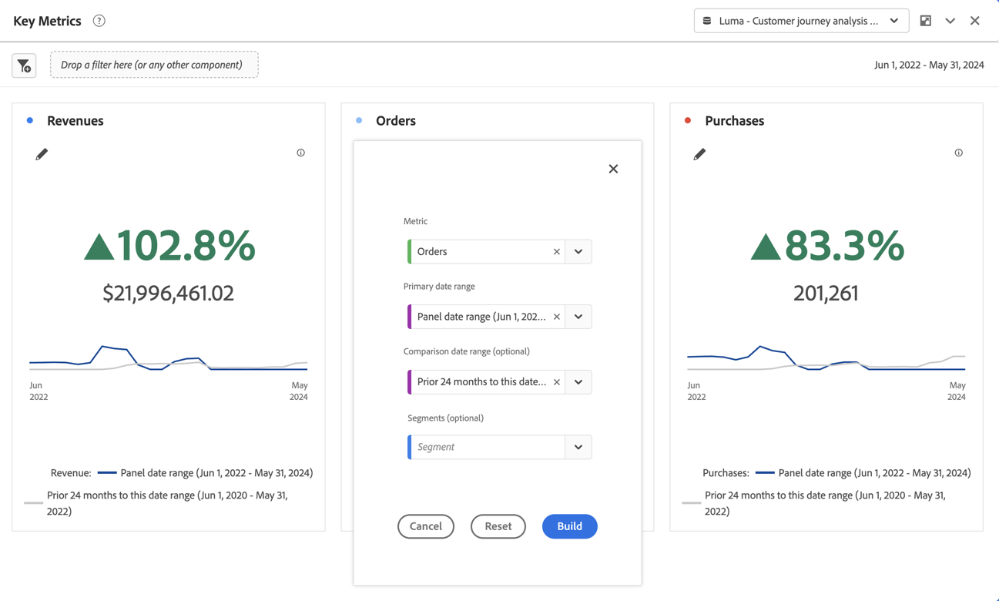

# Key metric summary {#key-metric-summary}

<!-- markdownlint-disable MD034 -->

>[!CONTEXTUALHELP]
>id="cja_workspace_keymetricsummary_button"
>title="Key metric summary"
>abstract="Create a visualization that is a combination of the line, summary change, and summary number charts. Use this visualization to compare how important metrics are trending between two periods of time."

<!-- markdownlint-enable MD034 -->

The  **[!UICONTROL Key metric summary]** visualization lets you see how an important metric is trending within a single timeframe. It also lets you compare metric performance across two timeframes. It provides the benefits of multiple visualizations combined into one visualization:

* **[!UICONTROL Line]** visualization shows how the metric is trending for the primary and comparison date ranges

* **[!UICONTROL Summary percent change]** shows the metric increase or decrease between the primary and comparison date ranges

* Current total value ([!UICONTROL **summary number**]) for the metric

This visualization addresses a variety of common use cases, including:

* An analyst trying to understand how opportunity creation looked this month compared to the same timeframe last year. 

* A marketer exploring how lead generation for a specific lead type has changed from this month to last month.

* An executive wanting to understand how new bookings changed from this quarter to last quarter.

## Use

1. Add a  **[!UICONTROL Key metric summary]** visualization. See [Add a visualization to a panel](freeform-analysis-visualizations.md#add-visualizations-to-a-panel).

1. Configure the visualization by selecting a **[!UICONTROL Metric]**, a **[!UICONTROL Primary date range]**, a **[!UICONTROL Comparison date range]** (optional) and a **[!UICONTROL Filter]** (optional):

   

   | Option| Description |
   | --- | --- |
   | **[!UICONTROL Metric]** | Select the metric you want to examine. All metrics are supported. |
   | **[!UICONTROL Primary date range]** | The current date range for the freeform table.  |
   | **[!UICONTROL Comparison date range]** | The date range to which you want to compare the primary date range. |
   | **[!UICONTROL Filter (optional)]** | Any filter that you are specifically interested in for this summary.  |

   {style="table-layout:auto"}

1. Select **[!UICONTROL Build]**.

<!--## How the Key Metric Summary visualization handles the comparison date range

(This will probably release in January. Per Jaden Howell)

* If the primary date range is set to the panel date range, there are 2-6 options that are considered 'relative' to the primary date range. These usually include the previous period (same amount of time immediately proceeding the primary date range), and 52 weeks prior to that date range.

* If the comparison date range is set to one of the 'relative' options, upon updating the primary date range, the comparison date range updates to the period immediate preceding the panel date range.

* If your comparison date range is *not* set to a 'relative' option, then updating the panel date range changes your primary date range, but has no effect on the comparison date range.

**Example 1**

Primary date range is set to the panel's date range: 'Yesterday'
Comparison date range is set to a relative date range, one of: 'Previous day', 'Same day last week', 'Same day 4 weeks prior', 'Same day last month', 'Same day last year', or 'Same day 52 weeks prior'.
When I change the panel's date range to 'This month', the comparison date range will update to 'Previous month'.

**Example 2**
 
Primary date range is set to the panel's date range: 'Yesterday'
Comparison date range is set to a non-relative date range, such as 'Feb 2nd, 2022', 'Highest sales day', 'Last week', etc. 

>[!NOTE]
>
>Last week is relative to the day the project is opened on, but it is not based on the panel's date range of 'Yesterday'. In other cases, such as if the panel's date range was 'This week', it may be relative.

When you change the panel's date range to '4 days ago', the comparison date range remains at the previous selection. -->

The output of the key metric summary looks like:

* The **[!UICONTROL Previous period]** line graph (always displayed in gray) corresponds to the **[!UICONTROL Comparison date range]** in the configuration step.

* If a comparison date range is not specified during configuration or is hidden in the visualization settings, only the line graph for the primary date range is displayed. The summary change is hidden. 

* From here, you can hover over the line graphs to see the statistics for individual days:

## Configure

After building the visualization, you can edit the original configuration. 

1. Select  **[!UICONTROL Configure visualization]** at the top of the visualization.

   You are taken back to the original configuration dialog. 

1. Change the settings as preferred. Select **[!UICONTROL Reset]** to reset the current settings. Select **[!UICONTROL Build]** to rebuild the visualization.

## Settings

As part of the visualization settings, specific key metric summary settings are available.

| Setting | Description |
|---|---|
| **[!UICONTROL Summary display type]** | Select between **[!UICONTROL Emphasize percent change]** or **[!UICONTROL Emphasize number value]**. |
| **[!UICONTROL Show trendlines]** | Show trendlines in the visualization. |
| **[!UICONTROL Show max and min on trendlines]** | Show maximum and minimum value on trendlines. |
| **[!UICONTROL Show comparison percentage and trendline]** | Show comparison percentage with trendline. If not selected, both are hidden. |
| **[!UICONTROL Number value options]** | **[!UICONTROL Show total number]** or **[!UICONTROL Show raw difference]** for the number value. | 
| **[!UICONTROL Abbreviate value]** | Select **[!UICONTROL Abbreviate value]** to abbreviate intelligently the number value. When selected, enter a number to define the amount of abbreviation. For example: <table><tr><td>**Original value**</td><td>**Abbreviation**</td><td>**Result**</td></tr><tr><td>$12,011,141.25</td><td>Not selected</td><td  align="right">$12,011,141.25</td></tr><tr><td>$12,011,141.25</td><td>Selected, set to 1</td><td align="right">$12M</td></tr><tr><td>$12,011,141.25</td><td>Selected, set to 2</td><td  align="right">$12.0M</td></tr><tr><td>$12,011,141.25</td><td>Selected, set to 2</td><td align="right">$12.011M</td></tr><tr><td>$12,011,141.25</td><td>Select, set to 3</td><td align="right">$12.011M</td></tr></table> |

>[!MORELIKETHIS]
>
>[Add a visualization to a panel](/help/analysis-workspace/visualizations/freeform-analysis-visualizations.md#add-visualizations-to-a-panel)
>[Visualization settings](/help/analysis-workspace/visualizations/freeform-analysis-visualizations.md#settings)
>[Visualization context menu](/help/analysis-workspace/visualizations/freeform-analysis-visualizations.md#context-menu)
>
