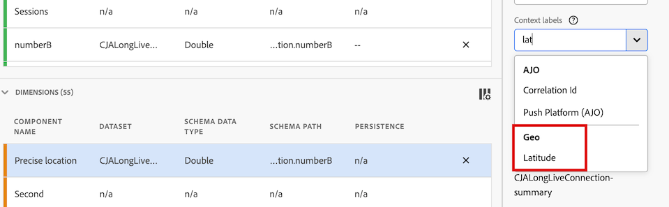

# Map {#map}

<!-- markdownlint-disable MD034 -->

>[!CONTEXTUALHELP]
>id="workspace_map_button"
>title="Map"
>abstract="This visualization represents metrics by overlaying them on a map. This is useful for identifying data across different geographic regions."

<!-- markdownlint-enable MD034 -->

<!-- markdownlint-disable MD034 -->

>[!CONTEXTUALHELP]
>id="workspace_map_bubbles"
>title="Bubbles"
>abstract="Plot events using bubbles."

<!-- markdownlint-enable MD034 -->

<!-- markdownlint-disable MD034 -->

>[!CONTEXTUALHELP]
>id="workspace_map_heatmap"
>title="Heatmap"
>abstract="Plot events using a heat map."

<!-- markdownlint-enable MD034 -->

>[!BEGINSHADEBOX]

_This article documents the Map visualization in_  _**Customer Journey Analytics**._ _See [Map](https://experienceleague.adobe.com/en/docs/analytics/analyze/analysis-workspace/visualizations/map-visualization) for the_  _**Adobe Analytics** version of this article._

>[!ENDSHADEBOX]

The  **[!UICONTROL Map]** visualization in Analysis Workspace allows you to build a visual map of any metric (including calculated metrics). It is useful for identifying and comparing metric data across different geographic regions.

>[!NOTE]
>
>The map visualization uses WebGL for graphics display. If your graphics drivers do not support WebGL rendering, you might need to update your drivers.

## Map visualization in Customer Journey Analytics vs. Adobe Analytics

The map visualization in Customer Journey Analytics differs from the map visualization in Adobe Analytics in the following ways:

| Feature | Customer Journey Analytics | Adobe Analytics |
|---------|----------|---------|
| Data source | Use any segment available in your data view as your data source.  | Provides the following options: <ul><li>Mobile lat/long</li><li>Geographic Dimension Represents geo segmentation data about visitor location based on the visitor's IP address. This data gets transformed into [!UICONTROL Country], [!UICONTROL Region], and [!UICONTROL City]. Note that it does not go to the DMA or Zip Code level.</li></ul> |
| Precision | For datasets with deep precision, you can configure the dimensions in your data view to show up to 5 decimal places. This allows the map visualization to be accurate within a single meter. 
For more information, see [Configure precise locations for dimensions](#configure-precise-locations-for-dimensions).
 | C2 |
| Create a segment from a selection | Create a segment based on a specific area that you select in the map visualization. 
For more information, see [Create a segment from the map visualization](#create-a-segment-from-the-map-visualization).
 | Create a segment based on the data that is being reported in the map visualization in general.|
| Create a trend from a selection | Create a trended line chart visualization based on a specific area that you select in the map visualization. 
For more information, see [Create a trended line chart from the map visualization](#create-a-trended-line-chart-from-the-map-visualization). <!-- is this correct? --> | Cannot create a trend from the map visualization. |
| Add a breakdown from a selection | Break down a specific dimension item, metric, segment, or date range within a specific area that you select in the map visualization. 
For more information, see [Add a breakdown from the map visualization](#add-a-breakdown-from-the-map-visualization). | Cannot add a breakdown from the map visualization. |

## Begin building a map visualization

1. Select the [!UICONTROL **Visualizations**] icon in the left rail, then drag the **[!UICONTROL Map]** visualization  into a panel that contains a freeform table. 

   Or

   Add a map visualization in any of the ways described in the [Add visualizations to a panel](/help/analysis-workspace/visualizations/freeform-analysis-visualizations.md#add-visualizations-to-a-panel) section in [Visualizations overview](/help/analysis-workspace/visualizations/freeform-analysis-visualizations.md).

   {width="50%"}

1. Specify the following basic information to configure the map visualization:

   * Add a metric: In the metric drop-down list, select a metric. Or drag in a metric from the list of metrics (including calculated metrics).

   * Add a segment: In the segment drop-down list, select a segment. Or drag in a segment from the list of segments.

   You can update this information after the visualization is built by selecting the edit icon  in the visualization header.

1. Select **[!UICONTROL Build]**.

   A world map visualization with bubbles is generated.

   

1. (Optional) Continue with [View a map visualization](#view-a-map-visualization) and [Configure visualization settings](#configure-visualization-settings).

## View a map visualization

1. If you haven't already, build a map visualization as described in [Begin building a map visualization](#begin-building-a-map-visualization).

1. In the map visualization in Analysis Workspace, do any of the following:

    * **Zoom in**: You can zoom in on the map to magnify certain areas in any of the following ways:
    
      * Double-click the map with your mouse.
      
      * Use your mouse scroll wheel or similar action on your trackpad.  
      
      * Select the plus icon  on the map visualization. 
      
      The map zooms accordingly. The required dimension (country > state > city) is automatically updated, based on the zoom level.

    * **Zoom out**: You can zoom out on the map to view larger areas in any of the following ways:
    
      * Hold the Shift key and double-click the map with your mouse.
      
      * Use your mouse scroll wheel or similar action on your trackpad.  
      
      * Select the minus icon  on the map visualization. 
      
      The map zooms accordingly. The required dimension (country > state > city) is automatically updated, based on the zoom level.

    * **Rotate**: You can rotate the map in 2D or 3D by holding the [!UICONTROL Ctrl] key while draggin the map with your mouse.

      To reset the map to its original north alignment, select the compass icon .

    * **Area selection**: You can select an area of the map to [create a segment](#create-a-segment-from-the-map-visualization), [create a trend](#create-a-trended-line-chart-from-the-map-visualization), or [add a breakdown](#add-a-breakdown-from-the-map-visualization). 
    
      Click the selection tool , then drag your mouse to select the desired area.

    * **Compare**: You can compare two or more map visualizations in the same project by placing them side by side.

    * **Show period-over-period comparisons (such as year-over-year)**:

        * Show negative numbers. 
        
          For example, if you are plotting a year-over-year metric, the map can show -33% over New York.
        * With metrics that are of type *percent*, clustering averages the percentages together.
        * A green and red color scheme indicates positive and negative.

    * **Additional visualization settings**: Select the Settings icon  in the visualization header to view additional settings for the map visualization. For more information, see [Configure visualization settings](#configure-visualization-settings).

1. **Save** the project to save all map settings (coordinates, zoom, rotation).
1. (Optional) The freeform table below the visualization can be populated by dragging in location dimensions and metrics from the left rail.

## Configure visualization settings

To configure settings for the map visualization:

1. In Analysis Workspace, open an existing map visualization, or [begin building a new one](#begin-building-a-map-visualization).

1. Hover over the map visualization, then select the Settings icon  in the visualization header.

   The following options are available:

   | Section | Setting | Description |
   | --- |--- |--- |
   | **[!UICONTROL Map type]** | | |
   | |**[!UICONTROL Bubbles]**|Plots events using bubbles. A bubble chart is a multi-variable graph that is a cross between a scatterplot and a proportional area chart. This view is the default.|
   | |**[!UICONTROL Heatmap]**|Plots events using a heatmap. A heatmap is a graphical representation of data where the individual values contained in a matrix are represented as colors.|
   | **[!UICONTROL Styles]** | | |
   | |**[!UICONTROL Color theme]**|Shows the color scheme for the heat map and bubbles. You can choose among Coral, Reds, Greens or Blues. The default is Coral.|
   | |**[!UICONTROL Map style]**|You can choose from Basic, Streets, Bright, Light, Dark, and Satellite.|
   | | **[!UICONTROL Cluster radius]**|Groups data points together that are within the specified number of pixels. The default is 50.|
   | | **[!UICONTROL Custom max value]**|Lets you alter the threshold for the max value for the map. Adjusting this value adjusts the scale for the bubbles or heatmap values (color and size) relative to the custom max value that you set.|
   | | **[!UICONTROL Show annotations]** | Show the annotations made for this visualization. |
   | | **[!UICONTROL Hide title]** | Hide the title of the visualization.  |

## Configure precise locations for dimensions

If you have custom datasets with deep precision, you can configure the map visualization to achieve location accuracy within a single meter. 

1. In Customer Journey Analytics, select **[!UICONTROL Data Management]** > **[!UICONTROL Data views]**.

1. Select the data view that contains the dimensions that you want to configure to use more precise locations.

1. In the data view, select the **[!UICONTROL Components]** tab.

1. Select the dimension that you want to configure.

1. Configure the level of precision for the dimension:

   1. With the dimension that you want to configure still selected, expand the **[!UICONTROL Format]** section in the right rail.

      

   1. In the **[!UICONTROL Decimal places]** field, change the number of decimals to reflect the desired level of precision: 

      * **0:** Precise to the large region or country level in the map visualization. Shows 0 decimal places in Worspace reports. 

      * **1:** Precise to the region or large city level in the map visualization.  Shows 1 decimal place in Worspace reports. 
   
      * **2:** Precise to the town or zip code level in the map visualization. Shows 2 decimal places in Worspace reports. 

        This is the default selection.

      * **3:** Precise to the very small town or neighborhood level in the map visualization. Shows 3 decimal places in Worspace reports. 

      * **4:** Precise to a specific parcel of land or building level in the map visualization. Shows 4 decimal places in Worspace reports. 

      * **5:** Precise to a single meter in the map visualization. Shows 5 decimal places in Worspace reports. 

1. Configure latitude and longitude context labels for the dimension:

   1. With the dimension that you want to configure still selected, expand the **[!UICONTROL Component settings]** section in the right rail.

   1. In the **[!UICONTROL Context labels]** field, begin typing `Latitude`, then select it when it appears in the drop-down menu.

      

   1. In the **[!UICONTROL Context labels]** field, begin typing `Longitude`, then select it when it appears in the drop-down menu. 

1. Select **[!UICONTROL Save and continue]** > **[!UICONTROL Save and finish]**.

## Create a segment from the map visualization

You can create a segment based on a specific area that you select in the map visualization. When you create a segment based on a selected area, any data that is within the latitude and longitude of your selection is included in the segment. 

To create a segment from the map visualization:

1. (Optional) Zoom in on the specific area of the map where you want to create the segment. 

1. Click the selection tool , then drag your mouse to select the desired area.

1. 

## Create a trended line chart from the map visualization

You can create a trended line chart visualization  based on a specific area that you select in the map visualization.

1. In the map visualization, click the selection tool , then drag your mouse to select the desired area.

1. 

## Add a breakdown from the map visualization

You can break down a specific dimension item, metric, segment, or date range within a specific area that you select in the map visualization.

1. In the map visualization, click the selection tool , then drag your mouse to select the desired area.

1. 

## Export the map visualization as a PDF

To export the map visualization in PDF format:

1. 

