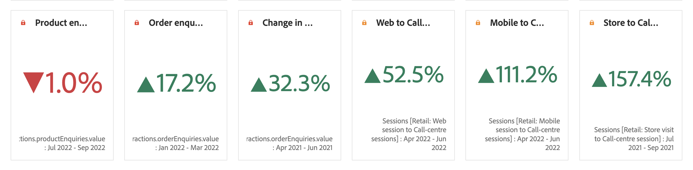

# Summary number and change

>[!BEGINSHADEBOX]

_This article documents the Summary number and Summary change visualizations in_  _**Customer Journey Analytics**._ _See [Summary number and Summary change](https://experienceleague.adobe.com/en/docs/analytics/analyze/analysis-workspace/visualizations/summary-number-change) for the_  _**Adobe Analytics** version of this article._

>[!ENDSHADEBOX]

>[!BEGINSHADEBOX]

See  [Summary number and Summary change visualization](https://experienceleague.adobe.com/en/docs/customer-journey-analytics-learn/tutorials/analysis-workspace/visualizations/use-summary-visualizations){target="_blank"} for a demo video.

>[!ENDSHADEBOX]

## Summary number {#summary-number}

<!-- markdownlint-disable MD034 -->

>[!CONTEXTUALHELP]
>id="workspace_summarynumber_button"
>title="Summary number"
>abstract="Create a visualization that shows totals and subtotals."

<!-- markdownlint-enable MD034 -->

Use the  **[!UICONTROL Summary number]** visualization to highlight a large number that is important in a project. This visualization behaves in the following ways, using the associated data source:

* Selects the total of the column if no cell is selected.
* If a single cell is selected, it shows the summary for that cell.
* If more than one cell is selected, it shows the first cell selected.
* If the column is selected, it picks the first cell value in the column.

As part of the visualization settings, specific Summary number options are available.

| Option | Definition |
|--- |--- |
| **[!UICONTROL Abbreviate value]** | Select **[!UICONTROL Abbreviate value]** to abbreviate intelligently the number value. When selected, enter a number to define the amount of abbreviation. For example: <table><tr><td>**Original value**</td><td>**Abbreviation value**</td><td>**Result**</td></tr><tr><td>$12,011,141.25</td><td>Not selected</td><td  align="right">$12,011,141.25</td></tr><tr><td>$12,011,141.25</td><td>Selected, set to `0`</td><td align="right">$12M</td></tr><tr><td>$12,011,141.25</td><td> Selected, set to `1`</td><td  align="right">$12.0M</td></tr><tr><td>$12,011,141.25</td><td>Selected, set to `2`</td><td align="right">$12.01M</td></tr><tr><td>$12,011,141.25</td><td>Selected, set to `3`</td><td align="right">$12.011M</td></tr></table> |
| **[!UICONTROL Summarize value by]** | Choose to display the max, min, mean, median, or sum for a selection of data. |

## Summary change {#summary-change}

<!-- markdownlint-disable MD034 -->

>[!CONTEXTUALHELP]
>id="workspace_summarychange_button"
>title="Summary change"
>abstract="Create a visualization that shows the delta (change) between two numbers"

<!-- markdownlint-enable MD034 -->

Use the  **[!UICONTROL Summary Change]** visualization to show the delta (change) between two numbers. <!-- This is applicable for AA, not CJA: The green and red color of the Summary Change can be controlled through [custom event polarity](https://experienceleague.adobe.com/docs/analytics/admin/admin-tools/success-events/success-event.html) or a calculated metric's [Show Upward Trend As](https://experienceleague.adobe.com/docs/analytics/components/calculated-metrics/calcmetric-workflow/cm-build-metrics.html) option.-->

<!--
The green and red color of the Summary Change can be controlled through [custom event polarity](https://experienceleague.adobe.com/docs/analytics/admin/admin/c-manage-report-suites/c-edit-report-suites/conversion-var-admin/c-success-events/success-event.md) or a calculated metric's [Show Upward Trend As](https://experienceleague.adobe.com/docs/analytics/components/calculated-metrics/calcmetric-workflow/cm-build-metrics.html) option.
-->

This visualization behaves in the following ways:

* If no cell is selected, it compares the first two cell values in the column.
* If one cell is selected, it shows 0, because it compares the cell value to itself.
* If two cells are selected, the first selected cell is taken as numerator and the second as denominator.
* If more than two cells are selected, it only considers the first two for comparison.
* If a range of cells is selected, it compares the first to the last cells selected in the range.
* If the column is selected, it compares the first value to itself, which shows a change of 0.

As part of the visualization settings, specific **[!UICONTROL Summary change options]** are available.

| Option | Definition |
|--- |--- |
| **[!UICONTROL Show percent change]**| Show the percent change between the 2 numbers.|
| **[!UICONTROL Show raw difference]** | Show the raw difference between the 2 numbers. You can also abbreviate values and show up to 3 decimal places with this option.|
| **[!UICONTROL Abbreviate value]** | Select **[!UICONTROL Abbreviate value]** to abbreviate intelligently the changed value. When selected, enter a number to define the amount of abbreviation. For example: <table><tr><td>**Original value**</td><td>**Abbreviation value**</td><td>**Result**</td></tr><tr><td>$12,011,141.25</td><td>Not selected</td><td  align="right">$12,011,141.25</td></tr><tr><td>$12,011,141.25</td><td>Selected, set to `0`</td><td align="right">$12M</td></tr><tr><td>$12,011,141.25</td><td> Selected, set to `1`</td><td  align="right">$12.0M</td></tr><tr><td>$12,011,141.25</td><td>Selected, set to `2`</td><td align="right">$12.01M</td></tr><tr><td>$12,011,141.25</td><td>Selected, set to `3`</td><td align="right">$12.011M</td></tr></table> |

>[!MORELIKETHIS]
>
>[Add a visualization to a panel](/help/analysis-workspace/visualizations/freeform-analysis-visualizations.md#add-visualizations-to-a-panel)
>[Visualization settings](/help/analysis-workspace/visualizations/freeform-analysis-visualizations.md#settings)
>[Visualization context menu](/help/analysis-workspace/visualizations/freeform-analysis-visualizations.md#context-menu)
>
