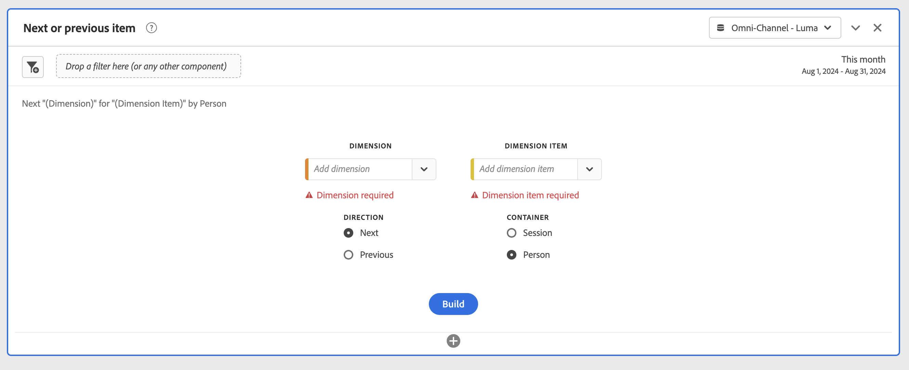

# Accessibility in Analysis Workspace

Learn about accessibility support in [!UICONTROL Analysis Workspace], the premier analysis tool for Customer Journey Analytics. 

Accessibility refers to making products usable for people with visual, auditory, cognitive, motor, and other disabilities. Examples of accessibility features for software products include: 

* screen reader support, 
* text equivalents for graphics, 
* keyboard shortcuts, 
* change of display colors to high contrast, 
* and more. 

[!UICONTROL Analysis Workspace] provides some tools that make it accessible to use, including:

## Keyboard navigation

Navigation in [!UICONTROL Analysis Workspace] works top down, and from left to right. The following navigational elements facilitate accessibility:

* The **[!UICONTROL Tab]** key enables landmark shortcuts, moving between larger sections within Workspace. In the left panel, **[!UICONTROL Tab]** also enables you to move from one draggable option to the next.
* The ◀︎ and ▶︎ move between individual elements after the **[!UICONTROL Tab]** key has highlighted an element. 
* The **[!UICONTROL F6]** key navigates to the first panel in the project and moves between the visualizations within that panel. Then, it moves to the next panel in the project and repeats. 
* Focus indicators are applied so that sighted keyboard users have a clear indication of which UI element currently has focus. The indicator is a blue border for the panel that has focus. And gray background for the recent selected functionality and the selection within the functionality. In the example, [!UICONTROL Components] and the Page dimension have been selected recently.

    

### Keyboard navigation for the menu bar 

1. Tab until you have reached the menu bar.
1. Use the arrow keys to navigate between menus and menu items.
1. Press **[!UICONTROL Enter]** to open a menu or select a menu item.
1. Use **[!UICONTROL Esc]** to close a menu.

### Keyboard navigation for drag & drop interactions 

[!UICONTROL Analysis Workspace] is a drag and drop user interface. However, users can add components using the keyboard instead:

1. Tab to a component in the left panel.
1. Press **[!UICONTROL Enter]** to select.
1. Use arrow keys to navigate to the area where you want to drop the component.
1. Press **[!UICONTROL Enter]** to place the component.

### Keyboard shortcuts (hotkeys) 

[!UICONTROL Analysis Workspace] offers a rich set of [keyboard shortcuts](/help/analysis-workspace/build-workspace-project/fa-shortcut-keys.md) for a more seamless workflow. 

## Support for screen readers and screen magnifiers

A screen reader reads text that appears on the computer screen. It also reads non-textual information, such as button labels or image descriptions in the application.  

## Color palettes & contrast  

[!UICONTROL Analysis Workspace] strives for WCAG 2.1 AA conformance, including requirements for color contrast. 

In addition, users can set their own preferred color palette for a project under **[!UICONTROL Project]** > **[!UICONTROL Project settings]** > [Project color palette](help/analysis-workspace/build-workspace-project/color-palettes.md). 

## Required validation

When building a component or a visualization or a panel, required fields are validated when you save. If a required field does not pass validation, it is outlined in red with an error icon. A written description explains what needs to be fixed.  

## Support for operating system accessibility features  

Analysis Workspace supports built-in Windows and macOS accessibility features like high-contrast mode, sticky keys, and slow keys/filter keys. It also provides information about the user interface to the operating system to enable interaction with assistive technologies, including screen readers such as VoiceOver for macOS and NVDA on Windows.
