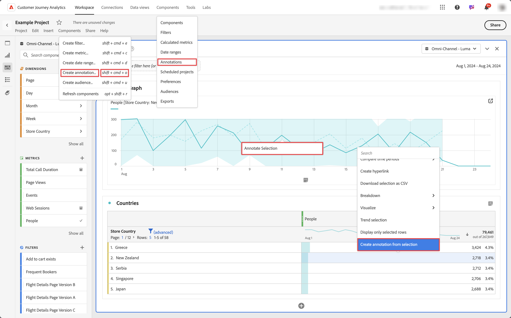
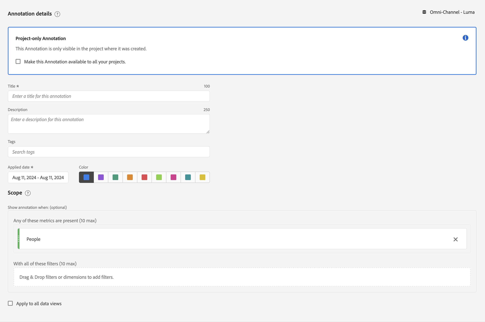

# Create annotations

By default, only administrators can create annotations. Users have rights to view annotations, similar to how users view other components (such as filters, calculated metrics, etc.).

However, administrators can give the **[!UICONTROL Annotation Creation]** permission for **[!UICONTROL Reporting Tools]** in **[!UICONTROL Edit permissions for CJA Workspace Access]** to users via the [Admin Console](/help/technotes/access-control.md#customer-journey-analytics-permissions-in-admin-console).

You can create an annotation in the following ways:

* 🅐 In the main interface, select **[!UICONTROL Components]** and select **[!UICONTROL Annotations]**. Select  [!UICONTROL **[!UICONTROL Add]**] from the [[!UICONTROL Annotations] manager](/help/components/annotations/manage-annotations.md). 
* 🅑 In a Workspace project, from the context menu in a visualization, select **[!UICONTROL Create annotation from selection]**.
* 🅒 In a Workspace project, from the context menu in a line graph, select **[!UICONTROL Annotate Selection]**.
* 🅓In a Workspace project, select **[!UICONTROL Components]** from the menu, and select **[!UICONTROL Create annotation]**. 
* 🅔 In a Workspace project, use the shortcut **[!UICONTROL ctrl+shift+o]** (Windows) or **[!UICONTROL shift+command+o]** (macOS)

To further define the annotation, you use the [[!UICONTROL Annotation builder]](#annotation-builder):

<!-- Should we really mention API here. If so, we can do it all over the place in the docs...
| **Use the [Customer Journey Analytics Annotations API](https://developer.adobe.com/cja-apis/docs/endpoints/annotations/)** | The Customer Journey Analytics Annotations APIs allow you to create, update, or retrieve annotations programmatically through Adobe Developer. These APIs use the same data and methods that Adobe uses inside the product UI. |
-->

## Annotation builder

The **[!UICONTROL Annotations builder]** dialog is used to create new or edit existing annotations. The dialog is titled **[!UICONTROL New annotation]** or **[!UICONTROL Edit annotation]** for annotations that you create or manage from the [[!UICONTROL Annotations] manager](/help/components/annotations/manage-annotations.md).

1. Specify the following details ( is required):

   

   | Element | Description |
   | --- | --- |
   | **[!UICONTROL Project-only Annotation]** | An info box to explain that the annotation you create is only visible in the Workspace project you are working on. Enable **[!UICONTROL Make this Annotation available to all your projects]**, to make the annotation visible to all your projects. This info box is only visible when you create an annotation from within a Workspace project. |
   | **[!UICONTROL Title]**  | Name the annotation, for example, `Memorial Day`. |
   | **[!UICONTROL Description]** |(Optional) Provide a description for the annotation, for example, `Public holiday observed in the US`. |
   | **[!UICONTROL Tags]**| (Optional) Organize annotations by creating or applying a tag. Start typing to find existing tags you can select. Or press **[!UICONTROL Enter]** to add a new tag. Select  to remove a tag. |
   | **[!UICONTROL Applied date]**  | Select the date or date range that needs to be present for the annotation to be visible. When you create an annotation using the shortcut, the annotation defaults to a data range for just the day. When you create an annotation using a selection in a visualization, the annotation defaults to the data range based on date range from the panel the visualization belongs to. |
   | **[!UICONTROL Color]** | Apply a color to the annotation. The annotation appears in the project with the selected color. Color can be used to categorize annotations, such as public holidays, external events, tracking issues, etc. |
   | **[!UICONTROL Scope]** | Drag and drop the metrics that trigger the annotation. Then drag and drop any dimensions or filters that act as filters to determine whether to display or not to display the annotation. If you don't specify a scope, the annotation applies to all your data. You have two options:<ul><li>**[!UICONTROL Any of these metrics are present]**: Drag and drop up to 10 metrics that trigger the annotation to show. For example, the Revenue metric have stopped collecting data for a specific date range. Drag the Revenue metric into this box.</li><li>**[!UICONTROL With all of these filters]**: Drag and drop up to 10 dimensions or filters that filter whether the annotation shows.</li></ul>

**Note:** Any annotation applied to a component that is then subsequently used as part of a calculated metric or filter definition does NOT automatically inherit the annotation. The desired calculated metric must also be added to the scope section to display the annotation. However, a new annotation should be created for any filter that you wish to annotate with the same information. For example, you apply an annotation to [!UICONTROL Orders] on a specific day. You then use [!UICONTROL Orders] in a calculated metric for the same date range. The new calculated metric does not automatically display the annotation for orders. Also add the calculated metric to the scope section for the annotation to display.|
   | **[!UICONTROL Apply to all data views]** | By default, the annotation applies to the originating data view. By checking this box, you can make the annotation apply to all data views in the company. |

{style="table-layout:auto"}
   
1. Click **[!UICONTROL Save]**.
