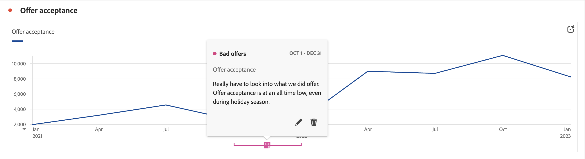

# Annotations overview

Annotations enable you to communicate contextual data nuances and insights effectively to other stakeholders in your organization. Annotations let you tie calendar events to specific dimensions and metrics. You can annotate a date or date range with known data issues, public holidays, campaign launches, etc. You can then graphically display events and see whether campaigns or other events have affected your site traffic, mobile app usage, revenue, or any other metric.

For example, let's say you are sharing projects with your organization. If you had a major downfall in your offers being accepted, you could create a **Bad Offers** annotation and scope it for your whole data view. When your users view any datasets that included that date, they see the annotation within their projects, alongside their data.

Annotations can apply to:

* A single date or a date range.

* Your entire dataset or specific metrics, dimensions, or filters.

* The project in which annotations are created (default) or all projects.

* The data view in which annotations are created (default), or all data views.

## Permissions

By default, only administrators can create annotations. Users have rights to view annotations, similar to how users view other components (such as filters, calculated metrics, etc.).

However, administrators can give the **[!UICONTROL Annotation Creation]** permission for **[!UICONTROL Reporting Tools]** in **[!UICONTROL Edit permissions for CJA Workspace Access]** to users via the [Admin Console](/help/technotes/access-control.md#customer-journey-analytics-permissions-in-admin-console).

## Turn annotations on or off

Annotations can be turned on or off at several levels:

| Level | How to... |
|---|---|
| **Visualization** | Enable or disable  > **[!UICONTROL Settings]** >  **[!UICONTROL Show annotations]**.  |
| **Project** | From a Workspace project menu, select **[!UICONTROL Project]** > **[!UICONTROL Project info & settings]** and enable or disable **[!UICONTROL Show annotations]**.  |
| **User** | From the **[!UICONTROL Components]** tab select **[!UICONTROL Preferences]**, or from a Workspace project menu, select **[!UICONTROL Project]** > **[!UICONTROL User preferences]**.  In **[!UICONTROL Preferences]**, select **[!UICONTROL Projects & Analysis]**. From the left tab bar, select **[!UICONTROL Data]**. At the bottom, enable or disable **[!UICONTROL Show annotations]** underneath the **[!UICONTROL Freeform table]** heading.  |
