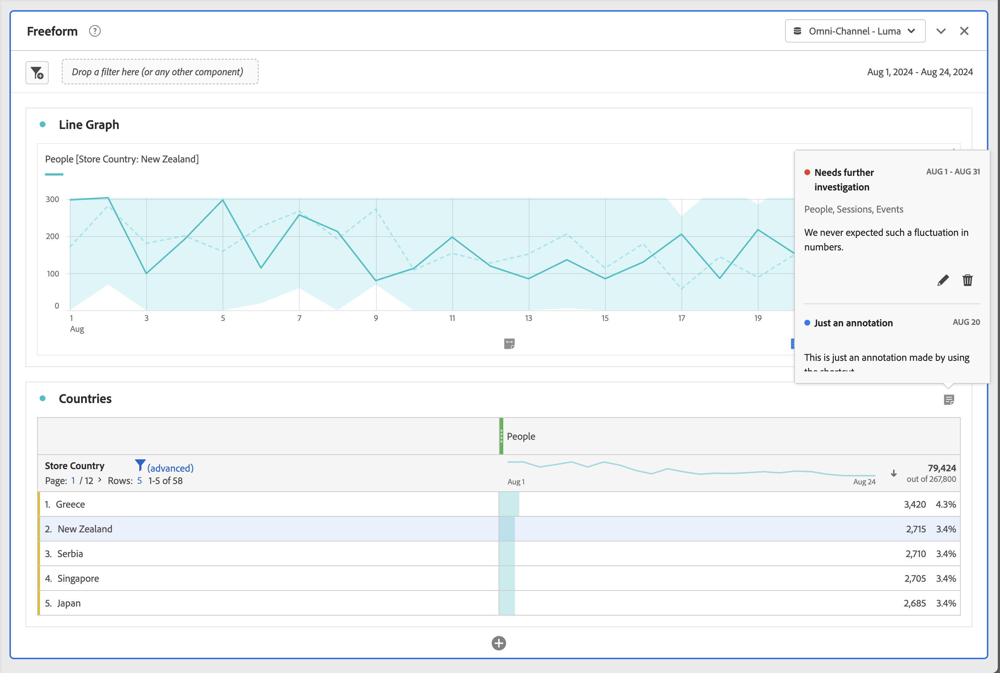

# View annotations

Annotations manifest slightly differently, depending on where they appear and whether they span a single day or a date range. 

## View annotations in Line charts or Tables

| Visualization Type | Description |
| --- | --- |
| **Line** **Single day** | When you select  in a line visualization, you see a popup with the annotation details.  To edit edit the annotation in the [Annotation builder](create-annotations.md#annotation-builder) select . To delete the annotation, select . |
| **Line** **Date range** |  When you select  you see a popup with the annotation details and a line at the bottom indicating the date range. To edit edit the annotation in the [Annotation builder](create-annotations.md#annotation-builder) select . To delete the annotation, select . |
| **Freeform table**| In a Freeform table, you can access all annotations from the annotations button at the top right of the visualization. Select  to see a (scrolling list) of all annotations.  For each annotation, you can select  to edit the annotation in the [Annotation builder](create-annotations.md#annotation-builder) and  to delete the annotation. |

{style="table-layout:auto"}

## View annotations in a PDF

When you download your project as a PDF, or send your project as a PDF, annotations are summarized in PDF in the Annotation summary section.

