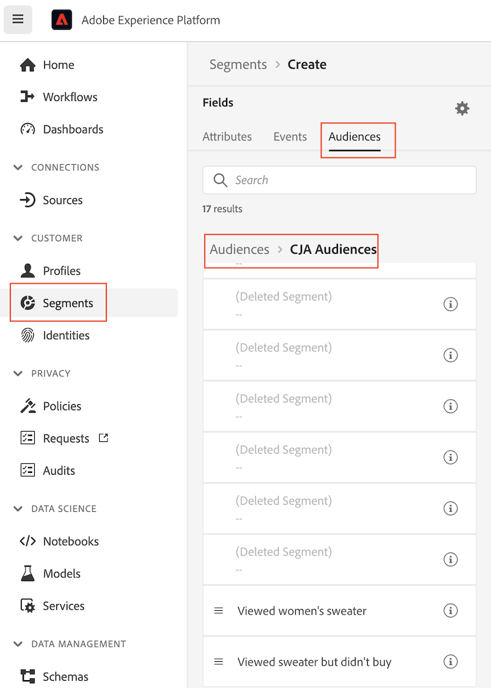

# Create and publish audiences

This topic discusses how to create and publish audiences identified in Customer Journey Analytics (CJA) to [Real-time Customer Profile](https://experienceleague.adobe.com/docs/experience-platform/profile/home.html?lang=en) in Adobe Experience Platform for customer targeting and personalization. 

Read this [overview](/help/components/audiences/audiences-overview.md) to familiarize yourself with the concept of CJA audiences.

## Create audience {#create}

1. To create audiences, you have three ways to get started:

   | Creation method | Details |
   | --- | --- |
   | From the main **[!UICONTROL Components] > [!UICONTROL Audiences]** menu | The Audiences Manager page opens. Click **[!UICONTROL Create audience]** and the [!UICONTROL Audience builder] opens. |
   | From within a Freeform table | Right-click an item in a Freeform table and select **[!UICONTROL Create an audience from selection]**. Using this method pre-populates the filter with the dimension or dimension item you selected in the table. |
   | From the filter creation/editing UI | Check the box that says **[!UICONTROL Create an audience from this filter]**. Using this method pre-populates the filter. |

   {style="table-layout:auto"}

1. Build the audience.

   Configure these settings before you can publish the audience.

   

   | Setting | Description |
   | --- | --- |
   | [!UICONTROL Name] | The name of the audience. |
   | [!UICONTROL Tags] | Any tags that you want assigned to the audience for organizational purposes. You can use a pre-existing tag or enter a new one.|
   | [!UICONTROL Description] | Add a good description of the audience, to differentiate it from others. |
   | [!UICONTROL Refresh frequency] | The frequency at which you want to refresh the audience.<ul><li>You can choose to create a one-time audience (default) that needs no refreshing. For example, this could be helpful for specific, one-time campaigns.</li><li>You can select other refresh intervals. For the 4-hour refresh frequency, there is a limit of 75 to 150 audience refreshes, depending on your CJA entitlement.</li></ul> |
   | Expiration date | When the audience will stop refreshing. The default is 1 year from the creation date. Expiring audiences are treated similarly to expiring scheduled reports - the admin gets an email a month before the audience expires. |
   | Refresh lookback window | Specifies how far back in your data window you want to go when creating this audience. The max is 90 days. |
   | [!UICONTROL One-time date range] | Date range when you want the one-time audience to be published. |
   | [!UICONTROL Filter] | Filters are the main input to the audience. You can add up to 20 filters. These filters can be joined with `And` or `Or` operators.  |
   | [!UICONTROL View sample IDs] | A sample of IDs in this audience. Use the search bar to search for sample IDs. |

   {style="table-layout:auto"}

1. Interpret the data preview.

   The audience preview appears in the right rail. It allows for a summarized analysis of the audience you have created.

   

   | Preview setting | Description |
   | --- | --- |
   | [!UICONTROL Data preview] window | The date range for the audience. |
   | [!UICONTROL Total people] | A summary number of the total number of people in this audience. It can go as high as 20 Million people. If your audience exceeds 20 Million people, you must reduce the audience size before you can publish it. |
   | [!UICONTROL Audience size limit] | Shows how far from the 20 Million limit this audience is. |
   | [!UICONTROL Estimated audience return] | This setting is useful for retargeting customers in this audience that come back to your site. (In other words, that are seen in this dataset again.) 
Here, you can select the time frame (next 7 days, next 2 weeks, next month) for the estimated number of customers who may return. |
   | [!UICONTROL Estimated to return] | This number gives you an estimated number of returning customers over the time frame that you selected from the drop-down list. We look at the historical churn rate for this audience to predict this number. |
   | [!UICONTROL Preview metrics] | This setting allows you to look at specific metrics to see whether this audience contributes a disproportionate amount to this metric, such as '[!UICONTROL Revenue]' or '[!UICONTROL Average time on site]'. It gives you the aggregate count of the metric, as well as the percentage of the total it represents. You can select any metric that is available in your data view. |
   | [!UICONTROL Namespaces included] | The specific namespaces that are associated with the people in your audience. Examples include ECID, CRM ID, email addresses, etc. |
   | [!UICONTROL Sandbox] | The [Experience Platform sandbox](https://experienceleague.adobe.com/docs/experience-platform/sandbox/home.html?lang=en) in which this audience resides. When you publish this audience to Platform, you can only work with it within the confines of this sandbox. |

   {style="table-layout:auto"}

1. Double-check your audience configuration and click **[!UICONTROL Publish]**.

   If everything went well, you will receive a confirmation message that the audience was published. It takes only minute or two for this audience to show up in Experience Platform. (Even for audiences with millions of members, it should take less than 5 minutes.)

1. Click **[!UICONTROL View audience in AEP]** within the same message and you will be taken to the [Segment UI](https://experienceleague.adobe.com/docs/experience-platform/segmentation/ui/overview.html?lang=en) in Adobe Experience Platform. See below for more information.

## What happens after an audience is created? {#after-audience-created} 

After you have created an audience, Adobe creates an Experience Platform streaming segment for each new CJA audience. An AEP streaming segment will only be created if your organization is set up for streaming segmentation.

* The AEP segment shares the same name/description as the CJA audience, but the name will be appended with the CJA audience ID to ensure that it is unique.
* If the CJA audience name/description changes, the AEP segment name/description reflects that change as well.
* If a CJA audience is deleted by a user, the AEP segment is NOT deleted. The reason is that the CJA audience may later get undeleted.

## Latency considerations {#latency}

At several points prior to, during, and after audience publishing, latencies can occur. Here is an overview of possible latencies.

| # | Latency point | Latency duration |
| --- | --- | --- |
| Not shown | Adobe Analytics to Analytics Source Connector (A4T) | Up to 30 minutes |
| 1 | Data ingestion into Data Lake (from Analytics Source Connector or other sources) | Up to 90 minutes |
| 2 | Data ingestion from Experience Platform Data Lake into CJA | Up to 90 minutes |
| 3 | Audience publishing to Real-time Customer Profile, including automatic creation of the streaming segment, and allowing the segment to be ready to receive the data. | Around 60 minutes |
| 4 | Refresh frequency for audiences |<ul><li>One-time refresh (latency of less than 5 minutes)</li><li>Refresh every 4 hours, daily, weekly, monthly (latency goes hand in hand with the refresh rate) |
| 5 | Creating destination in AEP: Activating the new segment | 1-2 hours |

{style="table-layout:auto"}

## Use CJA audiences in Experience Platform {#audiences-aep}

CJA takes all the namespace and ID combinations from your published audience and streams them into Real-time Customer Profile (RTCP). CJA sends the audience over to Experience Platform with the primary identity set, according to what was selected as the [!UICONTROL Person ID] when the connection was configured.

RTCP then examines each namespace/ID combination and looks for a profile that it may be part of. A profile is basically a cluster of linked namespaces, IDs and devices. If it finds a profile, it will add the namespace and ID to the other IDs in this profile as a segment membership attribute. Now, for example, "user@adobe.com" can be targeted across all their devices and channels. If a profile is not found, a new one is created.

You can view CJA audiences in Platform by going to **[!UICONTROL Segments]** > **[!UICONTROL Create segments]** > **[!UICONTROL Audiences]** tab > **[!UICONTROL CJA Audiences]**.

You can drag CJA audiences into the segment definition for AEP segments.

## FAQs {#faq}

Frequently asked questions on audience publishing.

+++**What happens if a user is no longer a member of an audience in CJA?**

In this case, an exit event is sent to Experience Platform from CJA.

+++

+++**What happens if you delete an audience in CJA?**

When a CJA Audience is deleted, that audience will no longer show up in the Experience Platform UI. However, no profiles associated with that audience are actually deleted in Platform.

+++

+++**If a corresponding profile does not exist in RTCDP, will a new profile be created?**

Yes, it will.

+++

+++**Does CJA send the audience data over as pipeline events or as a flat file that also goes to data lake?**

CJA streams the data into RTCP via pipeline, and this data is also collected into a system dataset in the data lake.

+++

+++**What identities does CJA send over?**

Whichever identity/namespace pairs that were specified in the [Connection setup](https://experienceleague.adobe.com/docs/analytics-platform/using/cja-connections/create-connection.html?lang=en#create-connection). Specifically, the step when a user selects the field they want to use as their "Person ID".

+++

+++**Which ID is chosen as the primary identity?**

See above. We only send one identity per CJA "person".

+++

+++**Does RTCP process the CJA messages as well? Can CJA add identities to a profile identity graph through audience sharing?**

No. We only send one identity per "person", so there would be no graph edges for RTCP to consume. 

+++

## Next steps

* To manage this audience, go to the [Management UI](/help/components/audiences/manage.md).
