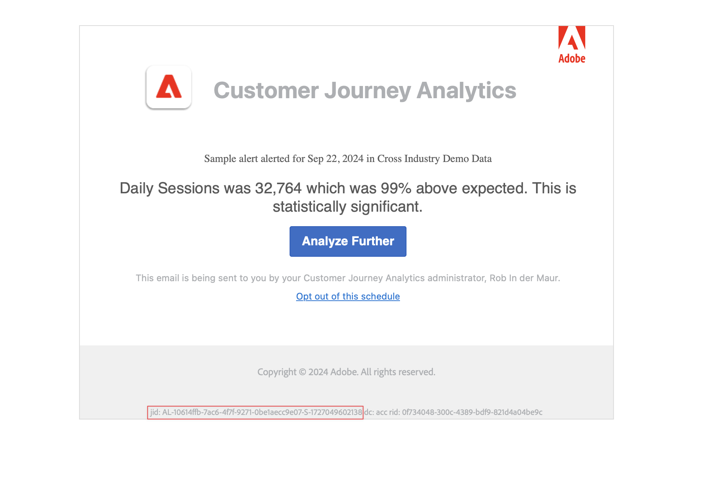

# Create alerts {#create-alerts}

<!-- markdownlint-disable MD034 -->

>[!CONTEXTUALHELP]
>id="components_alerts_timegranularity"
>title="Time granularity"
>abstract="Time granularity refers to how often the alert is checked."

<!-- markdownlint-enable MD034 -->

>[!NOTE]
>
>Using alerts with anomaly detection (also known as _Intelligent Alerts_) is available only to organizations with a Customer Journey Analytics Prime or Ultimate package.

Alerts in Customer Journey Analytics allow you to be notified based on changed percentages or specific data points. Depending on your Customer Journey Analytics package, you can also use alerts to be triggered based on anomaly thresholds. 

For more detailed information about alerts, see [Alerts overview](/help/components/c-intelligent-alerts/intelligent-alerts.md).

To create an alert:

<!-- Note that there are difference in how alerts are created in CJA vs AA. In AA you can create alerts from the Workspace menu and using a shortcut; these are not possible in CJA... -->

1. In Customer Journey Analytics, select **[!UICONTROL Components]** > **[!UICONTROL Alerts]**. In the [Alerts manager](alert-manager.md), select  **[!UICONTROL Add]** to create a new alert, or select any of the alerts listed to modify an existing alert. 

   

1. In Analysis Workspace, in a [freeform table](/help/analysis-workspace/visualizations/freeform-table/freeform-table.md), select **[!UICONTROL Create alert from selection]**.

The [Alert builder](#alert-builder) interface displays. When you create an alert from a selection in a freeform table, the alert builder is populated with the metrics you have selected.

## Alert builder

The Alert builder interface is familiar to the interface that you use when you build segments or calculated metrics in Customer Journey Analytics:

Specify the following details in the Alerts builder for an alert:

| Element | Description | 
|---------|----------|
| **[!UICONTROL Title]**  | Specify a name for the alert. The alert name might contain the name of the report or the metrics threshold. | 
| **[!UICONTROL Description (optional)]** | Specify a description for the alert. | 
| **[!UICONTROL Time granularity]** | Select how often you want the metric to be checked: Daily, Weekly, or Monthly.
<b>Note</b>: For data views with a [custom calendar](/help/data-views/create-dataview.md#calendar), monthly granularity is not supported in the Alert Builder.<!--true?-->
 | 
| **[!UICONTROL Recipients]** | Specify where the alert can be sent. An alert can be sent to an Analytics user, an Analytics group, a raw email address, or to a phone number.
<b>Important</b>: The phone number must be preceded by a `+` and a [country code](https://countrycode.org/).

The email that a user receives after an alert:

 | 
| **[!UICONTROL Expiration date]** | Set the date and time when you want the alert to expire. |
| **[!UICONTROL Delay]** | The time required before data is complete and available to be reported on in Customer Journey Analytics varies by organization, typically ranging from 3 to 9 hours past the data event time. For alerts to be accurate, event data for a given event range must be complete, meaning that Adobe is no longer receiving any event data for the specified event range.
To account for this delay in ingestion time, alerts have a default delay of 9 hours before they are sent.

You can adjust the default delay of 9 hours to anywhere between 0 and 24 hours. However, decreasing the delay below 9 hours can mean that you are reporting on incomplete data, which results in inaccurate alert information.

Consider the following when decreasing the delay time:
<ul><li>**Understand data availability versus data completeness**: Batch data is ingested into an Experience Platform dataset only after a period of 3 to 9 hours. For alerts to be accurate, data ingestion must be complete, with all batch data available in the dataset.</li><li>**Determine how long it takes for your data to be complete and available in the dataset**: Data ingestion times differ by organization. Make sure that the delay time you choose for alert delivery is the same or less frequent than the time it takes for the batch data to be available in the Platform dataset<!--add link? -->.</li>
**Tip:** The most accurate way of knowing the time required for all batch data to be complete and ingested into the Experience Platform dataset is to consult the data engineers in your organization.

Alternatively, you can get a general idea of how long it takes for the batch delivery in your organization to be available in the Platform dataset. Create the following freeform table in Analysis Workspace:
<ol><li>In a freeform table in Analysis Workspace, add an [!UICONTROL **Events**] metric and a [!UICONTROL **Day**] dimension.</li><li>Break down the [!UICONTROL **Day**] dimension using an [!UICONTROL **Hours**] dimension.
Hours that have no data show as 0.
</li></ol><li>**Account for errors in your calculations**: If you decrease the default delay time, configure the delay for at least an hour longer than the time it takes your organization for data ingestion completeness. For example, if there is a 3-hour delay before your data ingestion is complete, then you should set the delay to 4 hours.</li></ul>
For more information, see [Data ingestion times vary in Customer Journey Analytics](/help/components/c-intelligent-alerts/alerts-feature-comparison.md#data-ingestion-times-vary-in-customer-journey-analytics) in the article [Alerts feature comparison: Customer Journey Analytics and Adobe Analytics](/help/components/c-intelligent-alerts/alerts-feature-comparison.md). |
| **[!UICONTROL Send an alert when]** | [!UICONTROL **Any of these metrics trigger**]: Drag and drop metrics (including calculated metrics) here to create triggers for the alert.
An **"incompatible components"** message appears if not all the metrics, dimensions, or segments in the alert are compatible with the currently selected data view.

Determine the threshold that the metric must exceed before an alert is set. You can set this value to a threshold and then to one of the following conditions:
<ul><li>anomaly exists</li><li>anomaly is above expected</li><li>anomaly is below expected</li><li>is above or equals</li><li>is below or equals</li><li>changes by</li><li>You can set a threshold of 90%, 95%, 99%, 99.75%, and 99.9%.</li></ul>
[!UICONTROL **With all of these filters**]: Drag and drop segments or dimensions to add filters to the alert. For example, adding a *Mobile Devices Only* segment would mean that the rule triggers only for mobile devices. You can add additional filters by using an AND statement. You can add AND or OR rules by clicking the gear icon.

See [Alerts - use cases](/help/components/c-intelligent-alerts/alerts-use-cases.md) uses cases.
 | 
| **[!UICONTROL Preview]** | The interactive alert preview shows you how often, approximately, an alert fires based on past experience.
For example, if you set the time granularity to daily, the preview can tell you that the alert would have been triggered for a certain metric x times during the last 30 or 31 days.

If you find that too many alerts are triggered, you can adjust the threshold in the [Manage alerts](/help/components/c-intelligent-alerts/alert-manager.md).

{width="50%"}
 |
