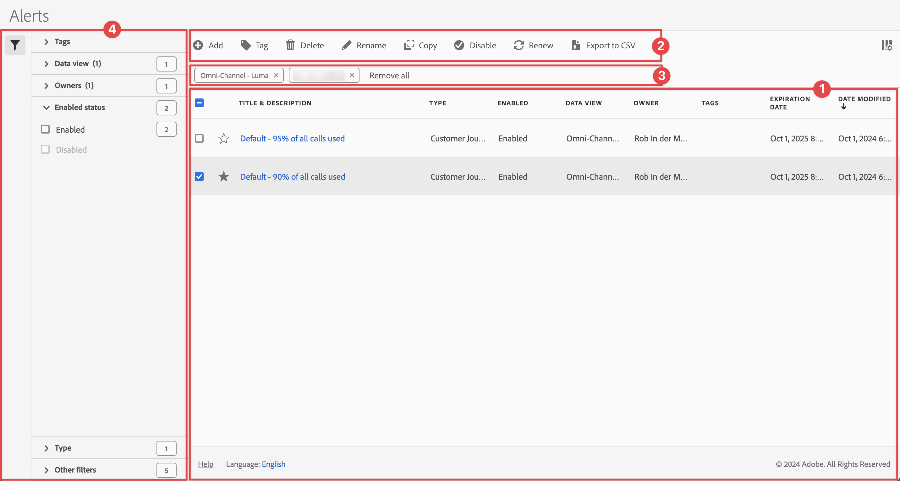

# Manage alerts

You can filter, tag, delete, rename, copy, enable, disable renew, and export alerts from a central [!UICONTROL Alerts] management interface. To manage alerts:

* Select **[!UICONTROL Components]** in the main interface, then select **[!UICONTROL Alerts]**.

The Alerts manager is structured like the [Segment manager](/help/components/segments/seg-manage.md) and the [Calculated metric manager](/help/components/calc-metrics/cm-workflow/cm-manager.md).

## Alerts manager

The Alerts manager has the following interface elements:

### Alerts list

The alerts list ➊ displays all the alerts that you own, the alerts that have been scoped to all your projects, and the alerts that have been shared with you. The list has the following columns:

| Column | Description |
|---|---|
|   | Select to favor  or un-favor  an alert. |
| **[!UICONTROL Title and description]** | To edit the alert, select the title link, which opens the [Alerts builder](alert-builder.md#alert-builder).|
| **[!UICONTROL Type]** | Shows whether the  alert is a Customer Journey Analytics data alert or a Server call usage alert. |
| **[!UICONTROL Enabled]** | Indicates whether the alert is enabled or disabled. |
| **[!UICONTROL Data view]** | The data views that this alert applies to.  |
| **[!UICONTROL Owner]** | The owner of the alert. As a non-administrator, you only see alerts you own or those that are shared with you. |
| **[!UICONTROL Tags]** | The tags for this alert. |
| **[!UICONTROL Expiration Date]** | The date and time when the alert is set to expire. |
| **[!UICONTROL Date modified]** | The date and time that the alert was last modified. |

<!-- When "Last used" column is added, add this information as the description: Shows the date when the alert was last used. 
This information can help you determine whether a component is valuable to users in your organization, where it is used, and if it needs to be deleted or modified.

Consider the following when viewing this column:
<ul><li>This information does not include usage from the API, Report Builder, or Data Warehouse.</li><li>For some components, this column might not contain data if the component was last used prior to September 2023.</li></ul> -->

Use  to specify which columns you want to display.

### Action bar

You can action on alerts using the action bar ➋. The action bar contains the following actions:

| Icon | Action | Description |
|:---:|---|---|
|  |**[!UICONTROL Add]** | Add another alert, using the [Alert builder](alert-builder.md#alert-builder). |
|  |[!UICONTROL *Search by title*] | When no alert is selected in the list, search for alerts using this search field. |
| | **[!UICONTROL Tag]** | Tag the selected alerts. In the **[!UICONTROL Tag Alert]** dialog, select or de-select the tags for the selected alerts. Select **[!UICONTROL Save]** to save the tags for the selected alerts.|
| | **[!UICONTROL Delete]** | Delete the selected alerts. You are prompted for a confirmation. |
| | **[!UICONTROL Rename]** | Rename a single selected alert. When selected, you can rename the alert inline. |
|  | **[!UICONTROL Copy]** | Copy the selected alert. New alerts are created with the same name and suffix `(Copy)`. |
| | **[!UICONTROL Enable]** or **[!UICONTROL Disable]** | Enable or disable the selected alerts. |
|| **[!UICONTROL Renew]** | Renews the alert expiration date. The  expiration date extends 1 year from the day you select this option, regardless of the original expiration date. |
| | **[!UICONTROL Export to CSV]** | Export the alerts to an `Alerts List.csv` file. |

### Active filter bar

The filter bar ➌ shows the active filters applied from the filter panel to the list of alerts (if any). You can quickly remove a filter using . If more than one filter is specified, you can remove all filters using **[!UICONTROL Remove all]**.

### Filter panel

You can filter the list of alerts using the  **[!UICONTROL Filter]** left panel ➍. The filter panel displays the type of filter and the number of alerts that honor the specific filter.

1. Select  to open the Filters panel. If you need more space for the Alerts list, you can select  once more to close the panel.
1. Select filters from any of the available filter sections. 

#### Tags filter section

{{tagfiltersection}}

#### Data view filter section

{{dataviewfiltersection}}

#### Owners filter section

{{ownerfiltersection}}

#### Enabled status filter section

{{enabledstatusfiltersection}}

#### Type filter section

{{typefiltersection}}

#### Other filters filter section

{{otherfiltersfiltersection}}

## Edit alerts

You can edit an alert

* In the [[!UICONTROL Alert] list](#alerts-list), select the title of the alert.

You use the [Alert builder](alert-builder.md#alert-builder) to edit the alert.

## Troubleshoot an alert

When troubleshooting an issue with an alert, provide the JID (Job Instance ID) number to Adobe Support. The JID number is located at the bottom of the alert email notification you receive.

