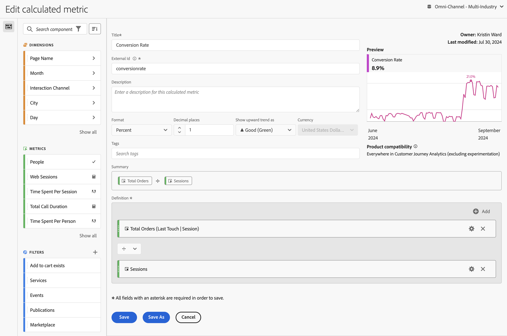

# Build calculated metrics {#build-metrics}

<!-- markdownlint-disable MD034 -->

>[!CONTEXTUALHELP]
>id="components_calculatedmetrics_productcompatibility"
>title="Product Compatibility"
>abstract="Indicates where in Customer Journey Analytics this calculated metric can be used, such as in Analysis Workspace, Report Builder, and so forth. Some calculated metrics cannot be used with experimentation."
>additional-url="https://experienceleague.adobe.com/en/docs/analytics-platform/using/cja-workspace/panels/experimentation#use-in-experimentation" text="Use calculated metrics in experimentation" 

<!-- markdownlint-enable MD034 -->

<!-- markdownlint-disable MD034 -->

>[!CONTEXTUALHELP]
>id="components_calculatedmetrics_externalid"
>title="External Id"
>abstract="Changing the External ID might impact how the calculated metric appears in external sources, such as business intelligence tools"

<!-- markdownlint-enable MD034 -->

The **[!UICONTROL Calculated metric builder]** dialog is used to create new or edit existing calculated metrics. The dialog is titled **[!UICONTROL New calculated metric]** or **[!UICONTROL Edit calculated metric]** for metrics that you create or manage from the [[!UICONTROL Calculated metrics] manager](/help/components/calc-metrics/cm-workflow/cm-manager.md).

>[!BEGINTABS]

>[!TAB Calculated metric builder] 

>[!TAB Create or Edit calculated metric] 

>[!ENDTABS]

1. Specify the following details ( is required):

   | Element | Description |
   | --- | --- |
   | **[!UICONTROL Data view]** | You can select the data view for the calculated metric.  The calculated metric you define is available in Workspace projects based on the selected data view. | 
   | **[!UICONTROL Project-only metric]** | An info box to explain that the metric is only visible in the project where it is created and that the metric will not be added to your component list. Enable **[!UICONTROL Make this metric available to all your projects and add it to your component list]** to change that setting. This info box is only visible when you create a metric in Workspace using **[!UICONTROL Create metric from selection]** and have selected a function (like **[!UICONTROL Mean]** or **[!UICONTROL Median]**). And later use the [Component info](/help/components/use-components-in-workspace.md#component-info) to edit that created metric. |
   | **[!UICONTROL Title]**  | Name the calculated metric, for example, `Conversion Rate`. |
   | **[!UICONTROL External ID]**  | The name of the calculated metric when using an external BI tool and the BI extension. The value is automatically defined as `undefined_xxx` unless you override the value. |
   | **[!UICONTROL Description]** | Provide a description for the filter, for example, `Calculated metric to define the conversion rate.` There is no need to describe the formula for the calculated metric as the formula is already automatically available in [!UICONTROL Summary]. |
   | **[!UICONTROL Format]** | Select a format for the calculated metric: You can select between **[!UICONTROL Decimal]**, **[!UICONTROL Time]**, **[!UICONTROL Percent]**, and **[!UICONTROL Currency]**. |
   | **[!UICONTROL Decimal places]** | Specify the number of decimal places for the format selected. Only enabled when the format selected is Decimal, Currency, and Percent. |
   | **[!UICONTROL Show upward trend as]** | Specify whether an upward trend of the calculated metric displays as ▲ **[!UICONTROL Good (Green)]** or as ▼ **[!UICONTROL Bad (Red)]**. | 
   | **[!UICONTROL Currency]**  | Specify the currency of the calculated metric. Only enabled when format selected is Currency. |
   | **[!UICONTROL Tags]**| Organize the calculated metric by creating or applying one or more tags. Start typing to find existing tags you can select. Or press **[!UICONTROL ENTER]** to add a new tag. Select  to remove a tag. |
   | **[!UICONTROL Preview]** | The preview covers the last 90 days and is a way to gauge whether you have defined your metric correctly. | 
   | **[!UICONTROL Summary]** | Displays a summary of the definition of the calculated metric.  For example:   **[!UICONTROL Total Orders]**   **[!UICONTROL Sessions]**. |
   | **[!UICONTROL Definition]** | Define your filter using the [Definition builder](#definition-builder). |

1. To verify whether your calculated metric definition is correct, use the constantly updated **[!UICONTROL Preview]** of the results of the calculated metric. The **[!UICONTROL Preview]** covers the last 90 days and evaluates the definition of your calculated metric continuously.
   
   The **[!UICONTROL Product compatibility]** indicates whether the calculated metric can be used in experimentation. Possible values are:
   * **[!UICONTROL Everywhere in Customer Journey Analytics]**: The calculated metric can be used throughout all of Customer Journey Analytics. 
   * **[!UICONTROL Everywhere in Customer Journey Analytics (excluding experimentation)]**: The calculated metric can be used throughout all of Customer Journey Analytics, except in the Experimentation panel. 

1. Select:
   * **[!UICONTROL Save]** to save the calculated metric.
   * **[!UICONTROL Save As]** to save a copy of the calculated metric. 
   * **[!UICONTROL Cancel]** to cancel any changes you made to the calculated metric or cancel the creation of a new calculated metric.

## Definition builder

You use the Definition builder to drag and drop dimensions, metrics, filters, and functions to create custom metrics based on container hierarchy logic, rules, and operators. In that construction, you can use standard metrics, Adobe defined metrics, calculated metrics, filters, dimensions and functions. All these components are available from the component panel in the Calculated metric builder. Furthermore, you can use operators and containers in the definition.

Only metrics are defined as singular components in the **[!UICONTROL Definition]** area. All other components are defined as a container, wrapping metrics or other containers. See [Containers](#containers) for more information.

### Metrics

To add a metric:

* Drag and drop an  **[!UICONTROL Metrics]** component from the components panel onto **[!UICONTROL Drag and drop metrics, dimensions, dimension items, filters, and/or functions here]**. You can use the  in the components bar to search for specific components.

When you use a calculated metric as part of your definition, the calculated metric is expanded.

To modify a metric:

1. Select  in a metric component in the **[!UICONTROL Definition]** area.
1. In the popup dialog you can define the type of metric and an attribution model. See [Metric type and Attribution](m-metric-type-alloc.md).

To delete a metric:

* Select  in the metric.

### Operators

Operators let you specify the operator between components or containers. Operators appear automatically between

* two or more metrics in a container, 
* two or more containers in a container, 
* one or more metrics and one or more containers in a container. 
 
You can select:

| Symbol | Operator |
|:---:|---|
|  | Divide (default) |
|  | Multiply |
|  | Subtract |
|  | Add |

### Static number

You can add a static number to your calculated metric definition. To add a static number:

* Select  **[!UICONTROL Add]** from within a container.
* Select **[!UICONTROL Static number]**. A static number container appears. 
* Select [!UICONTROL *Click to add a value*] and type a value.

### Containers

You add dimensions, filters and functions as containers to a calculated metric definition. You can also add a generic container. Containers function like a math expression and determine the order of operations. Anything within a container gets processed before the next component or container.

#### Filter container

You use the concept of a filter container to create a [filtered metric](metrics-with-segments.md). You can construct a filter container using a filter, or using a filter you create from a dimension.

* To add a filter container from a dimension:

  1. Drag and drop a  **[!UICONTROL Dimensions]** component from the components panel onto **[!UICONTROL Drag and drop metrics, dimensions, dimension items, filters, and/or functions here]**. You can use the  in the components bar to search for specific components.
  1. In the **[!UICONTROL Create Filter from Dimension]** popup, define the condition for the filter. Select from the list of operators and select a value or enter a value. For example, **[!UICONTROL Month]** **[!UICONTROL equals]**  `Sep 2024`.
  1. Select **[!UICONTROL Done]**. A filter container is added to the **[!UICONTROL Definition]**. 

* To add a filter container from a filter, you can use:

  * Drag and drop a  **[!UICONTROL Filters]** component from the components panel onto **[!UICONTROL Drag and drop metrics, dimensions, dimension items, filters, and/or functions here]**. You can use the  in the components bar to search for specific filters.
    Automatically a filter container is added to the **[!UICONTROL Definition]**, using the name of the filter.

  * Drag and drop a  **[!UICONTROL Filters]** component from the components panel onto a generic container. The container is modified into a filter container.

  * Select  **[!UICONTROL Add]** from within a container:

    1. Select **[!UICONTROL Filter]**. A filter container is added to the **[!UICONTROL Definition]**.
    1. In the new filter container, select a filter from the [!UICONTROL *Select...*] dropdown menu.

  >[!TIP]
  >
  >You can add more than one filter to a container. 

  The filters in the container are named after the filter component. For example,  **[!UICONTROL Web sessions]**. Select  to display a popup with details on the filter. In the popup, select  to edit the filter definition.

To remove a filter from a container:

* Select  next to the filter name.

See [Filtered metrics](metrics-with-segments.md) for more details and examples.

#### Function container

To add a function container, you can use:

* Drag and drop:

  1. Drag and drop a  **[!UICONTROL Functions]** component from the components panel onto **[!UICONTROL Drag and drop metrics, dimensions, dimension items, filters, and/or functions here]**. You can use the  in the components bar to search for specific functions.
  1. Automatically a function container is added to the **[!UICONTROL Definition]** using the name of the function. 

* Select  **[!UICONTROL Add]** from within a container:

  1. Select **[!UICONTROL Function]**.
  1. In the container, select a function from the [!UICONTROL *Select...*] dropdown menu.

The function container is named after the function component. For example,  **[!UICONTROL SQUARE ROOT (metric)]**. Select  to display a popup with details on the function. Select **[!UICONTROL Learn more]** for more information on the function. 

See [Use functions](cm-using-functions.md) for details on how to use functions and what functions are available to create a calculated metric.

#### Generic container

To add a generic container:

* Select  **[!UICONTROL Add]** from within a container
* Select **[!UICONTROL Container]**. A new empty generic container is added to the **[!UICONTROL Definition]**. You can use a generic container to nest or create a hierarchy in the definition of your calculated metric.

#### Delete a container

To delete a container, select  at the container level.

>[!MORELIKETHIS]
>
>[Use functions](cm-using-functions.md)
>[Filters](/help/components/filters/filters-overview.md)
>

