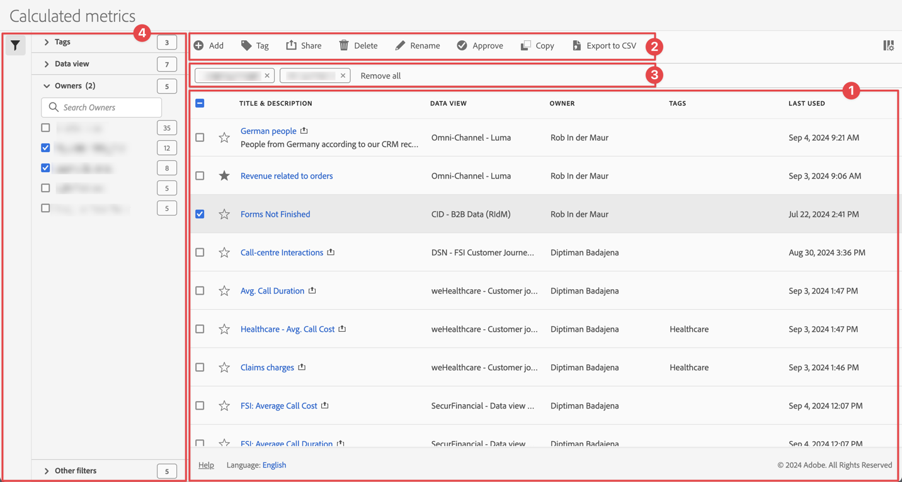

# Manage calculated metrics

You can share, filter, tag, approve, rename, copy, delete, export calculated metrics and mark calculated metrics as favorite from a central [!UICONTROL Calculated metrics] management interface. To manage calculated metrics:

* Select **[!UICONTROL Components]** in the main interface, then select **[!UICONTROL Calculated metrics]**.

## Calculated metrics manager

The Calculated metrics manager has the following interface elements:

### Filters list

The filters list ➊ displays all the calculated metrics that you own or that have been shared with you. The list has the following columns:

| Column | Description |
| --- | --- | 
|   | Select to favor  or un-favor  a calculated metric. See [Mark calculated metric as favorite](/help/components/filters/filters-favorite.md) |
| **[!UICONTROL Title and description]** | Provided in the [Calculated metrics builder](cm-build-metrics.md). To edit the title and description, select the title link, which opens the [Calculated metrics builder](cm-build-metrics.md). A shared filter is indicated with . |
| **[!UICONTROL Data view]** | The data views that this calculated metric applies to.  | 
| **[!UICONTROL Owner]** | Owner of the calculated metric. As a user, you only see the annotations that you own or the annotations that are shared with you. |
| **[!UICONTROL Tags]** | Lists the tags for this calculated metric. |
| **[!UICONTROL Shared with]** | Lists how many individuals or groups that you shared the calculated metric with. Select to open the **[!UICONTROL Share Component]** dialog and modify the tags for the calculated metric. |
| **[!UICONTROL Date modified]** | The date and time that the calculated metric was last modified. |
| **[!UICONTROL Used in]** | The components the calculated metric is used in. When you select **[!UICONTROL x Components]**, a new browser tab opens that shows the [Project manager](/help/analysis-workspace/build-workspace-project/freeform-overview.md) filtered to show only projects for the components used.  |
| **[!UICONTROL Last Used]** | When the calculated metric was last used. |

{style="table-layout:auto"}

Use  to specify which columns you want to display.

### Action bar

You can action on filters using the action bar ➋. The action bar contains the following actions:

| Action | Description |
|---|---|
|  **[!UICONTROL Add]** | Add another calculated metrics, using the [Calculated metric builder](cm-build-metrics.md). |
|  [!UICONTROL *Search by title*] | When no calculated metric is selected in the list, search for filters using this search field. |
|  **[!UICONTROL Tag]** | Tag the selected calculated metrics. In the **[!UICONTROL Tag Calculated metric]** dialog, select or de-select the tags for the selected calculated metric. Select **[!UICONTROL Save]** to save the tags for the selected calculated metrics. See [Tag calculated metrics](cm-tagging.md) for more information.|
|  **[!UICONTROL Share]** | Share the selected calculated metrics. In the **[!UICONTROL Share Calculated metrics]** dialog, you can  *Search individuals or groups* or you can select **[!UICONTROL Organization]** or **[!UICONTROL Groups]**. Select **[!UICONTROL Save]** to save share details for the selected calculated metrics. See [Share calculated metrics](cm-sharing.md) for more information. |
|  **[!UICONTROL Delete]** | Delete the selected calculated metrics. You are prompted for a confirmation. |
|  **[!UICONTROL Rename]** | Rename a single selected calculated metric. When selected, you can rename the calculated metric inline. |
|  **[!UICONTROL Approve]** | Approve the selected calculated metrics. See [Approve calculated metrics](cm-approving.md). | 
|   **[!UICONTROL Copy]** | Copy the selected calculated metrics. New calculated metrics are created with the same name and suffix `(Copy)` | 
|  **[!UICONTROL Export to CSV]** | Export the calculated metrics to a `Calculated  metric List.csv` file. |

### Active filter bar

The filter bar ➌ shows the active filters applied from the filter panel to the list of calculated metrics (if any). You can quickly remove a filter using . If more than one filter is specified, you can remove all filters using **[!UICONTROL Remove all]**.

### Filter panel

You can filter the list of calculated metric using the  **[!UICONTROL Filter]** left panel ➍. The filter panel displays the type of filter and the number of calculated metrics that honor the specific filter. Select  to toggle the display of the filter panel. 

See [Filter the list of calculated metrics](filters-filter.md) for more information.

<!-- OLD CONTENT 

The Calculated metric manager shows you all the filters you own and that have been shared with you. Admin-level users can see all custom metrics in the organization. This overview presents the user interface and the capabilities of the Calculated metric manager.

## Access the Calculated metrics manager

1. In Customer Journey Analytics, select [!UICONTROL **Components**] > [!UICONTROL **Calculated metrics**].

## Available actions in the Calculated metrics manager

In the Calculated metrics manager, you can:

* [Filter calculated metrics](/help/components/calc-metrics/cm-workflow/cm-filter.md)

* [Mark calculated metrics as favorites](/help/components/calc-metrics/cm-workflow/cm-favorite.md)

* [Approve calculated metrics](/help/components/calc-metrics/cm-workflow/cm-approving.md)

* [Tag calculated metrics](/help/components/calc-metrics/cm-workflow/cm-tagging.md)

* [Share calculated metrics](/help/components/calc-metrics/cm-workflow/cm-sharing.md)

* Export a calculated metric to a CSV file. 

* [Copy calculated metrics](/help/components/calc-metrics/cm-workflow/cm-copy.md)

* Delete calculated metrics

## Configure columns

You can configure the information displayed for each calculated metric in the Calculated metrics manager by configuring the columns that are displayed.

To configure the visible columns in the Calculated metrics manager:

1. In Customer Journey Analytics, select the **[!UICONTROL Components]** tab, then select **[!UICONTROL Calculated metrics]**. 

1. In the Calculated metrics manager, select the **Customize columns** icon , then select the columns that you want to be displayed in the Calculated metrics manager.

   The following columns are available:

   | Column title  | Description |
   |---|---|
   | Favorites  | Displays star icons next to each calculated metric, allowing you to mark calculated metrics as favorites. For more information, see [Mark calculated metrics as favorites](/help/components/calc-metrics/cm-workflow/cm-favorite.md). |
   | Title and description | These values are provided in the Calculated metric builder. To edit the title and description, select the title link to open the Calculated metric builder.  |
   | Report suite | Indicates in which report suite the metric was last saved.  |
   | Owner | Indicates who owns the custom metric. As a non-admin, you can see only metrics you own or those that were shared with you.  |
   | Tags | Shows tags that were applied to the metric, either by you or by people who shared the calculated metric with you.  |
   | Shared with | Lists individuals or groups (admin only) or All (admin only) that you shared the calculated metric with. 
When a calculated metric is being shared, a share icon displays next to the calculated metric name.
  |
   | Date modified | Indicates the date when the custom metric was last modified.  |
   | Used in | Shows how many components the calculated metric is currently being used in. 
For example, if the calculated metric is being used in 40 projects and 2 alerts, then the value of this column shows as [!UICONTROL **42 components**].
 
Select the value in this column to see the breakdown of where the calculated metric is being used (for example, [!UICONTROL **Projects (40)**], [!UICONTROL **Alerts (2)**]).

Calculated metrics can be used in any of the following component types:
 <ul><li>Projects</li><li>Scheduled projects</li></ul>
This information can help you determine whether a component is valuable to users in your organization, where it is used, and if it needs to be deleted or modified.

Consider the following when viewing this column:
<ul><li>This information does not include usage from the API, Report Builder, or Data Warehouse.</li><li>The [!UICONTROL **Used in**] column does not display by default. [Configure columns](#configure-columns) to display it.</li><li>If there is no data in this column for a given component but it has a [!UICONTROL **Last used**] date, the component might have been used in an analysis without being saved.</li><li>This information is available only to system administrators.</li></ul>
You can use the [Data Dictionary](/help/components/data-dictionary/data-dictionary-overview.md) along with this information to help you keep track of and better understand how components are being used in your organization.
 |
   | Last used | Shows the date when the calculated metric was last used in any of the following component types: <ul><li>Calculated metrics</li><li>Projects</li><li>Scheduled projects</li></ul> 
This information can help you determine whether a component is valuable to users in your organization, or whether it should be deleted.

Consider the following when viewing this column:
<ul><li>This information does not include usage from the API, Report Builder, or Data Warehouse.</li><li>For some components, this column might not contain data if the component was last used prior to September 2023.</li><li>This information is available only to system administrators.</li></ul>
You can use the [Data Dictionary](/help/components/data-dictionary/data-dictionary-overview.md) along with this information to help you keep track of and better understand how components are being used in your organization. |

   {style="table-layout:auto"}

-->