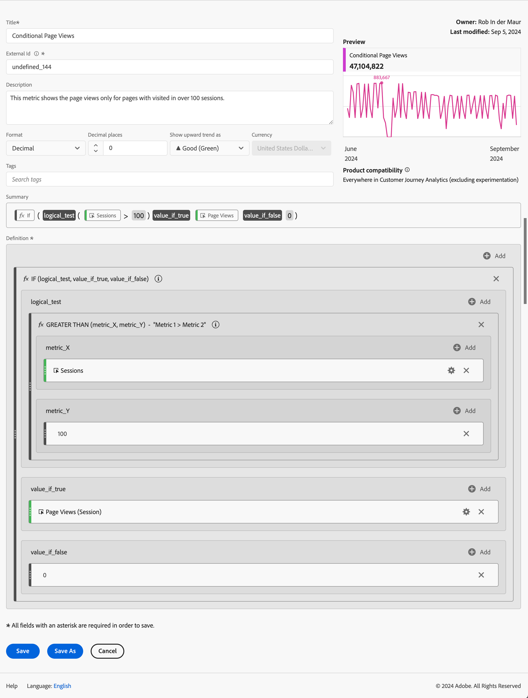

# Calculated metrics examples

This article shows examples of how to define more advanced calculated metrics.

## Bounce rate

You want to calculate the bounce rate. 

+++ Details

The definition of a bounce is subject for another discussion but for this example you define a Bounced events filter where Session Start equals 1 and Session Ends equals 1. You use this filter do define the rate of bounced sessions to sessions.

### Filter

### Calculated metric

### Derived fields

Alternatively, you can define a [bounce rate using derived fields](/help/data-views/derived-fields/derived-fields.md#bounces).

Derived fields are part of a Data view which has the advantage that not every user can override or modify the definition of a Bounce rate metric. That advantage also introduced a limitation. Users that do not have access to a data view cannot use derived fields and have to resort to filters and calculated metrics to define a bounce rate.

See for more background information on how to calculate bounces and bounce rate in Customer Journey Analytics, this [blog post](https://experienceleaguecommunities.adobe.com/t5/adobe-analytics-blogs/calculating-bounces-amp-bounce-rate-in-adobe-customer-journey/ba-p/706446).

+++

## Conditional page views

You want to define a calculated metric that calculates only page views for the pages that have been visited in over 100 sessions.

+++ Details 

+++

## Page views for top 30% sessions

You want to define a calculated metric that calculates only page views for the top 30% sessions.

+++ Details

+++
