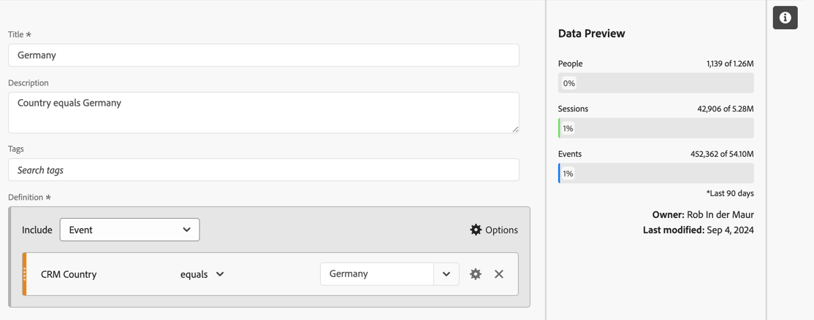

# Filtered metrics

In the [Calculated metric builder](cm-build-metrics.md#definition-builder), you can apply filters within your metric definition. Applying filters is helpful if you want to use metrics for a subset of your data in your analysis. 

>[!NOTE]
>
>Filter definitions are updated through the [Filter builder](/help/components/filters/filter-builder.md). If you make a change to a filter, the filter is automatically updated everywhere the filter is used, including if the filter is part of a calculated metric definition.
>

You want to compare metrics for German people interacting with your brand versus people outside of Germany. So, you can answer questions like:

1. How many German versus international people are visiting your most [popular pages](#popular-pages).
1. How many German versus international people in [total](#totals) have interacted online with your brand this month.
1. What are the [percentages](#percentages) of Germans and international people that have visited your popular pages?
   
See the sections below to illustrate how filtered metrics can help you answer these questions. Where appropriate, references are made to more detailed documentation.

## Popular pages

1. [Create a calculated metric](cm-workflow.md) from a Workspace project, named `German people`.
1. From within the [Calculated metric builder](cm-build-metrics.md), [create a filter](/help/components/filters/filter-builder.md), titled `Germany`, that is using the CRM Country field from your CRM data to determine where a person is coming from. 

   >[!TIP]
   >
   >In the Calculated metric builder, you can create a filter directly using the Components panel.
   >   

   Your filter could look like.

   

1. Back in the Calculated metric builder, use the filter to update the calculated metric.

   

Repeat the steps above for the international version of your calculated metric.

1. Create a calculated metric from your Workspace project, titled `International people`.
1. From within the Calculated metric builder, create a filter, titled `Not Germany`, that is using the CRM Country field from your CRM data to determine where a person is coming from.
 
   Your filter should look like.

   

1. Back in the Calculated metric builder, use the filter to update the calculated metric.

   

1. Create a project in Analysis Workspace, where you look at pages visited by German and International people.

   

## Totals

1. Create two new filters based on Grand Total. Open each of the filters created earlier, rename the filter, set the **[!UICONTROL Metric type]** for **[!UICONTROL People]** to **[!UICONTROL Grand Total]** and use **[!UICONTROL Save As]** to save the filter using the new name. For example:

   

1. Add a new Freeform table visualization to your Workspace project, showing the total pages for this month.

   

## Percentages

1. Create two new calculated metrics that calculate a percentage from the calculated metrics you created earlier.

   

1. Update your Workspace project.

   

>[!BEGINSHADEBOX]

See  [Use a filtered calculated metric as an implementationless metric](https://video.tv.adobe.com/){target=&#34;_blank&#34;} for a demo video.

{{videoaa}}

>[!ENDSHADEBOX]

