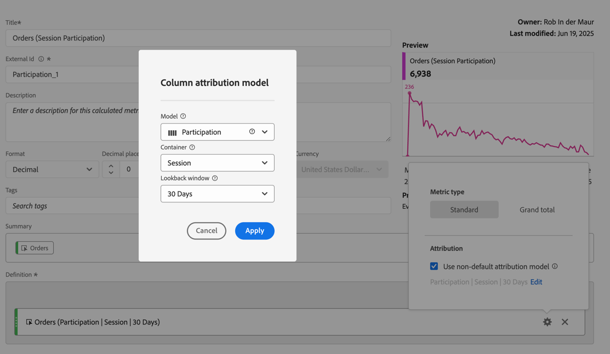

# Build a participation metric

This article explains how to create a participation metric. A participation metric shows how individual values for a dimension (like Page Views, Marketing Channel) contribute to or participate in sessions that contain a specific metric (for example Orders).

This type of information could be useful for any content owner.

>[!NOTE]
>
>Metrics with other attribution models, such as Participation, may also be created by administrators as part of a [data view](https://experienceleague.adobe.com/docs/analytics-platform/using/cja-dataviews/data-views.html). See [Attribution component settings](../../../data-views/component-settings/attribution.md) for more details. The example below shows how a participation metric can be created by any user with access to the calculated metric builder in Workspace.

1. Begin building a metric, as described in [Build metrics](/help/components/calc-metrics/cm-workflow/cm-build-metrics.md).
1. In the Calculated metrics builder, name the metric `Participation` or something similar.
1. Drag a metric containing a success event, for example [!DNL Orders], into the [!UICONTROL Definition] canvas.
1. Select  for the metric. 
1. In the popup that appears, select **[!UICONTROL Use a non-default attribution model]** to define the [attribution model](/help/components/calc-metrics/cm-workflow/m-metric-type-alloc.md) of that event to **[!UICONTROL Participation]** and select **[!UICONTROL Session]** for the [!UICONTROL Lookback window]. Select **[!UICONTROL Apply]** to confirm.

   In the Definition box, the selected metric is updated by appending  **(Partipation|Session)** to its name. 

      

  

1. Select [!UICONTROL **Save**] to save the metric.
1. Use the calculated metric in your report. For example, use the calculated [!DNL Orders (Session Participation)] metric (as defined in step 5) in a report to show which Customer Tier contributed to (or participated in) sessions that contained an order.

    

1. (Optional) Share the metric with other users in your organization, as described in [Share calculated metrics](/help/components/calc-metrics/cm-workflow/cm-sharing.md).
