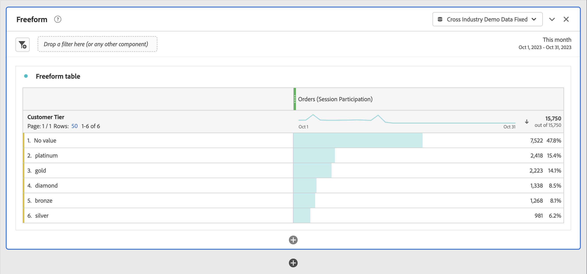

# Participation metrics

Participation metrics are used to quantify how individual values for a dimension (like Page Views) contribute to, or participate in sessions that contain a specific metric (like Orders).

>[!NOTE]
>
>Administrators can create metrics with non-default attribution models, such as Participation, as part of a [data view](https://experienceleague.adobe.com/en/docs/analytics-platform/using/cja-dataviews/data-views). See [Attribution component settings](../../../data-views/component-settings/attribution.md) for more details.

The steps below show how any user with [Create calculated metric permission](/help/technotes//access-control.md#user-level-access) can create a participation metric.

1. [Create a calculated metric](cm-workflow.md), and in the [Calculated metrics builder](cm-build-metrics.md), name the metric `Participation` or something similar.
1. Drag a metric containing a success event, for example [!DNL Orders], into [!UICONTROL **[!UICONTROL Definition]**] area.
1. Select  for the metric. 
1. In the popup that appears, select **[!UICONTROL Use a non-default attribution model]** to define the [attribution model](/help/components/calc-metrics/cm-workflow/m-metric-type-alloc.md) of that event to **[!UICONTROL Participation]** and select **[!UICONTROL Session]** for the [!UICONTROL Container]. Select **[!UICONTROL Apply]** to confirm.

    

    **(Partipation|Session)** is added to the metric component name. 

  

1. Select [!UICONTROL **Save**] to save the metric.
1. Use the calculated metric in your report. For example, use the calculated [!DNL Orders (Session Participation)] metric in a report to show which Customer Tier contributed to (or participated in) sessions that contained an order.

    
