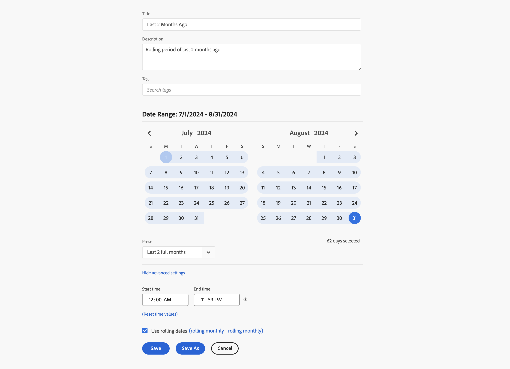
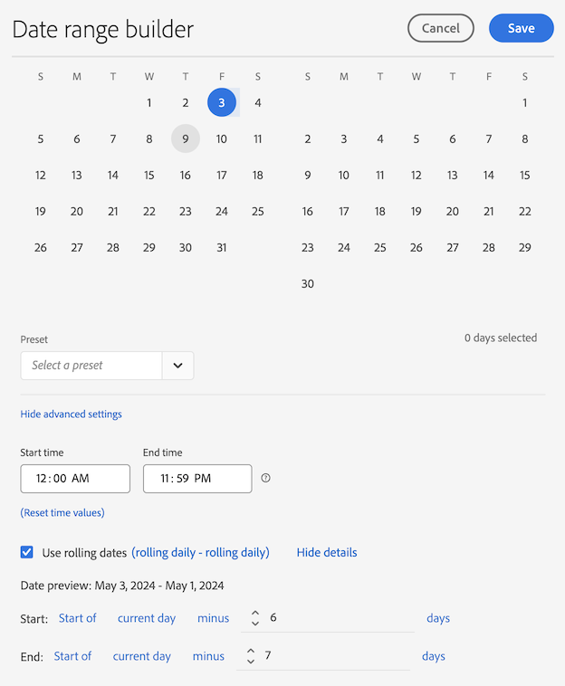

# Example custom date ranges

This article shows more examples of custom date ranges.

## Last two months ago

+++ Details

You want to define a custom date range that defines two months ago. You use one of the presets.

+++

## Rolling until the end of last week

+++ Details

You want to define a date range that defines the period between the current day a week ago until the end of that same last week. For example, if today is Wednesday September 11, 2024. You want a date range from Wednesday September 4, 2024 until Saturday September 7, 2024. 

+++ 

<!--
## Example: Use a 7-day rolling date range

You can create a date range that specifies a 7-day rolling window that ends one week ago:

Use *`rolling daily`*.

* The Start settings would be *`current day minus 6 days`*.

* The End settings would be *`current day minus 7 days`*.

This date range can be a component that you drag onto any freeform table.
-->