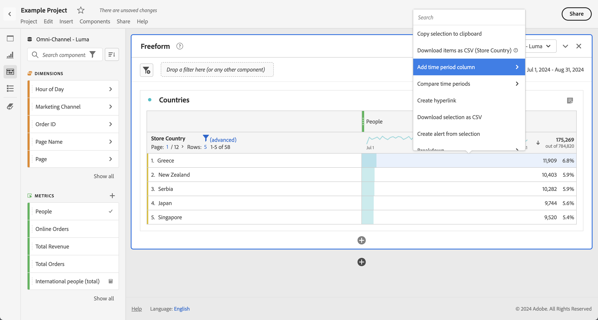
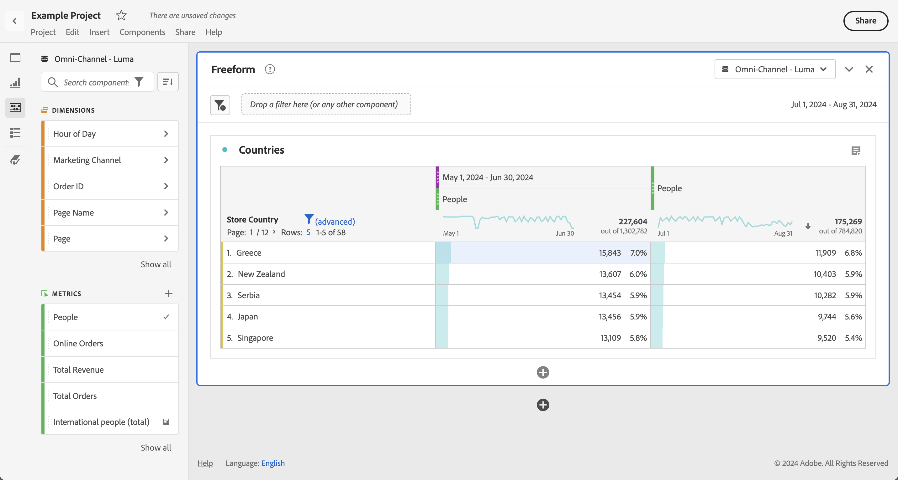

# Date comparison

Date Comparison in Analysis Workspace lets you take any column containing a date range and create a common date comparison, such as: year-over-year, quarter-over-quarter, month-over-month, etc.

## Compare time periods

Analysis requires context, and often that context is provided by a previous time period. For example, the question "How much better/worse are we doing than at this time last year?" is fundamental to understanding your business. Date Comparison automatically include a "difference" column, which shows the percentage change compared to a specified time period.

1. Create a [Freeform table](/help/analysis-workspace/visualizations/freeform-table/freeform-table.md), with any dimensions and metrics you want to compare over a time period.
1. Open the context menu for a table row and select **[!UICONTROL Compare time periods]**.

   

   >[!NOTE]
   >
   >This context menu optip is disabled for metric rows, date range rows, and time dimension rows.

1. Depending on how you have set the table's date range, you have these options for comparison: 

   |  Option  | Description  |
   |---|---|
   | **[!UICONTROL Prior *x* weeks / months / quarters / years to this date range]** | Compares to the week/month/etc. immediately before this date range.  |
   | **[!UICONTROL These x weeks / months / quarters / years last year to this date range]** | Compares to the same date range a year ago.  |
   | **[!UICONTROL Custom date range to this date range]** | Let you define a custom date range.  |

   >[!NOTE]
   >
   >When you select a custom number of days, for example October 7 - October 20 (a 14-day range), you will get only 2 options: **[!UICONTROL Prior 14 days before this date range]**, and **[!UICONTROL Custom date range to this date range]**.

1. The resulting comparison looks like this:

   

   Rows in the Percent change column appear red for negative values and green for positive values.

## Add a time period column for comparison

You can now add a time period to each column in a table, enabling you to add a time period that is different from the one your calendar is set to. This is another way you can compare dates.

1. Right-click a column in the table and select **[!UICONTROL Add time period column]**. 

   

1. Depending on how you have set the table's date range, you have these options for comparison: 

   |  Option  | Description  |
   |---|---|
   | **[!UICONTROL Prior *x* weeks / months / quarters / years to this date range]** | Adds a column with the week/month/etc. immediately before this date range.  |
   | **[!UICONTROL These *x* weeks / months / quarters / years last year to this date range]** | Adds the same date range a year ago.  |
   | **[!UICONTROL Custom date range to this date range]** | Lets you create a custom date range.  |

   >[!NOTE]
   >
   >When you select a custom number of days, for example October 7 - October 20 (a 14-day range), you will get only 2 options: **[!UICONTROL Prior 14 days before this date range]**, and **[!UICONTROL Custom date range to this date range]**.

1. The time period will be inserted on top of the column you selected:

   

1. You can add as many time columns as you want, as well as mix and match different date ranges:

1. In addition, you can sort on each column, which will change the order of days depending on the column you are sorting on.

## Align column dates to start on same row

You can align the dates from each column to all start on the same row. 

For example, when you choose to align dates, if you do a day-over-day comparison for the last week (ending October 5, 2024) and previous week, by default the left column will start with September 22 and the right column will start with September 29. 

You can enable **[!UICONTROL Align dates from each column to all start on the same row]** in [Settings](/help/analysis-workspace/visualizations/freeform-table/freeform-table.md#settings-1) for the Freeform table visualiations to align column dates to start on the same row.

Consider the following when using this option:

* This setting is enabled by default for all new projects.

* This setting applies to the entire table. For example, if you change this setting for a breakdown within the table, it will change the setting for the entire table.

